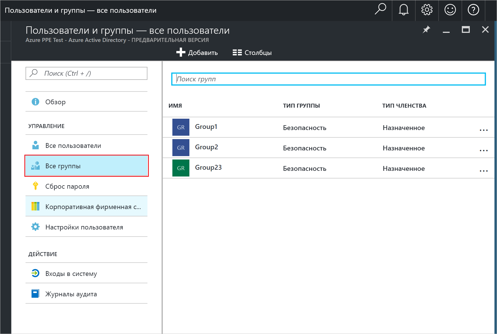
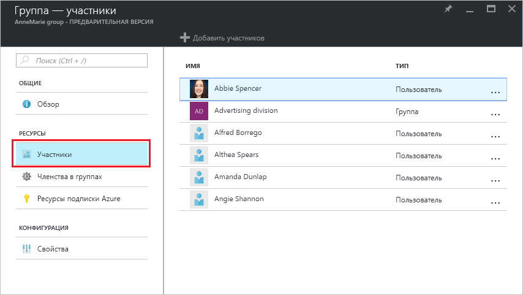
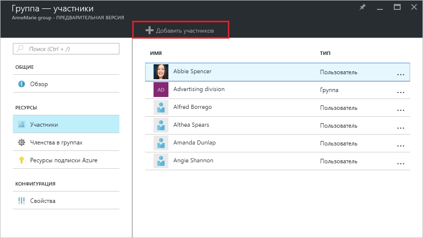
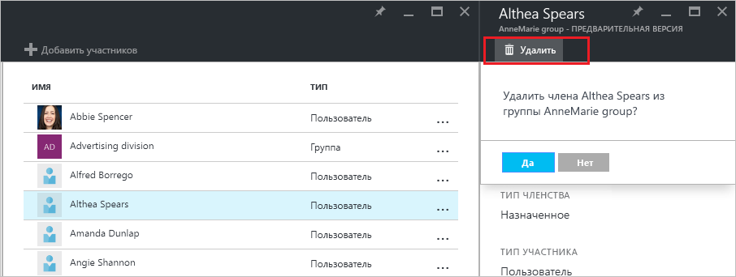

# Управление участниками групп в клиенте Azure Active Directory
В этой статье объясняется, как управлять участниками группы в Azure Active Directory (Azure AD).

## Как можно найти участников и управлять ими?
1. Войдите на [портал Azure](https://portal.azure.com) с помощью учетной записи глобального администратора каталога.
2. Выберите **Все службы**, введите **Пользователи и группы** в текстовое поле, а затем нажмите клавишу **ВВОД**.

   
3. В колонке **Пользователи и группы** выберите **Все группы**.

   
4. Выберите группу в колонке **Пользователи и группы — Все группы** .
5. В колонке **Группа — *имя_группы*** выберите **Участники**.

   
6. Чтобы добавить участников в группу, в колонке **Группа — Участники** щелкните **Добавить участников**.

   
7. В колонке **Участники** выберите одного или несколько пользователей или устройств для добавления в группу, а затем нажмите кнопку **Выбрать**, расположенную в нижней части колонки, чтобы добавить их в группу. В поле **Пользователь** можно ввести часть имени пользователя или устройства, чтобы отфильтровать по нему список отображенных элементов. Подстановочные знаки в поле не допускаются.
8. Чтобы удалить участника из группы, выберите его в колонке **Группы — Участники** .
9. В колонке ***имя_участника*** выберите команду **Удалить** и подтвердите свой выбор при появлении соответствующего запроса.

   
10. Завершив изменение состава группы, щелкните **Сохранить**.

## Дополнительная информация
В следующих статьях содержатся дополнительные сведения об Azure Active Directory.

* [Просмотр существующих групп](active-directory-groups-view-azure-portal.md)
* [Создание группы и добавление участников](active-directory-groups-create-azure-portal.md)
* [Управление параметрами группы](active-directory-groups-settings-azure-portal.md)
* [Управление членством в группе](active-directory-groups-membership-azure-portal.md)
* [Управление динамическими правилами для пользователей в группе](../users-groups-roles/groups-dynamic-membership.md)
