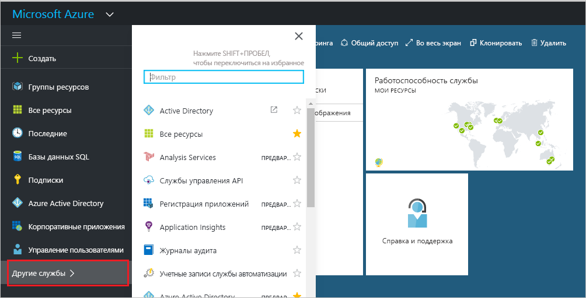
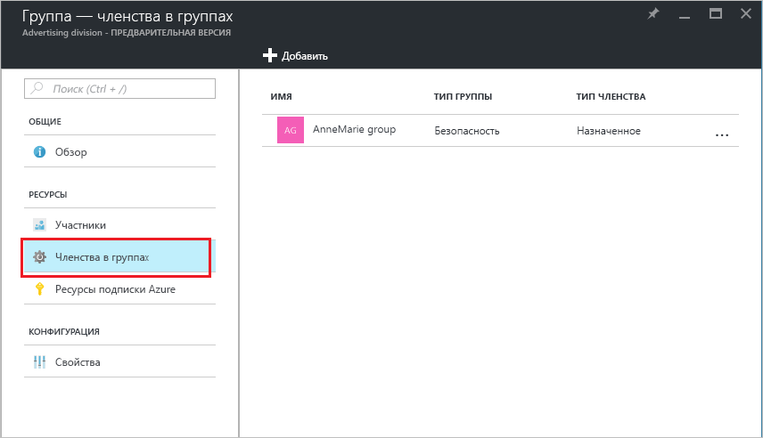
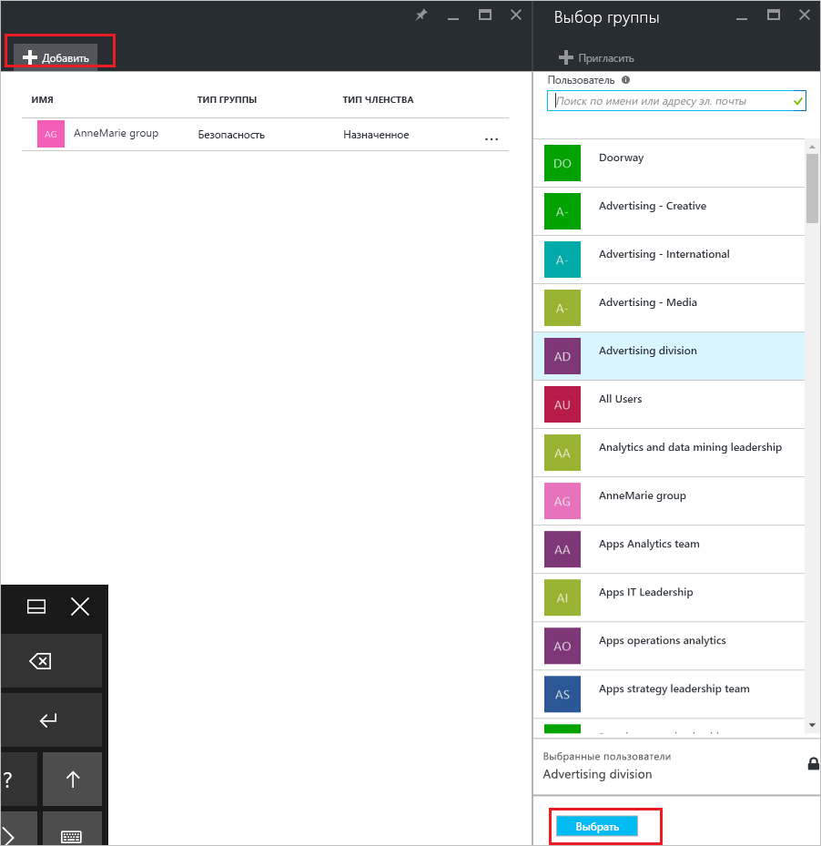
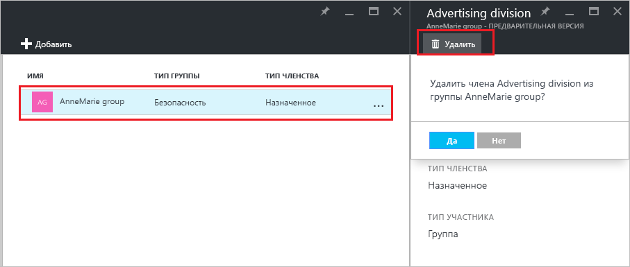

# Управление тем, к каким группам относится группа в клиенте Azure Active Directory
В Azure Active Directory группы могут содержать другие группы. Вот как можно управлять членством такого типа.

## Как узнать, членом каких групп является моя группа?
1. Войдите в [центр администрирования Azure AD](https://aad.portal.azure.com) с помощью учетной записи глобального администратора каталога.
2. Выберите **Пользователи и группы**.

   
1. Выберите **Все группы**.

   
1. Выберите группу.
2. Выберите **Членства в группах**.

   
1. Чтобы добавить группу в качестве участника в другую группу, в колонке **Группа — Членства в группах** выберите команду **Добавить**.
2. Выберите группу в колонке **Выбор группы** и нажмите кнопку **Выбрать**, расположенную в нижней части колонки. Одним действием группу можно добавить только в одну другую группу. В поле **Пользователь** можно ввести часть имени пользователя или устройства, чтобы отфильтровать по нему список отображенных элементов. Подстановочные знаки в поле не допускаются.

   
8. Чтобы удалить группу из другой группы, участником которой она является, в колонке **Группа — Принадлежность к группам** выберите удаляемую группу.
9. Выберите команду **Удалить** и подтвердите свой выбор при появлении соответствующего запроса.

   
10. Завершив изменение членства группы в других группах, щелкните **Сохранить**.

## Дополнительная информация
В следующих статьях содержатся дополнительные сведения об Azure Active Directory.

* [Просмотр существующих групп](active-directory-groups-view-azure-portal.md)
* [Создание группы и добавление участников](active-directory-groups-create-azure-portal.md)
* [Управление параметрами группы](active-directory-groups-settings-azure-portal.md)
* [Управление участниками группы](active-directory-groups-members-azure-portal.md)
* [Управление динамическими правилами для пользователей в группе](../users-groups-roles/groups-dynamic-membership.md)
