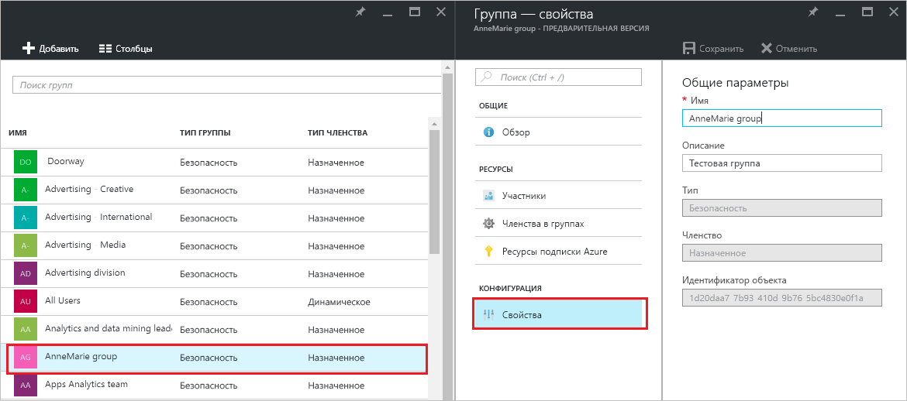
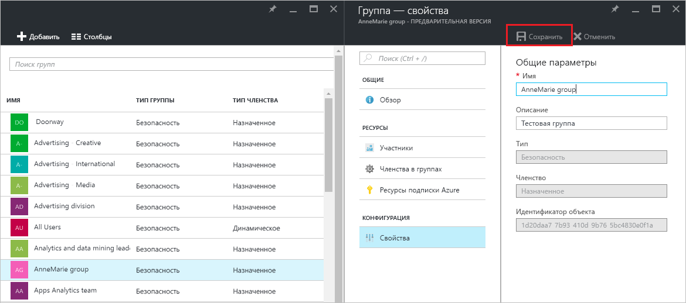

# Управление параметрами группы в Azure Active Directory
В этой статье объясняется, как управлять параметрами группы в Azure Active Directory (Azure AD).

## Как можно найти и изменить параметры?
1. Войдите в [центр администрирования Azure AD](https://aad.portal.azure.com) с помощью учетной записи глобального администратора каталога.
2. Выберите **Все службы**, введите **Пользователи и группы** в текстовое поле, а затем нажмите клавишу **ВВОД**.

   
3. В колонке **Пользователи и группы** выберите **Все группы**.

   
4. Выберите группу в колонке **Пользователи и группы — Все группы** .
5. В колонке **Группа — *имя_группы*** выберите **Свойства**.

   
6. Завершив изменение свойств группы, щелкните **Сохранить**.    

   

## Дополнительная информация
В следующих статьях содержатся дополнительные сведения об Azure Active Directory.

* [Просмотр существующих групп](active-directory-groups-view-azure-portal.md)
* [Создание группы и добавление участников](active-directory-groups-create-azure-portal.md)
* [Управление участниками группы](active-directory-groups-members-azure-portal.md)
* [Управление членством в группе](active-directory-groups-membership-azure-portal.md)
* [Управление динамическими правилами для пользователей в группе](../users-groups-roles/groups-dynamic-membership.md)
