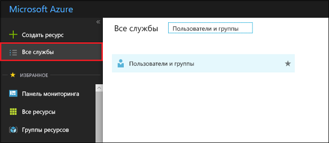

# Просмотр или поиск групп пользователей в Azure Active Directory
В этой статье объясняется, как просмотреть группы в Azure Active Directory (Azure AD). Одной из возможностей управления пользователями Azure AD является использование групп пользователей для выполнения задач управления, например назначение лицензий или разрешений нескольким пользователям одновременно.

## Как можно просмотреть все группы?
1. Войдите на [портал Azure](https://portal.azure.com) с помощью учетной записи глобального администратора каталога.
2. Выберите **Все службы**, введите **Пользователи и группы** в текстовое поле, а затем нажмите клавишу **ВВОД**.

   
3. В колонке **Пользователи и группы** выберите **Все группы**.

   
4. В колонке **Пользователи и группы — Все группы** можно добавить или удалить отображаемые столбцы, отфильтровать список для поиска группы или внести изменения в группы, для которых имеются необходимые разрешения на изменение.

## Дополнительная информация
В следующих статьях содержатся дополнительные сведения об Azure Active Directory.

* [Просмотр существующих групп](active-directory-groups-view-azure-portal.md)
* [Создание группы и добавление участников](active-directory-groups-create-azure-portal.md)
* [Управление параметрами группы](active-directory-groups-settings-azure-portal.md)
* [Управление участниками группы](active-directory-groups-members-azure-portal.md)
* [Управление членством в группе](active-directory-groups-membership-azure-portal.md)
* [Управление динамическими правилами для пользователей в группе](../users-groups-roles/groups-dynamic-membership.md)
