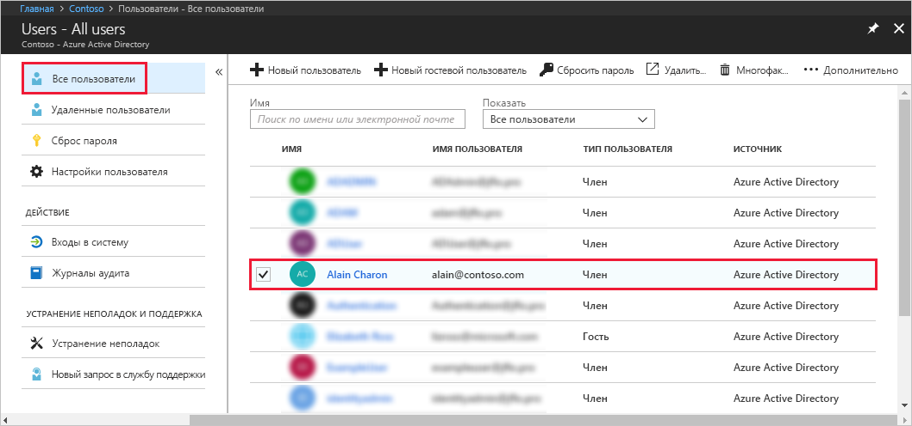
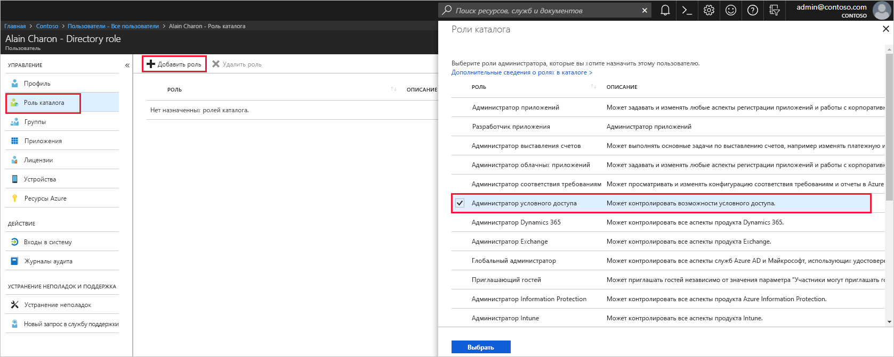

# Назначение пользователю ролей администратора в Azure Active Directory
В этой статье описывается назначение роли администратора пользователю в Azure Active Directory (Azure AD). Сведения о добавлении новых пользователей в организации см. в статье [Добавление пользователей из других каталогов или организаций-партнеров в предварительной версии Azure Active Directory](../add-users-azure-active-directory.md). По умолчанию добавленные пользователи не имеют прав администратора, но вы можете назначать им роли в любое время.

## Назначение роли пользователю
1. Войдите на [портал Azure](https://portal.azure.com) с помощью учетной записи глобального администратора или привилегированного администратора каталога.

2. Щелкните **Azure Active Directory**, выберите **Пользователи**, а затем выберите из списка определенного пользователя.

    

3. Для выбранного пользователя щелкните **Роль каталога**, выберите **Добавить роль**, а затем выберите соответствующие роли администратора из списка **Роли каталога**, например **Администратор условного доступа**. Дополнительные сведения о ролях администраторов см. в статье [Назначение ролей администратора в Azure Active Directory](../active-directory-assign-admin-roles-azure-portal.md). 

    

1. Нажмите кнопку **Выбрать**, чтобы сохранить изменения.

## Дополнительная информация
* [Краткое руководство по добавлению новых пользователей в Azure Active Directory](add-users-azure-active-directory.md)
* [Управление профилями пользователей](active-directory-users-profile-azure-portal.md)
* [Добавление гостевых пользователей из другого каталога](../b2b/what-is-b2b.md) 
* [Назначение пользователей в предварительной версии Azure AD](active-directory-users-assign-role-azure-portal.md)
* [Восстановление удаленного пользователя](active-directory-users-restore.md)
