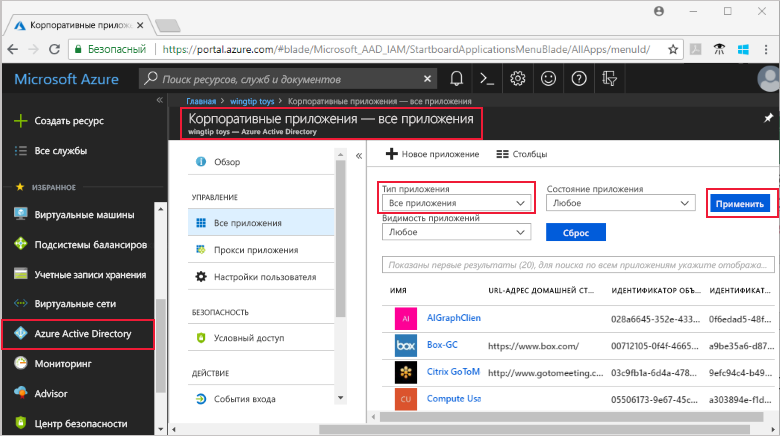
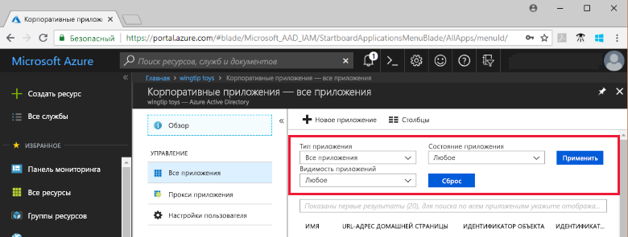
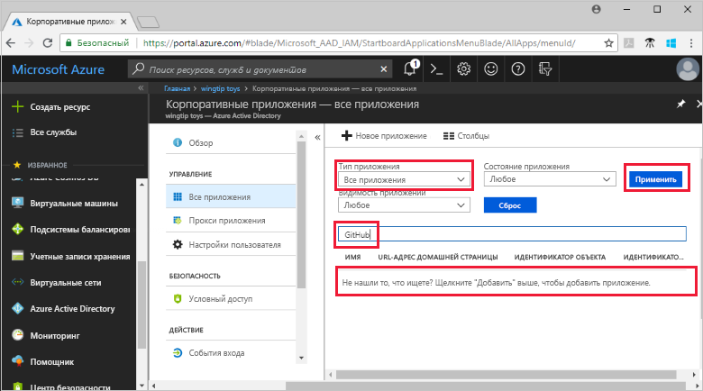
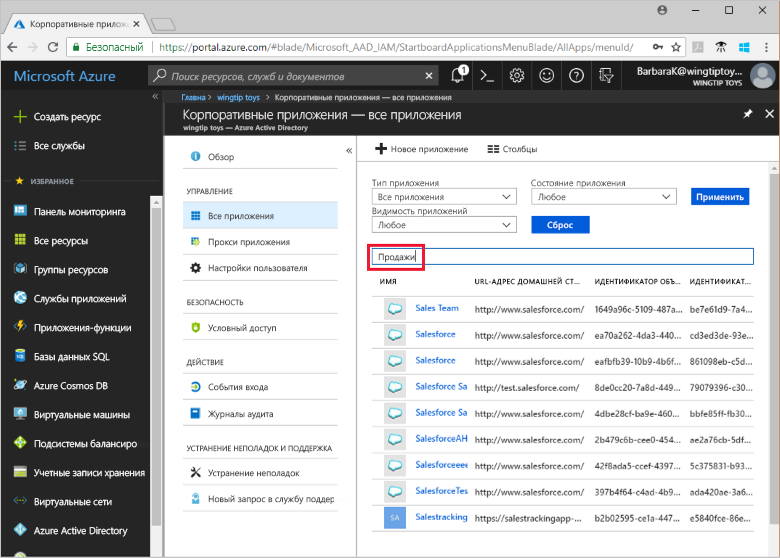

# Просмотр клиентских приложений в Azure Active Directory

В этом кратком руководстве используется портал Azure для просмотра приложений в клиенте Azure Active Directory (Azure AD).

## Перед началом работы

Чтобы увидеть результаты, необходимо иметь хотя бы одно приложение в клиенте Azure AD. Дополнительные сведения о добавлении приложения см. в кратком руководстве [Quickstart: Add an application to your Azure Active Directory tenant](add-application-portal.md) (Краткое руководство. Добавление приложения в клиент Azure Active Directory).

Войдите на [портал Azure](https://portal.azure.com) в клиент Azure AD в качестве глобального администратора, администратора облачных приложений или администратора приложения.

## Поиск списка клиентских приложений

Клиентские приложения Azure AD можно просмотреть в разделе **Корпоративные приложения** портала Azure.

Чтобы найти клиентские приложения, выполните следующие действия.

1. На **[портале Azure](https://portal.azure.com)** в области навигации слева щелкните **Azure Active Directory**. 

2. В колонке Azure Active Directory нажмите **Корпоративные приложения**. 

3. В раскрывающемся меню **Тип приложения** выберите **Все приложения** и нажмите **Применить**. Появится случайный пример клиентского приложения.

    
   
4. Чтобы просмотреть другие приложения, щелкните **Показать больше** в нижней части списка. В зависимости от количества приложений в клиенте может быть проще [искать конкретное приложение](#search-for-a-tenant-application) вместо прокрутки по списку.

## Выбор параметров просмотра

В этом разделе выберите необходимые для поиска параметры.

1. Можно просмотреть приложения в соответствии с такими параметрами: **Тип приложения**, **Состояние приложения** и **Видимость приложения**. 

    

2. В разделе **Тип приложения** выберите один из следующих вариантов.

    - **Корпоративные приложения**. Представление сторонних приложений.
    - **Приложения Майкрософт**. Представление приложений Майкрософт.
    - **Все приложения**. Представление и сторонних приложений, и приложений Майкрософт.

3. В разделе **Состояние приложения** выберите **Любое**, **Отключено** или **Включено**. Параметр **Любое** включает в себя как отключенные, так и включенные приложения.

4. В разделе **Видимость приложений** выберите **Любое** или **Скрытое**. Параметр **Скрытый** показывает приложения, которые находятся в клиенте, но не отображаются пользователям.

5. Выбрав нужные параметры, нажмите кнопку **Применить**.
 

## Поиск клиентского приложения

Для поиска конкретного приложения выполните следующие действия.

1. В меню **Тип приложения** выберите **Все приложения** и нажмите кнопку **Применить**.

2. Введите имя приложения, которое необходимо найти. Если приложение было добавлено в клиент Azure AD, оно появится в результатах поиска. В этом примере показано, что GitHub не был добавлен в приложения клиента.

    

3. Попробуйте ввести первые несколько букв имени приложения.  В этом примере показаны все приложения, которые начинаются с **Sales**.

    

## Дополнительная информация

Из этого краткого руководства вы узнали, как просмотреть приложения в клиенте Azure AD и как фильтровать список приложений по типу, состоянию и видимости приложения. Вы также узнали, как искать конкретное приложение.

Теперь, когда вы нашли приложение, которое искали, можно продолжить добавлять приложения в клиент. Дополнительные сведения см. в разделе [Quickstart: Add an application to your Azure Active Directory tenant](add-application-portal.md) (Краткое руководство. Добавление приложения в клиент Azure Active Directory). Или можно щелкнуть приложение для просмотра или редактирования свойств и параметров конфигурации. Например, можно настроить единый вход. 

> [!div class="nextstepaction"]
> [Настройка единого входа](configure-single-sign-on-portal.md)

