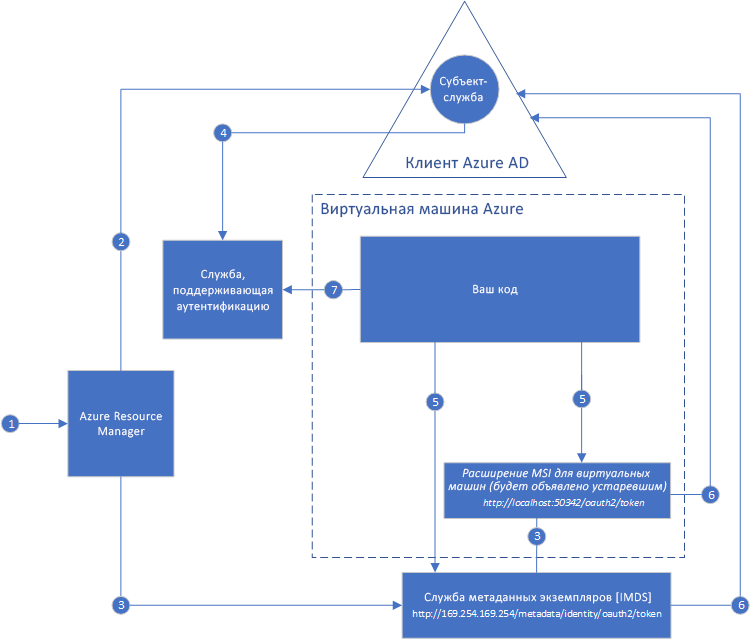

# Что такое Управляемое удостоверение службы для ресурсов Azure?

[!INCLUDE[preview-notice](../../../includes/active-directory-msi-preview-notice.md)]

Распространенная проблема при создании облачных приложений — управление учетными данными в коде для проверки подлинности в облачных службах. Обеспечение безопасности учетных данных является важной задачей. В идеальном случае учетные данные никогда не передаются на рабочие станции разработчиков и не проверяются после изменения в системе управления версиями. Azure Key Vault позволяет обеспечить безопасное хранение учетных данных, секретов, а также других ключей, но для их получения код должен выполнять проверку подлинности в Key Vault. 

С помощью функции "Управляемое удостоверение службы" в Azure Active Directory (Azure AD) данную проблему можно решить. Функция предоставляет службам Azure автоматически управляемое удостоверение в Azure AD. Удостоверение можно использовать для проверки подлинности в любой службе, которая поддерживает проверку подлинности Azure AD, включая Key Vault, при этом не сохраняя каких-либо учетных данных в коде.

Использование функции "Управляемое удостоверение службы" вместе с Azure AD в подписке Azure является бесплатным. Дополнительные затраты отсутствуют.

## Принципы работы функции

Существует два типа управляемых удостоверений.

- **Назначаемое системой удостоверение** включается непосредственно в экземпляре службы Azure. Если удостоверение включено, Azure создает удостоверение для экземпляра службы в клиенте Azure AD, который является доверенным в подписке этого экземпляра. После создания удостоверения учетные данные подготавливаются для передачи в экземпляр. Жизненный цикл назначенного системой удостоверения напрямую связан с экземпляром службы Azure, в которой оно включено. При удалении экземпляра Azure автоматически очищает учетные данные и удостоверение в Azure AD.
- **Назначенное пользователем удостоверение** создается как изолированный ресурс Azure. При этом Azure создает удостоверение в доверенном клиенте Azure AD используемой подписки. После создания удостоверения оно может быть назначено одному или нескольким экземплярам служб Azure. Управление жизненным циклом назначенного пользователем удостоверения осуществляется отдельно от жизненного цикла экземпляров служб Azure, для которых оно назначено.

Затем ваш код может использовать управляемое удостоверение службы для запроса на получение маркеров доступа для служб, которые поддерживают проверку подлинности Azure AD. Azure выполняет развертывание учетных данных, используемых экземпляром службы.

Работа управляемых удостоверений служб с виртуальными машинами Azure показана на следующей схеме.

### Работа назначенного системой удостоверения с виртуальной машиной Azure

1. Azure Resource Manager получает запрос на включение назначенного системой удостоверения MSI в виртуальной машине.
2. Azure Resource Manager создает субъект-службу в Azure AD для удостоверения виртуальной машины. В клиенте Azure AD, который является доверенным для этой подписки, создается субъект-служба.
3. Azure Resource Manager настраивает удостоверение на виртуальной машине;
    1. Обновляет конечную точку удостоверения Службы метаданных экземпляров Azure с помощью идентификатора клиента субъект-службы и сертификата.
    1. Предоставляет расширение виртуальной машины и добавляет идентификатор клиента субъект-службы и сертификат. (Этот шаг планируется объявить устаревшим).
4. После того как виртуальной машине было назначено удостоверение, для предоставления доступа виртуальной машины к ресурсам Azure используются сведения о субъекте-службе. Чтобы назначить соответствующую роль субъект-службе виртуальной машины, используйте Azure Resource Manager. Его можно вызвать с помощью управления доступом на основе ролей RBAC в Azure AD. Для вызова Key Vault следует предоставить доступ к определенному секрету или ключу в Key Vault.
5. Код, выполняющийся на виртуальной машине, может выполнить запрос на получение маркера из двух конечных точек, доступных только на виртуальной машине.

    - Конечная точка удостоверения Службы метаданных экземпляров Azure (рекомендуется): `http://169.254.169.254/metadata/identity/oauth2/token`.
        - Параметр ресурса указывает службу, в которую отправляется маркер. Для проверки подлинности в Azure Resource Manager необходимо использовать `resource=https://management.azure.com/`.
        - Параметр версии API указывает версию IMDS. Используйте api-version=2018-02-01 или более позднюю версию.
    - Конечная точка расширения виртуальной машины (планируется объявить устаревшей) `http://localhost:50342/oauth2/token` 
        - Параметр ресурса указывает службу, в которую отправляется маркер. Для проверки подлинности в Azure Resource Manager необходимо использовать `resource=https://management.azure.com/`.

6. В Azure AD выполняется вызов для запроса маркера доступа (как указано в шаге 5) с использованием идентификатора клиента и сертификата, настроенных на шаге 3. Azure AD возвращает маркер доступа JSON Web Token (JWT).
7. Код отправляет этот маркер доступа при вызове службы, которая поддерживает аутентификацию Azure AD.

### Работа назначенного пользователем удостоверения на виртуальной машине Azure

1. Azure Resource Manager получает запрос на создание назначаемого пользователем удостоверения.
2. Azure Resource Manager создает субъект-службу в Azure AD для назначенного пользователем удостоверения. В клиенте Azure AD, который является доверенным для этой подписки, создается субъект-служба.
3. Azure Resource Manager получает запрос на настройку назначаемого пользователем удостоверения в виртуальной машине.
    1. Обновляет конечную точку удостоверения Службы метаданных экземпляров Azure с помощью назначенного пользователем идентификатора и сертификата субъекта-службы назначаемого пользователем удостоверения.
    1. Подготавливает расширения виртуальной машины и добавляет назначенный пользователем идентификатор и сертификат субъекта-службы назначаемого пользователем удостоверения. (Этот шаг планируется объявить устаревшим).
4. После создания назначенного пользователем удостоверения, чтобы предоставить ему доступ к ресурсам Azure, используются сведения о субъекте-службе. Чтобы назначить соответствующую роль субъект-службе назначенного пользователем удостоверения, используйте вызов Azure Resource Manager с помощью RBAC в Azure AD. Для вызова Key Vault следует предоставить доступ к определенному секрету или ключу в Key Vault.

   > [!Note]
   > Также данное действие можно выполнить перед шагом 3.

5. Код, выполняющийся на виртуальной машине, может выполнить запрос на получение маркера из двух конечных точек, доступных только на виртуальной машине.

    - Конечная точка удостоверения Службы метаданных экземпляров Azure (рекомендуется): `http://169.254.169.254/metadata/identity/oauth2/token`.
        - Параметр ресурса указывает службу, в которую отправляется маркер. Для проверки подлинности в Azure Resource Manager необходимо использовать `resource=https://management.azure.com/`.
        - Параметр идентификатора клиента определяет удостоверение, для которого запрашивается маркер. Это значение необходимо для устранения неоднозначности в случае, когда на одной виртуальной машине находится более одного назначенного пользователем удостоверения.
        - Параметры версии API указывают версию Службы метаданных экземпляров Azure. Используйте `api-version=2018-02-01` или более поздней версии.

    - Конечная точка расширения виртуальной машины (планируется объявить устаревшей) `http://localhost:50342/oauth2/token`
        - Параметр ресурса указывает службу, в которую отправляется маркер. Для проверки подлинности в Azure Resource Manager необходимо использовать `resource=https://management.azure.com/`.
        - Параметр идентификатора клиента определяет удостоверение, для которого запрашивается маркер. Это значение необходимо для устранения неоднозначности в случае, когда на одной виртуальной машине находится более одного назначенного пользователем удостоверения.
6. В Azure AD выполняется вызов для запроса маркера доступа (как указано в шаге 5) с использованием идентификатора клиента и сертификата, настроенных на шаге 3. Azure AD возвращает маркер доступа JSON Web Token (JWT).
7. Код отправляет этот маркер доступа при вызове службы, которая поддерживает аутентификацию Azure AD.

## Как использовать управляемые удостоверения службы?

Дополнительные сведения об использовании управляемых удостоверений службы для получения доступа к разным ресурсам Azure приведены в следующих руководствах.

Сведения об использовании управляемого удостоверения службы виртуальной машины Windows.

* [Доступ к Azure Data Lake Store](tutorial-windows-vm-access-datalake.md)
* [Доступ к Resource Manager с помощью Управляемого удостоверения службы виртуальной машины Windows](tutorial-windows-vm-access-arm.md)
* [Доступ к Azure SQL](tutorial-windows-vm-access-sql.md)
* [Получение доступа к службе хранилища Azure с помощью ключа доступа и управляемого удостоверения службы виртуальной машины Windows](tutorial-windows-vm-access-storage.md)
* [Руководство по использованию управляемого удостоверения службы виртуальной машины Windows для доступа к службе хранилища Azure с учетными данными SAS](tutorial-windows-vm-access-storage-sas.md)
* [Получение доступа к Azure Key Vault с помощью управляемого удостоверения службы виртуальной машины Windows](tutorial-windows-vm-access-nonaad.md)

Сведения об использовании управляемого удостоверения службы виртуальной машины Linux.

* [Доступ к Azure Data Lake Store](tutorial-linux-vm-access-datalake.md)
* [Получение доступа к Azure Resource Manager с помощью управляемого удостоверения службы виртуальной машины Linux](tutorial-linux-vm-access-arm.md)
* [Доступ к службе хранилища Azure с помощью управляемого удостоверения виртуальной машины Linux](tutorial-linux-vm-access-storage.md)
* [Руководство по использованию управляемого удостоверения службы виртуальной машины Linux для доступа к службе хранилища Azure с учетными данными SAS](tutorial-linux-vm-access-storage-sas.md)
* [Доступ к Azure Key Vault с помощью управляемого удостоверения службы виртуальной машины Linux](tutorial-linux-vm-access-nonaad.md)

Сведения об использовании управляемого удостоверения службы других служб Azure.

* [службе приложений Azure](/azure/app-service/app-service-managed-service-identity)
* [Функции Azure](/azure/app-service/app-service-managed-service-identity)
* [служебной шине Azure](../../service-bus-messaging/service-bus-managed-service-identity.md)
* [Концентраторы событий Azure](../../event-hubs/event-hubs-managed-service-identity.md)
* [Управление API Azure](../../api-management/api-management-howto-use-managed-service-identity.md)

## Службы Azure, в которых поддерживается данная функция.

Управляемые удостоверения службы можно использовать для проверки подлинности служб, поддерживающих проверку подлинности Azure AD. Дополнительные сведения о списке служб Azure, поддерживающих функцию "Управляемое удостоверение служб", см. в статье [Службы, поддерживающие Управляемое удостоверение службы](services-support-msi.md).

## Дополнительная информация

Для начала работы с функцией "Управляемое удостоверение службы" ознакомьтесь со следующими краткими руководствами.

* [Доступ к Resource Manager с помощью Управляемого удостоверения службы виртуальной машины Windows](tutorial-windows-vm-access-arm.md)
* [Получение доступа к Azure Resource Manager с помощью Управляемого удостоверения службы виртуальной машины Linux](tutorial-linux-vm-access-arm.md)
