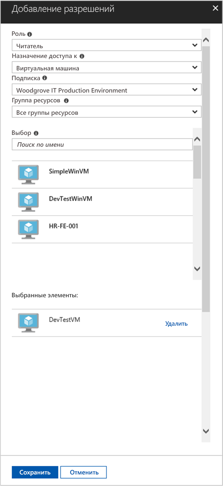

# <a name="use-a-linux-vm-system-assigned-managed-identity-to-access-azure-resource-manager"></a>Использование назначаемого системой управляемого удостоверения на виртуальной машине Linux для доступа к Azure Resource Manager

[!INCLUDE[preview-notice](../../../includes/active-directory-msi-preview-notice.md)]

В этом кратком руководстве показано, как использовать назначаемое системой управляемое удостоверение для доступа к API Azure Resource Manager с помощью виртуальной машины Linux. Управляемыми удостоверениями для ресурсов Azure автоматически управляет Azure. Они позволяют проходить проверку подлинности в службах, поддерживающих аутентификацию Azure Active Directory, без указания учетных данных в коде. Вы узнаете, как выполнять следующие задачи:

> [!div class="checklist"]
> * Предоставление виртуальной машине доступа к группе ресурсов в Azure Resource Manager 
> * Получение маркера доступа с помощью удостоверения виртуальной машины и вызов Azure Resource Manager с его помощью. 

## <a name="prerequisites"></a>Предварительные требования

[!INCLUDE [msi-qs-configure-prereqs](../../../includes/active-directory-msi-qs-configure-prereqs.md)]

[!INCLUDE [msi-tut-prereqs](../../../includes/active-directory-msi-tut-prereqs.md)]

- [Войдите на портал Azure](https://portal.azure.com).

- [Создайте виртуальную машину Linux](/azure/virtual-machines/linux/quick-create-portal).

- [Включите назначаемое системой управляемое удостоверение на виртуальной машине](/azure/active-directory/managed-service-identity/qs-configure-portal-windows-vm#enable-system-assigned-identity-on-an-existing-vm).

## <a name="grant-your-vm-access-to-a-resource-group-in-azure-resource-manager"></a>Предоставление виртуальной машине доступа к группе ресурсов в Azure Resource Manager 

С помощью управляемых удостоверений для ресурсов Azure код может получить маркеры доступа, чтобы пройти проверку подлинности и получить доступ к ресурсам, поддерживающим аутентификацию Azure AD. API Azure Resource Manager поддерживает аутентификацию Azure AD. Сначала нам необходимо предоставить этому удостоверению виртуальной машины доступ к ресурсу в Azure Resource Manager, в этом случае — к группе ресурсов, в которой находится виртуальная машина.  

1. Перейдите на вкладку **Группы ресурсов**.
2. Выберите определенную **группу ресурсов**, созданную ранее.
3. Перейдите к элементу **Управление доступом (IAM)** на панели слева.
4. Щелкните **Добавить**, чтобы добавить новое назначение роли виртуальной машине. В поле **Роль** выберите **Читатель**.
5. В раскрывающемся списке далее в поле **Назначение доступа к** выберите ресурс **Виртуальная машина**.
6. Проверьте, чтобы в раскрывающемся списке **Подписка** была выбрана нужная подписка. В поле **Группа ресурсов** выберите **Все группы ресурсов**.
7. И наконец, в поле **Выбрать** выберите свою виртуальную машину Linux в раскрывающемся списке, а затем нажмите кнопку **Сохранить**.

    

## <a name="get-an-access-token-using-the-vms-system-assigned-managed-identity-and-use-it-to-call-resource-manager"></a>Получение маркера доступа с помощью назначаемого системой управляемого удостоверения виртуальной машины и вызов Resource Manager с использованием этого маркера 

Для выполнения этих действий вам потребуется клиент SSH. Если вы используете Windows, можно использовать клиент SSH в [подсистеме Windows для Linux](https://msdn.microsoft.com/commandline/wsl/about). Если вам нужна помощь в настройке ключей SSH-клиента, ознакомьтесь с разделом [Использование ключей SSH с Windows в Azure](../../virtual-machines/linux/ssh-from-windows.md) или [Как создать и использовать пару из открытого и закрытого ключей SSH для виртуальных машин Linux в Azure](../../virtual-machines/linux/mac-create-ssh-keys.md).

1. На портале перейдите на виртуальную машину Linux и в разделе **Обзор** щелкните **Подключиться**.  
2. **Подключитесь** к виртуальной машине с помощью выбранного клиента SSH. 
3. В окне терминала выполните запрос к локальной конечной точке управляемых удостоверений для ресурсов Azure с помощью curl, чтобы получить маркер доступа для Azure Resource Manager.  
 
    Запрос cURL маркера доступа приведен ниже.  
    
    ```bash
    curl 'http://169.254.169.254/metadata/identity/oauth2/token?api-version=2018-02-01&resource=https%3A%2F%2Fmanagement.azure.com%2F' -H Metadata:true   
    ```
    
    > [!NOTE]
    > Значение параметра resource должно точно совпадать со значением, которое будет использоваться в Azure AD.  Если используется идентификатор ресурса Resource Manager, добавьте косую черту после универсального кода ресурса (URI). 
    
    Ответ включает маркер доступа, необходимый для доступа к Azure Resource Manager. 
    
    Ответ:  

    ```bash
    {"access_token":"eyJ0eXAiOi...",
    "refresh_token":"",
    "expires_in":"3599",
    "expires_on":"1504130527",
    "not_before":"1504126627",
    "resource":"https://management.azure.com",
    "token_type":"Bearer"} 
    ```
    
    Этот маркер доступа можно использовать для доступа к Azure Resource Manager, например для просмотра подробных сведений о группе ресурсов, к которой вы ранее предоставили доступ виртуальной машине. Замените значения \<SUBSCRIPTION ID\>, \<RESOURCE GROUP\> и \<ACCESS TOKEN\> идентификатором подписки, группой ресурсов и маркером доступа, созданными ранее. 
    
    > [!NOTE]
    > В URL-адресе учитывается регистр знаков, поэтому должен использоваться тот же регистр, который использовался, когда вы присваивали имя группе ресурсов. Обязательно укажите прописную букву "G" в имени группы resourceGroup.  
    
    ```bash 
    curl https://management.azure.com/subscriptions/<SUBSCRIPTION ID>/resourceGroups/<RESOURCE GROUP>?api-version=2016-09-01 -H "Authorization: Bearer <ACCESS TOKEN>" 
    ```
    
    Ответ с определенными сведениями о группе ресурсов выглядит следующим образом: 
     
    ```bash
    {"id":"/subscriptions/98f51385-2edc-4b79-bed9-7718de4cb861/resourceGroups/DevTest","name":"DevTest","location":"westus","properties":{"provisioningState":"Succeeded"}} 
    ```     

## <a name="next-steps"></a>Дополнительная информация

Из этого краткого руководства вы узнали, как использовать назначаемое системой управляемое удостоверение для доступа к API Azure Resource Manager.  Сведения об Azure Resource Manager см. здесь:

> [!div class="nextstepaction"]
>[Azure Resource Manager](/azure/azure-resource-manager/resource-group-overview)