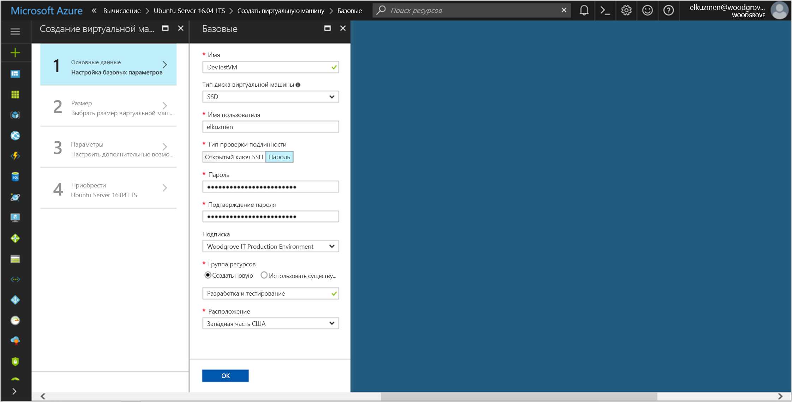

# <a name="tutorial-use-a-linux-vms-managed-identity-to-access-azure-storage"></a>Руководство. Доступ к службе хранилища Azure с помощью управляемого удостоверения виртуальной машины Linux 

[!INCLUDE[preview-notice](../../../includes/active-directory-msi-preview-notice.md)]


В этом руководстве показано, как создать и использовать управляемое удостоверение виртуальной машины Linux для доступа к хранилищу Azure. Вы узнаете, как выполнять следующие задачи:

> [!div class="checklist"]
> * Создание виртуальной машины Linux в новой группе ресурсов
> * включить управляемое удостоверение на виртуальной машине Linux;
> * создать контейнер больших двоичных объектов в учетной записи хранения;
> * предоставить доступ управляемому удостоверению виртуальной машины Linux к контейнеру службы хранилища Azure.
> * Получение маркера доступа и его использование для вызова службы хранилища Azure

> [!NOTE]
> Аутентификация Azure Active Directory для службы хранилища Azure находится на этапе общедоступной предварительной версии.

## <a name="prerequisites"></a>Предварительные требования

Если у вас нет учетной записи Azure, [зарегистрируйтесь для получения бесплатной пробной учетной записи](https://azure.microsoft.com), прежде чем продолжать.

[!INCLUDE [msi-tut-prereqs](~/includes/active-directory-msi-tut-prereqs.md)]

Запустить примеры сценариев CLI в этом руководстве можно двумя способами:

- Использовать службу [Azure Cloud Shell](~/articles/cloud-shell/overview.md) на портале Azure или с помощью кнопки **Попробовать**, расположенной в правом верхнем углу каждого блока кода.
- [Установить последнюю версию интерфейса командной строки (CLI) 2.0](https://docs.microsoft.com/cli/azure/install-azure-cli) (2.0.23 или более позднюю версию), если вы предпочитаете использовать локальную консоль CLI.

## <a name="sign-in-to-azure"></a>Вход в Azure

Войдите на портал Azure по адресу [https://portal.azure.com](https://portal.azure.com).

## <a name="create-a-linux-virtual-machine-in-a-new-resource-group"></a>Создание виртуальной машины Linux в новой группе ресурсов

В этом разделе вы создадите виртуальную машину Linux, которой позже будет назначено управляемое удостоверение.

1. Нажмите кнопку **Создать** в левом верхнем углу портала Azure.
2. Выберите **Вычисления**, а затем — **Сервер Ubuntu 16.04 LTS**.
3. Введите сведения о виртуальной машине. Для параметра **Тип проверки подлинности** выберите значение **Открытый ключ SSH** или **Пароль**. Созданные учетные данные позволят вам выполнить вход на виртуальную машину.

   

4. В списке **Подписка** выберите подписку для виртуальной машины.
5. Чтобы выбрать новую группу ресурсов, в которой вы хотите создать виртуальную машину, щелкните **Группа ресурсов** > **Создать**. По завершении нажмите кнопку **ОК**.
6. Выберите размер виртуальной машины. Чтобы просмотреть дополнительные размеры, выберите **Просмотреть все** или измените фильтр **Supported disk type** (Поддерживаемые типы диска). В области параметров оставьте значения по умолчанию и нажмите кнопку **ОК**.

## <a name="enable-managed-identity-on-your-vm"></a>Включение управляемого удостоверения на виртуальной машине

Управляемое удостоверение на виртуальной машине позволяет получить маркеры доступа из Azure AD без необходимости указывать в коде учетные данные. На самом деле при включении управляемого удостоверения на виртуальной машине с помощью портала Azure выполняются две задачи: регистрация виртуальной машины в Azure AD для создания управляемого удостоверения и его настройка на этой виртуальной машине.

1. Перейдите в группу ресурсов новой виртуальной машины и выберите виртуальную машину, созданную на предыдущем шаге.
2. В категории **Параметры** щелкните **Конфигурация**.
3. Чтобы включить управляемое удостоверение, выберите **Да**.
4. Чтобы применить конфигурацию, нажмите кнопку **Сохранить**. 

## <a name="create-a-storage-account"></a>Создание учетной записи хранения 

В этом разделе вы создадите учетную запись хранения. 

1. Нажмите кнопку **Создать ресурс** в верхнем левом углу окна портала Azure.
2. Щелкните **Хранилище**, а затем — **Учетная запись хранения — BLOB-объект, файл, таблица, очередь**.
3. В поле **Имя** введите имя учетной записи хранения.  
4. Для параметра **Модель развертывания** выберите **Resource Manager**, а для поля **Тип учетной записи** — **Хранилище (версия 1, общего назначения)**. 
5. Убедитесь, что значения **подписки** и **группы ресурсов** соответствуют указанным при создании виртуальной машины на предыдущем шаге.
6. Нажмите кнопку **Создать**.

    

## <a name="create-a-blob-container-and-upload-a-file-to-the-storage-account"></a>Создание контейнера больших двоичных объектов и передача файла в учетную запись хранения

Так как файлам необходимо хранилище BLOB-объектов, нужно создать контейнер больших двоичных объектов, в котором будет храниться файл. Затем файл отправляется в контейнер больших двоичных объектов в новой учетной записи хранения.

1. Вернитесь к только что созданной учетной записи хранения.
2. В колонке **Служба BLOB-объектов** щелкните **Контейнеры**.
3. В верхней области страницы щелкните **+ Container** (+ Контейнер).
4. В разделе **Создание контейнера** введите имя контейнера, а в разделе **Общедоступный уровень доступа** оставьте значение по умолчанию.

    

5. С помощью редактора по своему усмотрению создайте на локальном компьютере файл с именем *hello world.txt*.  Откройте его и добавьте текст (без кавычек) "Hello world! :)", а затем сохраните его. 

6. Передайте файл в только что созданный контейнер. Для этого щелкните имя контейнера, а затем нажмите кнопку **Отправить**.
7. В области **Отправить BLOB-объект** под полем **Файлы** щелкните значок папки и перейдите к файлу **hello_world.txt** на локальном компьютере, выберите этот файл и нажмите кнопку **Отправить**.

    

## <a name="grant-your-vm-access-to-an-azure-storage-container"></a>Предоставление виртуальной машине доступа к контейнеру службы хранилища Azure 

Вы можете использовать управляемое удостоверение виртуальной машины для извлечения данных в большом двоичном объекте службы хранилища Azure.   

1. Вернитесь к только что созданной учетной записи хранения.  
2. Щелкните ссылку **Управление доступом (IAM)** на панели слева.  
3. Щелкните **+ Добавить** в верхней части страницы, чтобы добавить новое назначение роли для виртуальной машины.
4. В поле **Роль** из раскрывающегося списка выберите **Модуль чтения данных больших двоичных объектов хранилища (предварительная версия)**. 
5. В следующем раскрывающемся списке в поле **Назначение доступа к** выберите **Виртуальная машина**.  
6. Убедитесь, что нужная подписка присутствует в раскрывающемся списке **Подписка**, и установите для параметра **Группа ресурсов** значение **Все группы ресурсов**.  
7. В разделе **Выбранные элементы** выберите свою виртуальную машину и нажмите кнопку **Сохранить**.

    

## <a name="get-an-access-token-and-use-it-to-call-azure-storage"></a>Получение маркера доступа и его использование для вызова службы хранилища Azure

В службе хранилища Azure изначально реализована поддержка аутентификации Azure AD, поэтому она может напрямую принимать маркеры доступа, полученные с помощью управляемого удостоверения. Эта реализация является частью интеграции службы хранилища Azure с Azure AD и отличается от указания учетных данных в строке подключения.

Чтобы выполнить следующие шаги, вам нужно работать с созданной ранее виртуальной машиной, и вам нужен клиент SSH для подключения к ней. Если вы используете Windows, можно использовать клиент SSH в [подсистеме Windows для Linux](https://msdn.microsoft.com/commandline/wsl/about). Если вам нужна помощь в настройке ключей SSH-клиента, ознакомьтесь с разделом [Использование ключей SSH с Windows в Azure](~/articles/virtual-machines/linux/ssh-from-windows.md) или [Как создать и использовать пару из открытого и закрытого ключей SSH для виртуальных машин Linux в Azure](~/articles/virtual-machines/linux/mac-create-ssh-keys.md).

1. На портале Azure перейдите к разделу **Виртуальные машины**, выберите свою виртуальную машину Linux и в разделе **Обзор** щелкните **Подключить**. Скопируйте строку подключения к виртуальной машине.
2. **Подключитесь** к виртуальной машине с помощью выбранного клиента SSH. 
3. В окне терминала с помощью CURL выполните запрос к локальной конечной точке MSI, чтобы получить маркер доступа для службы хранилища Azure.
    
    ```bash
    curl 'http://169.254.169.254/metadata/identity/oauth2/token?api-version=2018-02-01&resource=https%3A%2F%2Fstorage.azure.com%2F' -H Metadata:true
    ```
4. Теперь для получения доступа к службе хранилища Azure используйте маркер доступа, например, чтобы прочитать содержимое примера файла, предварительно отправленного в контейнер. Замените значения `<STORAGE ACCOUNT>`, `<CONTAINER NAME>` и `<FILE NAME>` значениями, указанными ранее, а `<ACCESS TOKEN>` — маркером, возвращенным на предыдущем шаге.

   ```bash
   curl https://<STORAGE ACCOUNT>.blob.core.windows.net/<CONTAINER NAME>/<FILE NAME> -H "x-ms-version: 2017-11-09" -H "Authorization: Bearer <ACCESS TOKEN>"
   ```

   В ответе содержится содержимое файла:

   ```bash
   Hello world! :)
   ```

## <a name="next-steps"></a>Дополнительная информация

В этом руководстве вы узнали, как включить управляемое удостоверение виртуальной машины Linux, чтобы получить доступ к службе хранилища Azure.  Дополнительные сведения о службе хранилища Azure см. в статье ниже.

> [!div class="nextstepaction"]
> [Хранилище Azure](/azure/storage/common/storage-introduction)
