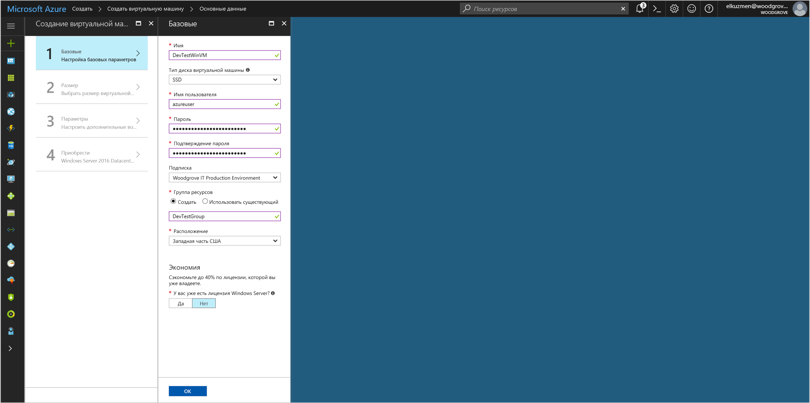

# <a name="tutorial-use-a-windows-vm-managed-identity-to-access-azure-storage"></a>Руководство. Доступ к службе хранилища Azure с помощью управляемого удостоверения виртуальной машины Windows

[!INCLUDE[preview-notice](../../../includes/active-directory-msi-preview-notice.md)]

В этой статье описывается активация управляемого удостоверения виртуальной машины Windows и его использование для получения доступа к службе хранилища Azure.  Вы узнаете, как выполнять следующие задачи:

> [!div class="checklist"]
> * Создание виртуальной машины Windows в новой группе ресурсов 
> * включить управляемое удостоверение на виртуальной машине Windows;
> * создать контейнер больших двоичных объектов в учетной записи хранения;
> * предоставить управляемому удостоверению на виртуальной машине Windows доступ к учетной записи хранения; 
> * получить доступ и использовать его для вызова службы хранилища Azure. 

> [!NOTE]
> Аутентификация Azure Active Directory для службы хранилища Azure находится на этапе общедоступной предварительной версии.

## <a name="prerequisites"></a>Предварительные требования

[!INCLUDE [msi-qs-configure-prereqs](../../../includes/active-directory-msi-qs-configure-prereqs.md)]

[!INCLUDE [msi-tut-prereqs](../../../includes/active-directory-msi-tut-prereqs.md)]

## <a name="sign-in-to-azure"></a>Вход в Azure

Войдите на портал Azure по адресу [https://portal.azure.com](https://portal.azure.com).

## <a name="create-a-windows-virtual-machine-in-a-new-resource-group"></a>Создание виртуальной машины Windows в новой группе ресурсов

В этом разделе вы создадите виртуальную машину Windows, которой позже будет назначено управляемое удостоверение.

1.  Нажмите кнопку **+ Создание службы** в верхнем левом углу портала Azure.
2.  Выберите **Вычисления**, а затем — **Windows Server 2016 Datacenter**. 
3.  Введите сведения о виртуальной машине. **Имя пользователя** и **пароль**, созданные здесь, используются для входа на виртуальную машину.
4.  В раскрывающемся списке выберите нужную **подписку** для виртуальной машины.
5.  Чтобы выбрать новую **группу ресурсов**, в которой вы хотите создать виртуальную машину, щелкните **Создать**. По завершении нажмите кнопку **ОК**.
6.  Выберите размер виртуальной машины. Чтобы просмотреть дополнительные размеры, выберите **Просмотреть все** или измените фильтр **Supported disk type** (Поддерживаемые типы диска). В колонке параметров оставьте значения по умолчанию и нажмите кнопку **OK**.

    

## <a name="enable-managed-identity-on-your-vm"></a>Включение управляемого удостоверения на виртуальной машине

Управляемое удостоверение на виртуальной машине позволяет получить маркеры доступа из Azure AD без необходимости указывать в коде учетные данные. На самом деле при включении управляемого удостоверения на виртуальной машине с помощью портала Azure выполняются две задачи: регистрация виртуальной машины в Azure AD для создания управляемого удостоверения и его настройка на этой виртуальной машине. 

1. Перейдите в группу ресурсов новой виртуальной машины и выберите виртуальную машину, созданную на предыдущем шаге.
2. В категории **Параметры** щелкните **Конфигурация**.
3. Чтобы включить управляемое удостоверение, выберите **Да**.
4. Чтобы применить конфигурацию, нажмите кнопку **Сохранить**. 

## <a name="create-a-storage-account"></a>Создание учетной записи хранения 

В этом разделе вы создадите учетную запись хранения. 

1. Нажмите кнопку **Создать ресурс** в верхнем левом углу окна портала Azure.
2. Щелкните **Хранилище**, а затем — **Учетная запись хранения — BLOB-объект, файл, таблица, очередь**.
3. В поле **Имя** введите имя учетной записи хранения.  
4. Для параметра **Модель развертывания** выберите **Resource Manager**, а для поля **Тип учетной записи** — **Хранилище (версия 1, общего назначения)**. 
5. Убедитесь, что значения **подписки** и **группы ресурсов** соответствуют указанным при создании виртуальной машины на предыдущем шаге.
6. Нажмите кнопку **Создать**.

    

## <a name="create-a-blob-container-and-upload-a-file-to-the-storage-account"></a>Создание контейнера больших двоичных объектов и передача файла в учетную запись хранения

Так как файлам необходимо хранилище BLOB-объектов, нужно создать контейнер больших двоичных объектов, в котором будет храниться файл. Затем файл отправляется в контейнер больших двоичных объектов в новой учетной записи хранения.

1. Вернитесь к только что созданной учетной записи хранения.
2. В колонке **Служба BLOB-объектов** щелкните **Контейнеры**.
3. В верхней области страницы щелкните **+ Container** (+ Контейнер).
4. В разделе **Создание контейнера** введите имя контейнера, а в разделе **Общедоступный уровень доступа** оставьте значение по умолчанию.

    

5. С помощью редактора по своему усмотрению создайте на локальном компьютере файл с именем *hello world.txt*.  Откройте его и добавьте текст (без кавычек) "Hello world! :)", а затем сохраните его. 
6. Передайте файл в только что созданный контейнер. Для этого щелкните имя контейнера, а затем нажмите кнопку **Отправить**.
7. В области **Отправить BLOB-объект** под полем **Файлы** щелкните значок папки и перейдите к файлу **hello_world.txt** на локальном компьютере, выберите этот файл и нажмите кнопку **Отправить**.
    

## <a name="grant-your-vm-access-to-an-azure-storage-container"></a>Предоставление виртуальной машине доступа к контейнеру службы хранилища Azure 

Вы можете использовать управляемое удостоверение виртуальной машины для извлечения данных в большом двоичном объекте службы хранилища Azure.   

1. Вернитесь к только что созданной учетной записи хранения.  
2. Щелкните ссылку **Управление доступом (IAM)** на панели слева.  
3. Щелкните **+ Добавить** в верхней части страницы, чтобы добавить новое назначение роли для виртуальной машины.
4. В поле **Роль** из раскрывающегося списка выберите **Модуль чтения данных больших двоичных объектов хранилища (предварительная версия)**. 
5. В следующем раскрывающемся списке в поле **Назначение доступа к** выберите **Виртуальная машина**.  
6. Убедитесь, что нужная подписка присутствует в раскрывающемся списке **Подписка**, и установите для параметра **Группа ресурсов** значение **Все группы ресурсов**.  
7. В разделе **Выбранные элементы** выберите свою виртуальную машину и нажмите кнопку **Сохранить**. 

    

## <a name="get-an-access-token-and-use-it-to-call-azure-storage"></a>Получение маркера доступа и его использование для вызова службы хранилища Azure 

В службе хранилища Azure изначально реализована поддержка аутентификации Azure AD, поэтому она может напрямую принимать маркеры доступа, полученные с помощью управляемого удостоверения. Эта реализация является частью интеграции службы хранилища Azure с Azure AD и отличается от указания учетных данных в строке подключения.

Вот пример кода .NET, который позволяет открыть подключение к службе хранилища Azure с помощью маркера доступа, а затем считать содержимое файла, созданного ранее. Этот код должен выполняться на виртуальной машине, чтобы иметь доступ к конечной точке управляемого удостоверения виртуальной машины. Для использования метода с маркером доступа необходима платформа .NET Framework 4.6 или более поздней версии. Замените значение `<URI to blob file>` на соответствующее. Вы можете получить это значение, если перейдете в созданный и отправленный в хранилище BLOB-объектов файл и скопируете **URL-адрес** в разделе **свойств** страницы **обзора**.

```csharp
using System;
using System.Collections.Generic;
using System.Linq;
using System.Text;
using System.Threading.Tasks;
using System.IO;
using System.Net;
using System.Web.Script.Serialization; 
using Microsoft.WindowsAzure.Storage.Auth;
using Microsoft.WindowsAzure.Storage.Blob;

namespace StorageOAuthToken
{
    class Program
    {
        static void Main(string[] args)
        {
            //get token
            string accessToken = GetMSIToken("https://storage.azure.com/");
           
            //create token credential
            TokenCredential tokenCredential = new TokenCredential(accessToken);

            //create storage credentials
            StorageCredentials storageCredentials = new StorageCredentials(tokenCredential);

            Uri blobAddress = new Uri("<URI to blob file>");

            //create block blob using storage credentials
            CloudBlockBlob blob = new CloudBlockBlob(blobAddress, storageCredentials);
        
            //retrieve blob contents
            Console.WriteLine(blob.DownloadText());
            Console.ReadLine();
        }

        static string GetMSIToken(string resourceID)
        {
            string accessToken = string.Empty;
            // Build request to acquire MSI token
            HttpWebRequest request = (HttpWebRequest)WebRequest.Create("http://169.254.169.254/metadata/identity/oauth2/token?api-version=2018-02-01&resource=" + resourceID);
            request.Headers["Metadata"] = "true";
            request.Method = "GET";

            try
            {
                // Call /token endpoint
                HttpWebResponse response = (HttpWebResponse)request.GetResponse();

                // Pipe response Stream to a StreamReader, and extract access token
                StreamReader streamResponse = new StreamReader(response.GetResponseStream());
                string stringResponse = streamResponse.ReadToEnd();
                JavaScriptSerializer j = new JavaScriptSerializer();
                Dictionary<string, string> list = (Dictionary<string, string>)j.Deserialize(stringResponse, typeof(Dictionary<string, string>));
                accessToken = list["access_token"];
                return accessToken;
            }
            catch (Exception e)
            {
                string errorText = String.Format("{0} \n\n{1}", e.Message, e.InnerException != null ? e.InnerException.Message : "Acquire token failed");
                return accessToken;
            }
        }            
    }
}
```

В ответе содержится содержимое файла:

`Hello world! :)`

## <a name="next-steps"></a>Дополнительная информация

В этом руководстве вы узнали, как включить управляемое удостоверение виртуальной машины Windows, чтобы получить доступ к службе хранилища Azure.  Дополнительные сведения о службе хранилища Azure см. в статье ниже.

> [!div class="nextstepaction"]
> [Хранилище Azure](/azure/storage/common/storage-introduction)


