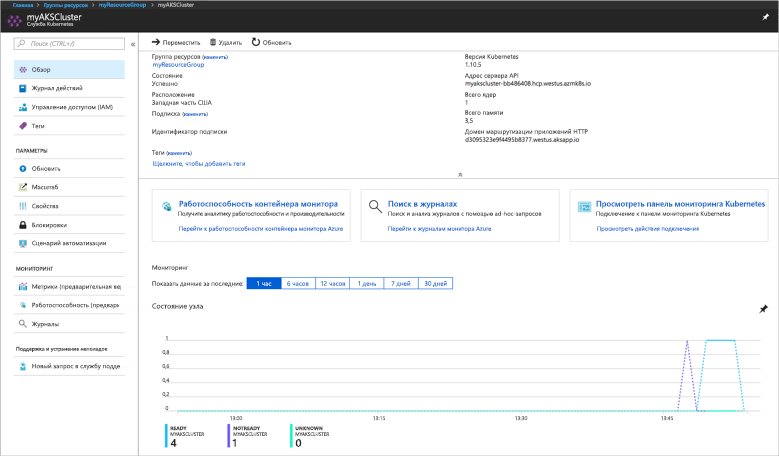
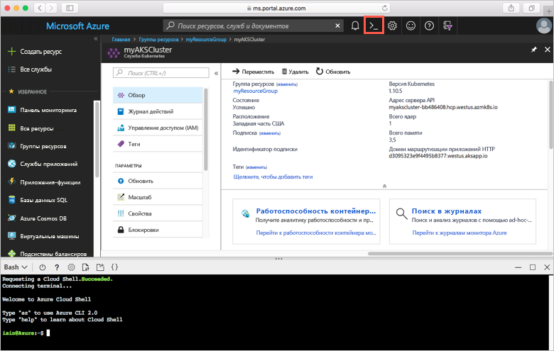
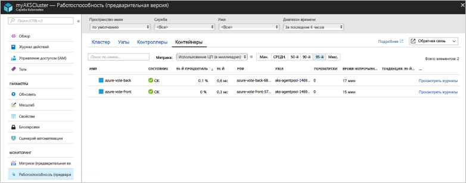

# <a name="quickstart-deploy-an-azure-kubernetes-service-aks-cluster"></a>Краткое руководство по развертыванию кластера службы Azure Kubernetes (AKS)

В этом кратком руководстве вы развернете кластер AKS с помощью портала Azure. Затем в кластере будет запущено многоконтейнерное приложение, состоящее из веб-интерфейса и экземпляра Redis. По завершении приложение будет доступно через Интернет.


В этом руководстве предполагается, что у вас есть некоторое представление о функциях Kubernetes. Дополнительные сведения см. в [документации по Kubernetes][kubernetes-documentation].

## <a name="sign-in-to-azure"></a>Вход в Azure

Войдите на портал Azure по адресу http://portal.azure.com.

## <a name="create-an-aks-cluster"></a>Создание кластера AKS

В верхнем левом углу портала Azure выберите **Создать ресурс** > **Служба Kubernetes**.

Чтобы создать кластеры AKS, выполните следующие действия.

1. **Основные**. Настройте следующие параметры.
    - *Сведения о проекте*. Выберите подписку Azure, а затем выберите или создайте группу ресурсов Azure, такую как *myResourceGroup*. Введите **Имя кластера Kubernetes**, например *myAKSCluster*.
    - *Сведения о кластере*. Выберите регион, версию Kubernetes и префикс DNS-имени для кластера AKS.
    - *Масштаб*. Выберите размер виртуальной машины для узлов AKS. Размер виртуальной машины **невозможно** изменить после развертывания кластера с AKS.
        - Выберите количество узлов для развертывания в кластере. В этом кратком руководстве задайте параметру **Число узлов** значение *1*. Количество узлов **можно** изменить после развертывания кластера.
    
    

    По завершении выберите **Далее: проверка подлинности**.

1. **Проверка подлинности**. Настройте следующие параметры.
    - Создайте новую субъект-службу или *настройте* для использования существующую. При использовании существующего имени субъекта-службы необходимо указать для него идентификатор клиента и секрет.
    - Включите параметр для элементов управления доступом на основе ролей (RBAC) Kubernetes. Эти элементы управления предоставляют более точный контроль над доступом к ресурсам Kubernetes, развернутых в кластере AKS.

    

    По завершении выберите **Next: Networking** (Далее: сети).

1. **Сеть**. Настройте следующие параметры сети, которые должны быть заданы по умолчанию.
    
    - **Маршрутизация HTTP для приложений**. Выберите **Да**, чтобы настроить интегрированный контроллер входящего трафика для автоматического создания общих DNS-имен. Дополнительные сведения о маршрутизации HTTP приведены в разделе [HTTP application routing][http-routing] (Маршрутизация HTTP для приложений).
    - **Конфигурация сети**. Выберите **базовую** конфигурацию сети с использованием подключаемого модуля Kubernetes [kubenet][kubenet], а не расширенную конфигурацию сети с использованием [Azure CNI][azure-cni]. Дополнительные сведения о параметрах сети см. в разделе [Network configuration in Azure Kubernetes Service (AKS)][aks-network] (Конфигурация сети в службе Azure Kubernetes (AKS)).
    
    По завершении выберите **Next: Monitoring** (Далее: мониторинг).

1. При развертывании кластера AKS службу аналитики для контейнеров Azure можно настроить для отслеживания работоспособности кластера AKS и модулей pod, работающих в кластере. Дополнительные сведения о мониторинге работоспособности контейнеров см. в разделе [Мониторинг работоспособности службы Azure Kubernetes (AKS) (предварительная версия)][aks-monitor].

    Выберите **Yes** (Да), чтобы включить мониторинг контейнеров, и выберите существующую рабочую область Log Analytics или создайте новую.
    
    Выберите **Review + create** (Просмотр и создание), а затем щелкните **Создать**.

Для создания кластера AKS и его подготовки к использованию потребуется несколько минут. Просмотрите группу ресурсов кластера AKS, например *myResourceGroup*, и выберите ресурс AKS, например *myAKSCluster*. Отображается панель мониторинга кластера AKS, как показано на снимке экрана ниже.



## <a name="connect-to-the-cluster"></a>Подключение к кластеру

Управлять кластером Kubernetes можно при помощи [kubectl][kubectl], клиента командной строки Kubernetes. Клиент `kubectl` предварительно установлен в Azure Cloud Shell.

Откройте Cloud Shell с помощью кнопки в правом верхнем углу портала Azure.



Выполните команду [az aks get-credentials][az-aks-get-credentials]чтобы настроить подключение `kubectl` к кластеру Kubernetes. В следующем примере возвращаются учетные данные для имени кластера *myAKSCluster* в группе ресурсов *myResourceGroup*.

```azurecli-interactive
az aks get-credentials --resource-group myResourceGroup --name myAKSCluster
```

Проверьте подключение к кластеру, выполнив команду [kubectl get][kubectl-get], чтобы просмотреть список узлов кластера.

```azurecli-interactive
kubectl get nodes
```

В следующем примере показан единый узел, созданный на предыдущих шагах.

```
NAME                       STATUS    ROLES     AGE       VERSION
aks-agentpool-14693408-0   Ready     agent     10m       v1.10.5
```

## <a name="run-the-application"></a>Выполнение приложения

Файл манифеста Kubernetes определяет требуемое состояние для кластера, включая образы контейнеров, которые нужно запустить. В этом кратком руководстве манифест используется для создания всех объектов, необходимых для запуска примера приложения Azure для голосования. Сюда входят два [развертывания Kubernetes][kubernetes-deployment]. Одно используется для внешнего интерфейса приложения Azure для голосования, а другой — для экземпляра Redis. Кроме того, создаются две [службы Kubernetes][kubernetes-service], внутренняя и внешняя. Внутренняя служба используется для экземпляра Redis, а внешняя — для доступа к приложению Azure для голосования из Интернета.

Создайте файл с именем `azure-vote.yaml` и скопируйте в него следующий код YAML. Если вы работаете в Azure Cloud Shell, создайте этот файл с помощью `vi` или `Nano`, как в обычной виртуальной или физической системе.

```yaml
apiVersion: apps/v1beta1
kind: Deployment
metadata:
  name: azure-vote-back
spec:
  replicas: 1
  template:
    metadata:
      labels:
        app: azure-vote-back
    spec:
      containers:
      - name: azure-vote-back
        image: redis
        ports:
        - containerPort: 6379
          name: redis
---
apiVersion: v1
kind: Service
metadata:
  name: azure-vote-back
spec:
  ports:
  - port: 6379
  selector:
    app: azure-vote-back
---
apiVersion: apps/v1beta1
kind: Deployment
metadata:
  name: azure-vote-front
spec:
  replicas: 1
  template:
    metadata:
      labels:
        app: azure-vote-front
    spec:
      containers:
      - name: azure-vote-front
        image: microsoft/azure-vote-front:v1
        ports:
        - containerPort: 80
        env:
        - name: REDIS
          value: "azure-vote-back"
---
apiVersion: v1
kind: Service
metadata:
  name: azure-vote-front
spec:
  type: LoadBalancer
  ports:
  - port: 80
  selector:
    app: azure-vote-front
```

Запустите приложение с помощью команды [kubectl apply][kubectl-apply].

```azurecli-interactive
kubectl create -f azure-vote.yaml
```

В следующем примере выходных данных показаны ресурсы Kubernetes, созданные в кластере AKS.

```
deployment "azure-vote-back" created
service "azure-vote-back" created
deployment "azure-vote-front" created
service "azure-vote-front" created
```

## <a name="test-the-application"></a>Тестирование приложения

При запуске приложения создается [служба Kubernetes][kubernetes-service], которая предоставляет это приложение в Интернете. Процесс создания может занять несколько минут.

Чтобы отслеживать ход выполнения, используйте команду [kubectl get service][kubectl-get] с аргументом `--watch`.

```azurecli-interactive
kubectl get service azure-vote-front --watch
```

Изначально для параметра *EXTERNAL-IP* службы *azure-vote-front* отображается значение *pending* (ожидание).

```
NAME               TYPE           CLUSTER-IP   EXTERNAL-IP   PORT(S)        AGE
azure-vote-front   LoadBalancer   10.0.37.27   <pending>     80:30572/TCP   6s
```

Как только *ВНЕШНИЙ IP-АДРЕС* изменится с состояния *ожидания* на *IP-адрес*, используйте команду `CTRL-C`, чтобы остановить процесс отслеживания kubectl.

```
azure-vote-front   LoadBalancer   10.0.37.27   52.179.23.131   80:30572/TCP   2m
```

Откройте веб-браузер по внешнему IP-адресу своей службы, чтобы увидеть приложение Azure для голосования, как показано в следующем примере.


## <a name="monitor-health-and-logs"></a>Мониторинг работоспособности и журналов

При создании кластера была включена аналитика для мониторинга контейнеров. Эта функция мониторинга предоставляет метрики работоспособности кластера AKS и модулей, запущенных в кластере. Дополнительные сведения о мониторинге работоспособности контейнеров см. в разделе [Мониторинг работоспособности службы Azure Kubernetes (AKS) (предварительная версия)][aks-monitor].

Он может потребоваться несколько минут, чтобы эти данные отобразились на портале Azure. Чтобы просмотреть текущее состояние, время непрерывной работы и использование ресурсов для модулей pod Azure для голосования, перейдите обратно к ресурсу AKS на портале Azure, например *myAKSCluster*. Выберите **Работоспособность контейнера монитора**, а затем — пространство имен **по умолчанию** и выберите **Контейнеры**.  Представление контейнеров *azure-vote-back* и *azure-vote-front*.



Чтобы просмотреть журналы для модуля pod `azure-vote-front`, щелкните ссылку **Просмотреть журналы** в правой части списка контейнеров. Эти журналы содержат потоки *stdout* и *stderr* из контейнера.


## <a name="delete-cluster"></a>Удаление кластера

Если кластер больше не нужен, просто удалите кластерный ресурс. После этого будут удалены все связанные ресурсы. Для этого на портале Azure можно нажать кнопку **Удалить** на панели мониторинга AKS. Можно также выполнить команду [az group delete][az-aks-delete] в Cloud Shell.

```azurecli-interactive
az aks delete --resource-group myResourceGroup --name myAKSCluster --no-wait
```

## <a name="get-the-code"></a>Получение кода

В этом кратком руководстве для развертывания Kubernetes используются предварительно созданные образы контейнеров. Связанный с приложением код, файл Dockerfile и файл манифеста Kubernetes доступны на сайте GitHub.

[https://github.com/Azure-Samples/azure-voting-app-redis][azure-vote-app]

## <a name="next-steps"></a>Дополнительная информация

С помощью этого краткого руководства мы развернули кластер Kubernetes, а затем развернули в нем многоконтейнерное приложение.

Дополнительные сведения о AKS и инструкции по созданию полного кода для примера развертывания см. в руководстве по кластерам Kubernetes.

> [!div class="nextstepaction"]
> [Руководство по AKS][aks-tutorial]

<!-- LINKS - external -->
[azure-vote-app]: https://github.com/Azure-Samples/azure-voting-app-redis.git
[azure-cni]: https://github.com/Azure/azure-container-networking/blob/master/docs/cni.md
[kubectl]: https://kubernetes.io/docs/user-guide/kubectl/
[kubectl-apply]: https://kubernetes.io/docs/reference/generated/kubectl/kubectl-commands#apply
[kubectl-get]: https://kubernetes.io/docs/reference/generated/kubectl/kubectl-commands#get
[kubenet]: https://kubernetes.io/docs/concepts/cluster-administration/network-plugins/#kubenet
[kubernetes-deployment]: https://kubernetes.io/docs/concepts/workloads/controllers/deployment/
[kubernetes-documentation]: https://kubernetes.io/docs/home/
[kubernetes-service]: https://kubernetes.io/docs/concepts/services-networking/service/

<!-- LINKS - internal -->
[az-aks-get-credentials]: /cli/azure/aks?view=azure-cli-latest#az-aks-get-credentials
[az-aks-delete]: /cli/azure/aks#az-aks-delete
[aks-monitor]: ../monitoring/monitoring-container-health.md
[aks-network]: ./networking-overview.md
[aks-tutorial]: ./tutorial-kubernetes-prepare-app.md
[http-routing]: ./http-application-routing.md
