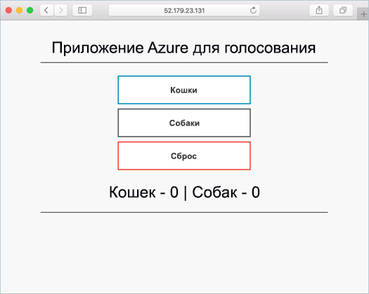

# <a name="quickstart-deploy-an-azure-kubernetes-service-aks-cluster"></a>Краткое руководство по развертыванию кластера службы Azure Kubernetes (AKS)

В этом кратком руководстве кластер AKS развертывается с помощью Azure CLI. Затем в кластере будет запущено многоконтейнерное приложение, состоящее из веб-интерфейса и экземпляра Redis. По завершении приложение будет доступно через Интернет.



Для работы с этим кратким руководством необходимо знание основных понятий Kubernetes. Подробные сведения см. в [документации по Kubernetes][kubernetes-documentation].

[!INCLUDE [cloud-shell-try-it.md](../../includes/cloud-shell-try-it.md)]

Если вы решили установить и использовать CLI локально, для выполнения инструкций из этого руководства вам потребуется Azure CLI 2.0.27 или более поздней версии. Чтобы узнать версию, выполните команду `az --version`. Если вам необходимо выполнить установку или обновление, см. статью [Установка Azure CLI 2.0][azure-cli-install].

## <a name="create-a-resource-group"></a>Создание группы ресурсов

Создайте группу ресурсов с помощью команды [az group create][az-group-create]. Группа ресурсов Azure — это логическая группа, в которой выполняется развертывание и администрирование ресурсов Azure.

При создании группы ресурсов вам будет предложено указать расположение ресурсов в Azure.

В следующем примере создается группа ресурсов с именем *myResourceGroup* в расположении *eastus*.

```azurecli-interactive
az group create --name myResourceGroup --location eastus
```

Выходные данные:

```json
{
  "id": "/subscriptions/00000000-0000-0000-0000-000000000000/resourceGroups/myResourceGroup",
  "location": "eastus",
  "managedBy": null,
  "name": "myResourceGroup",
  "properties": {
    "provisioningState": "Succeeded"
  },
  "tags": null
}
```

## <a name="create-aks-cluster"></a>Создание кластера AKS

Используйте команду [az aks create][az-aks-create], чтобы создать кластер AKS. В следующем примере создается кластер *myAKSCluster* с одним узлом. При развертывании кластера AKS также можно включить решение для мониторинга работоспособности контейнера. Дополнительные сведения о включении решения для мониторинга работоспособности контейнеров см. в разделе [Мониторинг работоспособности службы Azure Kubernetes][aks-monitor].

```azurecli-interactive
az aks create --resource-group myResourceGroup --name myAKSCluster --node-count 1 --generate-ssh-keys
```

Через несколько минут выполнение команды завершается и отображаются сведения о кластере в формате JSON.

## <a name="connect-to-the-cluster"></a>Подключение к кластеру

Управлять кластером Kubernetes можно при помощи [kubectl][kubectl], клиента командной строки Kubernetes.

Если вы используете Azure Cloud Shell, клиент kubectl уже установлен. Чтобы установить его локально, используйте команду [az aks install-cli][az-aks-install-cli].


```azurecli
az aks install-cli
```

Чтобы настроить подключение kubectl к кластеру Kubernetes, выполните команду [az aks get-credentials][az-aks-get-credentials]. На этом шаге скачиваются учетные данные и настраивается интерфейс командной строки Kubernetes для их использования.

```azurecli-interactive
az aks get-credentials --resource-group myResourceGroup --name myAKSCluster
```

Проверьте подключение к кластеру, выполнив команду [kubectl get][kubectl-get], чтобы просмотреть список узлов кластера. Обратите внимание, что это может занять несколько минут.

```azurecli-interactive
kubectl get nodes
```

Выходные данные:

```
NAME                          STATUS    ROLES     AGE       VERSION
k8s-myAKSCluster-36346190-0   Ready     agent     2m        v1.7.7
```

## <a name="run-the-application"></a>Выполнение приложения

Файл манифеста Kubernetes определяет требуемое состояние для кластера, включая образы контейнеров, которые нужно запустить. В этом примере манифест используется для создания всех объектов, необходимых для запуска приложения Azure для голосования. Сюда входят два [развертывания Kubernetes][kubernetes-deployment]. Одно используется для приложений Azure для голосования на Python, а другой — для экземпляра Redis. Кроме того, создаются две [службы Kubernetes][kubernetes-service], внутренняя и внешняя. Внутренняя служба используется для экземпляра Redis, а внешняя — для доступа к приложению Azure для голосования из Интернета.

Создайте файл с именем `azure-vote.yaml` и скопируйте в него следующий код YAML. Если вы работаете в Azure Cloud Shell, этот файл можно создать с помощью Vi или Nano, как при работе в виртуальной или физической системе.

```yaml
apiVersion: apps/v1beta1
kind: Deployment
metadata:
  name: azure-vote-back
spec:
  replicas: 1
  template:
    metadata:
      labels:
        app: azure-vote-back
    spec:
      containers:
      - name: azure-vote-back
        image: redis
        ports:
        - containerPort: 6379
          name: redis
---
apiVersion: v1
kind: Service
metadata:
  name: azure-vote-back
spec:
  ports:
  - port: 6379
  selector:
    app: azure-vote-back
---
apiVersion: apps/v1beta1
kind: Deployment
metadata:
  name: azure-vote-front
spec:
  replicas: 1
  template:
    metadata:
      labels:
        app: azure-vote-front
    spec:
      containers:
      - name: azure-vote-front
        image: microsoft/azure-vote-front:v1
        ports:
        - containerPort: 80
        env:
        - name: REDIS
          value: "azure-vote-back"
---
apiVersion: v1
kind: Service
metadata:
  name: azure-vote-front
spec:
  type: LoadBalancer
  ports:
  - port: 80
  selector:
    app: azure-vote-front
```

Запустите приложение с помощью команды [kubectl apply][kubectl-apply].

```azurecli-interactive
kubectl apply -f azure-vote.yaml
```

Выходные данные:

```
deployment "azure-vote-back" created
service "azure-vote-back" created
deployment "azure-vote-front" created
service "azure-vote-front" created
```

## <a name="test-the-application"></a>Тестирование приложения

При запуске приложения создается [служба Kubernetes][kubernetes-service], которая предоставляет внешний интерфейс приложения в Интернете. Процесс создания может занять несколько минут.

Чтобы отслеживать ход выполнения, используйте команду [kubectl get service][kubectl-get] с аргументом `--watch`.

```azurecli-interactive
kubectl get service azure-vote-front --watch
```

Изначально для параметра *ВНЕШНИЙ IP-АДРЕС* службы *azure-vote-front* отображается состояние *ожидания*.

```
NAME               TYPE           CLUSTER-IP   EXTERNAL-IP   PORT(S)        AGE
azure-vote-front   LoadBalancer   10.0.37.27   <pending>     80:30572/TCP   6s
```

Как только *ВНЕШНИЙ IP-АДРЕС* изменится с состояния *ожидания* на *IP-адрес*, используйте команду `CTRL-C`, чтобы остановить процесс отслеживания kubectl.

```
azure-vote-front   LoadBalancer   10.0.37.27   52.179.23.131   80:30572/TCP   2m
```

Теперь перейдите по внешнему IP-адресу в приложение Azure для голосования.


## <a name="delete-cluster"></a>Удаление кластера

Чтобы удалить ненужные кластер, группу ресурсов, службу контейнеров и все связанные с ней ресурсы, выполните команду [az group delete][az-group-delete].

```azurecli-interactive
az group delete --name myResourceGroup --yes --no-wait
```

## <a name="get-the-code"></a>Получение кода

В этом кратком руководстве для развертывания Kubernetes используются предварительно созданные образы контейнеров. Связанный с приложением код, файл Dockerfile и файл манифеста Kubernetes доступны на сайте GitHub.

[https://github.com/Azure-Samples/azure-voting-app-redis][azure-vote-app]

## <a name="next-steps"></a>Дальнейшие действия

С помощью этого краткого руководства мы развернули кластер Kubernetes, а затем развернули в нем многоконтейнерное приложение.

Дополнительные сведения о AKS и инструкции по созданию полного кода для примера развертывания см. в руководстве по кластерам Kubernetes.

> [!div class="nextstepaction"]
> [Руководство по AKS][aks-tutorial]

<!-- LINKS - external -->
[azure-vote-app]: https://github.com/Azure-Samples/azure-voting-app-redis.git
[kubectl]: https://kubernetes.io/docs/user-guide/kubectl/
[kubectl-apply]: https://kubernetes.io/docs/reference/generated/kubectl/kubectl-commands#apply
[kubernetes-deployment]: https://kubernetes.io/docs/concepts/workloads/controllers/deployment/
[kubernetes-documentation]: https://kubernetes.io/docs/home/
[kubectl-get]: https://kubernetes.io/docs/reference/generated/kubectl/kubectl-commands#get
[kubernetes-service]: https://kubernetes.io/docs/concepts/services-networking/service/

<!-- LINKS - internal -->
[aks-monitor]: ../monitoring/monitoring-container-health.md
[aks-tutorial]: ./tutorial-kubernetes-prepare-app.md
[az-aks-browse]: /cli/azure/aks?view=azure-cli-latest#az_aks_browse
[az-aks-create]: /cli/azure/aks?view=azure-cli-latest#az_aks_create
[az-aks-get-credentials]: /cli/azure/aks?view=azure-cli-latest#az_aks_get_credentials
[az-aks-install-cli]: /cli/azure/aks?view=azure-cli-latest#az_aks_install_cli
[az-group-create]: /cli/azure/group#az_group_create
[az-group-delete]: /cli/azure/group#az_group_delete
[azure-cli-install]: /cli/azure/install-azure-cli

