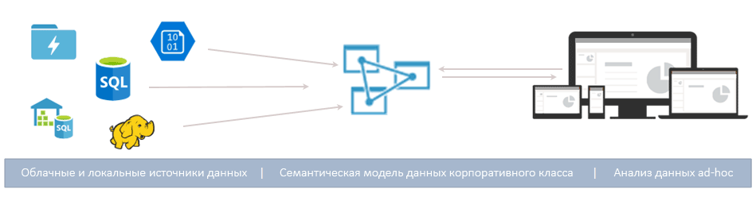
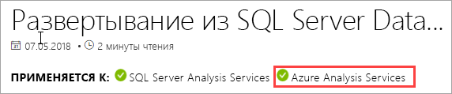
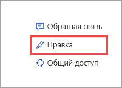

# Службы Azure Analysis Services

Azure Analysis Services — это полностью управляемая платформа как услуга (PaaS), которая предоставляет модели данных корпоративного уровня в облаке. С помощью расширенных функций комбинирования и моделирования можно объединять данные из нескольких источников данных, определять метрики и защищать данные в одной доверенной семантической табличной модели данных. Модель данных помогает пользователям быстрее и удобнее просматривать значительные объемы данных для ad-hoc-анализа данных.

**Видео.** Чтобы узнать, каким образом службы Azure Analysis Services дополняют общие возможности средств бизнес-аналитики Майкрософт, см. видео с [обзором служб Azure Analysis Services](https://sec.ch9.ms/ch9/d6dd/a1cda46b-ef03-4cea-8f11-68da23c5d6dd/AzureASoverview_high.mp4).

## Быстрая настройка и подготовка к работе

На портале Azure вы можете [создать сервер](analysis-services-create-server.md) за считанные минуты. А с помощью PowerShell и [шаблонов](../azure-resource-manager/resource-manager-create-first-template.md) Azure Resource Manager можно создавать серверы, используя декларативный шаблон. Используя один шаблон, можно развернуть ресурсы сервера, включая такие компоненты Azure, как учетные записи хранения и Функции Azure. 

**Видео.** Дополнительные сведения о том, как с помощью службы автоматизации Azure ускорить создание сервера, см. в видео об [автоматизации развертывания](https://channel9.msdn.com/series/Azure-Analysis-Services/AzureAnalysisServicesAutomation).

Службы Azure Analysis Services интегрируются с другими службами Azure, позволяя создавать сложные аналитические решения. Интеграция с [Azure Active Directory](../active-directory/active-directory-whatis.md) обеспечивает защищенный доступ на основе ролей к критически важным данным. Вы можете интегрировать службы с любым конвейером [фабрики данных Azure](../data-factory/introduction.md), добавив действие, которое загружает данные в модель. Для упрощенной оркестрации моделей с применением пользовательского кода можно использовать [службу автоматизации Azure](../automation/automation-intro.md) и [Функции Azure](../azure-functions/functions-overview.md). 

## Нужный уровень в нужный момент

Службы Azure Analysis Services предоставляются на уровнях **Разработка**, **Базовый** и **Стандартный**. В пределах каждого уровня стоимость планов зависит от вычислительной мощности, доступных единиц QPU и объема памяти. Создавая сервер, выбирайте план в пределах одного уровня. Вы можете повысить или понизить план в пределах одного уровня либо перейти с более низкого уровня на более высокий, но не наоборот.

### Уровень "Разработка"

Мы рекомендуем использовать этот уровень для сценариев оценки, разработки и тестирования. Один план содержит функции уровня "Стандартный", но имеет ограничения по вычислительной мощности, QPU и объему памяти. Масштабирование реплик запросов недоступно на этом уровне. Также на этом уровне не предусмотрено соглашение об уровне обслуживания.

|План  |QPU  |Память (ГБ)  |
|---------|---------|---------|
|D1    |    20     |    3     |

### Уровень Basic

Этот уровень рекомендуется для рабочих решений с небольшими табличными моделями, ограниченным параллелизмом пользователей и невысокими требованиями к обновлению данных. Масштабирование реплик запросов *недоступно* на этом уровне. Также на этом уровне *не поддерживается* использование перспектив, нескольких секций и функций табличной модели DirectQuery.  

|План  |QPU  |Память (ГБ)  |
|---------|---------|---------|
|B1    |    40     |    10     |
|B2    |    80     |    20     |

### Уровень Standard

Этот уровень лучше всего подходит для критически важных рабочих приложений с быстрорастущими моделями данных, для которых необходим эластичный параллелизм пользователей. На этом уровне поддерживаются все функции табличного моделирования и возможность быстрого обновления данных, которая позволяет обновлять модели данных практически в реальном времени.

|План  |QPU  |Память (ГБ)  |
|---------|---------|---------|
|S1    |    40     |    10     |
|S2    |    100     |    25     |
|S3    |    200     |    50     |
|S4    |    400     |    100     |
|S8*    |    320     |    200     |
|S9*    |    640    |    400     |

\* Доступно не во всех регионах.  

## Доступность по регионам

Службы Azure Analysis Services поддерживаются в регионах по всему миру. Чтобы обеспечить [высокий уровень доступности](analysis-services-bcdr.md), развертывайте модели на избыточных серверах в нескольких регионах. Поддерживаемые уровни и реплики запросов зависят от выбранного региона. 

### Северная и Южная Америка

|Регион  | Поддерживаемые уровни | Реплики запросов |
|---------|---------|:---------:|
|Южная часть Бразилии     |    B1, B2, S0, S1, S2, S4, D1     |     1    |
|Центральная Канада    |     B1, B2, S0, S1, S2, S4, D1    |     1    |
|Восток США     |     B1, B2, S0, S1, S2, S4, D1    |    1     |
|Восток США 2     |     B1, B2, S0, S1, S2, S4, S8, S9, D1     |    7     |
|Северо-центральный регион США     |     B1, B2, S0, S1, S2, S4, D1     |    1     |
|Центральный регион США     |    B1, B2, S0, S1, S2, S4, D1     |    3     |
|Южно-центральный регион США     |    B1, B2, S0, S1, S2, S4, D1     |    1     |
|Западно-центральная часть США   |     B1, B2, S0, S1, S2, S4, D1    |    7     |
|Запад США     |    B1, B2, S0, S1, S2, S4, S8, S9, D1     |    7     |
|Западная часть США 2    |    B1, B2, S0, S1, S2, S4, S8, S9, D1     |    1     |

### Европа

|Регион  | Поддерживаемые уровни | Реплики запросов |
|---------|---------|:---------:|
|Северная Европа     |    B1, B2, S0, S1, S2, S4, D1      |    1     |
|Южная часть Великобритании   |    B1, B2, S0, S1, S2, S4, D1      |     1    |
|Западная Европа     |    B1, B2, S0, S1, S2, S4, S8, S9, D1      |    7     |

### Азиатско-Тихоокеанский регион 

|Регион  | Поддерживаемые уровни | Реплики запросов |
|---------|---------|:---------:|
|Юго-Восточная часть Австралии     | B1, B2, S0, S1, S2, S4, D1       |    1     |
|Восточная часть Японии  |   B1, B2, S0, S1, S2, S4, D1       |    1     |
|Юго-Восточная Азия     |     B1, B2, S0, S1, S2, S4, S8, S9, D1     |   3      |
|Западная Индия     |    B1, B2, S0, S1, S2, S4, D1     |    1     |

## Масштабирование до нужных размеров

### Увеличение и уменьшение масштаба, приостановка и возобновление работы

Вы можете увеличить или уменьшить масштаб сервера, а также приостановить его работу. Используйте портал Azure или получите полный контроль над сервером в режиме реального времени с помощью PowerShell. Вы платите только за то, что используете.  

### Горизонтальное масштабирование ресурсов для быстрого получения ответов на запросы

Благодаря горизонтальному масштабированию клиентские запросы распределяются по нескольким *репликам запросов* в пуле запросов. В репликах запросов содержатся синхронизированные копии табличных моделей. Распределение рабочей нагрузки запросов позволяет уменьшить время отклика при высоких рабочих нагрузках запросов. Операции обработки моделей могут выполняться отдельно от пула запросов, чтобы эти операции не оказывали отрицательного влияния на клиентские запросы. 

Вы можете создать пул запросов, который содержит до семи дополнительных реплик запросов (всего восемь, включая сервер). Максимальное число реплик запроса, хранящихся в одном пуле, зависит от выбранного региона. Реплики запросов не могут распространяться за пределами региона сервера. Эти реплики оплачиваются по тем же тарифам, что и сервер.

Вы можете горизонтально масштабировать реплики запросов в соответствии со своими потребностями, так же как и менять уровень. Настройте горизонтальное масштабирование на портале или с помощью интерфейсов REST API. Дополнительные сведения см. в статье о [горизонтальном масштабировании служб Azure Analysis Services](analysis-services-scale-out.md).

## Цены

Общая стоимость зависит от ряда факторов, например от выбранного региона, уровня, числа реплик запросов и частоты приостановки и возобновления работы. Воспользуйтесь калькулятором на странице [цен на Azure Analysis Services](https://azure.microsoft.com/pricing/details/analysis-services/), чтобы определить стандартную цену для своего региона. Это средство позволяет рассчитать цену для экземпляра одного сервера в одном регионе. Учтите, что реплики запросов оплачиваются по тем же тарифам, что и сервер. 

## На основе SQL Server Analysis Services

Службы Azure Analysis Services совместимы с множеством полезных функций служб SQL Server Analysis Services выпуска Enterprise Edition. Службы Azure Analysis Services поддерживают табличные модели на [уровне совместимости](analysis-services-compat-level.md) 1200 и выше. Табличные модели представляют собой реляционные конструкции моделирования (модели, таблицы, столбцы), которые формулируются в виде определений объектов табличных метаданных в коде на языке TMSL (Tabular Model Scripting Language) и в табличной модели объектов (TOM). Кроме того, поддерживаются секции, перспективы, безопасность на уровне строк, двунаправленные связи и преобразования.* Многомерные модели и PowerPivot для Sharepoint *не* поддерживаются в Azure Analysis Services.

Для табличных моделей поддерживаются режимы DirectQuery и In-Memory. Табличные модели в режиме In-Memory (по умолчанию) поддерживают несколько источников данных. Так как данные модели сжимаются (высокая степень сжатия) и кэшируются в памяти, этот режим обеспечивает быстрое получение ответов на запросы по большим объемам данных. Он также обеспечивает наибольшую гибкость при работе со сложными наборами данных и запросами. Секционирование позволяет выполнять поэтапную загрузку, увеличивает распараллеливание и снижает потребление памяти. Также поддерживаются и другие возможности моделирования данных, такие как вычисляемые таблицы и все функции DAX. Выполняемые в памяти модели нужно обновлять (обрабатывать), чтобы обновить кэшированные данные из источников данных. Благодаря поддержке субъектов-служб Azure автоматические операции обновления с помощью PowerShell, TOM, TMSL и REST обеспечивают гибкость в отношении поддержания актуальности моделей данных. 

В режиме DirectQuery* для хранения и выполнения запросов используется серверная реляционная база данных. Поддерживаются большие наборы данных в одном источнике данных, например SQL Server, хранилище данных SQL Server, базе данных SQL Azure, хранилище данных SQL Azure, Oracle и Teradata. Серверные наборы данных могут превышать доступный объем памяти для ресурсов сервера. При работе со сложными моделями данных обновление не требуется. Также есть ряд ограничений, например ограничение типов источников данных, ограничения формул DAX, и не поддерживаются некоторые расширенные функции моделирования данных. Прежде чем определить оптимальный для вас режим, ознакомьтесь со статьей о [режиме DirectQuery](https://docs.microsoft.com/sql/analysis-services/tabular-models/directquery-mode-ssas-tabular).

\* Доступность функций зависит от уровня.

## Поддерживаемые источники данных

Табличные модели в Azure Analysis Services поддерживают различные источники данных — от простых текстовых файлов до больших данных в Azure Data Lake Store. Дополнительные сведения см. в статье [Источники данных, поддерживаемые в службах Azure Analysis Services](analysis-services-datasource.md).

## Надежное хранение данных

Службы Azure Analysis Services обеспечивают защиту конфиденциальных данных на нескольких уровнях. На уровне сервера: с помощью брандмауэра, проверки подлинности Azure, ролей администратора сервера и шифрования на стороне сервера. На уровне модели данных: роли пользователей, безопасность на уровне строк и на уровне объектов позволяют защитить данные и сделать их видимыми только для тех пользователей, которым они нужны.

### Брандмауэр

Брандмауэр Azure Analysis Services блокирует все клиентские подключения, кроме IP-адресов, указанных в правилах. Настройте правила, определяющие допустимые IP-адреса (отдельные IP-адреса клиентов или диапазон IP-адресов). Подключения Power BI (службы) можно также разрешить или заблокировать. Настройте брандмауэр и правила на портале или с помощью PowerShell. Дополнительные сведения см. в статье о [настройке брандмауэра сервера](analysis-services-qs-firewall.md).

### Authentication

Проверка подлинности пользователей осуществляется с помощью [Azure Active Directory (AAD)](../active-directory/active-directory-whatis.md). При входе в базу данных пользователи применяют удостоверение рабочей учетной записи с соответствующими правами доступа на основе ролей. Эти удостоверения должны иметь права участников каталога Azure Active Directory по умолчанию для подписки, где находится сервер. Дополнительные сведения см. в руководстве по [аутентификации и настройке пользовательских разрешений](analysis-services-manage-users.md).

### Защита данных

Для хранения данных и метаданных базы данных службы Azure Analysis Services используется хранилище BLOB-объектов Azure. Файлы данных в хранилище BLOB-объектов шифруются с использованием [шифрования на стороне сервера](../storage/common/storage-service-encryption.md). При использовании режима прямого запроса сохраняются только метаданные. Доступ к фактическим данным осуществляется с использованием протокола шифрования из источника данных во время запроса.

Чтобы обеспечить безопасный доступ к источникам данных в локальном корпоративном расположении, нужно установить и настроить [локальный шлюз данных](analysis-services-gateway.md). Шлюзы предоставляют доступ к данным с использованием режимов DirectQuery и In-Memory.

### Роли

В Analysis Services применяется [авторизация на основе ролей](https://docs.microsoft.com/sql/analysis-services/tabular-models/roles-ssas-tabular), которая позволяет предоставить доступ к серверу и операциям с шаблонами базы данных, объектам и данным. Все пользователи обращаются к серверу или базе данных, используя учетную запись пользователя Azure AD с назначенной ролью. Роль администратора сервера предоставляется на уровне ресурсов сервера. По умолчанию учетная запись, которая используется при создании сервера, автоматически добавляется к роли администраторов сервера. Другие учетные записи пользователей и групп добавляются с помощью портала, SSMS или PowerShell.
  
Пользователям без прав администратора, которые запрашивают данные, предоставляется доступ с использованием ролей базы данных. Роль базы данных создается как отдельный объект в базе данных и применяется только к базе данных, в которой она создана. Эти роли определяются на основе разрешений администратора (базы данных), разрешений на чтение, а также на чтение и обработку. Учетные записи пользователей и групп добавляются с помощью SSMS или PowerShell.

### Безопасность на уровне строк

На всех уровнях совместимости табличные модели поддерживают безопасность на уровне строк. Безопасность на уровне строк настраивается в модели с помощью выражений DAX, которые определяют строки в таблице и любые строки в направлении ко многим в связанной таблице, к которым пользователь может отправить запрос. С помощью выражений DAX определяются фильтры строк для разрешений на чтение, а также на чтение и обработку. 

### Защита на уровне объектов 

В табличных моделях на уровне совместимости 1400 поддерживается безопасность на уровне объектов, в том числе безопасность на уровне таблицы и безопасность на уровне столбцов. Безопасность на уровне объектов настраивается в метаданных на основе JSON в файле Model.bim с помощью TMSL или TOM. Дополнительные сведения см. в статье о [безопасности на уровне объектов](https://docs.microsoft.com/sql/analysis-services/tabular-models/object-level-security).

### Автоматизация с помощью субъектов-служб

Субъект-служба — это ресурс приложения Azure Active Directory, созданный в клиенте для выполнения автоматических операций с ресурсом и уровнем обслуживания. Субъекты-службы применяются для автоматизации типовых задач (обновление данных, масштабирование, приостановка и возобновление работы) с использованием службы автоматизации Azure, автоматического режима PowerShell, настраиваемых клиентских приложений и веб-приложений. Разрешения присваиваются субъектам-службам через членство в ролях. Дополнительные сведения см. в статье [Автоматизация с помощью субъектов-служб](analysis-services-service-principal.md).

### Система управления Azure

Использование служб Azure Analysis Services регулируется [условиями использования служб Microsoft Online Services](http://www.microsoftvolumelicensing.com/DocumentSearch.aspx?Mode=3&DocumentTypeId=31) и [заявлением о конфиденциальности корпорации Майкрософт](https://privacy.microsoft.com/privacystatement).
Дополнительные сведения о центре безопасности Azure см. [здесь](https://www.microsoft.com/trustcenter).

## Использование знакомых инструментов

### SQL Server Data Tools (SSDT) для Visual Studio

Разрабатывайте и развертывайте модели с помощью бесплатного решения [SQL Server Data Tools (SSDT) для Visual Studio](https://msdn.microsoft.com/library/mt204009.aspx). SSDT предоставляет шаблоны проектов Analysis Services для быстрой настройки и подготовки к работе. Для табличных моделей 1400 SSDT теперь включает современную функцию получения данных, с помощью которой можно комбинировать данные и создавать запросы к источнику данных. Если вы работали с функцией получения данных в Power BI Desktop и Excel 2016, вы уже знаете, насколько просто создавать настраиваемые запросы к источникам данных. Проекты Microsoft Analysis Services доступны для Visual Studio в виде устанавливаемых пакетов VSIX. [Скачать с сайта Marketplace](https://marketplace.visualstudio.com/items?itemName=ProBITools.MicrosoftAnalysisServicesModelingProjects).

### SQL Server Management Studio

Управляйте серверами и базами данных модели с помощью [SQL Server Management Studio (SSMS)](https://docs.microsoft.com/sql/ssms/download-sql-server-management-studio-ssms). Подключайтесь к серверам в облаке. Запускайте скрипты TMSL прямо в окне запросов XMLA и автоматизируйте задачи, используя эти скрипты и PowerShell. Новые возможности и функции SSMS появляются часто, так как обновления выходят каждый месяц.

### PowerShell

Для таких задач по управлению ресурсами сервера, как создание ресурсов сервера, приостановка или возобновление работы сервера, а также изменение уровня обслуживания (уровня служб), используются командлеты Azure Resource Manager (AzureRM). Для выполнения других задач по управлению базами данных, например добавление или удаление участников роли и обработка или выполнение скриптов TMSL, используются командлеты в модуле SQLServer. Дополнительные сведения см. в статье [Управление службами Azure Analysis Services с помощью PowerShell](analysis-services-powershell.md).

### Объектная модель и написание скриптов

Табличные модели помогают выполнять быструю разработку и использовать широкие возможности настройки. В табличных моделях для описания объектов моделей можно использовать [TOM](https://docs.microsoft.com/sql/analysis-services/tabular-model-programming-compatibility-level-1200/introduction-to-the-tabular-object-model-tom-in-analysis-services-amo). TOM предоставляется в JSON с помощью [языка TMSL](https://docs.microsoft.com/sql/analysis-services/tabular-model-scripting-language-tmsl-reference) и языка описания данных AMO в пространстве имен [Microsoft.AnalysisServices.Tabular](https://msdn.microsoft.com/library/microsoft.analysisservices.tabular.aspx). 

## Поддержка новых клиентских средств

Поддерживаются такие современные средства просмотра и визуализации данных, как Power BI, Excel, Reporting Services, а также инструменты сторонних производителей. Они предоставляют пользователям интерактивные визуальные представления моделей данных для анализа. 

## Мониторинг и диагностика.

Службы Azure Analysis Services интегрируются с метриками Azure, предоставляя широкий набор метрик на основе ресурсов для мониторинга производительности и работоспособности серверов. Чтобы узнать больше, ознакомьтесь с [отслеживанием метрик сервера](analysis-services-monitor.md). Для записи метрик используйте [журналы диагностики ресурсов Azure](../monitoring-and-diagnostics/monitoring-overview-of-diagnostic-logs.md). Отслеживайте и отправляйте журналы в [службу хранилища Azure](https://azure.microsoft.com/services/storage/), выполняйте их потоковую передачу в [концентраторы событий Azure](https://azure.microsoft.com/services/event-hubs/) и экспортируйте их в службу [Log Analytics](https://azure.microsoft.com/services/log-analytics/) как службу [Azure](https://www.microsoft.com/cloud-platform/operations-management-suite). Дополнительные сведения см. в статье [Настройка журнала ведения диагностики](analysis-services-logging.md).

Службы Azure Analysis Services также поддерживают [динамические административные представления (DMV)](https://docs.microsoft.com/sql/analysis-services/instances/use-dynamic-management-views-dmvs-to-monitor-analysis-services). В зависимости от синтаксиса SQL представления DMV позволяют создать связь между наборами строк схемы, которые возвращают метаданные и сведения о мониторинге для экземпляра сервера.

## Документация

Ниже представлена документация по службам Azure Analysis Services. Для поиска статей используйте оглавление в левой части окна браузера. 

Так как табличные модели служб Analysis Services Azure имеют много общего с табличными моделями в SQL Server Analysis Services, в [документации SQL Server Analysis Services](https://docs.microsoft.com/sql/analysis-services/analysis-services) представлена обширная библиотека общих тематических, справочных статей, статей по разработке и статей с пошаговыми инструкциями. Статьи в документации по SQL Server Analysis Services содержат под заголовком баннер "Область применения", в котором указано, применяется ли статья к Azure Analysis Services.

### Принимайте участие!

В документах по службам Analysis Services, таких как эта статья, используется открытый код. Если у вас есть учетная запись GitHub, вы можете изменить эту статью, щелкнув "Изменить" (значок карандаша) в правом верхнем углу окна браузера. Воспользуйтесь редактором в браузере и щелкните "Предложить изменения для файла". 

Ваши изменения проверит группа составителей документации. Если она утвердит изменения, имя вашей учетной записи GitHub будет отображаться в списке участников. Дополнительные сведения см. в [руководстве для участников разработки документации](https://docs.microsoft.com/contribute/).

В документации по Azure Analysis Services также содержится форма для отправки [вопросов в GitHub](https://docs.microsoft.com/teamblog/a-new-feedback-system-is-coming-to-docs). Вы можете отправить свой отзыв о продукте или документации. Для этого перейдите в раздел **Отзывы** в нижней части статьи. Форма для отправки вопросов в GitHub еще не добавлена в документацию по SQL Server Analysis Services. 

## Блоги

Обновления вносятся очень часто. Узнавайте последние новости из [блога команды разработчиков служб Analysis Services](https://blogs.msdn.microsoft.com/analysisservices/) и [блога Azure](https://azure.microsoft.com/blog/).

## Сообщество

Уже есть активное сообщество пользователей служб Analysis Services. Присоединяйтесь к обсуждению на [форуме по Azure Analysis Services](https://aka.ms/azureanalysisservicesforum).

## Дополнительная информация

> [!div class="nextstepaction"]
> [Подписаться на бесплатную пробную версию Azure](https://azure.microsoft.com/offers/ms-azr-0044p/)   

> [!div class="nextstepaction"]
> [Краткое руководство по созданию сервера с помощью портала](analysis-services-create-server.md)   

> [!div class="nextstepaction"]
> [Краткое руководство по созданию сервера с помощью PowerShell](analysis-services-create-powershell.md)  
