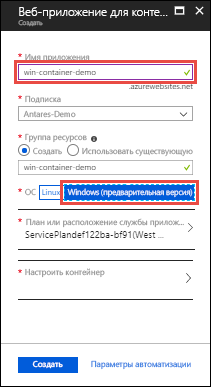
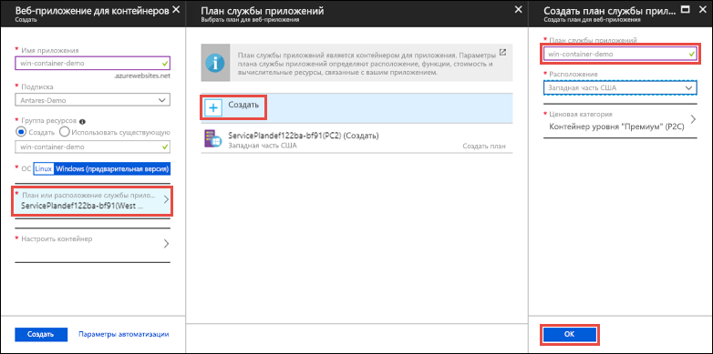
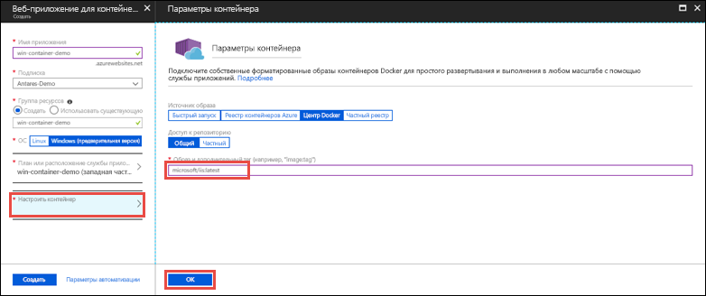

# <a name="run-a-custom-windows-container-in-azure-preview"></a>Запуск пользовательского контейнера Windows в Azure (предварительная версия)

[Служба приложений Azure](app-service-web-overview.md) предоставляет предопределенные стеки приложений на платформе Windows, например ASP.NET или Node.js, выполняющиеся в IIS. Предварительно настроенная среда Windows блокирует в операционной системе возможность административного доступа, установки программного обеспечения, изменений в глобальном кэше сборок и т. д. (см. раздел [Функциональные возможности операционной системы для службы приложений Azure](web-sites-available-operating-system-functionality.md)). Если приложению требуется более высокий уровень доступа, чем предусмотрено в предварительно настроенной среде, можно развернуть пользовательский контейнер Windows. В этом кратком руководстве показано, как развернуть пользовательский образ IIS в службе приложений Azure из [Docker Hub](https://hub.docker.com/).


## <a name="sign-in-to-azure"></a>Вход в Azure

Войдите на портал Azure по адресу https://portal.azure.com.

## <a name="create-a-windows-container-app"></a>Создание приложения-контейнера Windows

1. Выберите **Создать ресурс** в верхнем левом углу окна портала Azure.

2. В поле поиска над списком ресурсов Azure Marketplace найдите и выберите **Веб-приложение для контейнеров**.

3. Укажите имя приложения, например *mywebapp*, примите значения по умолчанию, чтобы создать группу ресурсов, а затем нажмите кнопку **Windows (предварительная версия)** в поле **ОС**.

    

4. Создайте план службы приложений, щелкнув **Расположение или план службы приложений** > **Создать**. Укажите имя нового плана, примите значения по умолчанию и нажмите кнопку **ОК**.

    

5. Щелкните **Настроить контейнер**, в поле **Образ и дополнительный тег** введите _microsoft/iis:latest_ и нажмите кнопку **ОК**.

    

    В этой статье используется общедоступный образ [microsoft/iis:latest](https://hub.docker.com/r/microsoft/iis/) Docker Hub. Если у вас есть пользовательский образ для веб-приложения в другом расположении, например [реестре контейнеров Azure](/azure/container-registry/) или любом другом частном репозитории, его можно настроить здесь.

6. Нажмите кнопку **Создать** и подождите, пока Azure создаст необходимые ресурсы.

## <a name="browse-to-the-container-app"></a>Переход к контейнеру приложения

По завершении операции Azure отображается окно уведомления.


1. Щелкните **Перейти к ресурсу**.

2. На странице приложения щелкните ссылку в разделе **URL-адрес**.

В браузере откроется следующая страница:


Подождите несколько минут и повторите попытку, пока не отобразится страница приветствия IIS:


**Поздравляем!** Вы запустили свой первый пользовательский контейнер Windows в службе приложений Azure.

## <a name="see-container-start-up-logs"></a>Просмотр журналов запуска контейнера

Загрузка контейнера Windows может занять некоторое время. Чтобы просмотреть ход выполнения, перейдите по следующему URL-адресу, указав вместо *\<app_name >* имя приложения.
```
https://<app_name>.scm.azurewebsites.net/api/logstream
```

Потоковые журналы выглядят следующим образом:

```
2018-07-27T12:03:11  Welcome, you are now connected to log-streaming service.
27/07/2018 12:04:10.978 INFO - Site: win-container-demo - Start container succeeded. Container: facbf6cb214de86e58557a6d073396f640bbe2fdec88f8368695c8d1331fc94b
27/07/2018 12:04:16.767 INFO - Site: win-container-demo - Container start complete
27/07/2018 12:05:05.017 INFO - Site: win-container-demo - Container start complete
27/07/2018 12:05:05.020 INFO - Site: win-container-demo - Container started successfully
```

## <a name="use-a-different-docker-image"></a>Использование другого образа Docker

Вы можете использовать другой пользовательский образ Docker, чтобы запустить приложение. При этом необходимо выбрать правильный [родительский образ](https://docs.docker.com/develop/develop-images/baseimages/) для платформы, которую вы хотите использовать: 

- Для развертывания приложений .NET Framework используйте родительский образ на основе выпуска [канала долгосрочного обслуживания (LTSC)](https://docs.microsoft.com/windows-server/get-started/semi-annual-channel-overview#long-term-servicing-channel-ltsc) для Windows Server Core 2016. 
- Для развертывания приложений .NET Core используйте родительский образ на основе выпуска [канала долгосрочного обслуживания (LTSC)](https://docs.microsoft.com/windows-server/get-started/semi-annual-channel-overview#long-term-servicing-channel-ltsc) для Windows Server Nano 2016. 

Скачивание родительского образа во время запуска приложения занимает некоторое время. Но вы можете ускорить запуск, используя один из следующих родительских образов, уже кэшированных в службе приложений Azure:

- [microsoft/iis](https://hub.docker.com/r/microsoft/iis/):windowsservercore-ltsc2016, последняя версия
- [microsoft/iis](https://hub.docker.com/r/microsoft/iis/):nanoserver-sac2016
- [microsoft/aspnet](https://hub.docker.com/r/microsoft/aspnet/):4.7.2-windowsservercore-ltsc2016, 4.7.2, последняя версия
- [microsoft/dotnet](https://hub.docker.com/r/microsoft/dotnet/):2.1-aspnetcore-runtime
- [microsoft/dotnet](https://hub.docker.com/r/microsoft/dotnet/):2.1-sdk
