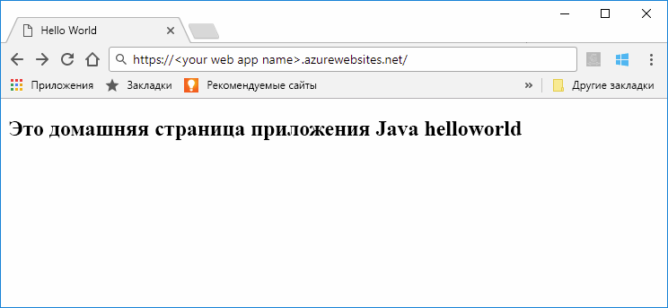
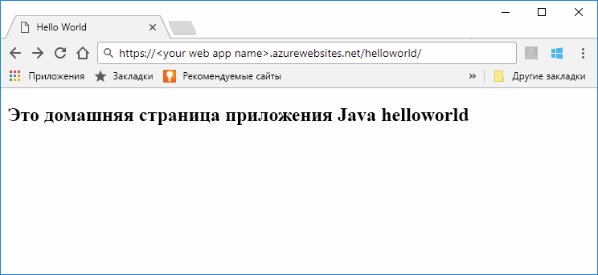

# <a name="quickstart-create-a-java-web-app-in-app-service-on-linux"></a>Краткое руководство по созданию веб-приложения Java в службе приложений Azure в Linux

[Служба приложений на Linux](app-service-linux-intro.md) — это высокомасштабируемая служба размещения с самостоятельной установкой исправлений на основе операционной системы Linux. В этом кратком руководстве показано, как использовать [интерфейс командной строки Azure](https://docs.microsoft.com/cli/azure/get-started-with-azure-cli) (Azure CLI) с [подключаемым модулем Maven для веб-приложений Azure (предварительная версия)](https://github.com/Microsoft/azure-maven-plugins/tree/develop/azure-webapp-maven-plugin), чтобы развернуть файл веб-архива (WAR) веб-приложения Java.



[!INCLUDE [quickstarts-free-trial-note](../../../includes/quickstarts-free-trial-note.md)]

[!INCLUDE [cloud-shell-try-it.md](../../../includes/cloud-shell-try-it.md)]

## <a name="create-a-java-app"></a>Создание приложения Java

В приглашении Cloud Shell выполните следующую команду Maven, чтобы создать новое веб-приложение с именем `helloworld`:

```bash
mvn archetype:generate -DgroupId=example.demo -DartifactId=helloworld -DarchetypeArtifactId=maven-archetype-webapp
```

## <a name="configure-the-maven-plugin"></a>Настройка подключаемого модуля Maven

Для развертывания из Maven используйте редактор кода в Cloud Shell, чтобы открыть проект файла `pom.xml` в каталоге `helloworld`. 

```bash
code pom.xml
```

Затем добавьте следующее определение подключаемого модуля в элемент `<build>` файла `pom.xml`.

```xml
<plugins>
    <!--*************************************************-->
    <!-- Deploy to Tomcat in App Service Linux           -->
    <!--*************************************************-->
      
    <plugin>
        <groupId>com.microsoft.azure</groupId>
        <artifactId>azure-webapp-maven-plugin</artifactId>
        <version>1.4.0</version>
        <configuration>
   
            <!-- Web App information -->
            <resourceGroup>${RESOURCEGROUP_NAME}</resourceGroup>
            <appName>${WEBAPP_NAME}</appName>
            <region>${REGION}</region>
   
            <!-- Java Runtime Stack for Web App on Linux-->
            <linuxRuntime>tomcat 8.5-jre8</linuxRuntime>
   
        </configuration>
    </plugin>
</plugins>
```    


> [!NOTE] 
> В этой статье мы работаем только с приложениями Java, которые упакованы в WAR-файлы. Подключаемый модуль также поддерживает веб-приложения JAR. Используйте такое альтернативное определение подключаемого модуля для этих приложений. Эта конфигурация развернет JAR, построенное Maven, в `${project.build.directory}/${project.build.finalName}.jar` на вашей локальной файловой системе.
>
>```xml
><plugin>
>            <groupId>com.microsoft.azure</groupId>
>            <artifactId>azure-webapp-maven-plugin</artifactId>
>            <version>1.4.0</version>
>            <configuration>
>                <deploymentType>jar</deploymentType>
>
>           <!-- Web App information -->
>            <resourceGroup>${RESOURCEGROUP_NAME}</resourceGroup>
>            <appName>${WEBAPP_NAME}</appName>
>            <region>${REGION}</region>  
>
>                <!-- Java Runtime Stack for Web App on Linux-->
>                <linuxRuntime>jre8</linuxRuntime>
>            </configuration>
>         </plugin>
>```    


Укажите нужные значения вместо следующих заполнителей в конфигурации подключаемого модуля:

| Placeholder | ОПИСАНИЕ |
| ----------- | ----------- |
| `RESOURCEGROUP_NAME` | Имя новой группы ресурсов, в которой создается веб-приложение. Поместив все ресурсы для приложения в группу, вы можете управлять ими совместно. Например, при удалении группы ресурсов все ресурсы, связанные с приложением, также удаляются. Укажите вместо этого значения уникальное имя новой группы ресурсов, например *TestResources*. Это имя группы ресурсов будет использоваться для удаления всех ресурсов Azure в следующем разделе. |
| `WEBAPP_NAME` | Имя приложения будет частью имени узла для веб-приложения, которое будет развернуто в Azure (WEBAPP_NAME.azurewebsites.net). Измените значение этого параметра на уникальное имя нового веб-приложения Azure, в котором будет размещено ваше приложение Java, например *contoso*. |
| `REGION` | Регион Azure, в котором размещено веб-приложение, например `westus2`. Список регионов можно получить из Cloud Shell или CLI с помощью команды `az account list-locations`. |

## <a name="deploy-the-app"></a>Развертывание приложения

Разверните приложение Java в Azure, используя команду приведенную ниже.

```bash
mvn package azure-webapp:deploy
```

По завершению развертывания перейдите к развернутому приложению, используя следующий URL-адрес в своем веб-браузере, например `http://<webapp>.azurewebsites.net/helloworld`. 



**Поздравляем!** Вы развернули свое первое приложение Java в службе приложений на платформе Linux.


[!INCLUDE [cli-samples-clean-up](../../../includes/cli-samples-clean-up.md)]


## <a name="next-steps"></a>Дополнительная информация

В этом кратком руководстве вы использовали Maven для создания веб-приложения Java, настроили [подключаемый модуль Maven для веб-приложений Azure (предварительная версия)](https://github.com/Microsoft/azure-maven-plugins/tree/develop/azure-webapp-maven-plugin), затем развернули веб-архив упакованного веб-приложения Java в службу приложений на платформе Linux. Чтобы узнать больше об использовании Java с Azure, перейдите по ссылке ниже.

> [!div class="nextstepaction"]
> [Azure для разработчиков Java](https://docs.microsoft.com/java/azure/)

