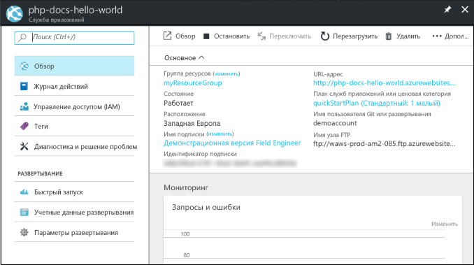

# <a name="deploy-a-python-web-app-in-web-app-for-containers"></a>Развертывание веб-приложения Python в Веб-приложении для контейнеров

[Служба приложений на платформе Linux](app-service-linux-intro.md) — это высокомасштабируемая служба размещения с самостоятельной установкой исправлений на основе операционной системы Linux. В этом кратком руководстве показано, как создать веб-приложение и развернуть простое приложение Flask с помощью пользовательского образа из центра Docker. Создайте веб-приложение с помощью [Azure CLI](https://docs.microsoft.com/cli/azure/get-started-with-azure-cli).


[!INCLUDE [quickstarts-free-trial-note](../../../includes/quickstarts-free-trial-note.md)]

## <a name="prerequisites"></a>Предварительные требования

Для работы с этим руководством:

* <a href="https://git-scm.com/" target="_blank">установите Git</a>;
* <a href="https://www.docker.com/community-edition" target="_blank">установите Docker Community Edition</a>.
* <a href="https://hub.docker.com/" target="_blank">зарегистрируйте учетную запись центра Docker</a>.

## <a name="download-the-sample"></a>Скачивание примера приложения

В окне терминала выполните команды ниже. Так вы клонируете пример приложения на локальный компьютер и перейдете в каталог, содержащий пример кода.

```bash
git clone https://github.com/Azure-Samples/python-docs-hello-world
cd python-docs-hello-world
```

Этот репозиторий содержит простое приложение Flask в папке _/app_ и файл _Dockerfile_, который определяет три вещи.

- Использование базового образа [tiangolo/uwsgi-nginx-flask:python3.6-alpine3.7](https://hub.docker.com/r/tiangolo/uwsgi-nginx-flask/).
- Контейнер должен ожидать передачи данных через порт 8000.
- Копирование каталога `/app` в контейнер каталога `/app`.

Конфигурация соответствует [инструкциям для базового образа](https://hub.docker.com/r/tiangolo/uwsgi-nginx-flask/).

## <a name="run-the-app-locally"></a>Локальный запуск приложения

Запустите приложение в контейнере Docker.

```bash
docker build --rm -t flask-quickstart .
docker run --rm -it -p 8000:8000 flask-quickstart
```

Откройте веб-браузер и перейдите к примеру приложения по адресу `http://localhost:8000`.

На странице отобразится сообщение **Hello World** из примера приложения.


Для остановки контейнера в окне терминала нажмите клавиши **CTRL+C**.

## <a name="deploy-image-to-docker-hub"></a>Развертывание образа из центра Docker

Войдите в учетную запись центра Docker. Следуйте указаниям для ввода учетных данных центра Docker.

```bash
docker login
```

Отметьте свой образ и перетащите его в новый _общедоступный_ репозиторий учетной записи центра Docker с именем `flask-quickstart`. Замените *\<dockerhub_id>* идентификатором центра Docker.

```bash
docker tag flask-quickstart <dockerhub_id>/flask-quickstart
docker push <dockerhub_id>/flask-quickstart
```

> [!NOTE]
> Если указанный репозиторий не найден, то команда `docker push` создаст общедоступный репозиторий. Это краткое руководство предполагает общедоступный репозиторий в центре Docker. Если вы предпочитаете отправлять в частный репозиторий, необходимо настроить учетные данные центра Docker в Службе приложений Azure позже. См. [Create a web app](#create-a-web-app) (Создание веб-приложения).

После завершения отправки образа его можно использовать в своем веб-приложении Azure.

[!INCLUDE [cloud-shell-try-it.md](../../../includes/cloud-shell-try-it.md)]

[!INCLUDE [Create resource group](../../../includes/app-service-web-create-resource-group-linux.md)]

[!INCLUDE [Create app service plan](../../../includes/app-service-web-create-app-service-plan-linux.md)]

## <a name="create-a-web-app"></a>Создание веб-приложения

Создайте [веб-приложение](../app-service-web-overview.md) в рамках плана `myAppServicePlan` службы приложений с помощью команды [az webapp create](/cli/azure/webapp?view=azure-cli-latest#az_webapp_create). Замените *\<app name>* на глобально уникальное имя приложения и *\<dockerhub_id>* на идентификатор центра Docker.

```azurecli-interactive
az webapp create --resource-group myResourceGroup --plan myAppServicePlan --name <app name> --deployment-container-image-name <dockerhub_id>/flask-quickstart
```

Когда веб-приложение будет создано, в Azure CLI отобразится примерно следующее:

```json
{
  "availabilityState": "Normal",
  "clientAffinityEnabled": true,
  "clientCertEnabled": false,
  "cloningInfo": null,
  "containerSize": 0,
  "dailyMemoryTimeQuota": 0,
  "defaultHostName": "<app name>.azurewebsites.net",
  "deploymentLocalGitUrl": "https://<username>@<app name>.scm.azurewebsites.net/<app name>.git",
  "enabled": true,
  < JSON data removed for brevity. >
}
```

Если вы ранее отправляли в закрытый репозиторий, необходимо также настроить учетные данные центра Docker в службе приложений. Дополнительные сведения см. в разделе [Использование частного образа из центра Docker Hub](tutorial-custom-docker-image.md#use-a-private-image-from-docker-hub-optional).

### <a name="specify-container-port"></a>Выбор порта контейнера

Как указано в _Dockerfile_, контейнер ожидает передачи данных через порт 8000. Чтобы служба приложений перенаправляла запрос на правильный порт, необходимо установить параметр приложения *WEBSITES_PORT*.

В Cloud Shell выполните команду [`az webapp config appsettings set`](/cli/azure/webapp/config/appsettings?view=azure-cli-latest#az_webapp_config_appsettings_set).


```azurecli-interactive
az webapp config appsettings set --name <app_name> --resource-group myResourceGroup --settings WEBSITES_PORT=8000
```

## <a name="browse-to-the-app"></a>Переход в приложение

```bash
http://<app_name>.azurewebsites.net/
```


> [!NOTE]
> Запуск веб-приложения займет некоторое время, так как образ центра Docker должен загрузиться и запуститься при запросе приложения в первый раз. Если сначала появится сообщение об ошибке после долгого перерыва, просто обновите страницу.

**Поздравляем!** Вы развернули пользовательский образ Docker, запускающий приложение Python в Веб-приложении Azure для контейнеров.

## <a name="update-locally-and-redeploy"></a>Обновление на локальном компьютере и повторное развертывание

В локальном текстовом редакторе в приложении Python откройте файл `app/main.py` и внесите небольшое изменение в текст рядом с оператором `return`:

```python
return 'Hello, Azure!'
```

Перестройте образ и повторно перетащите его в центр Docker.

```bash
docker build --rm -t flask-quickstart .
docker tag flask-quickstart <dockerhub_id>/flask-quickstart
docker push <dockerhub_id>/flask-quickstart
```

Перезапустите приложение в Cloud Shell. Перезапуск приложения позволяет применить все параметры и извлечь из реестра последний контейнер.

```azurecli-interactive
az webapp restart --resource-group myResourceGroup --name <app_name>
```

Подождите около 15 секунд, чтобы служба приложений получила обновленный образ. Перейдите в окно браузера, открытое на шаге **перехода в приложение**, и обновите страницу.


## <a name="manage-your-azure-web-app"></a>Управление веб-приложением Azure

Перейдите на [портал Azure](https://portal.azure.com), чтобы увидеть созданное веб-приложение.

В меню слева выберите **Службы приложений**, а затем щелкните имя своего веб-приложения Azure.


По умолчанию на портале отображается страница **Обзор** веб-приложения. Здесь вы можете наблюдать за работой приложения. Вы также можете выполнять базовые задачи управления: обзор, завершение, запуск, перезагрузку и удаление. На вкладках в левой части страницы отображаются различные страницы конфигурации, которые можно открыть.



[!INCLUDE [Clean-up section](../../../includes/cli-script-clean-up.md)]

## <a name="next-steps"></a>Дополнительная информация

> [!div class="nextstepaction"]
> [Использование Python и PostgreSQL](tutorial-docker-python-postgresql-app.md)

> [!div class="nextstepaction"]
> [Использование пользовательского образа Docker для платформы "Веб-приложения для контейнеров"](tutorial-custom-docker-image.md)