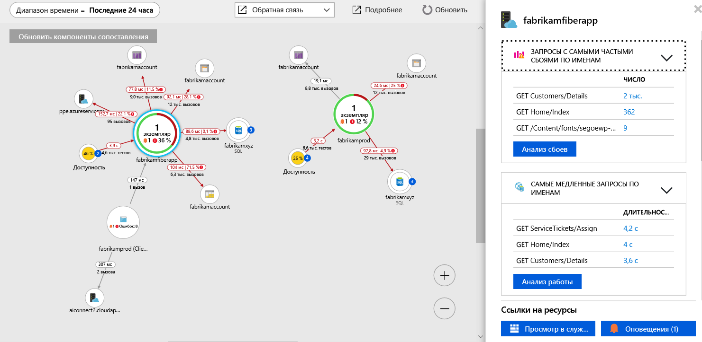

# <a name="collect-distributed-traces-from-python-preview"></a>Сбор распределенных трассировок из Python (предварительная версия)

Application Insights теперь поддерживает распределенную трассировку приложений Python за счет интеграции с [OpenCensus](https://opencensus.io) и нашим новым [локальным сервером пересылки](./opencensus-local-forwarder.md). Эта статья содержит пошаговое описание процесса установки OpenCensus для Python и получения данных трассировки в Application Insights.

## <a name="prerequisites"></a>Предварительные требования

- Вам понадобится подписка Azure.
- Должен быть установлен Python, в этой статье используется [Python 3.7.0](https://www.python.org/downloads/), хотя более ранние версии, скорее всего, будут работать с незначительной корректировкой.
- Следуйте инструкциям по установке [локального сервера пересылки в качестве службы Windows](./opencensus-local-forwarder.md#windows-service)

Если у вас еще нет подписки Azure, создайте [бесплатную](https://azure.microsoft.com/free/) учетную запись Azure, прежде чем начинать работу.

## <a name="sign-in-to-the-azure-portal"></a>Вход на портал Azure

Войдите на [портале Azure](https://portal.azure.com/).

## <a name="create-application-insights-resource"></a>Создание ресурса Application Insights

Сначала необходимо создать ресурс Application Insights, который создаст ключ инструментирования (ikey). Затем с помощью этого ключа ikey локальный сервер настраивается для отправки распределенных трассировок из инструментированного приложения OpenCensus в Application Insights.   

1. Выберите **Создать ресурс** > **Средства разработчика** > **Application Insights**.

   

   Откроется окно настроек, в котором нужно заполнить все поля в соответствии с приведенной ниже таблицей.

    | Параметры        | Значение           | ОПИСАНИЕ  |
   | ------------- |:-------------|:-----|
   | **Имя**      | Глобально уникальное значение | Имя, идентифицирующее отслеживаемое приложение |
   | **Тип приложения** | Общие сведения | Тип отслеживаемого приложения |
   | **Группа ресурсов**     | myResourceGroup      | Имя новой группы ресурсов для размещения данных App Insights |
   | **Местоположение.** | Восточная часть США | Выберите ближайшее расположение или расположение вблизи места размещения приложения |

2. Нажмите кнопку **Создать**.

## <a name="configure-local-forwarder"></a>Настройка локального сервера пересылки

1. Выберите **Обзор** > **Основные компоненты** и скопируйте **ключ инструментирования** приложения.

   

2. Отредактируйте файл `LocalForwarder.config` и добавьте ключ инструментирования. Если вы следовали инструкциям из [предварительных требований](./opencensus-local-forwarder.md#windows-service), этот файл расположен в `C:\LF-WindowsServiceHost`.

    ```xml
      <OpenCensusToApplicationInsights>
        <!--
          Instrumentation key to track telemetry to.
          -->
        <InstrumentationKey>{enter-instrumentation-key}</InstrumentationKey>
      </OpenCensusToApplicationInsights>
    
      <!-- Describes aspects of processing Application Insights telemetry-->
      <ApplicationInsights>
        <LiveMetricsStreamInstrumentationKey>{enter-instrumentation-key}</LiveMetricsStreamInstrumentationKey>
      </ApplicationInsights>
    </LocalForwarderConfiguration>
    ```

3. Перезапустите службу **Локальный сервер пересылки** приложения.

## <a name="opencensus-python-package"></a>Пакет OpenCensus Python

1. Установите пакет Open Census для Python с помощью pip или pipenv из командной строки:

    ```python
    python -m pip install opencensus
    # pip env install opencensus
    ```

    > [!NOTE]
    > `python -m pip install opencensus` предполагает, что для установки Python у вас задана переменная среды PATH. Если это не настроено, необходимо предоставить полный путь каталога к расположению исполняемого файла Python, что приведет к выполнению команды, подобной `C:\Users\Administrator\AppData\Local\Programs\Python\Python37-32\python.exe -m pip install opencensus`.

2. Сначала давайте создадим данные трассировки локально. В Python IDLE или любом выбранном текстовом редакторе введите следующий код:

    ```python
    from opencensus.trace.tracer import Tracer
    
    def main():
        while True:
            valuePrompt()
    
    def valuePrompt():
        tracer = Tracer()
        with tracer.span(name="test") as span:
            line = input("Enter a value: ")
            print(line)
    
    if __name__ == "__main__":
        main()
    
    ```

3. При выполнении кода вам несколько раз будет предложено ввести значение. С каждой записью значение будет выводиться в оболочке, а модуль OpenCensus Python будет создавать соответствующий фрагмент **SpanData**. Проект OpenCensus определяет [_трассировку в виде дерева диапазонов_](https://opencensus.io/core-concepts/tracing/).
    
    ```python
    Enter a value: 4
    4
    [SpanData(name='test', context=SpanContext(trace_id=1f07f062ac394c50925f2ae61e635e14, span_id=None, trace_options=TraceOptions(enabled=True), tracestate=None), span_id='5c17a4ad6ba14299', parent_span_id=None, attributes={}, start_time='2018-09-15T20:42:15.847292Z', end_time='2018-09-15T20:42:17.615664Z', child_span_count=0, stack_trace=None, time_events=[], links=[], status=None, same_process_as_parent_span=None, span_kind=0)]
    Enter a value: 25
    25
    [SpanData(name='test', context=SpanContext(trace_id=c71b4e88a22a495da61df52ce3eee3e1, span_id=None, trace_options=TraceOptions(enabled=True), tracestate=None), span_id='51547c0af5f046eb', parent_span_id=None, attributes={}, start_time='2018-09-15T20:42:17.615664Z', end_time='2018-09-15T20:48:11.160314Z', child_span_count=0, stack_trace=None, time_events=[], links=[], status=None, same_process_as_parent_span=None, span_kind=0)]
    Enter a value: 100
    100
    [SpanData(name='test', context=SpanContext(trace_id=b4cdcc9e6df44a8fbb6e8ddeccc1351c, span_id=None, trace_options=TraceOptions(enabled=True), tracestate=None), span_id='f2caacf7892744d1', parent_span_id=None, attributes={}, start_time='2018-09-15T20:48:11.175931Z', end_time='2018-09-15T20:48:12.629178Z', child_span_count=0, stack_trace=None, time_events=[], links=[], status=None, same_process_as_parent_span=None, span_kind=0)]
    ```

4. Хотя это может оказаться полезным в демонстрационных целях, в конечном итоге нам нужно выдать SpanData способом, которым они могут быть приняты нашей **службой локального сервера пересылки** и отправлены в Application Insights. Измените код из предыдущего шага на следующий.

    ```python
    from opencensus.trace.tracer import Tracer
    from opencensus.trace import config_integration
    from opencensus.trace.exporters.ocagent import trace_exporter
    from opencensus.trace import tracer as tracer_module
    
    import os
    
    def main():        
        while True:
            valuePrompt()
    
    def valuePrompt():
        export_LocalForwarder = trace_exporter.TraceExporter(
        service_name=os.getenv('SERVICE_NAME', 'python-service'),
        endpoint=os.getenv('OCAGENT_TRACE_EXPORTER_ENDPOINT'))
        
        tracer = Tracer(exporter=export_LocalForwarder)
        with tracer.span(name="test") as span:
            line = input("Enter a value: ")
            print(line)
    
    if __name__ == "__main__":
        main()
    ```

5. Если сохранить и попробовать запустить приведенный выше модуль, для `grpc` может появиться сообщение об ошибке `ModuleNotFoundError`. В этом случае выполните следующую команду, чтобы установить [пакет grpcio](https://pypi.org/project/grpcio/):

    ```
    python -m pip install grpcio
    ```

6. Теперь при запуске скрипта Python из примера выше вы по-прежнему будете получать запрос на ввод значений, но теперь только значение будет выводиться в оболочке.

7. Чтобы подтвердить, что **локальный сервер пересылки** собирает трассировки, проверьте файл `LocalForwarder.config`. Если вы выполнили шаги из [предварительных требований](https://docs.microsoft.com/azure/application-insights/local-forwarder#windows-service), он будет находиться в каталоге `C:\LF-WindowsServiceHost`.

    На приведенном ниже изображении файла журнала можно увидеть, что перед запуском второго скрипта, где был добавлен экспортер, `OpenCensus input BatchesReceived` было равно 0. Когда мы начали выполнять обновленный скрипт, `BatchesReceived` увеличилось в соответствии с введенным числом значений:
    
    

## <a name="start-monitoring-in-the-azure-portal"></a>Запуск мониторинга на портале Azure

1. Теперь можно повторно открыть страницу **Обзор** Application Insights на портале Azure для просмотра сведений о выполняющемся в данный момент приложении. Выберите **Live Metrics Stream**.

   

2. Если выполнить второй скрипт Python снова и начать вводить значения, отобразятся динамические данные трассировки, так как они поступают в Application Insights из службы локального сервера пересылки.

   

3. Вернитесь на страницу **Обзор** и выберите **Схема приложений**, чтобы получить визуальный макет отношений зависимости и длительность вызовов между компонентами приложения.

    

    Так как мы выполняли трассировку только одного вызова метода, наша схема приложений не так интересна. Но схему приложений можно масштабировать для визуализации гораздо большего количества распределенных приложений:

   

4. Выберите **Анализ работы**, чтобы выполнить подробный анализ работы и определить первопричину низкой производительности.

    

5. Если выбрать **Примеры**, а затем щелкнуть один из примеров, которые отображаются на панели справа, запустится интерфейс сведений о сквозной транзакции. В то время как в нашем примере приложения показано одно событие, в более сложном приложении можно изучить сквозную транзакцию до уровня стека вызовов отдельного события.

     

## <a name="opencensus-trace-for-python"></a>Трассировка OpenCensus для Python

Мы рассмотрели только основы подключения OpenCensus для Python с помощью локального сервера пересылки и Application Insights. В официальном руководстве по использованию рассматриваются более сложные темы, например:

* [Образцы](https://opencensus.io/api/python/trace/usage.html#samplers).
* [Интеграция с Flask](https://opencensus.io/api/python/trace/usage.html#flask).
* [Интеграция с Django](https://opencensus.io/api/python/trace/usage.html#django).
* [Интеграция с MySQL](https://opencensus.io/api/python/trace/usage.html#service-integration).
* [PostgreSQL](https://opencensus.io/api/python/trace/usage.html#postgresql)
  
## <a name="next-steps"></a>Дополнительная информация

* [Руководство по использованию OpenCensus для Python](https://opencensus.io/api/python/trace/usage.html)
* [Сопоставление приложений](./app-insights-app-map.md)
* [Поиск и диагностика проблем производительности с помощью Azure Application Insights](./app-insights-tutorial-performance.md)