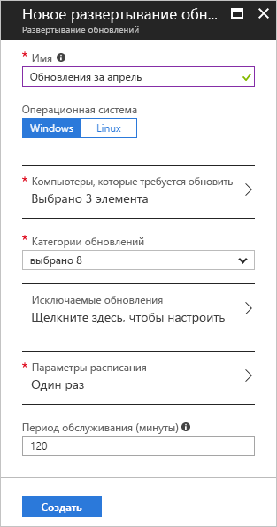

# <a name="manage-windows-updates-by-using-azure-automation"></a>Управление обновлениями Windows при помощи службы автоматизации Azure

С помощью решения по управлению обновлениями можно управлять обновлениями и исправлениями виртуальных машин. Из этого руководства можно узнать, как быстро оценить состояние доступных обновлений, назначить время установки необходимых обновлений, проверить результаты развертывания и создать оповещение, чтобы убедиться, что обновления успешно применены.

Сведения о ценах см. на странице [цен на службу автоматизации](https://azure.microsoft.com/pricing/details/automation/).

Из этого руководства вы узнаете, как выполнять следующие задачи:

> [!div class="checklist"]
> * Подключение виртуальной машины к управлению обновлениями
> * Просмотр оценки обновлений
> * Настройка оповещений
> * Планирование развертывания обновлений
> * просмотр результатов развертывания.

## <a name="prerequisites"></a>Предварительные требования

Для работы с этим учебником необходимы указанные ниже компоненты.

* Подписка Azure. Если у вас ее нет, [активируйте ежемесячную сумму денег для подписчиков Visual Studio на счете в Azure](https://azure.microsoft.com/pricing/member-offers/msdn-benefits-details/) или зарегистрируйте [бесплатную учетную запись](https://azure.microsoft.com/free/?WT.mc_id=A261C142F).
* [Учетная запись службы автоматизации Azure](automation-offering-get-started.md) для хранения модулей runbook "наблюдатель" и "действия", а также модуля "задачи наблюдателя".
* [Виртуальная машина](../virtual-machines/windows/quick-create-portal.md) для подключения.

## <a name="sign-in-to-azure"></a>Вход в Azure

Войдите на портал Azure по адресу https://portal.azure.com.

## <a name="enable-update-management"></a>Включение управления обновлениями

Для работы с этим руководством прежде всего включите управление обновлениями на виртуальной машине.

1. На портале Azure в левой области выберите **Виртуальные машины**. Выберите виртуальную машину из списка.
2. На странице "Виртуальная машина" в разделе **Операции** выберите **Управление обновлениями**. Отобразится панель **Включение управления обновлениями**.

Проверка выполняется для определения, включено ли Управление обновлениями для этой виртуальной машины. При этом проверяется рабочее пространство Log Analytics Azure и связанная учетная запись службы автоматизации, а также наличие решения по управлению обновлениями в рабочей области.

Рабочая область [Log Analytics](../log-analytics/log-analytics-overview.md?toc=%2fazure%2fautomation%2ftoc.json) используется для сбора данных, созданных компонентами и службами, такими как "Управление обновлениями". Рабочая область предоставляет единое расположение для проверки и анализа данных из нескольких источников.

В процессе проверки также определяется, была ли виртуальная машина подготовлена с помощью Microsoft Monitoring Agent (MMA) и гибридной рабочей роли службы автоматизации. Агент позволяет взаимодействовать со службой автоматизации Azure и получать сведения о состоянии обновления. Для взаимодействия со службой автоматизации Azure, а также для загрузки обновлений агенту требуется порт 443, который должен быть открыт.

Если во время подключения обнаружится, что отсутствует один из следующих компонентов, он будет автоматически добавлен.

* [Рабочая область Log Analytics](../log-analytics/log-analytics-overview.md?toc=%2fazure%2fautomation%2ftoc.json).
* [Учетная запись автоматизации](./automation-offering-get-started.md)
* [Гибридная рабочая роль runbook](./automation-hybrid-runbook-worker.md) (включена на виртуальной машине)

В разделе **Управление обновлениями** задайте рабочую область Log Analytics и учетную запись службы автоматизации. Нажмите кнопку **Включить**. Если эти параметры недоступны, это значит, что для виртуальной машины включено другое решение автоматизации. В этом случае необходимо использовать одну и ту же рабочую область и учетную запись автоматизации.


Включение решения может занять несколько минут. В течение этого времени не закрывайте окно браузера. После включения решения сведения об отсутствующих обновлениях на виртуальной машине передаются в Log Analytics. На получение данных для анализа может уйти от 30 минут до 6 часов.

## <a name="view-update-assessment"></a>Просмотр оценок обновления

После включения решения "Управление обновлениями" отобразится панель **Управление обновлениями**. Если будут обнаружены отсутствующие обновления, их список отобразится на вкладке **Отсутствующие обновления**.

В разделе **Ссылка на сведения** выберите ссылку обновления, чтобы открыть в новом окне соответствующую статью технической поддержки. В этом окне можно получить важные сведения об обновлении.


Чтобы открыть панель **Поиск по журналам** для выбранного обновления, щелкните обновление в любой точке. Запрос для поиска по журналам настроен для этого конкретного обновления. Вы можете изменить этот запрос или создать собственный, чтобы просмотреть подробные сведения об обновлениях, которые разворачиваются или отсутствуют в среде.


## <a name="configure-alerts"></a>Настройка оповещений

На этом шаге вы узнаете, как настроить оповещение об успешном развертывании на основе запроса Log Analytics или оповещение о неудачных развертываниях за счет отслеживания работы главного модуля runbook решения "Управление обновлениями".

### <a name="alert-conditions"></a>Условия оповещения

Для каждого типа оповещений существуют различные условия, которые необходимо определить.

#### <a name="log-analytics-query-alert"></a>Оповещение на основе запроса Log Analytics

Для успешного развертывания вы можете создать оповещение на основе запроса Log Analytics. В случае неудачных развертываний можно использовать шаги из раздела [Оповещение на основе модуля Runbook](#runbook-alert), чтобы настроить отправку оповещения, когда главный модуль runbook, который оркестрирует развертывания обновлений, завершает работу со сбоем. Чтобы охватить множество сценариев, можно написать пользовательский запрос для дополнительных оповещений.

На портале Azure перейдите к разделу **Монитор** и затем выберите **Создать оповещение**.

В разделе **1. Определение условия оповещения** щелкните **Выбор цели**. В разделе **Filter by resource type** (Фильтрация по типу ресурсов) выберите **Log Analytics**. Выберите рабочую область Log Analytics, а затем выберите **Готово**.


Выберите **Добавить критерии**.

В разделе **Настройка логики сигнала** в таблице выберите **Поиск пользовательских журналов**. В текстовом поле **Поисковый запрос** введите следующий запрос.

```loganalytics
UpdateRunProgress
| where InstallationStatus == 'Succeeded'
| where TimeGenerated > now(-10m)
| summarize by UpdateRunName, Computer
```
Этот запрос возвращает сведения о компьютерах и имя запуска обновления, завершенного в рамках указанного интервала времени.

В разделе **Логика оповещений** для поля **Порог** введите **1**. По завершении нажмите кнопку **Готово**.


#### <a name="runbook-alert"></a>Оповещение на основе модуля runbook

В случае неудачных развертываний нужно настроить отправку оповещения об ошибке работы модуля. На портале Azure откройте **Монитор**, а затем выберите **Создать оповещение**.

В разделе **1. Определение условия оповещения** щелкните **Выбор цели**. В разделе **Фильтр по типу ресурсов** выберите **Учетные записи службы автоматизации**. Выберите вашу учетную запись службы автоматизации и нажмите кнопку **Готово**.

Чтобы **указать имя модуля Runbook**, щелкните знак **\+** и введите **Patch-MicrosoftOMSComputers** в качестве настраиваемого имени. Для параметра **Состояние** выберите **Сбой** или щелкните знак **\+**, чтобы ввести **Сбой**.


В разделе **Логика оповещений** для поля **Порог** введите **1**. По завершении нажмите кнопку **Готово**.

### <a name="alert-details"></a>Сведения об оповещении

В разделе **2. Определение сведений об оповещении** введите имя и описание для оповещения. Установите для параметра **Серьезность** значение **Информационный (уровень серьезности 2)** для успешного запуска или **Информационный (уровень серьезности 1)** для неудачного запуска.


В разделе **3. Определение группы действий** выберите **Новая группа действий**. Группа действий содержит действия, которые можно использовать для нескольких оповещений. Эти действия могут включать в себя уведомления электронной почты, модули Runbook, веб-перехватчики и многое другое, но не ограничиваются ими. Дополнительные сведения о группах действий см. в разделе [Создание групп действий и управление ими на портале Azure](../monitoring-and-diagnostics/monitoring-action-groups.md).

В поле **Имя группы действий** введите имя для оповещения и короткое имя. Короткое имя используется вместо полного имени группы действий при отправке уведомлений с помощью этой группы.

В разделе **Действия** введите имя действия, например **Уведомления по электронной почте**. В разделе **Тип действия** выберите **Email/SMS/Push/Voice**. В разделе **Сведения** выберите **Изменить сведения**.

На панели **Email/SMS/Push/Voice** введите имя. Установите флажок **Электронная почта**, а затем введите допустимый адрес электронной почты.


На панели **Email/SMS/Push/Voice** выберите **ОК**. На панели **Добавить группу действий** выберите **ОК**.

Чтобы настроить тему оповещения по электронной почте, в разделе **Создать правило** в разделе **Настройка действий** выберите **Тема сообщения**. Когда закончите, выберите **Создать правило оповещения**. Это оповещение уведомляет об успешном завершении развертывания обновления и предоставляет сведения о том, на каких компьютерах выполнялось развертывание.

## <a name="schedule-an-update-deployment"></a>Планирование развертывания обновлений

Для установки обновлений составьте план развертывания в рамках графика выпуска и периода обслуживания. Вы можете выбрать типы обновлений, которые будут включены в развертывание. Например, можно включить только критические обновления или обновления для системы безопасности и исключить накопительные пакеты обновления.

Чтобы запланировать новое развертывание обновления для виртуальной машины, перейдите в **Управление обновлениями**, а затем выберите **Запланировать развертывание обновлений**.

В разделе **Новое развертывание обновления** укажите следующие сведения.

* **Имя**. Введите уникальное имя для развертывания обновлений.

* **Операционная система**. Выберите операционную систему для развертывания обновлений.

* **Обновляемые компьютеры**. Щелкните сохраненный поиск, импортировать группу или выберите компьютеры в раскрывающемся списке и выберите нужные компьютеры. Если выберете **Компьютеры**, готовность к обновлению будет показана в столбце **Готовность к обновлению агента**. Дополнительные сведения о различных способах создания группы компьютеров в Log Analytics, см. в разделе [Использование групп компьютеров при поиске по журналам Log Analytics](../log-analytics/log-analytics-computer-groups.md).

* **Классификация обновлений**. Выберите типы программного обеспечения, развертывание обновления которого было включено в развертывание. Для целей этого руководства сохраните выбор всех типов.

  Ниже приведены типы классификации:

   |ОС  |type  |
   |---------|---------|
   |Windows     | критические обновления;</br>обновления для системы безопасности;</br>накопительные пакеты обновления;</br>пакеты дополнительных компонентов;</br>пакеты обновления;</br>обновления определений;</br>Средства</br>Обновления        |
   |Linux     | критические обновления и обновления для системы безопасности;</br>Другие обновления       |

   Описание типов классификации обновлений см. в этом [разделе](automation-update-management.md#update-classifications).

* **Параметры расписания**. Откроется панель **Параметры расписания**. Время начала по умолчанию — на 30 минут позднее текущего времени. В будущем можно изменить время начала на любое другое начиная с 10 минут.

   Кроме того, можно указать, происходит ли развертывание один раз, или настроить расписание повторяющегося развертывания. В разделе **Периодичность** выберите **Однократно**. Оставьте значение 1 день по умолчанию и выберите **ОК**. Это действие устанавливает расписание с периодическим повторением.

* **Период обслуживания (в минутах)**. Сохраните значение по умолчанию. Вы можете установить окно времени, внутри которого будет происходить развертывание обновления. Этот параметр позволяет гарантировать, что изменения выполняются в рамках заданного периода обслуживания.

* **Параметры перезагрузки**. Этот параметр определяет, как следует выполнять перезагрузку. Доступные параметры:
  * Перезагрузка при необходимости (по умолчанию)
  * Всегда выполнять перезагрузку
  * Никогда не перезагружать
  * Только перезагрузка без установки обновлений.

После окончания настройки расписания выберите **Создать**.



Вы вернетесь к панели мониторинга состояния. Выберите **Запланированные развертывания обновлений**, чтобы отобразить созданный график развертывания.

## <a name="view-results-of-an-update-deployment"></a>Просмотр результатов развертывания обновлений

После запуска запланированного развертывания можно контролировать его состояние на вкладке **Развертывания обновлений** раздела **Управление обновлениями**. Во время выполнения развертывания отображается состояние **Выполняется**. После завершения развертывания состояние приобретает значение **Выполнено**. В случае сбоя одного или нескольких обновлений в развертывании устанавливается состояние **Частичный сбой**.

Выберите завершенное развертывание обновлений, чтобы просмотреть панель мониторинга для него.


В разделе **Результаты обновления** содержится сводная информация об общем количестве обновлений и результатах их развертывания на виртуальной машине. В таблице справа представлена подробная информация о каждом обновлении и результатах установки.

Возможные значения представлены в следующем списке.

* **Попытка не предпринималась**. Обновление не установлено из-за недостатка времени в связи с заданной длительностью окна обслуживания.
* **Выполнено**. Обновление успешно выполнено.
* **Сбой**. Обновление не удалось выполнить.

Чтобы просмотреть все записи журнала, созданные при этом развертывании, щелкните **Все журналы**.

Чтобы просмотреть поток заданий для модуля runbook, который управляет развертыванием обновления на целевой виртуальной машине, выберите **Вывести**.

Чтобы просмотреть подробные сведения об ошибках развертывания, выберите **Ошибки**.

После успешного развертывания обновления отправляется сообщение электронной почты, уведомляющее об успешном выполнении (как на следующем примере).


## <a name="next-steps"></a>Дополнительная информация

Из этого руководства вы узнали, как выполнить следующие задачи:

> [!div class="checklist"]
> * Подключение виртуальной машины к управлению обновлениями
> * Просмотр оценки обновлений
> * Настройка оповещений
> * Планирование развертывания обновлений
> * просмотр результатов развертывания.

Теперь переходите к обзору решения для управления обновлениями.

> [!div class="nextstepaction"]
> [Update Management solution](../operations-management-suite/oms-solution-update-management.md?toc=%2fazure%2fautomation%2ftoc.json) (Решение для управления обновлениями)
