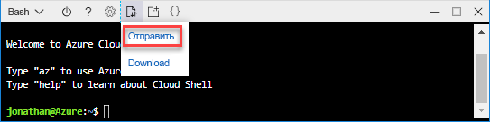

# <a name="quickstart-create-azure-resource-manager-templates-by-using-visual-studio-code"></a>Краткое руководство. Создание шаблона Azure Resource Manager c помощью Visual Studio Code

Дополнительные сведения о создании шаблонов Azure Resource Manager с помощью Visual Studio Code и расширения средств Azure Resource Manager. Шаблоны Resource Manager в Visual Studio Code можно создавать и без расширения. Но расширение предоставляет варианты автозаполнения, которые упрощают разработку шаблона. Основные понятия, связанные с развертыванием и управлением решений Azure, см. в [обзоре Azure Resource Manager](resource-group-overview.md).

Если у вас еще нет подписки Azure, [создайте бесплатную учетную запись Azure](https://azure.microsoft.com/free/), прежде чем начинать работу.

## <a name="prerequisites"></a>Предварительные требования

Для работы с этой статьей необходимо иметь следующее.

- [Visual Studio Code](https://code.visualstudio.com/).
- Расширение средств Resource Manager. Чтобы их установить, выполните следующие действия.

    1. Откройте Visual Studio Code.
    2. Чтобы открыть панель расширений,нажмите клавиши **CTRL+SHIFT+X**
    3. Выполните поиск по фразе **Средства Azure Resource Manager**, а затем нажмите кнопку **Установить**.
    4. Чтобы завершить установку расширения, щелкните **Перезагрузить**.

## <a name="open-a-quickstart-template"></a>Открытие шаблона быстрого запуска

Чтобы не создавать шаблон с нуля, откройте его в [Шаблонах быстрого запуска Azure](https://azure.microsoft.com/resources/templates/). Шаблоны быстрого запуска Azure являются репозиторием для шаблонов Resource Manager.

Шаблон, используемый в этом кратком руководстве, называется [Create a standard storage account](https://azure.microsoft.com/resources/templates/101-storage-account-create/) (Создание стандартной учетной записи хранения). Шаблон определяет ресурс учетной записи службы хранилища Azure.

1. В Visual Studio Code выберите **Файл**>**Открыть файл**.
2. Скопируйте приведенный ниже URL-адрес и вставьте его в поле **Имя файла**.

    ```url
    https://raw.githubusercontent.com/Azure/azure-quickstart-templates/master/101-storage-account-create/azuredeploy.json
    ```
3. Чтобы открыть файл, выберите **Открыть**.
4. Выберите **Файл**>**Сохранить как**, чтобы сохранить файл в качестве **azuredeploy.json** на локальном компьютере.

## <a name="edit-the-template"></a>Изменение шаблона

Чтобы узнать, как изменить шаблон с помощью Visual Studio Code, в разделе выходных данных необходимо добавить еще один элемент.

1. Используя Visual Studio Code, добавьте один или несколько элементов выходных данных в экспортированный шаблон.

    ```json
    "storageUri": {
      "type": "string",
      "value": "[reference(variables('storageAccountName')).primaryEndpoints.blob]"
    }
    ```

    После завершения раздел выходных данных будет выглядеть следующим образом.

    ```json
    "outputs": {
      "storageAccountName": {
        "type": "string",
        "value": "[variables('storageAccountName')]"
      },
      "storageUri": {
        "type": "string",
        "value": "[reference(variables('storageAccountName')).primaryEndpoints.blob]"
      }
    }
    ```

    Чтобы проверить возможности расширения средств Resource Manager IntelliSence, после того, как код внутри Visual Studio Code был скопирован и вставлен, попробуйте еще раз ввести **значение** элемента.

    

2. Чтобы сохранить файл выберите **Файл**>**Сохранить**.

## <a name="deploy-the-template"></a>Развертывание шаблона

Существует множество методов по развертыванию шаблонов.  В этом кратком руководстве используется Azure Cloud Shell с портала Azure. Cloud Shell поддерживает как Azure CLI, так и Azure PowerShell. 

1. Войдите на [портал Azure](https://portal.azure.com)
2. В правом верхнем углу выберите **Cloud Shell** (как показано на следующем рисунке).

    

    Cloud Shell откроется в нижней части экрана.

3. В верхнем левом углу Cloud Shell показано **PowerShell** или **Bash**. Чтобы использовать CLI, необходимо открыть сеанс Bash. Чтобы запустить PowerShell, нужно открыть сеанс PowerShell. Для переключения щелкните стрелку вниз, а затем выберите интерпретатор. На следующем рисунке показано, как переключиться с PowerShell на Bash.

    

    После переключения желательно перезагрузить оболочку.
4. Выберите **Отправка и скачивание файлов**, а затем **Отправить**.

    

    Чтобы развернуть файл шаблона из оболочки, сначала его нужно отправить.
5. Выберите файл в кратком руководстве, сохраненный ранее. **azuredeploy.json** — имя по умолчанию.
6. Чтобы проверить, что файл загружен успешно, в командной строке Cloud Shell необходимо выполнить команду **ls**. Для проверки содержимого шаблона также можно использовать команду **cat**. На следующем рисунке показано, как выполнить команду из Bash.  Вы используете те же команды из сеанса PowerShell.

    
7. Выполните следующие команды в Cloud Shell. Выберите вкладку, чтобы отобразить код PowerShell или код CLI.

    # <a name="clitabcli"></a>[ИНТЕРФЕЙС КОМАНДНОЙ СТРОКИ](#tab/CLI)
    ```cli
    az group create --name <ResourceGroupName> --location <AzureLocation>

    az group deployment create --name <DeploymentName> --resource-group <ResourceGroupName> --template-file <TemplateFileName>
    ```
   
    # <a name="powershelltabpowershell"></a>[PowerShell](#tab/PowerShell)
    
    ```powershell
    New-AzureRmResourceGroup -Name <ResourceGroupName> -Location <AzureLocation>

    New-AzureRmResourceGroupDeployment -ResourceGroupName <ResourceGroupName> -TemplateFile <TemplateFileName>
    ```
    
    ---

    На следующем снимке экрана показан пример развертывания с помощью интерфейса командной строки:

    

    Значения, которые были использованы, приведены на снимке экрана.

    - **&lt;ResourceGroupName>**: myresourcegroup0709. Существуют два вида отображения параметра.  Убедитесь, что используется одинаковое значение.
    - **&lt;AzureLocation>**: eastus2
    - **&lt;DeployName>**: mydeployment0709
    - **&lt;TemplateFile>**: azuredeploy.json

    Как видно из результата изображенного на снимке экрана, имя учетной записи хранения это — *3tqebj3slyfyestandardsa*. 

7. Чтобы перечислить созданные учетные записи хранения, выполните следующую команду PowerShell или CLI:

    # <a name="clitabcli"></a>[ИНТЕРФЕЙС КОМАНДНОЙ СТРОКИ](#tab/CLI)
    ```cli
    az storage account show --resource-group <ResourceGroupName> --name <StorageAccountName>
    ```
   
    # <a name="powershelltabpowershell"></a>[PowerShell](#tab/PowerShell)
    
    ```powershell
    Get-AzureRmStorageAccount -ResourceGroupName <ResourceGroupName> -Name <StorageAccountName>
    ```
    
    ---

## <a name="clean-up-resources"></a>Очистка ресурсов

Если ресурсы Azure больше не нужны, их можно удалить. Для этого необходимо удалить группу ресурсов.

1. На портале Azure в меню слева выберите **Группа ресурсов**.
2. В поле **Filter by name** (Фильтровать по имени) введите имя группы ресурсов.
3. Выберите имя группы ресурсов.  В группе ресурсов должно появится шесть ресурсов.
4. В главном меню выберите **Удалить группу ресурсов**.

## <a name="next-steps"></a>Дополнительная информация

Основное внимание в этом руководстве уделяется использованию Visual Studio Code для редактирования существующего шаблона быстрого запуска Azure. Вы также узнали, как развернуть шаблон, используя CLI или PowerShell из Azure Cloud Shell. Шаблоны быстрого запуска Azure могут не обеспечить вас всем необходимым. В следующем руководстве показано, как в справочнике по шаблону найти информацию, чтобы создать зашифрованную учетную запись хранения Azure.

> [!div class="nextstepaction"]
> [Создание шаблона Azure Resource Manager для развертывания зашифрованной учетной записи хранения](./resource-manager-tutorial-create-encrypted-storage-accounts.md)
