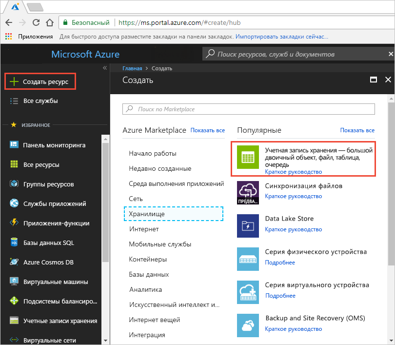
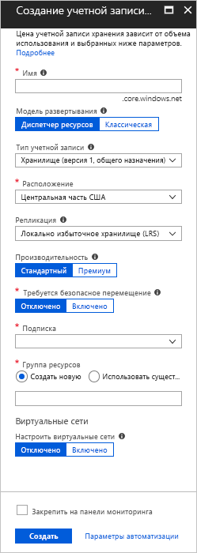
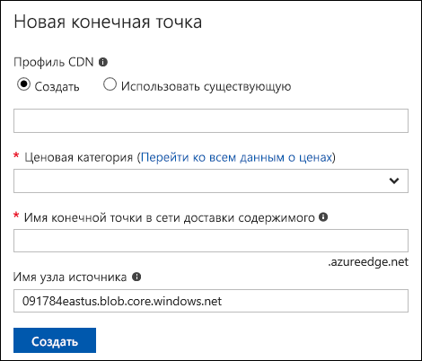
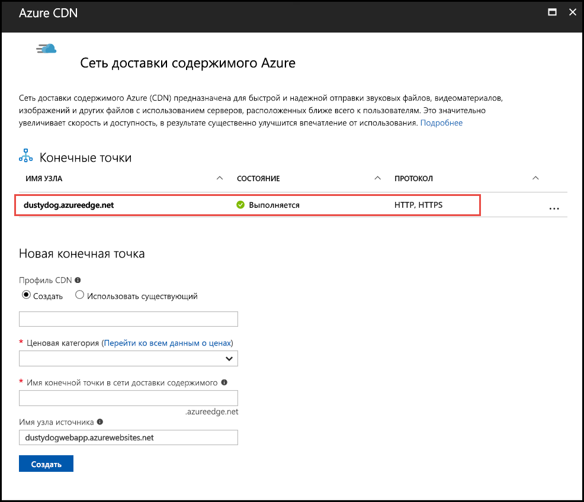
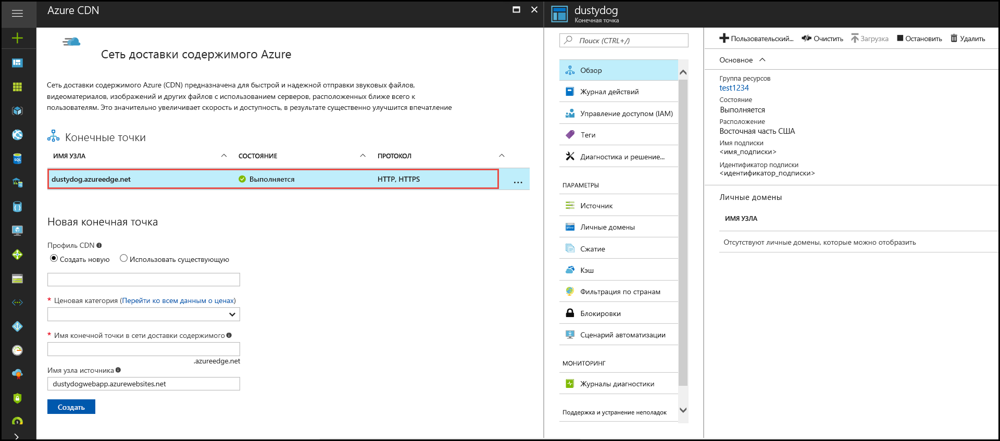

# Краткое руководство по интеграции учетной записи хранения Azure с Azure CDN
С помощью этого краткого руководства вы настроите для [сети доставки содержимого Azure (CDN)](cdn-overview.md) кэширование содержимого из хранилища Azure. Azure CDN предлагает разработчикам глобальное решение по доставке больших объемов содержимого. Она может кэшировать большие двоичные объекты и статическое содержимое вычислительных экземпляров на физических узлах в США, Европе, Азии, Австралии и Южной Америке.

[!INCLUDE [quickstarts-free-trial-note](../../includes/quickstarts-free-trial-note.md)]

## Войдите на портал Azure.
Войдите на [портал Azure](https://portal.azure.com) со своей учетной записью Azure.

## Создание учетной записи хранения
Чтобы создать учетную запись хранения для подписки Azure, воспользуйтесь следующей процедурой. Учетная запись хранения предоставляет доступ к службам хранилища Azure. Учетная запись хранения представляет собой высший уровень пространства имен для доступа ко всем компонентам службы хранилища Azure: большой двоичный объект, хранилище очередей и хранилище таблиц Azure. Дополнительную информацию см. в статье [Введение в хранилище Microsoft Azure](../storage/common/storage-introduction.md).

Чтобы создать учетную запись хранения, вы должны быть администратором службы или соадминистратором для связанной подписки.

Есть несколько способов, которые можно использовать для создания учетной записи хранения. В их число входят портал Azure и Powershell. В этом руководстве показано, как это сделать с помощью портала Azure.   

**Создание учетной записи хранения для подписки Azure**

1. На портале Azure слева вверху выберите **Создать ресурс**. 

    Появится панель **Создание**.

2. Выберите **Хранилище**, а затем **Учетная запись хранения — BLOB-объект, файл, таблица, очередь**.
    
    

    Появится область **Создать учетную запись хранения**.   

    

3. В поле **Имя** введите имя дочернего домена. Запись может содержать от 3 до 24 строчных букв и цифр.
   
    Это значение станет именем узла в URI, который используется для адресации ресурсов большого двоичного объекта, очереди и таблицы в подписке. Для обращения к ресурсу контейнера в хранилище BLOB-объектов используйте URI в следующем формате:
   
    http://*&lt;StorageAcountLabel&gt;*.blob.core.windows.net/*&lt;мой_контейнер&gt;*

    где *&lt;StorageAccountLabel&gt;* указывает на значение, введенное в поле **Имя**.
   
    > [!IMPORTANT]    
    > Метка URL-адреса образует поддомен URI учетной записи хранения и должна быть уникальной на уровне всех размещенных служб в Azure.
   
    Это значение также используется как имя учетной записи хранения на портале или при доступе к этой учетной записи программным способом.
    
4. Для остальных параметров используйте значения, указанные в следующей таблице:

    | Параметр  | Значение |
    | -------- | ----- |
    | **Модель развертывания** | Используйте значение по умолчанию. |
    | **Account kind** (Тип учетной записи) | Используйте значение по умолчанию. |
    | **Местоположение.**    | В раскрывающемся списке выберите **Central US**. |
    | **Репликация** | Используйте значение по умолчанию. |
    | **Производительность** | Используйте значение по умолчанию. |
    | **Secure transfer required** (Требуется безопасное перемещение) | Используйте значение по умолчанию. |
    | **Подписка** | В раскрывающемся списке выберите подписку Azure. |
    | **Группа ресурсов** | Щелкните **Создать** и введите *my-resource-group-123* в качестве имени группы ресурсов. Оно должно быть глобально уникальным. Если это имя уже используется, вы можете ввести другое имя или в разделе **Use existing** (Использовать существующее) выбрать в раскрывающемся списке **my-resource-group-123**.  Дополнительные сведения о группах ресурсов см. в статье [Общие сведения об Azure Resource Manager](../azure-resource-manager/resource-group-overview.md#resource-groups).| 
    | **Настройка виртуальных сетей** | Используйте значение по умолчанию. |  
    
5. Чтобы закрепить созданную учетную запись хранения на панели мониторинга, установите флажок **Закрепить на панели мониторинга**.
    
6. Нажмите кнопку **Создать**. Создание учетной записи хранения может занять несколько минут.

## Включение Azure CDN для учетной записи хранения

Вы можете включить Azure CDN непосредственно из учетной записи хранения. Если требуется указать дополнительные параметры для конечной точки CDN, например тип оптимизации, вы можете создать конечную точку CDN или профиль CDN с помощью [расширения Azure CDN](cdn-create-new-endpoint.md).

1. Выберите учетную запись хранения на панели мониторинга, а затем выберите **Сеть доставки содержимого Azure** на левой панели. Если кнопка **Сеть доставки содержимого Azure** не отображается сразу, попробуйте ввести CDN в поле **Поиск** на панели слева.
    
    Откроется страница **Azure CDN**.

    
    
2. Создайте конечную точку, указав необходимые сведения из следующей таблицы.

    | Параметр  | Значение |
    | -------- | ----- |
    | **Профиль CDN** | Выберите **Создать** и введите имя профиля *my-cdn-profile-123*. Это имя должно быть глобально уникальным. Если оно уже используется, введите другое имя.  |
    | **Ценовая категория** | В раскрывающемся списке выберите **Verizon уровня "Стандартный"**. |
    | **Имя конечной точки CDN** | В качестве имени узла конечной точки введите *my-endpoint-123*. Это имя должно быть глобально уникальным. Если оно уже используется, введите другое имя. Это имя будет использоваться для доступа к кэшированным ресурсам в домене _&lt;имя конечной точки&gt;_.azureedge.net. По умолчанию созданная конечная точка CDN использует имя узла учетной записи хранения как сервер-источник.|

3. Нажмите кнопку **Создать**. Созданная конечная точка отображается в списке конечных точек.

    

## Включение дополнительных функций CDN
На странице **Сеть доставки содержимого Azure** для учетной записи хранения выберите в списке конечную точку CDN, чтобы открыть страницу конфигурации конечной точки CDN. Н этой странице вы можете включить дополнительные функции CDN для доставки, например [сжатие](cdn-improve-performance.md), [кэширование строк запросов](cdn-query-string.md) и [геофильтрацию](cdn-restrict-access-by-country.md). 
    

## Получение доступа к содержимому CDN
Для доступа к кэшированному содержимому в сети CDN воспользуйтесь URL-адресом CDN, отображаемым в портале. Адрес для кэшированного большого двоичного объекта будет иметь следующий вид:

http://<*имя_конечной_точки*\>.azureedge.net/<*общедоступный_контейнер*\>/<*имя_большого_двоичного_объекта*\>

> [!NOTE]
> Когда вы включите доступ Azure CDN к учетной записи хранения, ко всем общедоступным объектам будут применяться кэширование CDN POP. После изменения объекта, который находится в кэше CDN, новое содержимое будет недоступно через Azure CDN до следующего обновления содержимого, например по истечении срока жизни кэшированного содержимого.

## Удаление содержимого из Azure CDN
Если кэширование объекта в сети CDN Azure больше не требуется, можно выполнить одно из следующих действий:

* Сделать контейнер закрытым, а не общедоступным. Дополнительные сведения см. в статье [Управление анонимным доступом на чтение к контейнерам и большим двоичным объектам](../storage/blobs/storage-manage-access-to-resources.md).
* Отключить или удалить конечную точку CDN с помощью портала Azure.
* Изменить размещенную службу, чтобы она перестала отвечать на запросы объекта.

Объект, кэшированный в сети Azure CDN, сохраняется в кэше до истечения срока жизни для этого объекта или до [очистки](cdn-purge-endpoint.md) конечной точки. По истечении срока действия Azure CDN проверит, действует ли еще конечная точка CDN и возможен ли анонимный доступ к этому объекту. Если это не так, объект больше не будет кэшироваться.

## Очистка ресурсов
На предыдущих шагах вы создали профиль и конечную точку CDN в группе ресурсов. Сохраните эти ресурсы, чтобы перейти к разделу [Дополнительная информация](#next-steps) и узнать, как добавить личный домен к конечной точке. Но если в будущем эти ресурсы вам не понадобятся, их можно удалить, удалив группу ресурсов, чтобы избежать дополнительных затрат:

1. На портале Azure в меню слева щелкните **Группы ресурсов**, а затем выберите **my-resource-group-123**.

2. На странице **Группа ресурсов** выберите **Удалить группу ресурсов**, в текстовое поле введите *my-resource-group-123* и щелкните **Удалить**.

    В результате удалится группа ресурсов, профиль и конечная точка, которые вы создали с помощью этого краткого руководства.

3. Чтобы удалить учетную запись хранилища, выберите ее на панели мониторинга и щелкните **Удалить** в меню сверху.

## Дополнительная информация
Дополнительные сведения о добавлении личного домена к конечной точке CDN см. в следующем руководстве:

> [!div class="nextstepaction"]
> [Руководство. Добавление личного домена к конечной точке CDN Azure](cdn-map-content-to-custom-domain.md)

