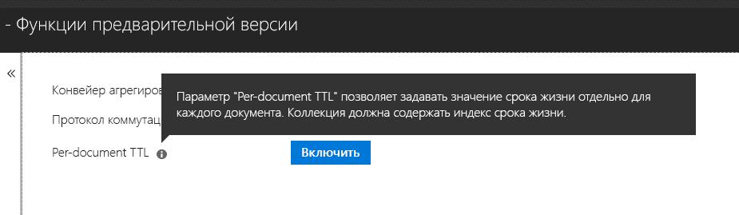

# <a name="expire-data-in-azure-cosmos-db-mongodb-api"></a>Прекращение хранения данных в API MongoDB Azure Cosmos DB

Функция срока жизни позволяет автоматически прекращать хранение данных в базе данных. В API MongoDB можно настраивать срок жизни Azure Cosmos DB. Поддерживаются два режима: установка срока жизни по умолчанию для всей коллекции и выбор отдельных значений срока жизни для каждого документа. В API MongoDB индексы срока жизни и значения срока жизни для документов управляются с помощью [той же логики, что и в Azure Cosmos DB](../cosmos-db/mongodb-indexing.md).

## <a name="ttl-indexes"></a>Индексы срока жизни
Чтобы установить срок жизни для всей коллекции, нужно создать [индекс срока жизни](../cosmos-db/mongodb-indexing.md). Это индекс для поля _ts со значением expireAfterSeconds.

Пример:
```JavaScript
globaldb:PRIMARY> db.coll.createIndex({"_ts":1}, {expireAfterSeconds: 10})
{
        "_t" : "CreateIndexesResponse",
        "ok" : 1,
        "createdCollectionAutomatically" : true,
        "numIndexesBefore" : 1,
        "numIndexesAfter" : 4
}
```

С помощью приведенной выше команды создается индекс с функцией срока жизни. После создания индекса в базе данных будут автоматически удаляться все документы в этой коллекции, которые не были изменены за последние 10 секунд. 

> [!NOTE]
> **_ts** является специфическим полем Cosmos DB и не доступно клиентам MongoDB. Это зарезервированное (системное) свойство, содержащее метку времени последнего изменения документа.
>
    
Дополнительный пример на C#: 
```C# 
var options = new CreateIndexOptions {ExpireAfter = TimeSpan.FromSeconds(10)}; 
var field = new StringFieldDefinition<BsonDocument>("_ts"); 
var indexDefinition = new IndexKeysDefinitionBuilder<BsonDocument>().Ascending(field); 
await collection.Indexes.CreateOneAsync(indexDefinition, options); 
``` 

## <a name="set-time-to-live-value-for-a-document"></a>Установка срока жизни для документа 
Также есть возможность установить срок жизни для документа. Документы должны содержать свойство ttl (в нижнем регистре) корневого уровня. Кроме того, для коллекции нужно создать индекс срока жизни, как описано выше. Значения срока жизни, заданные для отдельных документов, переопределяют значение срока жизни для коллекции.

Значение срока жизни должно быть типа int32, значением типа int64, которое помещается в значение типа int32 либо значением double без десятичной части, которое помещается в значение типа int32. Значения срока жизни, не соответствующие этим характеристикам, допускаются, но не рассматриваются как значимые.

Значение срока жизни для документа является необязательным. В коллекцию можно вставлять и документы без значения срока жизни.  В этом случае будет применяться значение срока жизни для коллекции. 

Для указанных ниже документов заданы допустимые значения срока жизни. После вставки документов значения их срока жизни переопределяют значение срока жизни для коллекции. Следовательно, документы будут удалены через 20 секунд.  

```JavaScript 
globaldb:PRIMARY> db.coll.insert({id:1, location: "Paris", ttl: 20.0}) 
globaldb:PRIMARY> db.coll.insert({id:1, location: "Paris", ttl: NumberInt(20)}) 
globaldb:PRIMARY> db.coll.insert({id:1, location: "Paris", ttl: NumberLong(20)}) 
```

Для указанных ниже документов заданы недопустимые значения срока жизни. Документы будут вставлены, но значения их срока жизни не будут применяться. Следовательно, документы будут удалены через 10 секунд из-за истечения срока жизни, заданного для коллекции. 

```JavaScript 
globaldb:PRIMARY> db.coll.insert({id:1, location: "Paris", ttl: 20.5}) //TTL value contains non-zero decimal part. 
globaldb:PRIMARY> db.coll.insert({id:1, location: "Paris", ttl: NumberLong(2147483649)}) //TTL value is greater than Int32.MaxValue (2,147,483,648). 
``` 

## <a name="how-to-activate-the-per-document-ttl-feature"></a>Как активировать функцию срока жизни на уровне документа
Функцию срока жизни на уровне документа можно активировать с помощью учетной записи API MongoDB на вкладке "Предварительная версия функций" на портале Azure.

 

## <a name="next-steps"></a>Дополнительная информация
* [Автоматическое завершение срока действия данных в коллекциях Azure Cosmos DB с использованием срока жизни](../cosmos-db/time-to-live.md)
* [Индексирование в Azure Cosmos DB: API MongoDB](../cosmos-db/mongodb-indexing.md)
