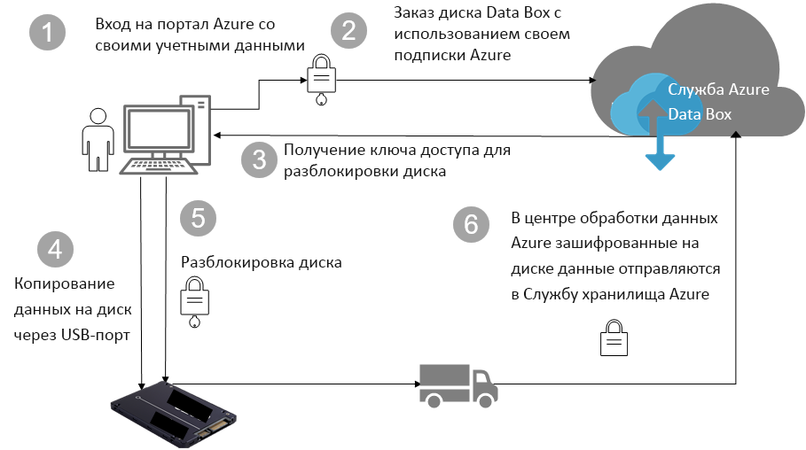

# Безопасность работы диска Azure Data Box и защита данных (предварительная версия)

В этой статье описываются функции безопасности диска Azure Data Box, которые помогают защитить каждый компонент решения Data Box и данные, хранимые на нем. 

> [!IMPORTANT]
> Диск Data Box находится в режиме предварительной версии. Изучите [Дополнительные условия использования Предварительных выпусков Microsoft Azure](https://azure.microsoft.com/support/legal/preview-supplemental-terms/), прежде чем развертывать это решение.

## Поток данных через компоненты

Решение Microsoft Azure Data Box состоит из четырех основных компонентов, которые взаимодействуют друг с другом.

- **Служба Azure Data Box, размещенная в Azure** — это служба управления, с помощью которой можно заказывать диски, настраивать их, а затем отслеживать заказы до их завершения.
- **Диски Data Box** — это реальные диски, которые отправляются для импорта локальных данных в Azure. 
- **Клиенты или серверы, подключенные к дискам** — это клиенты инфраструктуры, которые подключаются к диску Data Box через USB-порт и содержат данные, которые необходимо защитить.
- **Облачное хранилище** – расположение в облаке Azure, где хранятся данные. Обычно это учетная запись хранения, связанная с созданным ресурсом Azure Data Box.

На следующей схеме показан поток данных через решение Azure Data Box Disk от локального компьютера в хранилище Azure.

## Функции безопасности

Диск Data Box предоставляет безопасное решение для защиты данных, гарантируя, что только авторизованные субъекты могут просматривать, изменять или удалять данные. Функции безопасности этого решения предназначены для диска и для связанной службы, обеспечивающих безопасность хранимых на них данных. 

### Защита диска Data Box

Защита диска Data Box осуществляется с помощью следующих функций.

- BitLocker AES-128 бит обеспечивает шифрование диска в любое время.
- Возможность безопасного обновления дисков.
- Диски поставляются в заблокированном состоянии и могут быть разблокированы только с помощью средства разблокировки диска Data Box. Средство разблокировки доступно на портале службы Data Box Disk.

### Защита данных диска Data Box

Входные и выходные данные диска Data Box защищены следующими функциями.

- Постоянное шифрование данных с помощью BitLocker. 
- Безопасное удаление данных с диска после завершения передачи данных в Azure. Удаление данных осуществляется в соответствии со стандартами NIST 800-88r1.

### Защита службы Data Box

Служба Data Box защищена с помощью следующих функций.

- Для доступа к службе Data Box Disk организации необходимо иметь подписку Azure, включающую диск Data Box. Подписка обеспечивает доступ к функциям, предоставляемым на портале Azure.
- Так как служба Data Box размещается в Azure, она защищена средствами безопасности Azure. Дополнительные сведения о функциях безопасности, предоставляемых Microsoft Azure, см. в [центре управления безопасностью Microsoft Azure](https://www.microsoft.com/TrustCenter/Security/default.aspx). 
- Диск Data Box хранит ключ доступа к диску, который используется для разблокировки диска в службе. 
- Служба Data Box Disk хранит сведения о заказе и состоянии в службе. Эта информация удаляется при удалении самого заказа. 

## Управление персональными данными

[!INCLUDE [GDPR-related guidance](../../includes/gdpr-intro-sentence.md)]

Диск Azure Data Box сохраняет и отображает личные сведения в следующих ключевых экземплярах службы.

- **Параметры уведомлений**. Когда создается заказ, адреса электронной почты пользователей настраиваются в параметрах уведомлений. Эти сведения может просматривать администратор. Эта информация удаляется службой, когда задание выполнено или когда заказ удаляется.

- **Сведения о заказе**. После создания заказа адрес доставки, электронная почта, контактная информация пользователей хранятся на портале Azure. Сохраненная информация включает следующее.

    - имя контактного лица;
    - номер телефона.
    - Email
    - почтовый адрес;
    - City
    - почтовый индекс;
    - Состояние
    - страна, область, край, округ, регион;
    - идентификатор диска;
    - номер счета перевозчика;
    - номер отслеживания доставки.

    Сведения о заказе удаляются службой Data Box после завершения задания или при удалении заказа.

- **Адрес доставки**. После размещения заказа служба Data Box предоставляет адрес доставки сторонним операторам, таким как UPS или DHL. 

Дополнительные сведения см. в политике конфиденциальности Майкрософт в [центре управления безопасностью](https://www.microsoft.com/trustcenter).

## Дополнительная информация

- Знакомство с [требованиями диска Data Box](data-box-disk-system-requirements.md).
- Объяснение [ограничений диска Data Box](data-box-disk-limits.md).
- Быстрое развертывание [диска Azure Data Box](data-box-disk-quickstart-portal.md) на портале Azure.
