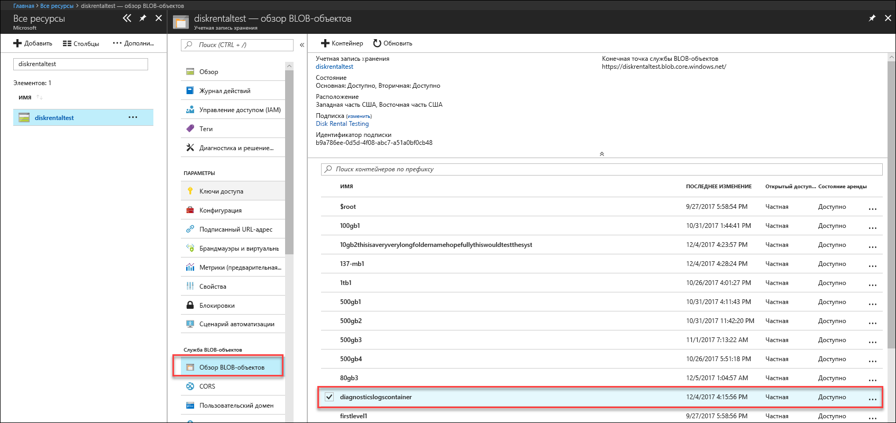
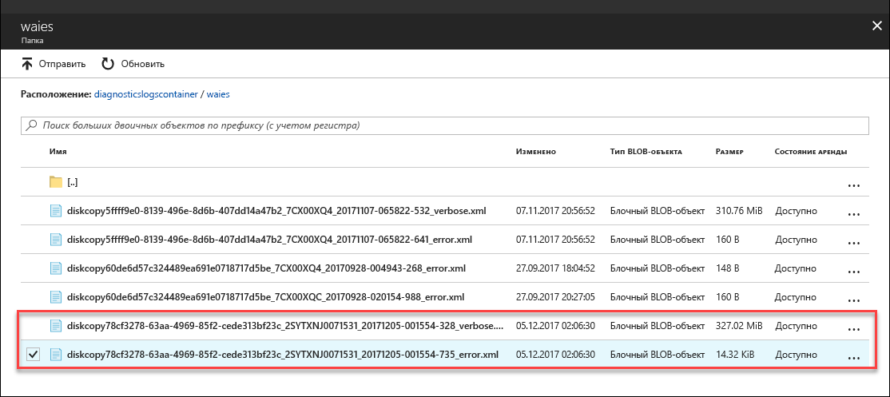

# Устранение неполадок в диске Azure Data Box (предварительная версия)

Данная статья относится к выпуску предварительной версии Microsoft Azure Data Box. В этой статье описываются некоторые сложные рабочие процессы и задачи управления, которые могут выполняться в Data Box и диске Data Box. 

Для управления Data Box можно использовать пользовательский интерфейс службы Data Box (это пользовательский интерфейс портала) и локальный пользовательский веб-интерфейс устройства. Управлять диском Data Box можно только через портал Azure. В этой статье речь идет о задачах, выполняемых с использованием портала Azure. Используйте портал Azure для управления заказами, управления устройствами и отслеживания состояния заказа, когда он переходит на этап терминала.

В этой статье содержатся руководства, позволяющие выполнить следующие задачи:

- Загрузка журналов диагностики
- Запрос журналов действий

> [!IMPORTANT]
> Data Box находится в режиме предварительной версии. Изучите [Дополнительные условия использования Предварительных выпусков Microsoft Azure](https://azure.microsoft.com/support/legal/preview-supplemental-terms/), прежде чем развертывать это решение.

## Загрузка журналов диагностики

Если во время процесса копирования данных имеются какие-либо ошибки, портал покажет путь к папке, в которой находятся журналы диагностики. 

Журналы диагностики делятся на две группы.
- Журналы ошибок
- Журналы подробных сведений  

Чтобы перейти к пути для копирования журнала, перейдите в учетную запись хранения, связанную с заказом Data Box. 

1.  Перейдите в **Общие > Сведения о заказе** и отметьте учетную запись хранения, связанную с заказом.
 

2.  Перейдите в раздел **Все ресурсы** и найдите учетную запись хранения, указанную на предыдущем шаге. Выберите и щелкните учетную запись хранения.

    

3.  Перейдите в раздел **Служба BLOB-объектов > Просмотреть BLOB-объекты** и найдите BLOB-объект, соответствующий учетной записи хранения. Перейдите к **diagnosticslogcontainer > waies**. 

    

    Вы увидите как журналы ошибок, так и подробные журналы для копирования данных. Выберите и щелкните каждый файл, а затем загрузите локальную копию.

## Запрос журналов действий

Журналы действий используются для поиска ошибки при устранении неполадок, а также для наблюдения за тем, как пользователь организации изменяет ресурс. С помощью журналов действий можно определить:

- Какие операции выполнялись с ресурсами в подписке.
- Сторона, инициировавшая операцию. 
- Когда была выполнена операция.
- Состояние операции.
- Значения других свойств, которые могут помочь в анализе операции.

Журнал действий содержит все операции записи (PUT, POST, DELETE), выполняемые с ресурсами, но не содержит операций чтения (таких как GET). 

Журналы изменений сохраняются в течение 90 дней. Вы можете запросить любой диапазон дат, при условии, что дата начала не старше 90 дней в прошлом. Также можно фильтровать один из встроенных запросов в аналитических сведениях. Например, щелкните ошибку, а затем выберите и щелкните конкретные ошибки, чтобы понять основную причину.

## Ошибки средства разблокировки диска Data Box

| Сообщение об ошибке/Режимы работы средства      | Рекомендации                                                                                               |
|-------------------------------------------------------------------------------------------------------------------------------------|------------------------------------------------------------------------------------------------------|
| None  Аварийное завершение средства разблокировки диска Data Box.                                                                            | Bitlocker не установлен. Убедитесь, что на главном компьютере, на котором установлено средство разблокировки диска Data Box, установлен BitLocker.                                                                            |
| Текущая платформа .NET не поддерживается. Поддерживаемые версии — 4.5 и более поздние.  Средство завершит свою работу с сообщением.  | Платформа .NET версии 4.5 не установлена. Установите .NET 4.5 или более поздней версии на главном компьютере, на котором запущено средство разблокировки диска Data Box.                                                                            |
| Не удалось разблокировать или проверить какие-либо тома. Обратитесь в службу технической поддержки Майкрософт.    Средство не может разблокировать или проверить заблокированный диск. | Средству не удалось разблокировать ни один из разблокированных дисков с помощью поставляемого ключа доступа. Обратитесь в службу поддержки Майкрософт, чтобы узнать, что делать дальше.                                                |
| Следующие тома разблокированы и проверены.  Том букв диска: E: Не удалось разблокировать все тома со следующими ключами доступа: werwerqomnf, qwerwerqwdfda   Средство разблокирует некоторые диски и перечислит успешные и неудачные буквы дисков.| Частично удалось. Не удалось разблокировать некоторые диски с помощью поставляемого ключа доступа. Обратитесь в службу поддержки Майкрософт, чтобы узнать, что делать дальше. |
| Не удалось найти заблокированные тома. Проверьте, что диск, полученный от Microsoft, подключен правильно и находится в заблокированном состоянии.          | Средству не удается найти заблокированные диски. Либо диски уже разблокированы или не обнаружены. Убедитесь, что диски подключены и заблокированы.                                                           |
| Неустранимая ошибка: недопустимый параметр Имя параметра: invalid_arg Использование. DataBoxDiskUnlock /Ключи доступа:<passkey_list_separated_by_semicolon>  Пример: DataBoxDiskUnlock /Ключи доступа:passkey1; passkey2; passkey3 Пример: DataBoxDiskUnlock /SystemCheck Пример: DataBoxDiskUnlock /Help  /PassKeys: Получите этот ключ доступа из заказа диска Azure DataBox Disk. Ключ доступа разблокирует диски. /Help: Этот параметр предоставляет справку об использовании командлета и примеры. /SystemCheck: Этот параметр проверяет, соответствует ли система требованиям для запуска средства.  Нажмите любую клавишу, чтобы выйти. | Недопустимый ввод параметра. Единственными допустимыми параметрами являются /SystemCheck, /PassKey и /Help.                                                                            |
## Дополнительная информация

- Узнайте, как [управлять диском Data Box с помощью портала Azure](data-box-portal-ui-admin.md).
