# Администрирование Диска Data Box (предварительная версия) с помощью портала Azure

Рекомендации, приведенные в этой статье, применяются к диску Microsoft Azure Data Box на время действия предварительной версии. В этой статье описываются некоторые сложные рабочие процессы и задачи управления, которые могут выполняться на диске Data Box. 

Вы можете управлять диском Data Box на портале Azure. В этой статье речь идет о задачах, выполняемых с использованием портала Azure. На портале Azure можно управлять заказами, администрировать диски и отслеживать состояние заказа, пока он не перейдет на последнюю стадию.

> [!IMPORTANT]
> Диск Data Box находится в режиме предварительной версии. Прежде чем развертывать это решение, просмотрите [условия использования Azure для предварительной версии](https://azure.microsoft.com/support/legal/preview-supplemental-terms/).

## Отмена заказа

Возможно, после размещения заказа вам нужно будем отменить его по различным причинам. Его можно отменить только перед началом подготовки диска. После подготовки дисков и обработки заказа отменить его невозможно. 

Выполните следующие действия для отмены заказа.

1.  Перейдите на вкладку **Обзор > Отмена**. 

    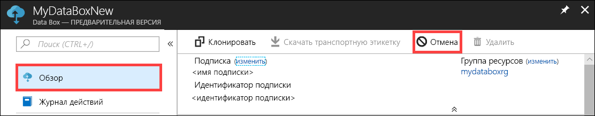

2.  Введите причину для отмены заказа.  

    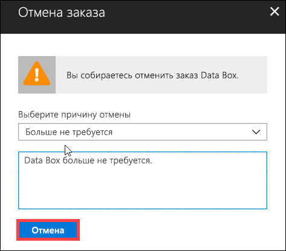

3.  После отмены заказа на портале обновляется состояние заказа и отображается значение **Отменено**.

    

Вы не получите уведомление по электронной почте об отмене заказа.

## Клонирование заказа

Клонирование полезно в определенных ситуациях. Например, пользователь использовал диск Data Box для передачи данных. Так как поступает все больше данных, существует потребность в дополнительных дисках для передачи этих данных в Azure. В этом случае заказ можно просто клонировать.

Выполните следующие действия для клонирования заказа.

1.  Перейдите на вкладку **Обзор > Клонировать**. 

    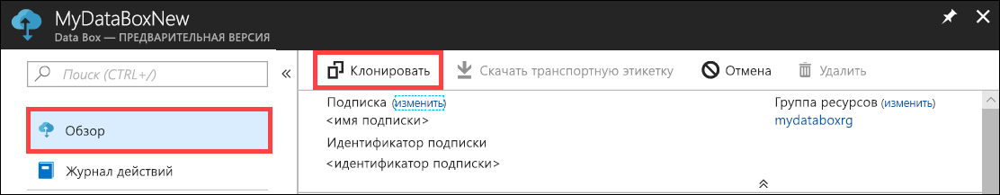

2.  Все сведения о заказе остаются теми же. Имя заказа — это первоначальное имя с добавлением *-Clone*. Установите флажок, чтобы подтвердить, что вы просмотрели сведения о конфиденциальности. Нажмите кнопку **Создать**.    

Клон создается в течение нескольких минут, после чего портал обновляется и отображается новый заказ.

[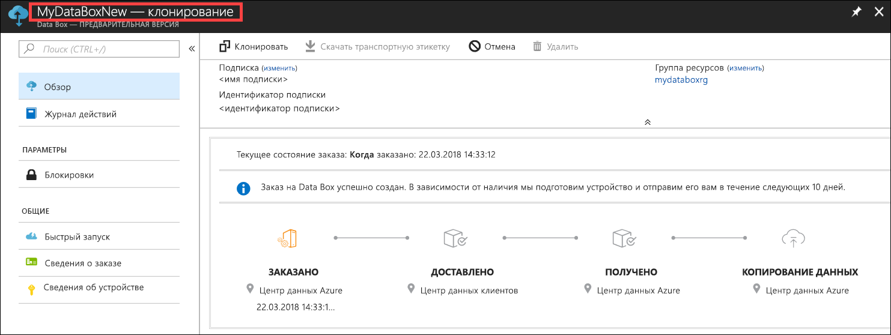](media/data-box-portal-ui-admin/clone-order3.png#lightbox) 

## Удаление заказа

Вы можете удалить заказ после его обработки. Заказ содержит ваши личные сведения, такие как имя, адрес и контактные данные. При удалении заказа удаляются и личные данные.

Можно удалить только завершенные или отмененные заказы. Чтобы удалить заказ, выполните указанные ниже действия.

1. Щелкните **Все ресурсы**. Найдите свой заказ.

    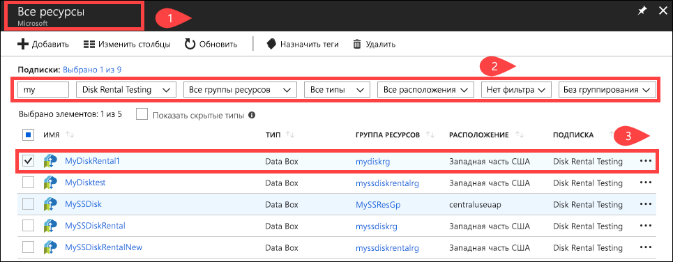

2. Щелкните заказ, который необходимо удалить, и перейдите на вкладку **Обзор**. На панели команд нажмите кнопку **Удалить**.

    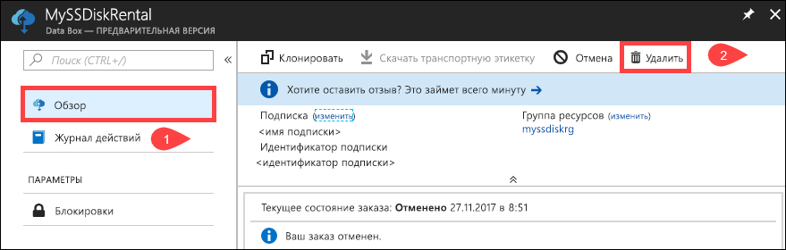

3. Когда будет предложено подтвердить удаление, введите имя заказа. Нажмите кнопку **Delete**(Удалить).

     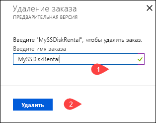

## Скачивание транспортной этикетки

Если транспортная этикетка для возврата, поставляемая с дисками, будет потеряна, вам понадобится скачать ее. 

Выполните следующие действия, чтобы скачать транспортную этикетку.
1.  Выберите **Обзор > Скачать транспортную этикетку**. Этот параметр доступен только после отправки диска. 

    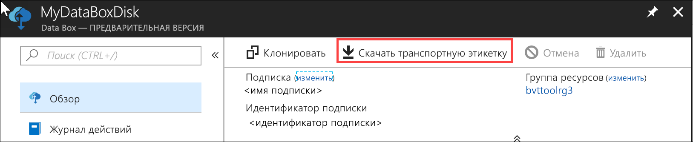

2.  Загрузится новая транспортная этикетка для возврата, которая выглядит следующим образом. Сохраните этикетку, распечатайте ее и прикрепите к возвращаемой посылке.

    

## Изменение адреса поставки

Вам может понадобиться изменить адрес поставки после размещения заказа. Эта возможность доступна только до отправки диска. После отправки диска этот параметр больше недоступен.

Выполните следующие действия для изменения адреса доставки.

1. Выберите **Сведения о заказе > Изменить адрес поставки**.

    

2. Теперь можно изменить адрес поставки и сохранить изменения.

    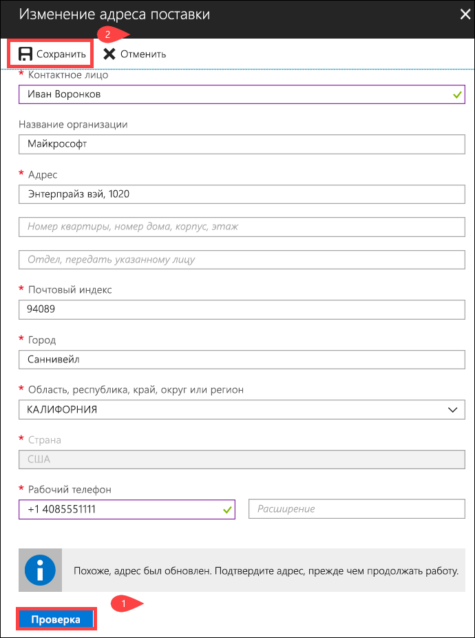

## Изменение сведений об уведомлении

Вам может понадобиться изменить пользователей, которым необходимо отправлять сообщения о состоянии заказа. Например, пользователя нужно уведомлять о доставке или получении диска. Другого пользователя может понадобиться уведомить о завершении копирования данных, чтобы он мог убедиться, что данные находятся в учетной записи хранения Azure, перед удалением их из источника. В таких случаях можно изменить сведения об уведомлении.

Выполните следующие действия, чтобы изменить сведения об уведомлении.

1. Перейдите к **Сведения о заказе > Изменить сведения об уведомлении**.

    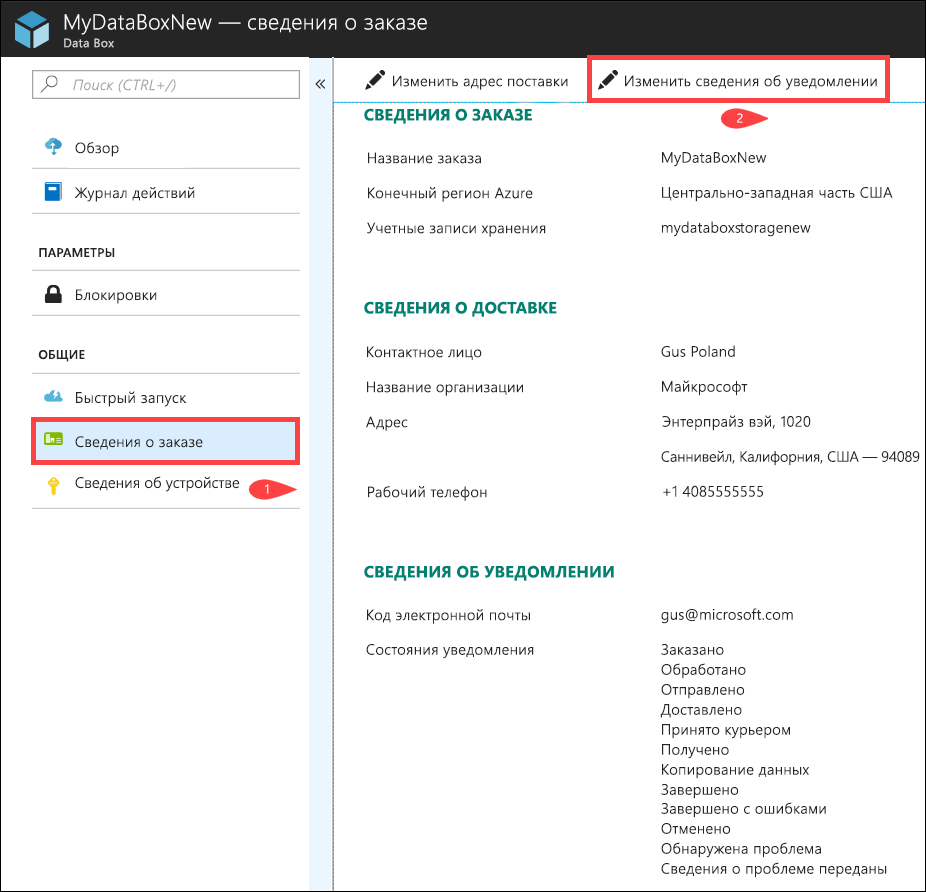

2. Теперь можно изменить сведения об уведомлении, а затем сохранить изменения.
 
    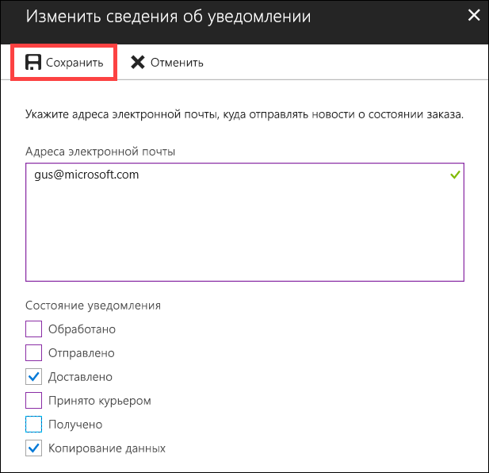

## Просмотр состояния заказа

|Состояние заказа |ОПИСАНИЕ |
|---------|---------|
|Заказано     | Заказ успешно размещен.   Если диски недоступны, вы получите уведомление.  Если диски доступны, корпорация Майкрософт определяет диск для посылки и подготавливает коробку с ним.        |
|Обработано     | Обработка заказа завершена.   Во время обработки заказов выполняются следующие действия:<li>диски шифруются с использованием AES-128 BitLocker; </li> <li>диск Data Box блокируется для предотвращения неавторизованного доступа;</li><li>во время этого процесса создается ключ доступа, который разблокирует диски.</li>        |
|Отправлено     | Заказ отправлен. Вы должны получить заказ в течение 1–2 дней.        |
|Доставлено     | Заказ был доставлен на указанный адрес.        |
|Принято курьером     |Ваша обратная отправка была получена курьером.   После получения посылки в центре обработки данных Azure данные будут автоматически отправлены в Azure.         |
|Received     | Диски получены в центре обработки данных Azure. Скоро начнется копирование данных.        |
|Копирование данных     |Выполняется копирование данных.  Дождитесь завершения копирования данных.         |
|Завершено       |Заказ успешно выполнен.  Убедитесь, что данные находятся в Azure, прежде чем удалять локальные данные с серверов.         |
|Завершено с ошибками| Копирование данных выполнено, но с ошибками.   Просмотрите журналы копирования, используя путь, указанный на вкладке **Обзор**. Дополнительные сведения см. в разделе о [загрузке журналов диагностики](data-box-disk-troubleshoot.md#download-diagnostic-logs).   |
|Canceled            |Ваш заказ отменен.   Либо вы отменили заказ, либо произошла ошибка и служба отменила заказ.     |

## Дополнительная информация

- См. сведения об [устранении неполадок с диском Data Box Azure](data-box-disk-troubleshoot.md).
