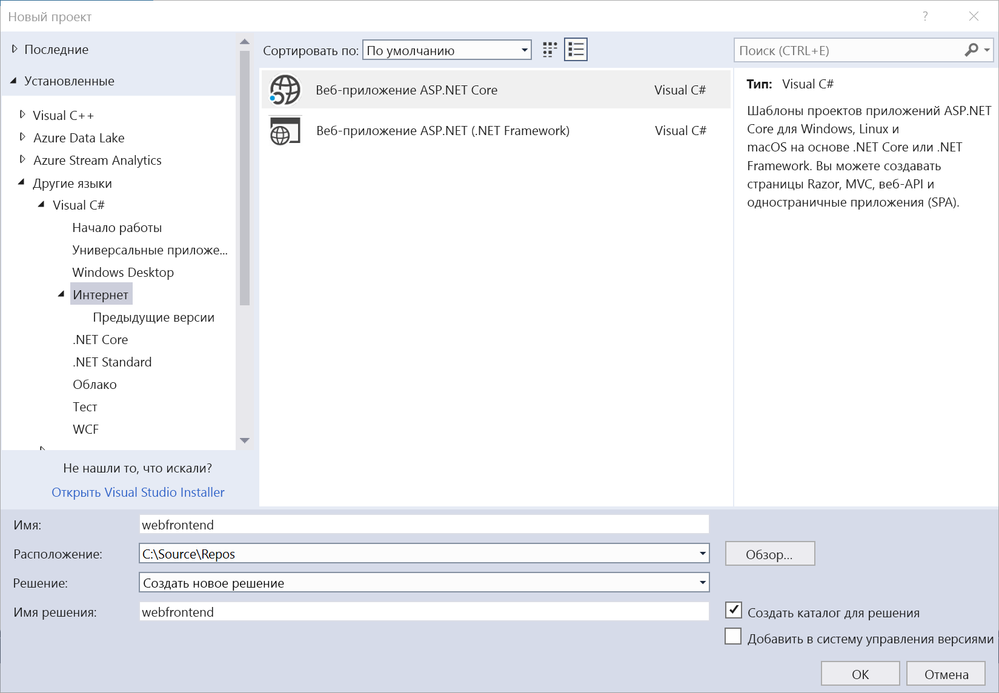
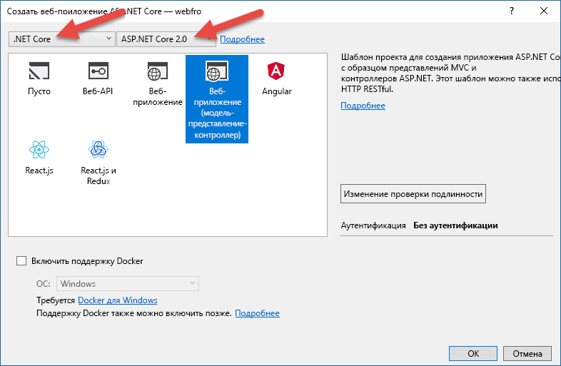
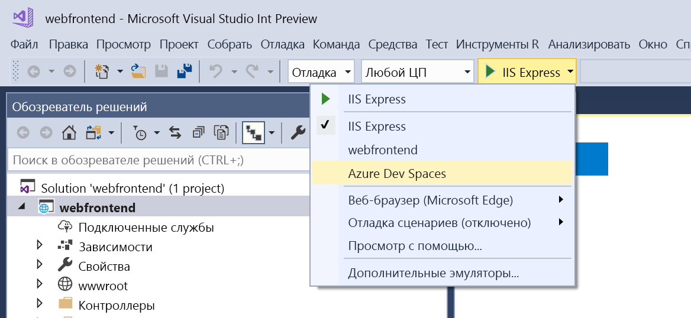
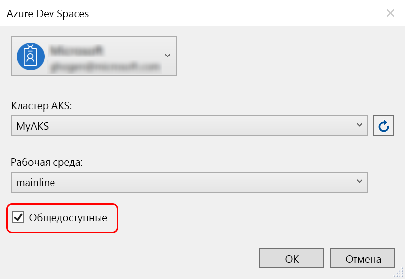
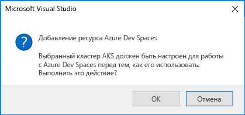
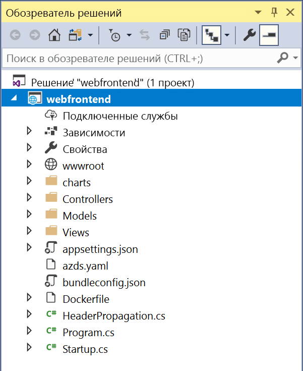

# Начало работы в Azure Dev Spaces и .NET Core и Visual Studio

Из этого руководства вы узнаете, как выполнить следующие задачи:

- Настройка Azure Dev Spaces с помощью управляемого кластера Kubernetes в Azure.
- итеративно разрабатывать код в контейнерах с помощью Visual Studio.
- независимо разработать две отдельные службы и использовать обнаружение службы DNS Kubernetes для вызова другой службы;
- эффективно разработать и протестировать код в командной среде.

[!INCLUDE]

[!INCLUDE]

## Получение средств Visual Studio
1. Установите последнюю версию [Visual Studio 2017](https://www.visualstudio.com/vs/).
1. Убедитесь, что выбрана следующая рабочая нагрузка в установщике Visual Studio:
    * ASP.NET и веб-разработка.
1. Установка [Средств Visual Studio для Kubernetes](https://aka.ms/get-azds-visualstudio)

## Создание веб-приложения для работы в контейнере

В этом разделе вы создадите веб-приложение ASP.NET Core и запустите его в контейнере в Kubernetes.

### Создание веб-приложения ASP.NET

Создайте новый проект в Visual Studio 2017. В настоящее время проект должен быть **веб-приложением ASP.NET Core**. Присвойте проекту имя **webfrontend**.

Выберите шаблон **Веб-приложение (модель-представление-контроллер)** и выберите **.NET Core** и **ASP.NET Core 2.0** в двух раскрывающихся списках в верхней части диалогового окна. Нажмите кнопку **ОК** , чтобы создать проект.

### Включение Dev Spaces для кластера AKS

В только что созданном проекте в раскрывающемся списке параметров запуска выберите **Azure Dev Spaces**, как показано ниже.

В появившемся диалоговом окне убедитесь, что вы вошли в систему с соответствующей учетной записью, а затем выберите существующий кластер Kubernetes.

В раскрывающемся списке **Пространство** оставьте пока значение по умолчанию (`default`). Позже вы узнаете больше об этом параметре. Установите флажок **Publicly Accessible** (Общедоступное), чтобы веб-приложение было доступно через общедоступную конечную точку. Этот параметр не является обязательным, но он будет полезен для демонстрации некоторых концепций далее в этом пошаговом руководстве. Но не волнуйтесь, вы в любом случае сможете выполнить отладку веб-сайта с помощью Visual Studio.

Нажмите кнопку **ОК**, чтобы выбрать или создать кластер.

Если выбран кластер, который еще не был настроен для работы с Azure Dev Spaces, вы увидите сообщение с вопросом, хотите ли вы настроить его.

Нажмите кнопку **ОК**.

 Эта задача запустится в фоновом режиме. Выполнение может занять несколько минут. Чтобы увидеть, находится ли кластер в процессе создания, наведите указатель мыши на значок **фоновые задачи** в левом нижнем углу строки состояния, как показано на следующем изображении.

> [!Note]
> Пока не будет создано пространство разработки, выполнить отладку приложения нельзя.

### Просмотр файлов, добавленных в проект
Пока вы ожидаете завершения создания пространства разработки, просмотрите файлы, которые были добавлены в ваш проект при выборе пространства разработки.

Во-первых, вы можете увидеть, что была добавлена папка с именем `charts`, в которой создана [диаграмма Helm](https://docs.helm.sh) для вашего приложения. Эти файлы используются для развертывания приложения в пространство разработки.

Вы увидите добавленный файл с именем `Dockerfile`. Этот файл содержит сведения, необходимые для упаковки приложения в стандартном формате Docker.

Наконец вы увидите файл с именем `azds.yaml`, содержащий конфигурацию, которая использовалась при разработке и требуется для пространства разработки.

## Отладка контейнера в Kubernetes
После успешного создания пространства разработки вы можете приступить к отладке приложения. Установите точку останова в коде, например, в строке 20 в файле `HomeController.cs`, где установлена ​​переменная `Message`. Нажмите клавишу **F5**, чтобы запустить отладку. 

Visual Studio будет взаимодействовать с пространством разработки для создания и развертывания приложения, а затем откроет браузер с работающим веб-приложением. Может показаться, что контейнер работает локально, но на самом деле он выполняется в пространстве разработки в Azure. В адресе указано localhost, так как Azure Dev Spaces создает временный туннель SSH к контейнеру, работающему в AKS.

Перейдите по ссылке **About** (Сведения) в верхней части страницы, чтобы вызвать точку останова. У вас есть полный доступ к отладочной информации, как если бы код выполнялся локально, например к стеку вызовов, локальным переменным, информации об исключениях и т. д.

## Итерационная разработка кода

Azure Dev Spaces — это не просто среда выполнения кода в Kubernetes. Она позволяет быстро и итеративно видеть, как изменения вашего кода вступают в силу в среде Kubernetes в облаке.

### Обновление файла содержимого
1. Найдите файл `./Views/Home/Index.cshtml` и внесите изменения в HTML. Например, измените строку 70 `<h2>Application uses</h2>` строкой примерно такого содержания: `<h2>Hello k8s in Azure!</h2>`
1. Сохраните файл.
1. Вернитесь в браузер и обновите страницу. Должна отобразиться веб-страница с обновленным HTML.

Что произошло? Изменения файлов содержимого, таких как HTML и CSS, не требуют повторной компиляции в веб-приложении .NET Core, поэтому активный сеанс F5 автоматически синхронизирует любые измененные файлы содержимого в запущенный контейнер в AKS, чтобы можно было сразу же видеть изменения содержимого.

### Обновление файла кода
Для обновления файлов кода требуется немного больше работы, так как приложение .NET Core должно перестроить и создать обновленные двоичные файлы приложений.

1. Остановите отладчик в Visual Studio.
1. Откройте файл кода с именем `Controllers/HomeController.cs` и измените сообщение, которое будет отображаться на странице About (Сведения): `ViewData["Message"] = "Your application description page.";`
1. Сохраните файл.
1. Нажмите клавишу **F5**, чтобы снова запустить отладку. 

Вместо того, чтобы перестраивать и повторно развертывать новый образ контейнера при каждой правке кода, что часто занимает много времени, Azure Dev Spaces пошагово перекомпилирует код в существующем контейнере, чтобы ускорить цикл редактирования и отладки.

В браузере обновите веб-приложение и перейдите на страницу About (Сведения). Вы должны увидеть настраиваемое сообщение в пользовательском интерфейсе.

## Дополнительная информация

> [!div class="nextstepaction"]
> [См. дополнительные сведения о коллективной разработке](team-development-netcore-visualstudio.md)
