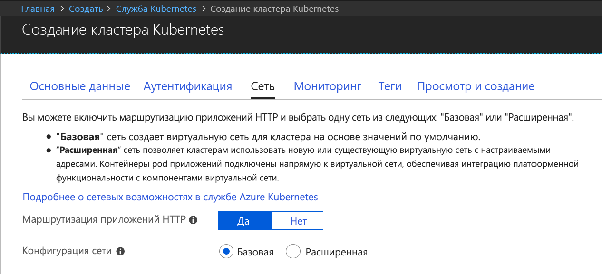

## Создание и включение кластера Kubernetes для Azure Dev Spaces

1. Войдите на портал Azure по адресу http://portal.azure.com.
1. Выберите **Создать ресурс**, выполните поиск **Kubernetes**, затем выберите **Kubernetes Service** (Служба Kubernetes)  >  **Создать**.

   Выполните приведенные ниже действия под каждым заголовком в форме создания кластера AKS.

    - **PROJECT DETAILS** (Сведения о проекте): выберите подписку Azure и создайте новую или выберите существующую группу ресурсов Azure.
    - **Сведения о кластере.** Для кластера AKS укажите имя, регион (сейчас нужно выбрать EastUS, Central US, WestEurope, WestUS2, CanadaCentral или CanadaEast), версию и префикс имени DNS.
    - **Масштаб**. Выберите размер виртуальной машины для узлов агента AKS и количество узлов. Если вы только начинаете работать с Azure Dev Spaces, одного узла будет достаточно, чтобы ознакомиться с функциями. После развертывания кластера вы сможете легко изменить количество узлов в любое время. Обратите внимание, что размер виртуальной машины невозможно изменить после создания кластера AKS. Но после развертывания кластера AKS можно легко создать новый кластер с виртуальными машинами большего размера и с помощью Dev Spaces выполнить повторное развертывание в большем кластере, если требуется масштабировать ресурсы.

   Выберите Kubernetes 1.10.3 или более поздней версии.

   

   По завершении выберите **Next: Networking** (Далее: сети).

1. Убедитесь, что маршрутизация приложений HTTP включена.

   

    > [!IMPORTANT]
    > Обязательно включите параметр "Маршрутизация приложений HTTP" при создании кластера AKS. Вы не сможете изменить значение этого параметра позже.

1. Выберите нужный параметр для управления доступом на основе ролей (RBAC). Служба Azure Dev Spaces поддерживает кластеры как с включенным, так и с отключенным механизмом RBAC.

    

1. Выберите **Review + create** (Проверить и создать), а по завершении щелкните **Create** (Создать).
