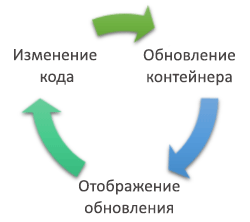
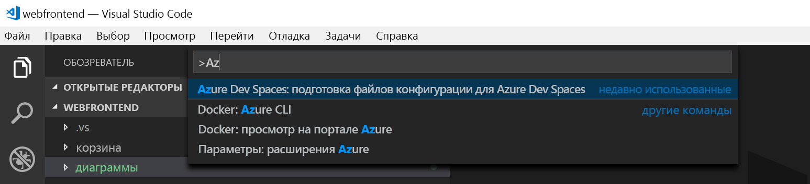
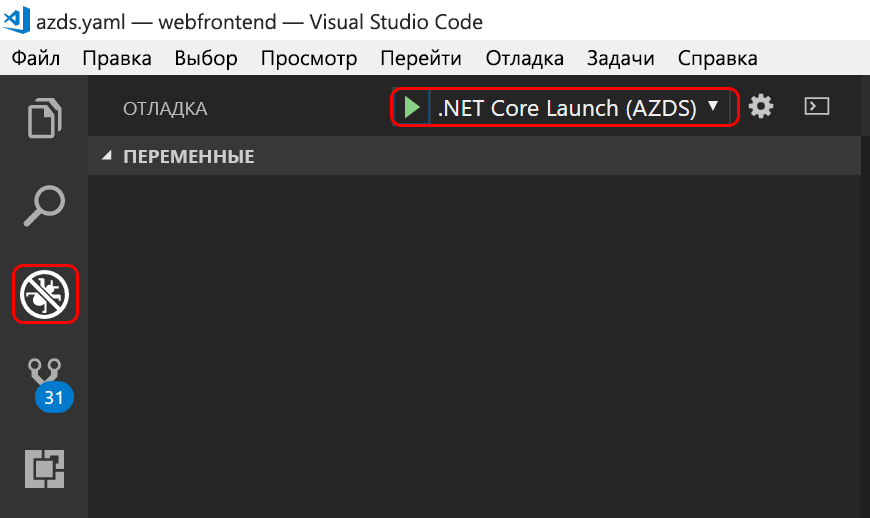

# <a name="quickstart-create-a-kubernetes-dev-space-with-azure-dev-spaces-net-core-and-vs-code"></a>Краткое руководство по созданию среды разработки Kubernetes с помощью Azure Dev Spaces (.NET Core и VS Code)

Из этого руководства вы узнаете, как выполнить следующие задачи:

- Настройка Azure Dev Spaces с помощью управляемого кластера Kubernetes в Azure.
- итеративная разработка кода в контейнерах с помощью VS Code и командной строки;
- Отладка кода в среде разработки с помощью VS Code

> [!Note]
> **Если на каком-то этапе у вас возникли трудности**, см. статью [Устранение неполадок](troubleshooting.md) или оставьте комментарий на этой странице. Можно также ознакомиться с более подробным [руководством](get-started-netcore.md).

## <a name="prerequisites"></a>Предварительные требования

- Подписка Azure. Если ее нет, можно создать [бесплатную учетную запись](https://azure.microsoft.com/free).
- [Кластер Kubernetes](https://ms.portal.azure.com/#create/microsoft.aks), работающий с Kubernetes 1.10.3, в регионах EastUS, CentralUS, WestUS2, WestEurope, CanadaCentral или CanadaEast, с включенным параметром **Маршрутизация HTTP для приложений**.

  

- [Visual Studio Code](https://code.visualstudio.com/download).

## <a name="set-up-azure-dev-spaces"></a>Настройка Azure Dev Spaces

Azure CLI и расширение Azure Dev Spaces могут устанавливаться и работать на компьютерах с Windows, Mac или Linux. Для Linux поддерживаются следующие дистрибутивы: Ubuntu (18.04, 16.04 и 14.04), Debian 8 и 9, RHEL 7, Fedora 26 и более поздней версии, CentOS 7, openSUSE 42.2 и SLES 12.

Вот как можно настроить Azure Dev Spaces:

1. Установите [Azure CLI](/cli/azure/install-azure-cli?view=azure-cli-latest) (версии 2.0.38 или более поздней).
1. Настройка Dev Spaces в кластере AKS: `az aks use-dev-spaces -g MyResourceGroup -n MyAKS`
1. Загрузите [расширение Azure Dev Spaces](https://marketplace.visualstudio.com/items?itemName=azuredevspaces.azds) для VS Code. Один раз щелкните "Установить" на странице расширения в Marketplace и еще раз — в VS Code.

## <a name="build-and-run-code-in-kubernetes"></a>Сборка и запуск кода в Kubernetes

1. Загрузите пример кода из репозитория GitHub: [https://github.com/Azure/dev-spaces](https://github.com/Azure/dev-spaces) 
1. Перейдите в папку webfrontend: `cd dev-spaces/samples/dotnetcore/getting-started/webfrontend`
1. Создайте ресурсы диаграмм Docker и Helm: `azds prep --public`
1. Создайте и запустите свой код в AKS. В окне терминала из **папки проекта webfrontend** выполните следующую команду: `azds up`
1. Просмотрите выходные данные консоли, чтобы найти сведения об URL-адресе, который был создан командой `up`. Он будет выглядеть следующим образом: 

   `Service 'webfrontend' port 'http' is available at <url>` 

   При открытии этого URL-адреса в окне браузера должна начаться загрузка веб-приложения. 
   
   > [!Note]
   > При первом запуске подготовка общедоступной записи DNS может занять несколько минут. Если не удается разрешить общедоступный URL-адрес, вместо него можно использовать альтернативный URL-адрес http://localhost:<portnumber>, который отображается в выходных данных консоли. Если вы используете URL-адрес localhost, может показаться, что контейнер выполняется локально, но на самом деле он выполняется в AKS. Для вашего удобства и упрощения взаимодействия со службой на локальном компьютере служба Azure Dev Spaces создает временный туннель SSH для контейнера, запущенного в Azure. Вы можете опробовать общедоступный URL-адрес позже, когда запись DNS будет готова.

### <a name="update-a-content-file"></a>Обновление файла содержимого

1. Найдите файл, такой как `./Views/Home/Index.cshtml`, и внесите изменения в HTML-код. Например, измените строку 70 `<h2>Application uses</h2>` строкой примерно такого содержания: `<h2>Hello k8s in Azure!</h2>`
1. Сохраните файл. Через несколько мгновений в окне терминала вы увидите сообщение о том, что файл в запущенном контейнере обновлен.
1. Вернитесь в браузер и обновите страницу. Должна отобразиться веб-страница с обновленным HTML.

Что произошло? Изменения файлов содержимого, таких как HTML и CSS, не требуют перекомпиляции в веб-приложении .NET Core, поэтому активная команда `azds up` автоматически синхронизирует любые измененные файлы содержимого в запущенный контейнер в Azure, чтобы можно было сразу же видеть изменения содержимого.

### <a name="update-a-code-file"></a>Обновление файла кода
Для обновления файлов кода требуется немного больше работы, так как приложение .NET Core должно перестроить и создать обновленные двоичные файлы приложений.

1. В окне терминала нажмите клавишу `Ctrl+C` (чтобы остановить `azds up`).
1. Откройте файл кода с именем `Controllers/HomeController.cs` и измените сообщение, которое будет отображаться на странице About (Сведения): `ViewData["Message"] = "Your application description page.";`
1. Сохраните файл.
1. Запустите `azds up` в окне терминала. 

Эта команда перестроит образ контейнера и повторно развернет диаграмму Helm. Чтобы увидеть, как изменения вашего кода вступили в силу в работающем приложении, перейдите в меню "Сведения" в веб-приложении.

Но есть еще один *более быстрый метод* разработки кода, который вы рассмотрите в следующем разделе. 

## <a name="debug-a-container-in-kubernetes"></a>Отладка контейнера в Kubernetes

В этом разделе используйте VS Code для прямой отладки контейнера, работающего в Azure. Также вы узнаете, как быстрее вносить изменения, выполнять тестирование и запуск.



### <a name="initialize-debug-assets-with-the-vs-code-extension"></a>Инициализация ресурсов отладки с помощью расширения VS Code
Сначала необходимо настроить проект кода, чтобы редактор VS Code мог взаимодействовать с нашим пространством разработки в Azure. Расширение VS Code для Azure Dev Spaces содержит вспомогательную команду для настройки конфигурации отладки. 

Откройте **палитру команд** (с помощью меню **Вид | Палитра команд**), включите автоматическое завершение ввода и выберите эту команду: `Azure Dev Spaces: Prepare configuration files for Azure Dev Spaces`. 

В папку `.vscode` будет добавлена конфигурация отладки для Azure Dev Spaces.



### <a name="select-the-azds-debug-configuration"></a>Выбор конфигурации отладки AZDS
1. Чтобы открыть представление отладки, щелкните значок "Отладка" на **панели действия** сбоку VS Code.
1. Выберите **.NET Core Launch (AZDS)** (Запуск .NET Core (AZDS)) как активную конфигурацию отладки.



> [!Note]
> Если вы не видите никаких команд Azure Dev Spaces на палитре команд, убедитесь, что вы установили расширение VS Code для Azure Dev Spaces. Убедитесь, что рабочая область, которую вы открыли в VS Code, — это папка, содержащая файл azds.yaml.


### <a name="debug-the-container-in-kubernetes"></a>Отладка контейнера в Kubernetes
Нажмите клавишу **F5**, чтобы отладить свой код в Kubernetes.

Как и команда `up`, код синхронизируется со средой разработки, а контейнер создается и развертывается в Kubernetes. На этот раз, конечно, отладчик подключен к удаленному контейнеру.

> [!Tip]
> В строке состояния VS Code отобразится URL-адрес, щелкнув по которому, можно перейти на соответствующий ресурс.

Установите точку останова в файле кода на стороне сервера, например в функции `Index()` в исходном файле `Controllers/HomeController.cs`. Обновление страницы браузера инициирует срабатывание точки останова.

У вас есть полный доступ к отладочной информации, как если бы код выполнялся локально, например к стеку вызовов, локальным переменным, информации об исключениях и т. д.

### <a name="edit-code-and-refresh"></a>Изменение и обновление кода
С помощью активного отладчика отредактируйте код. Например, измените сообщение страницы About (Сведения) в `Controllers/HomeController.cs`. 

```csharp
public IActionResult About()
{
    ViewData["Message"] = "My custom message in the About page.";
    return View();
}
```

Сохраните файл и в области **действий отладки** нажмите кнопку **Обновить**. 


Вместо того, чтобы перестраивать и повторно развертывать новый образ контейнера при каждой правке кода, что часто занимает много времени, Azure Dev Spaces пошагово перекомпилирует код в существующем контейнере, чтобы ускорить цикл редактирования и отладки.

В браузере обновите веб-приложение и перейдите на страницу About (Сведения). Вы должны увидеть настраиваемое сообщение в пользовательском интерфейсе.

**Теперь у вас есть метод быстрой итерации кода и отладки непосредственно в Kubernetes**.

## <a name="next-steps"></a>Дополнительная информация

Узнайте, каким образом в Azure Dev Spaces можно разрабатывать более сложные приложения в нескольких контейнерах и как упростить совместную разработку, работая с разными версиями или ветвями кода в разных средах. 

> [!div class="nextstepaction"]
> [Работа с несколькими контейнерами и командной разработкой](team-development-netcore.md)
