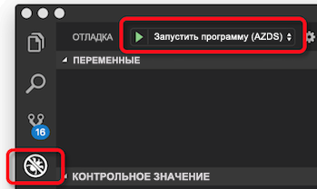
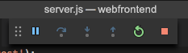

# <a name="quickstart-create-a-kubernetes-dev-space-with-azure-dev-spaces-nodejs"></a>Краткое руководство по созданию пространства разработки Kubernetes с помощью Azure Dev Spaces (Node.js)

Из этого руководства вы узнаете, как выполнить следующие задачи:

- Настройка Azure Dev Spaces с помощью управляемого кластера Kubernetes в Azure.
- итеративная разработка кода в контейнерах с помощью VS Code и командной строки;
- выполнять отладку кода, запущенного в кластере.

> [!Note]
> **Если на каком-то этапе у вас возникли трудности**, см. статью [Устранение неполадок](troubleshooting.md) или оставьте комментарий на этой странице. Можно также ознакомиться с более подробным [руководством](get-started-nodejs.md).

## <a name="prerequisites"></a>Предварительные требования

- Подписка Azure. Если у вас нет подписки Azure, создайте [бесплатную учетную запись](https://azure.microsoft.com/free).
- [Кластер Kubernetes](https://ms.portal.azure.com/#create/microsoft.aks), работающий с Kubernetes 1.10.3, в регионах EastUS, CentralUS, WestUS2, WestEurope, CanadaCentral или CanadaEast, с включенным параметром **Маршрутизация HTTP для приложений**.

  

- Visual Studio Code можно скачать по ссылке [здесь](https://code.visualstudio.com/download).

## <a name="set-up-azure-dev-spaces"></a>Настройка Azure Dev Spaces

Azure CLI и расширение Azure Dev Spaces могут устанавливаться и работать на компьютерах с Windows, Mac или Linux. Для Linux поддерживаются следующие дистрибутивы: Ubuntu (18.04, 16.04 и 14.04), Debian 8 и 9, RHEL 7, Fedora 26 и более поздней версии, CentOS 7, openSUSE 42.2 и SLES 12.

Вот как можно настроить Azure Dev Spaces:

1. Установите [Azure CLI](/cli/azure/install-azure-cli?view=azure-cli-latest) (версии 2.0.38 или более поздней).
1. Настройка Dev Spaces в кластере AKS: `az aks use-dev-spaces -g MyResourceGroup -n MyAKS`
1. Загрузите [расширение Azure Dev Spaces](https://aka.ms/get-azds-code) для VS Code. Один раз щелкните "Установить" на странице расширения в Marketplace и еще раз — в VS Code.

## <a name="build-and-run-code-in-kubernetes"></a>Сборка и запуск кода в Kubernetes

1. Загрузите пример кода из репозитория GitHub: [https://github.com/Azure/dev-spaces](https://github.com/Azure/dev-spaces) 
1. Перейдите в папку webfrontend: `cd dev-spaces/samples/nodejs/getting-started/webfrontend`
1. Создайте ресурсы диаграмм Docker и Helm: `azds prep --public`
1. Создайте и запустите свой код в AKS. В окне терминала из **папки проекта webfrontend** выполните следующую команду: `azds up`
1. Просмотрите выходные данные консоли, чтобы найти сведения об URL-адресе, который был создан командой `up`. Он будет выглядеть следующим образом: 

   `Service 'webfrontend' port 'http' is available at <url>` 

   При открытии этого URL-адреса в окне браузера должна начаться загрузка веб-приложения. По мере выполнения контейнера в окно терминала передаются выходные данные `stdout` и `stderr`.
   
   > [!Note]
   > При первом запуске подготовка общедоступной записи DNS может занять несколько минут. Если не удается разрешить общедоступный URL-адрес, вместо него можно использовать альтернативный URL-адрес http://localhost:<portnumber>, который отображается в выходных данных консоли. Если вы используете URL-адрес localhost, может показаться, что контейнер выполняется локально, но на самом деле он выполняется в AKS. Для вашего удобства и упрощения взаимодействия со службой на локальном компьютере служба Azure Dev Spaces создает временный туннель SSH для контейнера, запущенного в Azure. Вы можете опробовать общедоступный URL-адрес позже, когда запись DNS будет готова.

### <a name="update-a-content-file"></a>Обновление файла содержимого
Azure Dev Spaces — это не просто среда выполнения кода в Kubernetes. Она позволяет быстро и итеративно видеть, как изменения вашего кода вступают в силу в среде Kubernetes в облаке.

1. Найдите файл `./public/index.html` и внесите изменения в HTML. Например, можно изменить цвет фона страницы на оттенок синего цвета:

    ```html
    <body style="background-color: #95B9C7; margin-left:10px; margin-right:10px;">
    ```

1. Сохраните файл. Через несколько мгновений в окне терминала вы увидите сообщение о том, что файл в запущенном контейнере обновлен.
1. Вернитесь в браузер и обновите страницу. Вы увидите обновление цвета.

Что произошло? Изменение файлов содержимого, таких как HTML и CSS, не требует перезапуска процесса Node.js, поэтому активная команда `azds up` автоматически синхронизирует любые измененные файлы содержимого непосредственно в запущенный контейнер в Azure, тем самым обеспечивая быстрый способ проверки изменений содержимого.

### <a name="test-from-a-mobile-device"></a>Тестирование с мобильного устройства
Откройте веб-приложение на мобильном устройстве с помощью общедоступного URL-адреса для webfrontend. Чтобы не вводить длинный адрес, можно скопировать и отправить URL-адрес с рабочего стола на устройство. Когда веб-приложение загрузится на мобильном устройстве, вы заметите, что пользовательский интерфейс не отображается должным образом на устройстве небольшого размера.

Чтобы устранить эту проблему, нужно добавить метатег `viewport`:
1. Откройте файл `./public/index.html`.
1. Добавьте метатег `viewport` в имеющийся элемент `head`:

    ```html
    <head>
        <!-- Add this line -->
        <meta name="viewport" content="width=device-width, initial-scale=1">
    </head>
    ```

1. Сохраните файл.
1. Обновите браузер своего устройства. Теперь веб-приложение будет отображаться должным образом. 

Это пример того, как некоторые проблемы невозможно выявить, пока вы не протестируете приложение на устройствах, для которых оно предназначено. В Azure Dev Spaces вы можете быстро выполнять итерации кода и проверять любые изменения на целевых устройствах.

### <a name="update-a-code-file"></a>Обновление файла кода
Для обновления файлов кода на стороне сервера требуется немного больше работы, потому что приложение Node.js необходимо перезапустить.

1. В окне терминала нажмите клавишу `Ctrl+C` (чтобы остановить `azds up`).
1. Откройте файл кода с именем `server.js` и измените приветственное сообщение службы: 

    ```javascript
    res.send('Hello from webfrontend running in Azure!');
    ```

3. Сохраните файл.
1. Запустите `azds up` в окне терминала. 

Это перестроит образ контейнера и перераспределит диаграмму Helm. Перезагрузите страницу браузера, чтобы увидеть, как изменения вашего кода вступают в силу.

Но есть еще один *более быстрый метод* разработки кода, который вы рассмотрите в следующем разделе. 

## <a name="debug-a-container-in-kubernetes"></a>Отладка контейнера в Kubernetes

В этом разделе используется VS Code для прямой отладки контейнера, работающего в Azure. Также вы узнаете, как быстрее вносить изменения, выполнять тестирование и запуск.


### <a name="initialize-debug-assets-with-the-vs-code-extension"></a>Инициализация ресурсов отладки с помощью расширения VS Code
Сначала необходимо настроить проект кода, чтобы редактор VS Code мог взаимодействовать со средой разработки в Azure. Расширение VS Code для Azure Dev Spaces содержит вспомогательную команду для настройки конфигурации отладки. 

Откройте **палитру команд** (с помощью меню **Вид | Палитра команд**), включите автоматическое завершение ввода и выберите эту команду: `Azure Dev Spaces: Prepare configuration files for Azure Dev Spaces`.

В папку `.vscode` будет добавлена конфигурация отладки для Azure Dev Spaces.


### <a name="select-the-azds-debug-configuration"></a>Выбор конфигурации отладки AZDS
1. Чтобы открыть представление отладки, щелкните значок "Отладка" на **панели действия** сбоку VS Code.
1. Выберите **Launch Program (AZDS)** (Запустить программу (AZDS)) как активную конфигурацию отладки.



> [!Note]
> Если вы не видите никаких команд Azure Dev Spaces на палитре команд, убедитесь, что вы установили расширение VS Code для Azure Dev Spaces.

### <a name="debug-the-container-in-kubernetes"></a>Отладка контейнера в Kubernetes
Нажмите клавишу **F5**, чтобы отладить ваш код в Kubernetes.

Подобно команде `up`, код синхронизируется со средой разработки при запуске отладки, и выполняется сборка и развертывание контейнера в Kubernetes. На этот раз отладчик подключен к удаленному контейнеру.

> [!Tip]
> В строке состояния VS Code отобразится URL-адрес, щелкнув по которому, можно перейти на соответствующий ресурс.

Установите точку останова в файле кода на стороне сервера, например в `app.get('/api'...` внутри `server.js`. Обновите страницу браузера или нажмите кнопку Say It Again (Повторить это), и вы достигнете точки останова и сможете осуществить пошаговое выполнение кода.

У вас есть полный доступ к отладочной информации, как если бы код выполнялся локально, например к стеку вызовов, локальным переменным, информации об исключениях и т. д.

### <a name="edit-code-and-refresh-the-debug-session"></a>Изменение кода и обновление сеанса отладки
Измените код при активном отладчике. Например, еще раз измените приветствие:

```javascript
app.get('/api', function (req, res) {
    res.send('**** Hello from webfrontend running in Azure! ****');
});
```

Сохраните файл и в области **действий отладки** нажмите кнопку **Обновить**. 



Вместо повторной сборки и развертывания нового образа контейнера при каждой правке кода, что часто занимает немало времени, Azure Dev Spaces перезапустит процесс Node.js между сеансами отладки, чтобы ускорить цикл правки и отладки.

Обновите веб-приложение в браузере или нажмите кнопку *Say It Again* (Повторить это). Вы должны увидеть настраиваемое сообщение в пользовательском интерфейсе.

### <a name="use-nodemon-to-develop-even-faster"></a>Использование NodeMon для ускоренной разработки

Образец проекта `webfrontend` был настроен на использование [nodemon](https://nodemon.io/), популярного средства для ускорения разработки Node.js, которое полностью совместимо с Azure Dev Spaces.

Попробуйте сделать следующее.
1. Остановите отладчик VS Code.
1. Щелкните значок "Отладка" в **строке действий** в боковой части VS Code. 
1. Выберите **Attach (AZDS)** (Присоединить (AZDS)) как активную конфигурацию отладки.
1. Нажмите клавишу F5.

В этой конфигурации контейнер настроен запускать *nodemon*. При внесении изменений в код сервера *nodemon* автоматически перезапускает процесс Node, как при локальной разработке. 
1. Измените сообщение hello снова на `server.js` и сохраните файл.
1. Обновите браузер или нажмите кнопку *​​Say It Again* (Повторить это), чтобы увидеть свои изменения.

**Теперь у вас есть метод быстрой итерации кода и отладки непосредственно в Kubernetes**.

## <a name="next-steps"></a>Дополнительная информация

> [!div class="nextstepaction"]
> [Работа с несколькими контейнерами и командной разработкой](team-development-nodejs.md)
