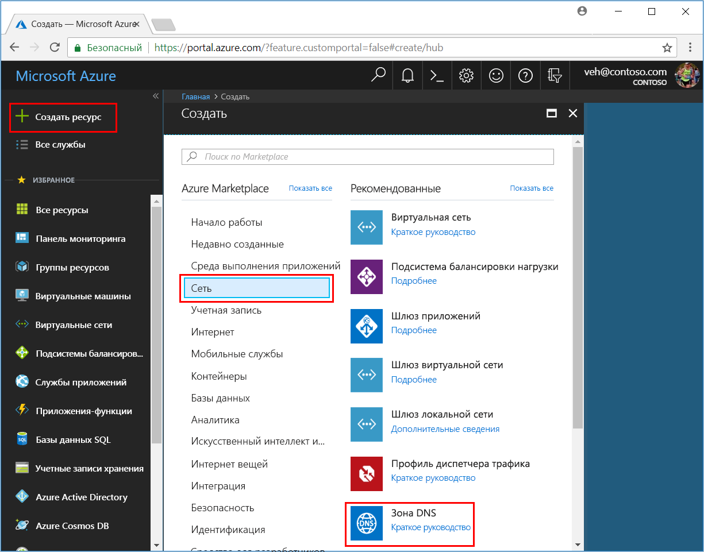

# <a name="quickstart-configure-azure-dns-for-name-resolution-using-the-azure-portal"></a>Краткое руководство. Настройка Azure DNS для разрешения имен с помощью портала Azure

 В общедоступном домене можно настроить Azure DNS для разрешения имен узлов. Например, если было приобретено доменное имя contoso.com у регистратора доменных имен, можно настроить Azure DNS для размещения домена contoso.com и присвоить www.contoso.com IP-адрес веб-сервера или веб-приложения.

В этом кратком руководстве создайте тестовый домен и записи адреса с именем "www", чтобы задать путь к IP-адресу 10.10.10.10.

Важно знать, что все имена и IP-адреса в этом кратком руководстве приведены только для примера и не соответствуют никаким сценариям из реальной жизни. Тем не менее там, где необходимо, также описаны сценарии из реальной жизни.

<!---
You can also perform these steps using [Azure PowerShell](dns-getstarted-powershell.md) or the cross-platform [Azure CLI 2.0](dns-getstarted-cli.md).
--->

Зона DNS используется для сохранения DNS-записей определенного домена. Чтобы разместить свой домен в Azure DNS, необходимо создать зону DNS для этого доменного имени. Каждая запись DNS (или запись) для домена создается внутри этой зоны DNS. Следующие действия демонстрируют, как это сделать.

Если у вас еще нет подписки Azure, [создайте бесплатную учетную запись Azure](https://azure.microsoft.com/free/?WT.mc_id=A261C142F), прежде чем начинать работу.

## <a name="create-a-dns-zone"></a>Создание зоны DNS

1. Войдите на портал Azure.
2. В верхнем левом углу щелкните **+ Создать ресурс**, затем **Сеть**, а потом нажмите **Зона DNS**, чтобы открыть страницу **Создание зоны DNS**.

    

4. На странице **Создание зоны DNS** введите следующие значения, а затем щелкните **Создать**.


   | **Параметр** | **Значение** | **Дополнительные сведения** |
   |---|---|---|
   |**Имя**|contoso.xyz|Имя зоны DNS для этого примера. Любое значение для этого краткого руководства можно использовать до тех пор, пока оно еще не настроено на серверах Azure DNS. Реальное значение будет доменом, который был приобретен у регистратора доменных имен.|
   |**Подписка**|[Ваша подписка]|Выберите подписку для создания зоны DNS.|
   |**Группа ресурсов**|**Создание:** dns-test|Создайте группу ресурсов. Имя группы ресурсов должно быть уникальным в пределах выбранной подписки. |
   |**Местоположение.**|Восточная часть США||

Создание зоны может занять несколько минут.

## <a name="create-a-dns-record"></a>Создание записи DNS

Теперь создайте новую запись адреса (запись "А"). Записи "А" используются для присвоения имени узлу в IPv4-адресе.

1. На портале Azure в области **Избранное** щелкните **Все ресурсы**. Щелкните зону DNS **contoso.xyz** на странице "Все ресурсы". Если выбранная подписка имеет несколько ресурсов, в поле **Фильтровать по имени...** введите **contoso.xyz** чтобы быстро получить доступ к необходимой зоне DNS.

1. В верхней части страницы **Зона DNS** щелкните **Набор записей**, чтобы открыть страницу **Добавление набора записей**.

1. На странице **Добавление набора записей** введите следующие значения и нажмите кнопку **ОК**. В этом примере создается запись "A".

   |**Параметр** | **Значение** | **Дополнительные сведения** |
   |---|---|---|
   |**Имя**|www|Имя записи. Это имя, которое необходимо использовать для узла для присвоения IP-адресу.|
   |**Тип**|A| Тип создаваемой записи DNS. Записи "А" являются самыми распространенными, но существуют другие типы записей для почтовых серверов (MX), IPv6-адресов (AAAA) и т.д. |
   |**Срок жизни**|1|Срок жизни DNS-запроса. Указывает, как долго DNS-серверы и клиенты могут кэшировать ответ.|
   |**Единица срока жизни**|hours|Измерение времени для значения срока жизни.|
   |**IP-адрес**|10.10.10.10| Это значение является IP-адресом, который разрешает запись "А". Это тестовое значение для этого краткого руководства. Для реального примера необходимо ввести общедоступный IP-адрес своего веб-сервера.|


Так как в этом кратком руководстве фактически не приобретается настоящее доменное имя, нет необходимости настраивать Azure DNS в качестве сервера имен у регистратора доменных имен. Но в реальной ситуации необходимо, чтобы любой пользователь в Интернете имел возможность разрешить имя узла для подключения к веб-серверу или приложению. Дополнительные сведения об этом реальном сценарии см. в разделе [Делегирование домена в Azure DNS](dns-delegate-domain-azure-dns.md).


## <a name="test-the-name-resolution"></a>Тестирование разрешения имен

Теперь, когда есть тестовая зона с записью тестов "A", можно протестировать разрешение имен с помощью утилиты nslookup. 

1. Сначала необходимо отметить имена серверов Azure DNS для их использования с помощью nslookup. 

   Имена серверов для зоны перечислены в зоне DNS на странице **Обзор**. Скопируйте одно из имен серверов.

   

2. Теперь откройте командную строку и выполните следующую команду.

   ```
   nslookup <host name> <name server>
   
   For example:

   nslookup www.contoso.xyz ns1-08.azure-dns.com
   ```

Снимки экрана будут подобны следующим.


Это подтверждает, что разрешение имен работает правильно. www.contoso.xyz разрешает 10.10.10.10, как и было настроено.

## <a name="clean-up-resources"></a>Очистка ресурсов

Удалите группу ресурсов **dns-test**, если больше не нужны ресурсы, созданные в этом кратком руководстве. Чтобы сделать это, щелкните группу ресурсов **dns-test**, а затем нажмите **Удалить группу ресурсов**.


## <a name="next-steps"></a>Дополнительная информация

> [!div class="nextstepaction"]
> [Создание записей DNS для веб-приложения в пользовательском домене](./dns-web-sites-custom-domain.md)