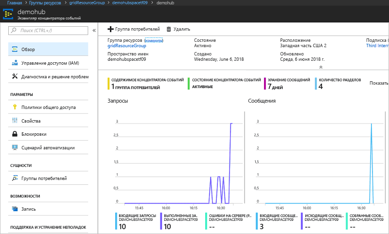

# <a name="route-custom-events-to-azure-event-hubs-with-azure-cli-and-event-grid"></a>Перенаправление пользовательских событий в концентраторы событий Azure с помощью Azure CLI и службы "Сетка событий"

"Сетка событий Azure" — это служба обработки событий для облака. Концентратор событий Azure – это один из поддерживаемых обработчиков событий. В этой статье используется интерфейс командной строки Azure, чтобы создать пользовательскую тему, подписаться на тему и активировать событие, чтобы увидеть результат. Отправка событий в концентраторы событий.

[!INCLUDE [quickstarts-free-trial-note.md](../../includes/quickstarts-free-trial-note.md)]

## <a name="create-a-resource-group"></a>Создание группы ресурсов

Темами событий сетки являются ресурсы Azure, которые необходимо поместить в группу ресурсов Azure. Группа ресурсов Azure — это логическая коллекция, в которой выполняется развертывание и администрирование ресурсов Azure.

Создайте группу ресурсов с помощью команды [az group create](/cli/azure/group#az-group-create). 

В следующем примере создается группа ресурсов с именем *gridResourceGroup* в расположении *westus2*.

```azurecli-interactive
az group create --name gridResourceGroup --location westus2
```

[!INCLUDE [event-grid-register-provider-cli.md](../../includes/event-grid-register-provider-cli.md)]

## <a name="create-a-custom-topic"></a>Создание пользовательской темы

Раздел сетки событий содержит определяемую пользователем конечную точку, в которой можно размещать свои события. В приведенном ниже примере создается пользовательский раздел в вашей группе ресурсов. Замените `<your-topic-name>` уникальным именем для вашей темы. Имя раздела должно быть уникальным, так как оно представлено записью службы доменных имен (DNS).

```azurecli-interactive
topicname=<your-topic-name>
az eventgrid topic create --name $topicname -l westus2 -g gridResourceGroup
```

## <a name="create-event-hub"></a>Создание концентратора событий

Перед подпиской на раздел необходимо создать конечную точку для сообщения о событии. Концентратор событий создается для сбора событий.

```azurecli-interactive
namespace=<unique-namespace-name>
hubname=demohub

az eventhubs namespace create --name $namespace --resource-group gridResourceGroup
az eventhubs eventhub create --name $hubname --namespace-name $namespace --resource-group gridResourceGroup
```

## <a name="subscribe-to-a-topic"></a>Оформление подписки на тему

Подпишитесь на тему, чтобы определить в сетке событий Azure, какие события вам необходимо отслеживать. В следующем примере создается подписка на созданный раздел и передается идентификатор ресурса концентратора событий для конечной точки. Конечная точка имеет следующий формат:

`/subscriptions/<subscription-id>/resourceGroups/<resource-group-name>/providers/Microsoft.EventHub/namespaces/<namespace-name>/eventhubs/<hub-name>`

Следующий сценарий получает идентификатор ресурса для концентратора событий и подписывается на событие в разделе сетки. В нем также задается тип `eventhub` для конечной точки и используется идентификатор концентратора событий для нее.

```azurecli-interactive
hubid=$(az eventhubs eventhub show --name $hubname --namespace-name $namespace --resource-group gridResourceGroup --query id --output tsv)

az eventgrid event-subscription create \
  --topic-name $topicname \
  -g gridResourceGroup \
  --name subtoeventhub \
  --endpoint-type eventhub \
  --endpoint $hubid
```

## <a name="send-an-event-to-your-topic"></a>Отправка события в тему

Давайте активируем событие, чтобы увидеть, как сообщение отправляется в конечную точку при помощи службы "Сетка событий". Сначала получите URL-адрес и ключ для пользовательского раздела.

```azurecli-interactive
endpoint=$(az eventgrid topic show --name $topicname -g gridResourceGroup --query "endpoint" --output tsv)
key=$(az eventgrid topic key list --name $topicname -g gridResourceGroup --query "key1" --output tsv)
```

Для простоты используйте пример данных события для отправки в раздел. Как правило, приложение или служба Azure отправит данные события. CURL — это служебная программа, которая отправляет HTTP-запросы. В этой статье мы используем CURL для отправки события в раздел.  В следующем примере в раздел сетки событий отправляется три события:

```azurecli-interactive
for i in 1 2 3
do
   body=$(eval echo "'$(curl https://raw.githubusercontent.com/Azure/azure-docs-json-samples/master/event-grid/customevent.json)'")
   curl -X POST -H "aeg-sas-key: $key" -d "$body" $endpoint
done
```

Перейдите к концентратору событий на портале. Вы увидите, что служба "Сетка событий" отправила эти три события в концентратор событий.



Как правило, Вы создаете приложение, которое извлекает события из концентратора событий. Чтобы создать приложение, которое получает сообщения от концентратора событий, см.:

* [Основные сведения о получении сообщений с помощью узла Event Processor Host в .NET Standard](../event-hubs/event-hubs-dotnet-standard-getstarted-receive-eph.md)
* [Получение событий от концентраторов событий Azure с помощью Java](../event-hubs/event-hubs-java-get-started-receive-eph.md)
* [Получение событий из концентраторов событий с помощью Apache Storm](../event-hubs/event-hubs-storm-getstarted-receive.md)

## <a name="clean-up-resources"></a>Очистка ресурсов
Если вы планируете продолжить работу с этим событием, не удаляйте ресурсы, созданные при работе с этой статьей. В противном случае удалите соответствующие ресурсы с помощью следующей команды.

```azurecli-interactive
az group delete --name gridResourceGroup
```

## <a name="next-steps"></a>Дополнительная информация

Теперь, когда вы знаете, как создавать темы и подписки на события, ознакомьтесь с дополнительными сведениями о сетке событий, которые могут помочь вам:

- [An introduction to Azure Event Grid](overview.md) (Общие сведения о службе "Сетка событий Azure")
- [Перенаправление событий хранилища BLOB-объектов в пользовательскую конечную веб-точку (предварительная версия)](../storage/blobs/storage-blob-event-quickstart.md?toc=%2fazure%2fevent-grid%2ftoc.json)
- [Monitor virtual machine changes with Azure Event Grid and Logic Apps](monitor-virtual-machine-changes-event-grid-logic-app.md) (Отслеживание изменений виртуальной машины с помощью Azure Logic Apps и службы "Сетка событий Azure")
- [Потоковая передача больших данных в хранилище данных](event-grid-event-hubs-integration.md)
