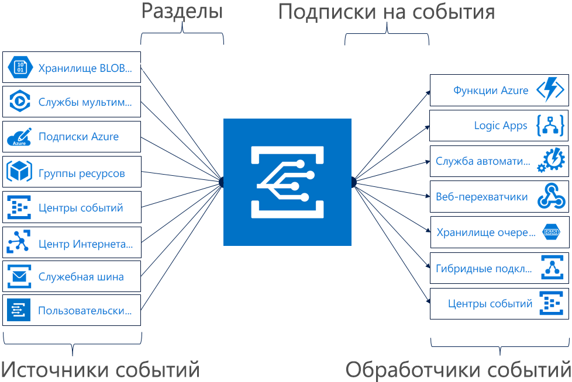

# Общие сведения о службе "Сетка событий Azure"

Служба "Сетка событий Azure" позволяет легко создавать приложения с архитектурой на основе событий. Сначала выберите ресурс Azure, на которой вы хотите подписаться, а затем укажите обработчик событий или конечную точку веб-перехватчика для отправки события. Служба "Сетка событий" обеспечивает встроенную поддержку событий, поступающих из таких служб Azure, как хранилища BLOB-объектов и группы ресурсов. Служба "Сетка событий" также поддерживает пользовательские события с использованием соответствующих разделов. 

Вы можете применять фильтры для маршрутизации определенных событий в различные конечные точки, использовать многоадресную рассылку в несколько конечных точек, а также проверять надежность доставки.

Сейчас служба "Сетка событий Azure" предоставляется во всех общедоступных регионах. Она пока не предоставляется в облаках Azure для Китая, Azure для Германии или Azure для государственных организаций.

В статье представлен обзор службы "Сетка событий Azure". Чтобы приступить к использованию службы, см. раздел [Создание и перенаправление пользовательского события со службой "Сетка событий Azure"](custom-event-quickstart.md). 

Обратите внимание: на этом рисунке показано, как служба "Сетка событий" соединяет источники и обработчики. Здесь не предоставлен полный список поддерживаемых интеграций.

## Источники событий

Дополнительные сведения о возможностях каждого источника, а также статьи по этой теме см. в описании [источников событий](event-sources.md). В настоящее время отправку событий в службу "Сетка событий" поддерживают следующие службы Azure:

* Подписки Azure (операции управления)
* Реестр контейнеров
* Пользовательские разделы
* Центры событий;
* Центр Интернета вещей
* Службы мультимедиа
* Группы ресурсов (операции управления)
* Служебная шина Azure
* Большой двоичный объект хранилища
* Хранилище общего назначения версии 2 (GPv2)

## Обработчики событий

Дополнительные сведения о возможностях каждого обработчика, а также статьи по этой теме см. в описании [обработчиков событий](event-handlers.md). В настоящее время обработку событий из службы "Сетка событий" поддерживают следующие службы Azure: 

* Служба автоматизации Azure
* Функции Azure
* Центры событий;
* через гибридные подключения
* Logic Apps
* Microsoft Flow
* Хранилище очередей
* Веб-перехватчики

## Основные понятия

Есть пять основных понятий, с которыми нужно ознакомиться перед началом работы со службой "Сетка событий Azure":

* **События** — это то, что произошло.
* **Источники событий** — это расположения, в которых произошли события.
* **Разделы** — это конечная точка, в которую издатель отправляет событие.
* **Подписки на события** — это конечная точка или встроенный механизм для маршрутизации события, иногда в несколько обработчиков. Кроме того, подписки используются обработчиками для интеллектуальной фильтрации входящих событий.
* **Обработчики событий** — это приложения или службы, реагирующие на события.

Дополнительные сведения об этих понятиях см. в разделе [Concepts in Azure Event Grid](concepts.md) (Основные понятия службы "Сетка событий Azure").

## Возможности

Вот несколько ключевых преимуществ службы "Сетка событий Azure":

* **Простота** — интерактивная поддержка целевых событий в ресурсе Azure для любого обработчика событий или конечной точки.
* **Расширенная фильтрация** — фильтрация по типам или пути публикации событий, гарантирующая, что обработчики получают только релевантные события.
* **Размноженная отправка** — подписывайтесь на несколько конечных точек для одного и того же события, чтобы копии событий отправлялись в любое требуемое число расположений.
* **Надежность** — выполнение повторных попыток в течение 24 часов с экспоненциальным откладыванием гарантирует доставку событий.
* **Оплата за событие** — вы платите только за те ресурсы службы "Сетка событий", которые используете.
* **Высокая пропускная способность** — в службе "Сетка событий" можно создавать высокие рабочие нагрузки с поддержкой миллионов событий в секунду.
* **Встроенные события** — быстрое возобновление работы благодаря встроенным событиям с определяемыми ресурсами.
* **Пользовательские события** — используйте маршрутизацию и фильтр службы "Сетка событий", чтобы обеспечить надежную доставку пользовательских событий в приложение.

Сравнение службы "Сетка событий", Центров событий и служебной шины см. в статье [Choose between Azure services that deliver messages](compare-messaging-services.md) (Выбор между службами Azure, которые доставляют сообщения).

## Что можно сделать с помощью службы "Сетка событий"?

Служба "Сетка событий Azure" включает несколько функций, которые значительно расширяют возможности бессерверных операций, автоматизации операций и интеграции. 

### Архитектура бессерверных приложений

Служба "Сетка событий Azure" связывает источники данных и обработчики событий. Например, служба "Сетка событий Azure" может активировать функции для бессерверной обработки данных, запуская анализ изображений при каждом добавлении новой фотографии в контейнер больших двоичных объектов. 

### Автоматизация операций

Служба "Сетка событий Azure" ускоряет автоматизацию процессов и упрощает применение политик. Например, служба "Сетка событий" может уведомлять службу автоматизации Azure о создании виртуальных машин или базы данных SQL. Эти события можно использовать для автоматической проверки соответствия конфигураций служб, отправки метаданных в рабочие средства, присвоения тегов виртуальным машинам или регистрации рабочих элементов.

### Интеграция приложений

Служба "Сетка событий Azure" связывает приложения с другими службами. Например, вы можете создавать пользовательские разделы для отправки событий приложения в службу "Сетка событий", используя преимущества надежной доставки, расширенных возможностей маршрутизации и непосредственной интеграции с Azure. Кроме того, службу "Сетка событий Azure" можно использовать с Logic Apps для обработки данных в любой точке мира без необходимости писать код. 

## Сколько стоит служба "Сетка событий"?

Для службы "Сетка событий Azure" применяется модель оплаты за событие, поэтому счет выставляются только за те ресурсы, которые вы используете. Первые 100 000 операций в месяц не оплачиваются. Операциями считаются входящие события, попытки доставки подписок, вызовы управления и фильтрация по суффиксу субъекта. Дополнительные сведения см. на [странице с ценами](https://azure.microsoft.com/pricing/details/event-grid/).

## Дополнительная информация

* [Перенаправление событий хранилища BLOB-объектов](../storage/blobs/storage-blob-event-quickstart.md?toc=%2fazure%2fevent-grid%2ftoc.json)  
  Реагирование на события хранилища BLOB-объектов с помощью службы "Сетка событий".
* [Создание и перенаправление пользовательского события со службой "Сетка событий Azure"](custom-event-quickstart.md)  
  Перейдите сразу к делу. Отправляйте пользовательские события в любую конечную точку, воспользовавшись инструкциями в кратком руководстве по службе "Сетка событий Azure".
* [Отслеживание изменений виртуальной машины с помощью Azure Logic Apps и службы "Сетка событий Azure"](monitor-virtual-machine-changes-event-grid-logic-app.md)  
  Руководство по созданию приложения с помощью Logic Apps для реагирования на события, отправляемые службой "Сетка событий".
* [Потоковая передача больших данных в хранилище данных](event-grid-event-hubs-integration.md)  
  Руководство, в котором служба "Функции Azure" используется для потоковой передачи данных из Центров событий в хранилище данных SQL.
* [Справочник по REST API службы "Сетка событий Azure"](/rest/api/eventgrid)  
  Дополнительные технические сведения о службе "Сетка событий Azure" и руководство по управлению подписками на события, маршрутизацией и фильтрацией.