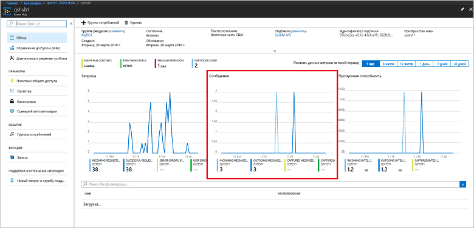

# <a name="quickstart-create-an-event-hub-using-azure-cli"></a>Краткое руководство. Создание концентратора событий с помощью Azure CLI

Центры событий Azure — это высокомасштабируемая платформа потоковой передачи данных и служба приема событий, принимающая и обрабатывающая миллионы событий в секунду. В этом кратком руководстве показано, как создавать ресурсы Центров событий с помощью Azure CLI, а также как отправлять и получать потоки событий из концентратора событий с помощью кода Java.

Для работы с этим кратким руководством вам потребуется подписка Azure. Если у вас еще нет подписки Azure, [создайте бесплатную учетную запись][], прежде чем начать работу.

## <a name="prerequisites"></a>Предварительные требования

[!INCLUDE [cloud-shell-try-it.md](../../includes/cloud-shell-try-it.md)]

Если вы решили установить и использовать Azure CLI локально, то для работы с этим руководством вам понадобится Azure CLI 2.0.4 или более поздней версии. Выполните команду `az --version`, чтобы узнать номер версии. Если вам необходимо выполнить установку или обновление, см. статью [Установка Azure CLI 2.0]( /cli/azure/install-azure-cli).

## <a name="log-on-to-azure"></a>Вход в учетную запись Azure

Следующие действия не требуются, если вы выполняете команды в Cloud Shell. Если вы используете CLI локально, выполните следующие действия, чтобы войти в учетную запись Azure и выбрать текущую подписку:

Выполните следующую команду, чтобы войти в Azure:

```azurecli-interactive
az login
```

Задайте контекст текущей подписки. Замените `MyAzureSub` идентификатором именем подписки Azure, которую вы хотите использовать:

```azurecli-interactive
az account set --subscription MyAzureSub
``` 

## <a name="provision-resources"></a>Подготовка ресурсов

Выполните следующие команды, чтобы подготовить ресурсы Центров событий. Не забудьте заменить заполнители `myResourceGroup`, `namespaceName`, `eventHubName` и `storageAccountName` правильными значениями:

```azurecli-interactive
# Create a resource group
az group create --name myResourceGroup --location eastus

# Create an Event Hubs namespace
az eventhubs namespace create --name namespaceName --resource-group myResourceGroup -l eastus2

# Create an event hub
az eventhubs eventhub create --name eventHubName --resource-group myResourceGroup --namespace-name namespaceName

# Create a general purpose standard storage account
az storage account create --name storageAccountName --resource-group myResourceGroup --location eastus2 --sku Standard_RAGRS --encryption blob

# List the storage account access keys
az storage account keys list --resource-group myResourceGroup --account-name storageAccountName

# Get namespace connection string
az eventhubs namespace authorization-rule keys list --resource-group myResourceGroup --namespace-name namespaceName --name RootManageSharedAccessKey
```

Сохраните и вставьте строку подключения во временное расположение, например в Блокноте, для последующего использования.

## <a name="stream-into-event-hubs"></a>Потоковая передача в Центры событий

Следующий шаг заключается в загрузке примера кода, который отправляет поток событий в концентратор событий, а также получает эти события с помощью узла обработчика событий. Сначала отправим сообщения:

Выполните следующую команду, которая клонирует [репозиторий GitHub для Центров событий](https://github.com/Azure/azure-event-hubs):

```bash
git clone https://github.com/Azure/azure-event-hubs.git
```

Перейдите в папку **SimpleSend**: `\azure-event-hubs\samples\Java\Basic\SimpleSend\src\main\java\com\microsoft\azure\eventhubs\samples\SimpleSend`. Откройте файл SimpleSend.java и замените строку `"Your Event Hubs namaspace name"` пространством имен Центров событий, полученным в разделе "Создание пространства имен Центров событий" этой статьи.

Замените строку `"Your event hub"` именем концентратора событий, созданного в этом пространстве имен, а строку `"Your policy name"` — именем политики общего доступа для пространства имен. Если вы не создавали новую политику, то используется политика по умолчанию **RootManageSharedAccessKey**. 

В завершение замените строку `"Your primary SAS key"` значением ключа SAS для политики из предыдущего шага.

### <a name="build-the-application"></a>создание приложения; 

Вернитесь в папку `\azure-event-hubs\samples\Java\Basic\SimpleSend` и выполните следующую команду построения:

```shell
mvn clean package -DskipTests
```

### <a name="receive"></a>Получение

Теперь загрузите образец узла обработчика событий, который принимает сообщения, отправленные вами. Перейдите в папку **EventProcessorSample**: `\azure-event-hubs\samples\Java\Basic\EventProcessorSample\src\main\java\com\microsoft\azure\eventhubs\samples\eventprocessorsample`.

В файле EventProcessorSample.java замените значение `----EventHubsNamespaceName-----` пространством имен Центров событий, полученным в разделе "Создание пространства имен Центров событий" этой статьи. 

Замените остальные строковые значения в этом файле: замените `----EventHubName-----` именем концентратора событий, созданного в этом пространстве имен, а строку `-----SharedAccessSignatureKeyName-----` — именем политики общего доступа для пространства имен. Если вы не создавали новую политику, то используется политика по умолчанию **RootManageSharedAccessKey**.

Замените строку `---SharedAccessSignatureKey----` значением ключа SAS для политики из предыдущего шага, строку `----AzureStorageConnectionString----` — строкой подключения для учетной записи хранения, которую вы создали, а строку `----StorageContainerName----` — именем контейнера, содержащемся в созданной учетной записи хранения. 

В завершение замените `----HostNamePrefix----` на имя учетной записи хранения.

### <a name="build-the-receiver"></a>Создание приемника 

Для создания принимающего приложения перейдите в папку `\azure-event-hubs\samples\Java\Basic\EventProcessorSample` и выполните следующую команду:

```shell
mvn clean package -DskipTests
```

### <a name="run-the-apps"></a>Запуск приложений

Если построение завершается успешно, то все готово для отправки и получения событий. Сначала запустите приложение **SimpleSend** и просмотрите отправляемые события. Для запуска программы перейдите в папку `\azure-event-hubs\samples\Java\Basic\SimpleSend` и выполните следующую команду:

```shell
java -jar ./target/simplesend-1.0.0-jar-with-dependencies.jar
```

Затем запустите приложение **EventProcessorSample** и просмотрите получаемые события. Для запуска программы перейдите в папку `\azure-event-hubs\samples\Java\Basic\EventProcessorSample` и выполните следующую команду:
   
```shell
java -jar ./target/eventprocessorsample-1.0.0-jar-with-dependencies.jar
```

После запуска обеих программ можно проверить страницу обзора на портала Azure для концентратора событий, чтобы увидеть количество входящих и исходящих сообщений:



## <a name="clean-up-resources"></a>Очистка ресурсов

Выполните команду ниже, чтобы удалить группу ресурсов, пространство имен, учетную запись хранения и все связанные ресурсы. Замените значение `myResourceGroup` именем вашей группы ресурсов:

```azurecli
az group delete --resource-group myResourceGroup
```

## <a name="understand-the-sample-code"></a>Разбор примера кода

Этот раздел содержит дополнительные сведения о работе этого примера кода.

### <a name="send"></a>Отправка

В файле SimpleSend.java основная часть работы выполняется в методе main(). Сначала код использует экземпляр класса `ConnectionStringBuilder` для создания строки подключения, с помощью заданных пользователем значений для имени пространства имен, имени концентратора событий, имени ключа SAS и самого ключа SAS:

```java
final ConnectionStringBuilder connStr = new ConnectionStringBuilder()
        .setNamespaceName("Your Event Hubs namespace name")
        .setEventHubName("Your event hub")
        .setSasKeyName("Your policy name")
        .setSasKey("Your primary SAS key");
```

Java-объект, содержащий полезные данные события, затем преобразуется в формат Json:

```java
final Gson gson = new GsonBuilder().create();

final PayloadEvent payload = new PayloadEvent(1);
byte[] payloadBytes = gson.toJson(payload).getBytes(Charset.defaultCharset());
EventData sendEvent = EventData.create(payloadBytes);  
```

В этой строке кода создается клиент Центров событий:

```java
final EventHubClient ehClient = EventHubClient.createSync(connStr.toString(), executorService);
```

Блок try/finally отправляет событие в раздел, выбираемый циклическим перебором:

```java
try {
    for (int i = 0; i < 100; i++) {

        String payload = "Message " + Integer.toString(i);
        //PayloadEvent payload = new PayloadEvent(i);
        byte[] payloadBytes = gson.toJson(payload).getBytes(Charset.defaultCharset());
        EventData sendEvent = EventData.create(payloadBytes);

        // Send - not tied to any partition
        // Event Hubs service will round-robin the events across all EventHubs partitions.
        // This is the recommended & most reliable way to send to EventHubs.
        ehClient.sendSync(sendEvent);
    }

    System.out.println(Instant.now() + ": Send Complete...");
    System.in.read();
} finally {
    ehClient.closeSync();
    executorService.shutdown();
}
```

### <a name="receive"></a>Получение 

Операция получения происходит в файле EventProcessorSample.java. Вначале в нем объявляются константы для хранения имени пространства имен Центров событий и других учетных данных:

```java
String consumerGroupName = "$Default";
String namespaceName = "----NamespaceName----";
String eventHubName = "----EventHubName----";
String sasKeyName = "----SharedAccessSignatureKeyName----";
String sasKey = "----SharedAccessSignatureKey----";
String storageConnectionString = "----AzureStorageConnectionString----";
String storageContainerName = "----StorageContainerName----";
String hostNamePrefix = "----HostNamePrefix----";
```

Подобно программе SimpleSend, код затем создает экземпляр ConnectionStringBuilder для формирования строки подключения:

```java
ConnectionStringBuilder eventHubConnectionString = new ConnectionStringBuilder()
    .setNamespaceName(namespaceName)
    .setEventHubName(eventHubName)
    .setSasKeyName(sasKeyName)
    .setSasKey(sasKey);
```

*Узел обработчика событий* представляет собой класс, который упрощает прием событий от концентраторов событий путем управления постоянными контрольными точками и одновременно принимает сообщения от этих концентраторов событий в параллельном режиме. Код ниже создает экземпляр класса `EventProcessorHost`:

```java
EventProcessorHost host = new EventProcessorHost(
    EventProcessorHost.createHostName(hostNamePrefix),
    eventHubName,
    consumerGroupName,
    eventHubConnectionString.toString(),
    storageConnectionString,
    storageContainerName);
```

После объявления кода для обработки ошибок приложение затем объявляет класс `EventProcessor` — реализацию интерфейса `IEventProcessor`. Этот класс обрабатывает полученные события:

```java
public static class EventProcessor implements IEventProcessor
{
    private int checkpointBatchingCount = 0;
    ...
```

Метод `onEvents()` вызывается при получении события в этом разделе концентратора событий:

```java
@Override
public void onEvents(PartitionContext context, Iterable<EventData> events) throws Exception
{
    System.out.println("SAMPLE: Partition " + context.getPartitionId() + " got event batch");
    int eventCount = 0;
    for (EventData data : events)
    {
        try
        {
         System.out.println("SAMPLE (" + context.getPartitionId() + "," + data.getSystemProperties().getOffset() + "," +
                data.getSystemProperties().getSequenceNumber() + "): " + new String(data.getBytes(), "UTF8"));
             eventCount++;
                
         // Checkpointing persists the current position in the event stream for this partition and means that the next
         // time any host opens an event processor on this event hub+consumer group+partition combination, it will start
         // receiving at the event after this one. Checkpointing is usually not a fast operation, so there is a tradeoff
         // between checkpointing frequently (to minimize the number of events that will be reprocessed after a crash, or
         // if the partition lease is stolen) and checkpointing infrequently (to reduce the impact on event processing
         // performance). Checkpointing every five events is an arbitrary choice for this sample.
         this.checkpointBatchingCount++;
         if ((checkpointBatchingCount % 5) == 0)
         {
            System.out.println("SAMPLE: Partition " + context.getPartitionId() + " checkpointing at " +
                    data.getSystemProperties().getOffset() + "," + data.getSystemProperties().getSequenceNumber());
            // Checkpoints are created asynchronously. It is important to wait for the result of checkpointing
            // before exiting onEvents or before creating the next checkpoint, to detect errors and to ensure proper ordering.
            context.checkpoint(data).get();
         }
    }
        catch (Exception e)
        {
            System.out.println("Processing failed for an event: " + e.toString());
        }
    }
    System.out.println("SAMPLE: Partition " + context.getPartitionId() + " batch size was " + eventCount + " for host " + context.getOwner());
}
```

## <a name="next-steps"></a>Дальнейшие действия

С помощью этой статьи вы создали пространство имен Центров событий и другие ресурсы, необходимые для отправки и получения событий в концентраторе событий. Для получения дополнительных сведений перейдите к следующему руководству:

> [!div class="nextstepaction"]
> [Визуализация аномальных данных в потоках данных Центров событий](event-hubs-tutorial-visualize-anomalies.md)

[создайте бесплатную учетную запись]: https://azure.microsoft.com/free/?ref=microsoft.com&utm_source=microsoft.com&utm_medium=docs&utm_campaign=visualstudio
[Install Azure CLI 2.0]: /cli/azure/install-azure-cli
[az group create]: /cli/azure/group#az-group-create
[fully qualified domain name]: https://wikipedia.org/wiki/Fully_qualified_domain_name
