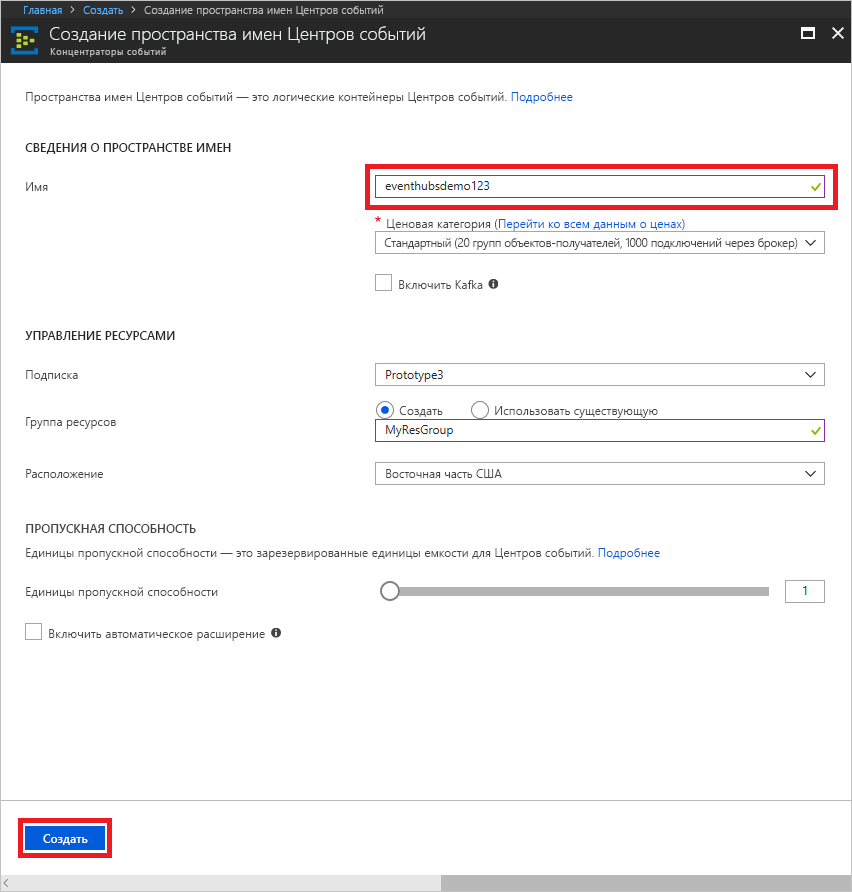
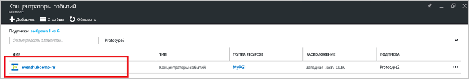
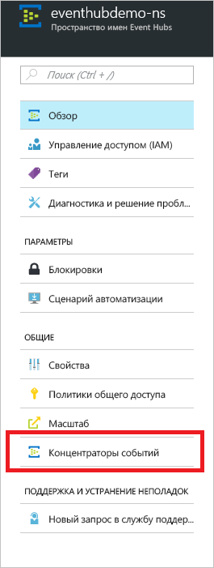
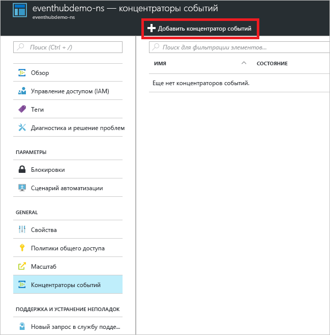
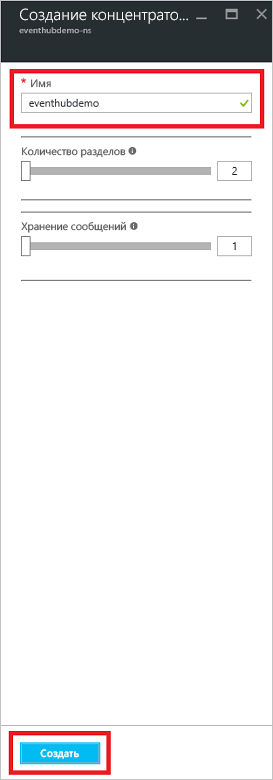
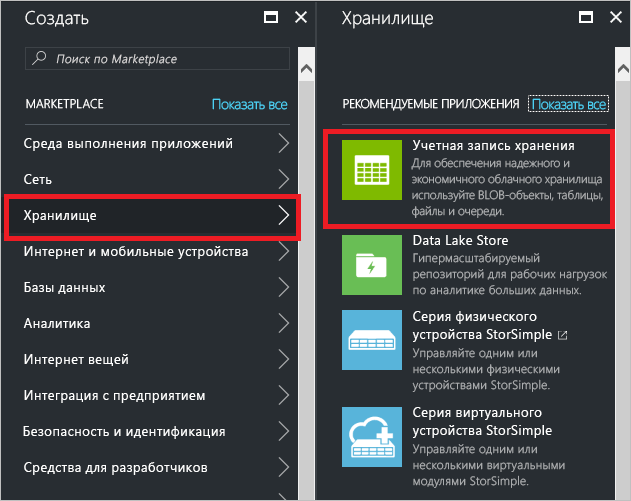
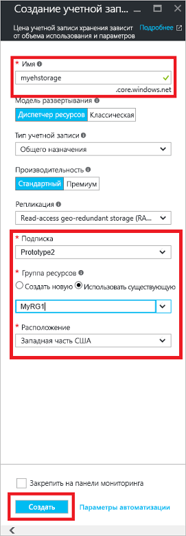
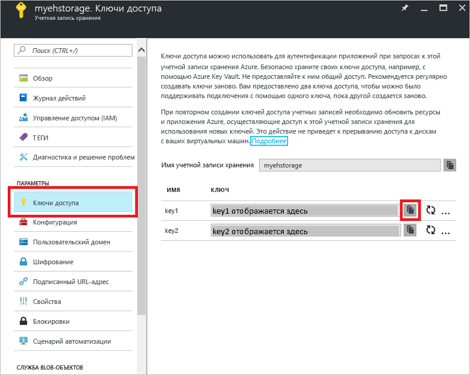

# Краткое руководство. Обработка потоков событий с помощью портал Azure и .NET

Концентраторы событий Azure — это высокомасштабируемая платформа потоковой передачи данных и служба приема событий, принимающая и обрабатывающая миллионы событий в секунду. В этом кратком руководстве показано, как создать концентратор событий с помощью [портал Azure](https://portal.azure.com) и как затем отправлять и получать данные из концентратора событий, используя пакет SDK для .NET Standard.

Для работы с этим кратким руководством вам потребуется подписка Azure. Если у вас еще нет подписки Azure, [создайте бесплатную учетную запись][], прежде чем начать работу.

## Предварительные требования

В рамках этого краткого руководства вам потребуются:

- [Visual Studio 2017 с обновлением 3 (версия 15.3, 26730.01)](http://www.visualstudio.com/vs) или более новая версия.
- [Пакет SDK для .NET Standard](https://www.microsoft.com/net/download/windows) версии 2.0 или более новой.

## Создание группы ресурсов

Группа ресурсов — это логическая коллекция ресурсов Azure. Все ресурсы развертываются и управляются в группе ресурсов. Чтобы создать группу ресурсов, сделайте следующее:

1. В области навигации слева щелкните **Группа ресурсов**. Нажмите кнопку **Добавить**.

   ![][1]

2. Введите уникальное имя группы ресурсов. Система мгновенно проверит, доступно ли имя в текущей выбранной подписке Azure.

3. В разделе **Подписки** щелкните имя подписки Azure, в которой необходимо создать группу ресурсов.

4. Выберите географическое расположение группы ресурсов.

5. Нажмите кнопку **Создать**.

   ![][2]

## Создание пространства имен концентраторов событий

Пространство имен концентраторов событий предоставляет уникальный контейнер, ограничивающий область действия. Вы можете обращаться к этому контейнеру по полному доменному имени и создавать в нем концентраторы событий. Чтобы создать пространство имен в группе ресурсов с использованием портала, сделайте следующее:

1. Войдите на [портал Azure][] и щелкните **Создать ресурс** в левой верхней части экрана.

2. Последовательно выберите **Интернет вещей** и **Концентраторы событий**.

3. В разделе **создания пространства имен** укажите имя пространства имен. Система немедленно проверяет, доступно ли оно.

   

4. Убедившись, что пространство имен доступно, выберите ценовую категорию: "Базовый" или "Стандартный". Также выберите подписку Azure, группу ресурсов и расположение для создания ресурса.
 
5. Щелкните **Создать** , чтобы создать пространство имен. Полная подготовка ресурсов для системы может занять несколько минут.

6. На портале в списке пространств имен щелкните имя только что созданного пространства имен.

7. В колонке **Политики общего доступа** щелкните **RootManageSharedAccessKey**.
    
8. Нажмите кнопку копирования, чтобы скопировать строку подключения **RootManageSharedAccessKey** в буфер обмена. Сохраните эту строку подключения во временном расположении папке, например в Блокноте, для последующего использования.
    
## Создание концентратора событий

Чтобы создать концентратор событий в пространстве имен, сделайте следующее:

1. В списке пространств имен концентраторов событий щелкните созданное пространство имен.      
   
     

2. В окне пространства имен щелкните **Концентраторы событий**.
   
    

1. Щелкните **+ Добавить концентратор событий** в верхней части окна.
   
    
1. Введите имя концентратора событий, а затем щелкните **Создать**.
   
    

Поздравляем! Вы создали пространство имен концентраторов событий и создали концентратор событий в этом пространстве имен с помощью портала.

## Создание учетной записи хранения для узла обработчика событий

Узел обработчика событий представляет собой интеллектуальный агент, который упрощает прием событий от концентраторов событий путем управления постоянными контрольными точками и параллельным приемом. Для создания контрольных точек узлу обработчика событий требуется учетная запись хранения. В следующем примере показано, как создать учетную запись хранения и как получить ключи для доступа:

1. Войдите на [портал Azure][портал Azure] и щелкните **Создать** в левой верхней части экрана.

2. Щелкните **Хранилище**, а затем — **Учетная запись хранения**.
   
    

3. На панели **Создание учетной записи хранения** введите имя учетной записи хранения. Выберите подписку Azure, группу ресурсов и расположение для создания ресурса. Затем щелкните **Создать**.
   
    

4. В списке учетных записей хранения выберите только что созданную учетную запись хранения.

5. В окне учетной записи хранения щелкните **Ключи доступа**. Скопируйте значение **key1**, чтобы использовать его позже.
   
    

## Скачивание и запуск примеров

Следующий шаг заключается в выполнении примера кода, который отправляет события в концентратор событий, а также получает эти события с помощью узла обработчика событий. 

Сначала загрузите примеры [SampleSender](https://github.com/Azure/azure-event-hubs/tree/master/samples/DotNet/Microsoft.Azure.EventHubs/SampleSender) и [SampleEphReceiver](https://github.com/Azure/azure-event-hubs/tree/master/samples/DotNet/Microsoft.Azure.EventHubs/SampleEphReceiver) из GitHub или клонируйте [репозиторий azure-event-hubs](https://github.com/Azure/azure-event-hubs).

### Отправитель

1. Откройте Visual Studio, в меню **Файл** выберите **Открыть** и затем щелкните **Решение или проект**.

2. Найдите папку примера **SampleSender**, который вы скачали ранее, а затем дважды щелкните файл SampleSender.sln, чтобы загрузить проект в Visual Studio.

3. В окне обозревателя решений дважды щелкните файл Program.cs, чтобы открыть его в редакторе Visual Studio.

4. Замените значение `EventHubConnectionString` строкой подключения, полученной при создании пространства имен.

5. Замените значение `EventHubName` именем концентратора событий, созданного в этом пространстве имен.

6. В меню **Сборка** выберите **Собрать решение**, чтобы убедиться в отсутствии ошибок.

### Получатель

1. Откройте Visual Studio, в меню **Файл** выберите **Открыть** и затем щелкните **Решение или проект**.

2. Найдите папку примера **SampleEphReceiver**, который вы скачали на шаге 1, а затем дважды щелкните файл SampleEphReceiver, чтобы загрузить проект в Visual Studio.

3. В окне обозревателя решений дважды щелкните файл Program.cs, чтобы открыть его в редакторе Visual Studio.

4. Замените значения следующих переменных:
    1. `EventHubConnectionString`: замените значение строкой подключения, полученной при создании пространства имен.
    2. `EventHubName`: замените значение именем концентратора событий, созданного в этом пространстве имен.
    3. `StorageContainerName`: имя контейнера хранилища. Присвойте ему уникальное имя, и контейнер будет создан автоматически при запуске приложения.
    4. `StorageAccountName`: имя созданной учетной записи хранения.
    5. `StorageAccountKey`: ключ учетной записи хранения, полученный на портале Azure.

5. В меню **Сборка** выберите **Собрать решение**, чтобы убедиться в отсутствии ошибок.

### Запуск приложений

Сначала запустите приложение **SampleSender** и наблюдайте за тем, как будут отправлены 100 сообщений. Нажмите клавишу **ВВОД**, чтобы закрыть программу.

![][3]

Затем запустите приложение **SampleEphReceiver** и посмотрите, как сообщения поступают в узел обработчика событий.

![][4]
 
## Очистка ресурсов

С помощью портала можно удалить учетную запись хранения, пространство имен и концентратор событий. 

1. На портале Azure щелкните **Все ресурсы** на панели слева. 
2. Щелкните учетную запись хранения или пространство имен, которое требуется удалить. При удалении пространства имен также удаляются все концентраторы событий в этом пространстве имен.
3. В строке меню в верхней части экрана щелкните **Удалить**. Подтвердите удаление. 

## Дальнейшие действия

С помощью этой статьи вы создали пространство имен концентраторов событий и другие ресурсы, необходимые для отправки и получения событий в концентраторе событий. Для получения дополнительных сведений перейдите к следующему руководству:

> [!div class="nextstepaction"]
> [Визуализация аномальных данных в потоках данных концентраторов событий](event-hubs-tutorial-visualize-anomalies.md)

[создайте бесплатную учетную запись]: https://azure.microsoft.com/free/?ref=microsoft.com&utm_source=microsoft.com&utm_medium=docs&utm_campaign=visualstudio
[портал Azure]: https://portal.azure.com/
[1]: ./media/event-hubs-quickstart-portal/resource-groups1.png
[2]: ./media/event-hubs-quickstart-portal/resource-groups2.png
[3]: ./media/event-hubs-quickstart-portal/sender1.png
[4]: ./media/event-hubs-quickstart-portal/receiver1.png
