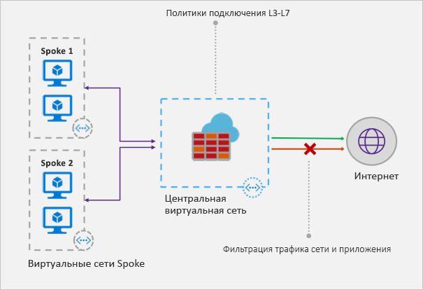

# Что такое брандмауэр Azure?

Брандмауэр Azure — это управляемая облачная служба сетевой безопасности, которая защищает ресурсы виртуальной сети Azure. Брандмауэр разработан как служба с полным отслеживанием состояния со встроенной высокой доступностью и неограниченной облачной масштабируемостью. 

Вы можете централизованно создавать, применять и регистрировать политики приложений и сетевых подключений в подписках и виртуальных сетях. Брандмауэр Azure использует статический общедоступный IP-адрес для виртуальных сетевых ресурсов, позволяя внешним брандмауэрам идентифицировать трафик, исходящий из виртуальной сети.  Служба полностью интегрирована с Azure Monitor для ведения журналов и аналитики.

## Функции

Брандмауэр Azure обеспечивает следующие функции.

### высокую доступность;
Встроен высокий уровень доступности, поэтому не требуются дополнительные подсистемы балансировки нагрузки и ничего не нужно настраивать.

### неограниченную облачную масштабируемость; 
Брандмауэр Azure может увеличивать масштаб настолько, насколько это необходимо для изменения потоков сетевого трафика, поэтому нет необходимости выделять бюджет для пикового трафика.

### Правила фильтрации FQDN для приложений

Можно ограничить исходящий трафик HTTP или HTTPS указанным списком полных доменных имен (FQDN), включая подстановочные знаки. Эта функция не требует завершения SSL-запросов.

### правила фильтрации трафика;

Можно централизованно создавать *разрешение* или *запрет* правил сетевой фильтрации по исходному и целевому IP-адресу, порту и протоколу. Брандмауэр Azure полностью отслеживает состояние, поэтому он может различать правомерные пакеты для разных типов подключений. Правила применяются и регистрируются в нескольких подписках и виртуальных сетях.

### Теги FQDN

Теги FQDN помогают разрешать прохождение трафика известных служб Azure через брандмауэр. К примеру, вам нужно, чтобы брандмауэр пропускал трафик Центра обновления Windows. Вы создаете правило приложения и добавляете тег Центра обновления Windows. Теперь трафик из Центра обновления Windows сможет проходить через брандмауэр.

### поддержку исходящих данных SNAT;

Все исходящие IP-адреса виртуального трафика преобразовываются к общедоступному IP-адресу брандмауэра Azure (преобразование исходных сетевых адресов (NAT)). Можно определить и разрешить трафик, исходящий из виртуальной сети, к удаленным интернет-адресатам.

### Поддержка DNAT для входящего трафика

Входящий трафик, поступающий на общедоступный IP-адрес брандмауэра, преобразуется (этот процесс называется преобразованием сетевых адресов назначения — DNAT) и фильтруется по частным IP-адресам в виртуальных сетях. 

### ведение журналов Azure Monitor;

Все события интегрируются с Azure Monitor, позволяя архивировать журналы в учетную запись хранения, передавать события в концентратор событий или отправлять их в Log Analytics.

## Известные проблемы

В брандмауэре Azure существуют следующие известные проблемы.

|Проблема  |ОПИСАНИЕ  |Устранение  |
|---------|---------|---------|
|Конфликт компонента JIT центра безопасности Azure (ASC)|Если виртуальная машина имеет доступ с помощью JIT и находится в подсети с определенным пользователем маршрутом, который указывает на брандмауэр Azure в качестве шлюза по умолчанию, то JIT ASC не будет работать. Это результат асимметричной маршрутизации — пакет поступает через общедоступный IP-адрес виртуальной машины (JIT открыл доступ), но путь возврата проходит через брандмауэр, который удаляет пакет, потому что на брандмауэре не установлен сеанс.|Чтобы обойти эту проблему, поместите виртуальные машины JIT в отдельную подсеть, которая не имеет определенного пользователем маршрута к брандмауэру.|
|Концентратор и периферийная зона с глобальным пирингом не работают|Звездообразная модель, где концентратор и брандмауэр развернуты в одном регионе Azure, а периферийные зоны — в другом регионе Azure подключены к концентратору через пиринг глобальной виртуальной сети, не поддерживается.|Для получения дополнительной информации см. раздел [Создание, изменение и удаление пиринга в виртуальной сети](https://docs.microsoft.com/azure/virtual-network/virtual-network-manage-peering#requirements-and-constraints)|
Правила сетевой фильтрации для протоколов, которые отличаются от TCP или UDP (например, ICMP), не работают для трафика, связанного с Интернетом|Правила сетевой фильтрации для протоколов, которые отличаются от TCP или UDP, не работают со SNAT для общедоступных IP-адресов. Протоколы, которые отличаются от TCP или UDP, поддерживаются между периферийными зонами подсетей и виртуальной сетью.|Брандмауэр Azure использует Load Balancer (цен. категория "Стандартный"), [который сейчас не поддерживает SNAT для IP-протоколов](https://docs.microsoft.com/azure/load-balancer/load-balancer-standard-overview#limitations). Изучаются варианты поддержки этого сценария в будущем выпуске.|
|Порты 80 и 22 не поддерживают преобразование сетевых адресов назначения (DNAT).|В поле порта назначения в коллекции правил NAT нельзя указывать порт 80 или порт 22.|Мы работаем над скорейшим решением этой проблемы. Пока же используйте другие порты в качестве портов назначения в правилах NAT. Порт 80 или 22 можно по-прежнему использовать в качестве преобразованного порта (например, можно сопоставить общедоступный ip:81 с частным ip:80).|
|

## Дополнительная информация

- [Руководство по развертыванию и настройке службы "Брандмауэр Azure" с помощью портала Azure](tutorial-firewall-deploy-portal.md)
- [Deploy Azure Firewall using a template](deploy-template.md) (Развертывание службы "Брандмауэр Azure" с помощью шаблона)
- [Create an Azure Firewall test environment](scripts/sample-create-firewall-test.md) (Создание тестовой среды службы "Брандмауэр Azure")

