# <a name="quickstart-get-started-with-hadoop-and-hive-in-azure-hdinsight-using-resource-manager-template"></a>Краткое руководство по началу работы с Hadoop и Hive в Azure HDInsight с помощью шаблона Resource Manager

В этой статье вы узнаете, как создать кластеры [Hadoop](http://hadoop.apache.org/) в HDInsight с помощью шаблона Resource Manager, а затем запустить задания Hive в HDInsight. Большинство заданий Hadoop — пакетные. Вы создаете кластер, выполняете несколько заданий, а затем удаляете его. В этой статье будут выполнены все три задачи.

В этом кратком руководстве для создания кластера Hadoop в HDInsight используется шаблон Resource Manager. Кластер можно также создать с помощью [портала Azure](apache-hadoop-linux-create-cluster-get-started-portal.md).

В настоящее время в HDInsight доступно [семь типов кластеров](./apache-hadoop-introduction.md#cluster-types-in-hdinsight). Каждый тип кластера поддерживает свой набор компонентов. Все типы кластеров поддерживают инфраструктуру Hive. Дополнительные сведения о поддерживаемых компонентах в HDInsight см. в статье [Что представляют собой различные компоненты Hadoop, доступные в HDInsight?](../hdinsight-component-versioning.md)  

Если у вас еще нет подписки Azure, [создайте бесплатную учетную запись Azure](https://azure.microsoft.com/free/), прежде чем начинать работу.

<a name="create-cluster"></a>
## <a name="create-a-hadoop-cluster"></a>Создание кластера Hadoop

В этом разделе вы создадите в HDInsight кластер Hadoop, используя шаблон Azure Resource Manager. Знакомство с шаблонами Resource Manager не является обязательным для работы с этой статьей. 

1. Нажмите кнопку **Развертывание в Azure** ниже, чтобы войти в Azure и открыть шаблон Resource Manager на портале Azure. 
   
    <a href="https://portal.azure.com/#create/Microsoft.Template/uri/https%3A%2F%2Fraw.githubusercontent.com%2FAzure%2Fazure-quickstart-templates%2Fmaster%2F101-hdinsight-linux-ssh-password%2Fazuredeploy.json" target="_blank"></a>

2. Введите или выберите значения, как показано на следующем снимке экрана.

    > [!NOTE]
    > Необходимо указать уникальные значения, соответствующие правилам именования. Шаблон не выполняет проверки. Если введенные значения уже используются или не соответствуют правилам именования, после отправки шаблона произойдет ошибка.       
    > 
    >
    
    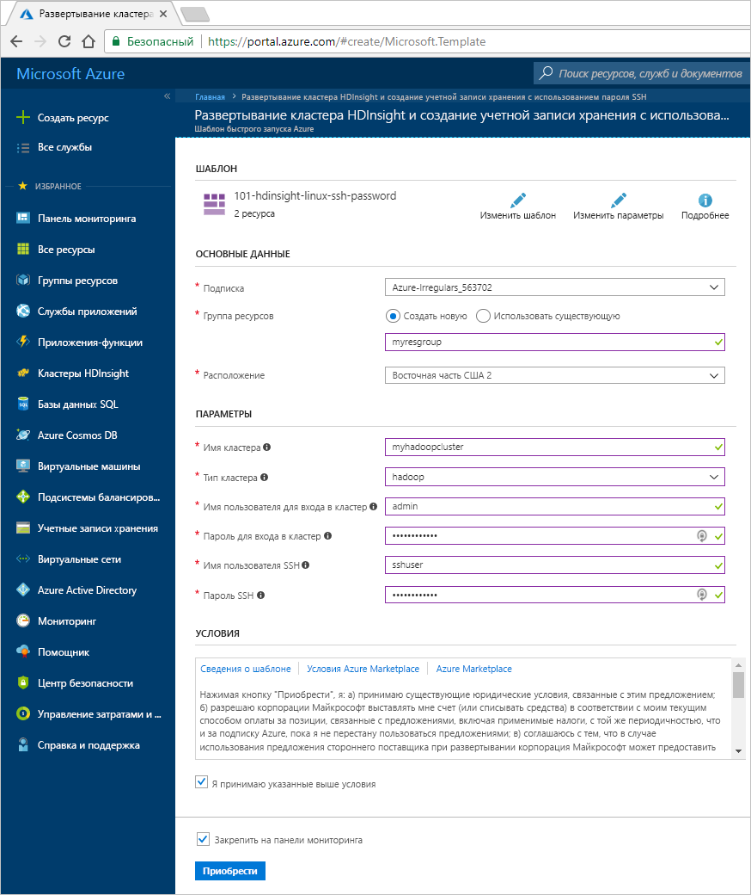

    Введите или выберите следующие значения:
    
    |Свойство  |ОПИСАНИЕ  |
    |---------|---------|
    |**Подписка**     |  Выберите подписку Azure. |
    |**Группа ресурсов**     | Создайте новую группу ресурсов или выберите имеющуюся группу ресурсов.  Группа ресурсов — это контейнер компонентов Azure.  В этом случае группа ресурсов содержит кластер HDInsight и зависимую учетную запись службы хранилища Azure. |
    |**Местоположение.**     | Выберите расположение Azure для создания кластера.  Выберите ближайшее к себе расположение для повышения производительности. |
    |**Тип кластера**     | Выберите **hadoop**. |
    |**Имя кластера**     | Введите имя кластера Hadoop. Так как все кластеры в HDInsight используют одно пространство имен DNS, это имя должно быть уникальным. Имя может содержать до 59 символов, включая буквы, цифры и дефисы. Первый и последний знаки в имени не могут быть дефисами. |
    |**Cluster login name and password** (Имя для входа и пароль для кластера)     | Имя для входа по умолчанию — **admin**. Длина пароля должна составлять не менее 10 символов. Пароль должен содержать по меньшей мере одну цифру, одну прописную и одну строчную буквы, а также один специальный символ (кроме ' " ` \)). Ни в коем случае **не вводите** распространенные пароли, например Pass@word1.|
    |**SSH username and password** (Имя пользователя SSH и пароль)     | Имя пользователя по умолчанию — **sshuser**.  Вы можете изменить имя пользователя SSH.  Для пароля пользователя SSH выдвигаются те же требования, что и для пароля для входа в кластер.|
       
    Некоторые свойства жестко заданы в шаблоне.  Эти значения можно настроить из шаблона. Дополнительные сведения об этих свойствах см. в инструкциях по [созданию кластеров Hadoop в HDInsight](../hdinsight-hadoop-provision-linux-clusters.md).

3. Установите флажки **Я принимаю указанные выше условия** и **Закрепить на панели мониторинга** и нажмите кнопку **Приобрести**. Вы увидите новый элемент **Отправляется развертывание** на панели мониторинга портала. Процесс создания кластера занимает около 20 минут.

    

4. После создания кластера заголовок элемента меняется на имя группы ресурсов, которое вы указали. На элементе также указан кластер HDInsight, созданный в этой группе ресурсов. 
   
    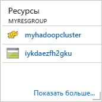
    
5. На элементе также указано хранилище по умолчанию, связанное с кластером. У каждого кластера есть зависимость [учетной записи хранения Azure](../hdinsight-hadoop-use-blob-storage.md) или [учетной записи Azure Data Lake](../hdinsight-hadoop-use-data-lake-store.md). Она называется учетной записью хранения по умолчанию. Кластер HDInsight должен находиться в том же регионе Azure, что и его учетная запись хранения, используемая по умолчанию. Удаление кластеров не приведет к удалению учетной записи хранения.
    

> [!NOTE]
> Сведения о других способах создания кластеров, а также о свойствах, используемых в этом руководстве, см. в статье [Создание кластеров Hadoop под управлением Linux в HDInsight](../hdinsight-hadoop-provision-linux-clusters.md).       
> 
>

## <a name="use-vscode-to-run-hive-queries"></a>Использование VS Code для выполнения запросов Hive

Дополнительные сведения о средствах HDInsight для VS Code см. в статье [Использование средств Azure HDInsight для Visual Studio Code](../hdinsight-for-vscode.md).

### <a name="submit-interactive-hive-queries"></a>Отправка интерактивных запросов Hive

С помощью средств HDInsight для VS Code можно отправлять интерактивные запросы Hive в кластеры интерактивных запросов HDInsight.

1. Создайте рабочую папку и файл сценария Hive, если у вас их еще нет.

2. Подключитесь к учетной записи Azure, а затем настройте кластер по умолчанию, если вы еще этого не сделали.

3. Скопируйте следующий код и вставьте его в файл Hive, а затем сохраните файл.

    ```hiveql
    SELECT * FROM hivesampletable;
    ```
4. Щелкните редактор скриптов правой кнопкой мыши и выберите **HDInsight: Hive Interactive** (HDInsight: интерактивный запрос Hive), чтобы отправить запрос. Средства также позволяют отправить блок кода вместо целого файла сценария с помощью контекстного меню. Вскоре после этого результаты запроса появятся на новой вкладке.

   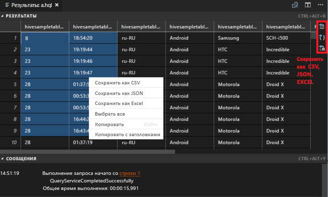

    - Область **результатов**: вы можете сохранить все результаты в виде файла CSV, JSON или Excel по локальному пути или просто выбрать несколько строк.

    - Область **сообщений**: выбрав номер **строки**, можно перейти к нужной строке выполняемого скрипта.

Выполнение интерактивного запроса занимает гораздо меньше времени, чем [выполнение пакетного задания Hive](#submit-hive-batch-scripts).

### <a name="submit-hive-batch-scripts"></a>Отправка пакетных сценариев Hive

1. Создайте рабочую папку и файл сценария Hive, если у вас их еще нет.

2. Подключитесь к учетной записи Azure, а затем настройте кластер по умолчанию, если вы еще этого не сделали.

3. Скопируйте следующий код и вставьте его в файл Hive, а затем сохраните файл.

    ```hiveql
    SELECT * FROM hivesampletable;
    ```
4. Щелкните редактор скриптов правой кнопкой мыши и выберите **HDInsight: Hive Batch** (HDInsight: пакет Hive), чтобы отправить задание Hive. 

5. Выберите кластер для отправки.  

    После отправки задания Hive сведения о состоянии отправки и идентификатор задания появятся в области **вывода**. Задание Hive также открывает **веб-браузер**, в котором показаны журналы заданий и их состояние в режиме реального времени.

   

[Отправка интерактивных запросов Hive](#submit-interactive-hive-queries) происходит намного быстрее, чем отправка пакетного задания.

## <a name="use-visualstudio-to-run-hive-queries"></a>Использование Visual Studio для выполнения запросов Hive

Как получить средства HDInsight в Visual Studio см. в разделе [Use Data Lake Tools for Visual Studio](./apache-hadoop-visual-studio-tools-get-started.md) (Использование средств Data Lake для Visual Studio).

### <a name="run-hive-queries"></a>Выполнение запросов Hive

Есть два способа создания и выполнения запросов Hive.

* Создание ad-hoc-запросов
* Создание приложения Hive

Чтобы создать и выполнить ad-hoc-запросы необходимо выполнить следующие шаги.

1. В **обозревателе сервера** последовательно выберите пункты **Azure** > **Кластеры HDInsight**.

2. Правой кнопкой мыши щелкните кластер, в котором вы хотите выполнить запрос, и выберите **Write a Hive Query** (Написать запрос Hive).  

3. Введите запросы Hive. 

    Редактор Hive поддерживает технологию IntelliSense. Средства Data Lake для Visual Studio поддерживают загрузку удаленных метаданных при редактировании скрипта Hive. Например, если ввести **SELECT * FROM**, IntelliSense отобразит все предлагаемые имена таблиц. Если указано имя таблицы, IntelliSense выведет список имен столбцов. Эти инструменты поддерживают почти все инструкции, подзапросы и встроенные определяемые пользователем функции Hive DML.
   
    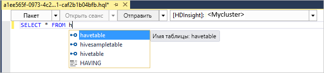
   
    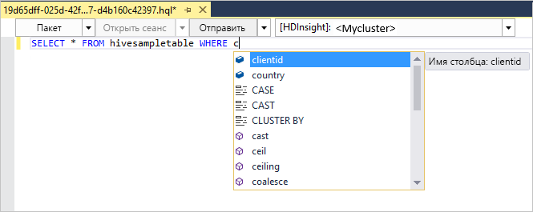
   
   > [!NOTE]
   > IntelliSense предлагает только метаданные кластеров, выбранных на панели инструментов HDInsight.
   > 
   
4. Выберите **Отправить** или выполните **расширенную отправку**. 
   
    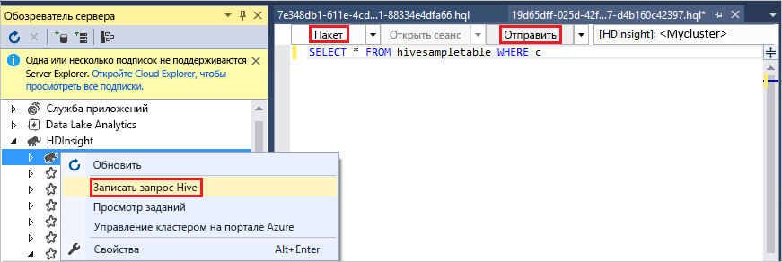

   С помощью расширенной отправки можно настроить **имя задания**, **аргументы**, **дополнительные конфигурации** и **каталог состояния** скрипта.

    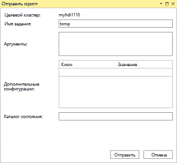

   Выполнение интерактивных запросов Hive

   * Чтобы выбрать **интерактивный**, щелкните стрелку вниз. 
   
   * Нажмите **Execute (Выполнить)**.

   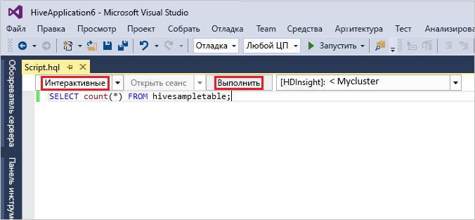

Для создания и запуска решения Hive сделайте следующее:

1. В меню **Файл** выберите **Создать**, а затем — **Проект**.
2. В левой области выберите **HDInsight**. В средней области выберите **Hive Application** (Приложение Hive). Введите свойства, а затем нажмите кнопку **ОК**.
   
    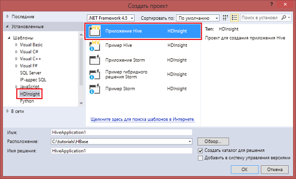
3. В **обозревателе решений** дважды щелкните файл **Script.hql**, чтобы открыть его.
4. После введения запросов Hive их необходимо отправить. (См. предыдущие шаги 3 и 4)  


## <a name="run-hive-queries"></a>Выполнение запросов Hive

[Apache Hive](hdinsight-use-hive.md) — это самый популярный компонент службы HDInsight. Существует множество способов выполнения заданий Hive в HDInsight. В этом руководстве используется представление Hive Ambari на портале. Другие способы отправки заданий Hive описаны в статье [Использование Hive в HDInsight](hdinsight-use-hive.md).

1. Чтобы открыть Ambari, на предыдущем экране выберите **Панель мониторинга кластера**.  Вы можете также перейти по ссылке **https://&lt;ClusterName>.azurehdinsight.net**, где &lt;ClusterName> — это кластер, созданный в предыдущем разделе.

    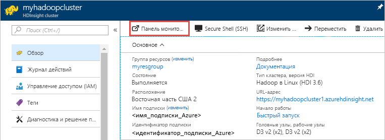

2. Введите имя пользователя Hadoop и пароль, указанные при создании кластера. Имя пользователя по умолчанию — **admin**.

3. Откройте **представление Hive** , как показано на снимке экрана ниже:
   
    

4. На вкладке **Запрос** вставьте в лист следующие инструкции HiveQL:
   
        SHOW TABLES;

    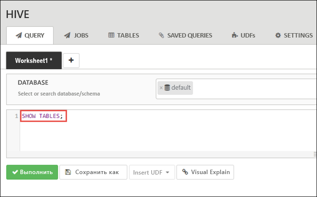
   
   > [!NOTE]
   > Для Hive требуется точка с запятой.       
   > 
   > 

5. Нажмите кнопку **Execute**(Выполнить). Вкладка **Результаты** отобразится под вкладкой **Запрос** с информацией о задании. 
   
    Когда запрос будет выполнен, на вкладке **Запрос** появятся результаты этой операции. Вы увидите одну таблицу с именем **hivesampletable**. Этот пример таблицы Hive входит в состав всех кластеров HDInsight.
   
    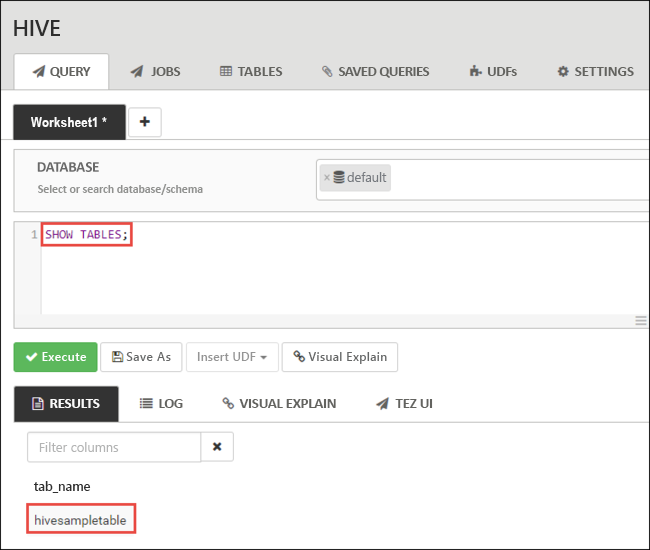

6. Повторите шаги 4 и 5 и выполните следующий запрос.
   
        SELECT * FROM hivesampletable;
   
7. Вы также можете сохранить результаты запроса. Нажмите кнопку меню справа и укажите, как это следует сделать: скачать результаты в качестве CSF-файла или сохранить их в учетной записи хранения, связанной с кластером.

    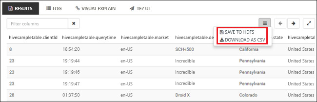

Когда задание Hive будет завершено, вы сможете [экспортировать результаты в базу данных SQL Azure или базу данных SQL Server](apache-hadoop-use-sqoop-mac-linux.md) либо [визуализировать их с помощью Excel](apache-hadoop-connect-excel-power-query.md). Дополнительные сведения об использовании Hive в HDInsight см. в статье [Использование Hive и HiveQL с Hadoop в HDInsight для анализа примера файла Apache log4j](hdinsight-use-hive.md).

## <a name="troubleshoot"></a>Устранение неполадок

Если при создании кластеров HDInsight возникли проблемы, см. раздел [Создание кластеров](../hdinsight-administer-use-portal-linux.md#create-clusters).

## <a name="clean-up-resources"></a>Очистка ресурсов
После завершения работы с этой статьей кластер можно удалить. В случае с HDInsight ваши данные хранятся в службе хранилища Azure, что позволяет безопасно удалить неиспользуемый кластер. Плата за кластеры HDInsight взимается, даже когда они не используются. Поскольку стоимость кластера во много раз превышает стоимость хранилища, экономически целесообразно удалять неиспользуемые кластеры. 

> [!NOTE]
> Если вы *сразу же* перейдете к следующему руководству, чтобы узнать, как выполнять операции извлечения, преобразования и загрузки, то можете не прерывать работу кластера. Дело в том, что в этом руководстве вам придется повторно создать кластер. Но если вы не собираетесь немедленно приступать к изучению следующего руководства, то нужно удалить кластер.
> 
> 

**Удаление кластера и/или учетной записи хранения по умолчанию**

1. Вернитесь на вкладку браузера, где открыт портал Azure. Откройте страницу обзора кластера. Если требуется удалить кластер и сохранить учетную запись хранения по умолчанию, щелкните **Удалить**.

    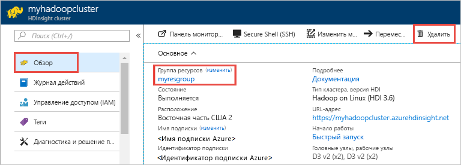

2. Если вам нужно удалить кластер и учетную запись хранения по умолчанию, выберите имя группы ресурсов (выделено на предыдущем снимке экрана), чтобы открыть страницу группы ресурсов.

3. Выберите **Удалить группу ресурсов**, чтобы удалить группу ресурсов, которая содержит кластер и учетную запись хранения по умолчанию. Обратите внимание, что удаление группы ресурсов приводит к удалению учетной записи хранения. Если вы хотите сохранить учетную запись хранения, удалите только кластер.

## <a name="next-steps"></a>Дополнительная информация
В этой статье вы узнали, как с помощью шаблона Resource Manager создать кластер HDInsight под управлением Linux и как выполнять базовые запросы Hive. В следующей статье вы узнаете, как выполнять операции извлечения, преобразования и загрузки с помощью Hadoop в HDInsight.

> [!div class="nextstepaction"]
>[Извлечение, преобразование и загрузка данных с помощью Apache Hive в HDInsight](../hdinsight-analyze-flight-delay-data-linux.md)

Если вы готовы приступить к работе с собственными данными и хотите узнать больше о том, как HDInsight сохраняет данные или как получать данные в HDInsight, см. сведения в статьях ниже:

* Сведения о том, как HDInsight использует службу хранилища Azure, см. в статье [Использование HDFS-совместимой службы хранилища с Hadoop в HDInsight](../hdinsight-hadoop-use-blob-storage.md).
* Сведения об отправке данных в HDInsight см. в статье [Отправка данных для заданий Hadoop в HDInsight](../hdinsight-upload-data.md).

Дополнительные сведения об анализе данных с помощью HDInsight см. в следующих статьях.

* Дополнительные сведения об использовании Hive с HDInsight, включая выполнение запросов Hive из Visual Studio, см. в [этой статье](hdinsight-use-hive.md).
* Дополнительные сведения о Pig — языке, который используется для преобразования данных, — см. в статье [Использование Pig с Hadoop в HDInsight](hdinsight-use-pig.md).
* Дополнительные сведения о MapReduce, — способе написания программ, которые обрабатывают данные в Hadoop, — см. в статье [Использование MapReduce в Hadoop в HDInsight](hdinsight-use-mapreduce.md).
* Дополнительные сведения об анализе данных в HDInsight с помощью средств HDInsight для Visual Studio см. в статье [Приступая к работе с инструментами Hadoop в Visual Studio для HDInsight для выполнения запроса Hive](apache-hadoop-visual-studio-tools-get-started.md).
* Дополнительные сведения о HDInsight для VS Code, который используется для анализа данных HDInsight, см. в статье [Использование средств Azure HDInsight для Visual Studio Code](../hdinsight-for-vscode.md).


Дополнительные сведения о создании кластера HDInsight и управлении этим кластером см. в следующих статьях:

* Сведения об управлении кластером HDInsight под управлением Linux см. в статье [Управление кластерами HDInsight с помощью веб-интерфейса Ambari](../hdinsight-hadoop-manage-ambari.md).
* Дополнительные сведения о параметрах, которые можно выбрать при создании кластера HDInsight, см. в статье [Создание кластеров Hadoop под управлением Linux в HDInsight](../hdinsight-hadoop-provision-linux-clusters.md).


[1]: ../HDInsight/apache-hadoop-visual-studio-tools-get-started.md

[hdinsight-provision]: hdinsight-provision-linux-clusters.md
[hdinsight-upload-data]: hdinsight-upload-data.md
[hdinsight-use-hive]: hdinsight-use-hive.md
[hdinsight-use-pig]: hdinsight-use-pig.md


