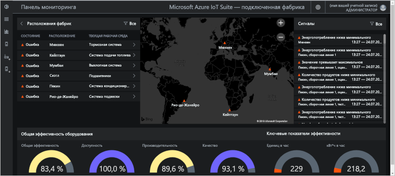
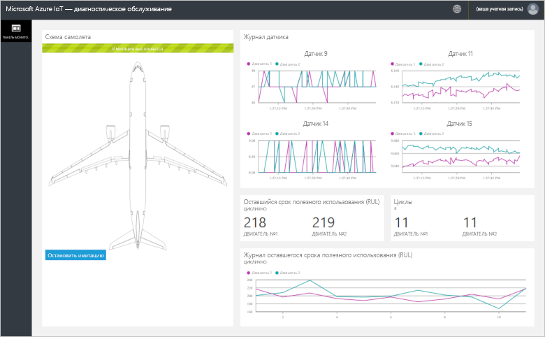
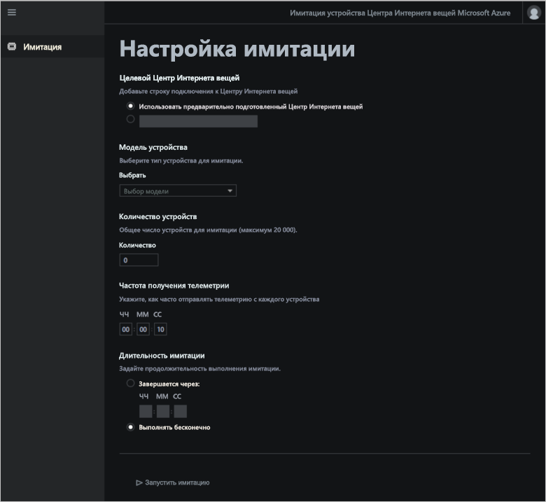

# Что такое акселераторы решений Интернета вещей Azure?

Облачные решения Интернета вещей обычно используют пользовательский код и несколько облачных служб для управления подключением устройств, обработки данных, аналитики и представления.

Акселераторы решений Интернета вещей представляют собой коллекцию полноценных, готовых к развертыванию решений Интернета вещей, реализующих распространенные сценарии, например сценарии удаленного мониторинга, подключенной фабрики, прогнозного обслуживания и имитации устройств. При развертывании акселератора решений вы получите все необходимые облачные службы вместе со всем необходимым кодом приложения.

Акселераторы решений являются отправной точкой для разработки собственных решений Интернета вещей. Исходный код всех акселераторов решений является открытым и доступен в GitHub. Рекомендуется загрузить и настроить акселераторы решений в соответствии с вашими требованиями.

Акселераторы решений также можно использовать для обучения перед созданием своего собственного решения для Интернета вещей с нуля. В акселераторах решений реализованы традиционные подходы для облачных решений Интернета вещей, которым нужно следовать.

Код приложения в каждом акселераторе решений включает веб-приложение, которое позволяет управлять им.

## Поддерживаемые сценарии Интернета вещей

В настоящее время для развертывания доступны четыре акселератора решений:

### Удаленный мониторинг

Используйте этот акселератор решений для сбора данных телеметрии из нескольких удаленных устройств и управления ими. Примеры устройств включают системы охлаждения, установленные у ваших заказчиков, или клапаны, установленные на удаленных насосных станциях.

С помощью панели удаленного мониторинга можно просмотреть данные телеметрии с подключенных устройств, подготовить новые устройства или обновить встроенное программное обеспечение на подключенных устройствах.

### Подключенная фабрика

Используйте этот акселератор решений для сбора данных телеметрии с промышленных объектов с помощью интерфейса [унифицированной архитектуры OPC](https://opcfoundation.org/about/opc-technologies/opc-ua/) и управления ими. Промышленные объекты могут включать сборочные и испытательные установки на производственной линии завода.

Панель мониторинга подключенного производства можно использовать для отслеживания и управления производственными устройствами.

### Прогнозное обслуживание

Используйте этот акселератор решений для прогнозирования, когда предположительно произойдет сбой удаленного устройства, чтобы можно было выполнить его обслуживание до наступления этого момента. Этот акселератор решений использует алгоритмы машинного обучения для прогнозирования сбоев на основании данных телеметрии устройства. Примером таким устройств могут служить двигатели самолетов или лифты.

Панель мониторинга диагностического обслуживания можно использовать для просмотра аналитики диагностического обслуживания.

### Имитация устройства

Используйте этот акселератор решений для запуска нескольких виртуальных устройств, которые генерируют реалистичную телеметрию. Этот акселератор решений можно использовать для тестирования поведения других акселераторов решений или для тестирования собственных решений Интернета вещей.

С помощью веб-приложения имитации устройства можно настраивать и запускать моделирования.

## Принципы проектирования

Все акселераторы решений следуют одним и тем же принципам проектирования и целям использования. Они спроектированы, чтобы быть:

* **Масштабируемыми**, позволяя подключать и управлять миллионами устройств.
* **Расширяемыми**, позволяя настраивать их в соответствии с вашими требованиями.
* **Понятными**, позволяя понять, как они работают и как реализованы.
* **Модульными**, позволяя заменять службы на альтернативные.
* **Защищенными**, соединяя в себе безопасность Azure со встроенными функциями безопасности для подключений и устройств.

## Архитектуры и языки

Изначально акселераторы решений были написаны на .NET с использованием архитектуры "модель-представление-контроллер" (MVC). Корпорация Майкрософт переводит акселераторы решений на новую архитектуру на основе микрослужб. В таблице ниже показано текущее состояние для акселераторов решений со ссылками на репозитории GitHub.

| Акселератор решений   | Архитектура  | Языки     |
| ---------------------- | ------------- | ------------- |
| Удаленный мониторинг      | Микрослужбы | [Java](https://github.com/Azure/azure-iot-pcs-remote-monitoring-java) и [.NET](https://github.com/Azure/azure-iot-pcs-remote-monitoring-dotnet) |
| Прогнозное обслуживание | MVC           | [.NET](https://github.com/Azure/azure-iot-predictive-maintenance)          |
| Подключенная фабрика      | MVC           | [.NET](https://github.com/Azure/azure-iot-connected-factory)          |
| Имитация устройства      | Микрослужбы | [.NET](https://github.com/Azure/device-simulation-dotnet)          |

Дополнительные сведения об архитектурах микрослужб см. на странице [архитектуры приложения для .NET](https://www.microsoft.com/net/learn/architecture), а также в записи блога, посвященной [возможностям микрослужб для приложений на базе облака](https://azure.microsoft.com/blog/microservices-an-application-revolution-powered-by-the-cloud/).

## Варианты развертывания

Акселераторы решений можно развертывать с сайта [Microsoft Azure IoT Solution Accelerators](https://www.azureiotsolutions.com/Accelerators#) (Акселераторы решений Интернета вещей Microsoft Azure) или с помощью командной строки.

Акселератор решения удаленного мониторинга можно развернуть в следующих конфигурациях.

* **Стандартный.** Развертывание расширенной инфраструктуры для разработки развертывания в рабочей среде. С помощью Службы контейнеров Azure можно развернуть микрослужбы на нескольких виртуальных машинах Azure. Kubernetes управляет контейнерами Docker, на которых размещаются отдельные микрослужбы.
* **Базовый.** Версия с низкой стоимостью для демонстрации или тестирования развертывания. Все микрослужбы развертываются на одной виртуальной машине Azure.
* **Локальный.** Развертывание на локальном компьютере для тестирования и разработки. При этом подходе выполняется развертывание микрослужб в локальном контейнере Docker и подключение к облачным службам: Центр Интернета вещей, база данных Azure Cosmos DB и служба хранения Azure.

Стоимость запуска акселератора решений — это [общая стоимость базовых служб Azure](https://azure.microsoft.com/pricing). При выборе параметров развертывания отображаются сведения об используемых службах Azure.

## Дополнительная информация

Чтобы опробовать один из акселераторов решений Интернета вещей, см. следующие краткие руководства.

* [Краткое руководство. Использование облачного решения для удаленного мониторинга](quickstart-remote-monitoring-deploy.md)
* [Краткое руководство. Пробное использование облачного решения для управления промышленными устройствами Центра Интернета вещей](quickstart-connected-factory-deploy.md)
* [Краткое руководство. Использование облачных решений для анализа прогнозного обслуживания на подключенных устройствах](quickstart-predictive-maintenance-deploy.md)
* [Краткое руководство по развертыванию и запуску решения "Симулятор устройств" на основе облака](quickstart-device-simulation-deploy.md)
