# Краткое руководство. Пробное использование облачного решения для управления промышленными устройствами Цента Интернета вещей

В этом кратком руководстве показано, как развернуть решение подключенной фабрики Цента Интернета вещей Azure для моделирования облачного мониторинга промышленных устройств Центра Интернета вещей и управления ими. Развертывание акселератора решений для подключенной фабрики уже содержит имитируемые ресурсы, которые позволяют выполнять распространенный промышленный сценарий Центра Интернета вещей. Несколько имитированных фабрик, подключенных к решению, передают значения данных, необходимые для расчета общей эффективности оборудования (OEE) и ключевых показателей эффективности (КПЭ). В этом кратком руководстве показано, как использовать панель мониторинга для:

* мониторинга фабрик, производственных линий, общей эффективности оборудования узла и значений ключевых показателей эффективности;
* анализа данных телеметрии, полученных с этих устройств;
* реагирования на оповещения.

Для работы с этим кратким руководством вам потребуется действующая подписка Azure.

Если у вас еще нет подписки Azure, [создайте бесплатную учетную запись Azure](https://azure.microsoft.com/free/?WT.mc_id=A261C142F), прежде чем начинать работу.

## Развертывание решения

Когда вы будете развертывать акселератор решения в подписке Azure, необходимо указать некоторые параметры конфигурации.

Войдите на сайт [azureiotsolutions.com](https://www.azureiotsolutions.com/Accelerators) с использованием данных учетной записи Azure.

На плитке **Подключенная фабрика** щелкните **Попробовать**.

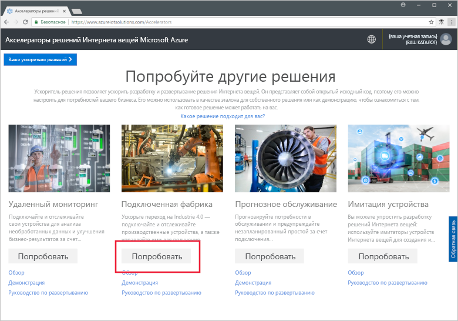

На странице **Create Connected Factory solution** (Создание решения подключенной фабрики) введите уникальное **имя решения** для акселератора решения подключенной фабрики. Это имя решения также будет именем группы ресурсов Azure, содержащей различные ресурсы акселератора. В этом кратком руководстве мы назовем решение **MyDemoConnectedFactory**.

Выберите **подписку** и **регион**, которые необходимо использовать для развертывания акселератора решений. Вы можете выбрать ближайший к вам регион. Здесь используется **Visual Studio Enterprise** и **Восточная часть США**. Вы должны быть [глобальным администратором или пользователем](iot-accelerators-permissions.md) в подписке.

Щелкните **Создать решение**, чтобы начать развертывание. Этот процесс занимает по крайней мере пять минут:

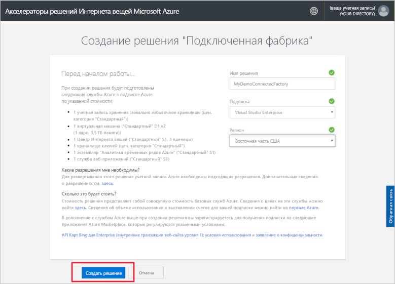

## Вход в решение

После завершения развертывания в подписке Azure появится зеленая галочка и надпись **Готово** на плитке решения. Теперь вы можете войти на панель мониторинга акселератора решений для подключенной фабрики.

На странице **Подготовленные решения** щелкните новый акселератор решения для подключенной фабрики:

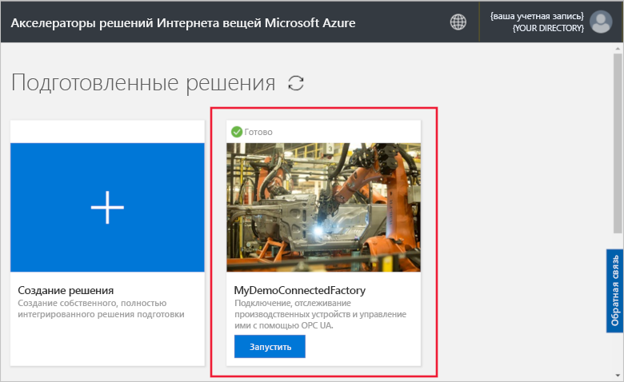

Вы можете просмотреть сведения об акселераторе решения для подключенной фабрики на отобразившейся панели. Чтобы просмотреть акселератор решения для подключенной фабрики, выберите **Панель мониторинга решений**:

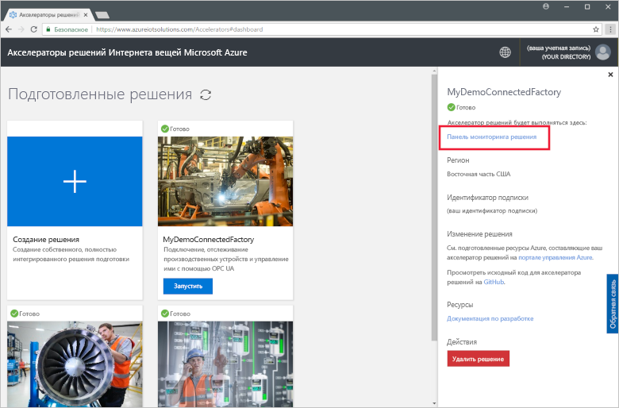

Щелкните **Принять**, чтобы принять запрос на разрешения, и в браузере отобразится панель мониторинга решения для подключенной фабрики. Здесь отображается набор имитаций фабрик, производственных линий и станций.

## Просмотр панели мониторинга

*Панель мониторинга* является представлением по умолчанию. Чтобы перейти к другим областям портала, используйте меню в левой части страницы:

[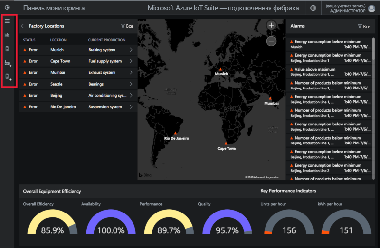](./media/quickstart-connected-factory-deploy/dashboard-expanded.png#lightbox)

Панель мониторинга используется для управления промышленными устройствами Центра Интернета вещей. Подключенная фабрика использует иерархию, чтобы представить глобальную конфигурацию фабрик. На верхнем уровне иерархии находится предприятие, которое владеет одной или несколькими фабриками, каждая фабрика содержит производственные линии, а каждая производственная линия состоит из станций. На каждом уровне можно просматривать значения общей эффективности оборудования и ключевых показателей эффективности, публиковать новые узлы для передачи телеметрии и реагировать на оповещения.

На панели мониторинга можно увидеть следующее.

## Общая эффективность оборудования

На панели **Общая эффективность оборудования** отображаются соответствующие значения для всего предприятия, фабрики, производственной линии или станции, которые вы просматриваете. Это значение агрегируется из представления узла с представлением уровня предприятия. Показатель общей эффективности оборудования и его составные элементы в дальнейшем можно проанализировать.

[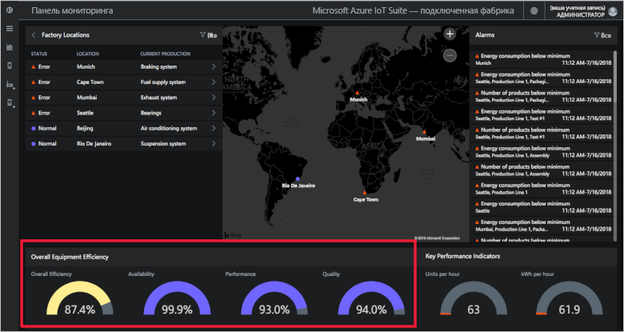](./media/quickstart-connected-factory-deploy/oee-expanded.png#lightbox)

Значение общей эффективности оборудования определяет эффективность производственного процесса с помощью параметров работоспособности. Общая эффективность оборудования является стандартной рабочей мерой, которая вычисляется путем умножения значений уровня доступности, производительности и качества (общая эффективность оборудования = доступность x качество x производительность).

Можно дополнительно проанализировать общую эффективность оборудования для любого уровня в иерархии данных. Щелкните элемент с процентом общей эффективности оборудования, доступности, производительности либо качества. Отобразится контекстная панель с визуализациями, которые отображают данные на разных шкалах времени:

[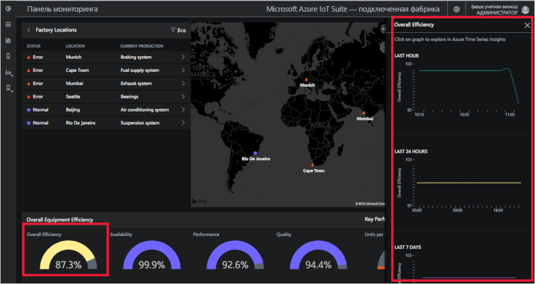](./media/quickstart-connected-factory-deploy/oeedetail-expanded.png#lightbox)

Вы можете щелкнуть диаграмму, чтобы выполнить дальнейший анализ данных.

### Ключевые показатели эффективности

На панели **Ключевые показатели эффективности** отображается количество произведенной продукции в час и количество энергии (кВт/ч), потребляемой всем предприятием, фабрикой, производственной линией или станцией, которые вы просматриваете. Эти значения агрегируются из представления станции с уровнем предприятия.

[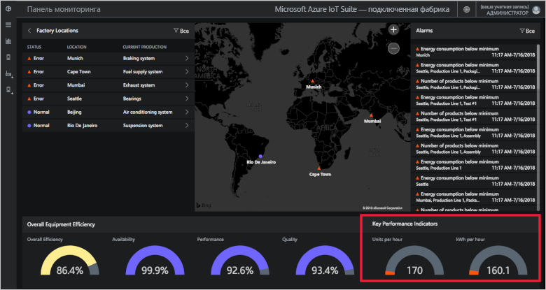](./media/quickstart-connected-factory-deploy/kpis-expanded.png#lightbox)

Можно дополнительно проанализировать ключевые показатели эффективности для любого уровня в иерархии данных. Щелкните элемент с процентом общей эффективности оборудования, доступности, производительности либо качества. Отобразится контекстная панель с визуализациями, которые отображают данные на разных шкалах времени:

[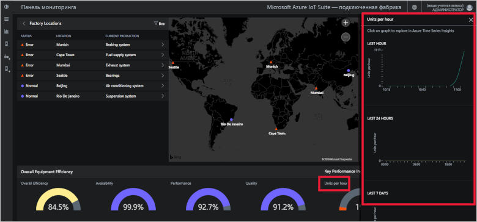](./media/quickstart-connected-factory-deploy/kpidetail-expanded.png#lightbox)

Вы можете щелкнуть диаграмму, чтобы выполнить дальнейший анализ данных.

### Расположения фабрик

На панели **Расположения фабрик** отображается состояние, расположение и текущая рабочая конфигурация решения. При первом запуске акселератора решений на панели мониторинга отображается имитируемый набор фабрик. Имитация производственной линии состоит из трех физических серверов на основе унифицированной архитектуры (UA) OPC, которые выполняют имитирующие задачи и обмениваются данными. Дополнительные сведения об OPC UA см. в статье [Часто задаваемые вопросы об акселераторе решения "Подключенная фабрика"](iot-accelerators-faq-cf.md).

[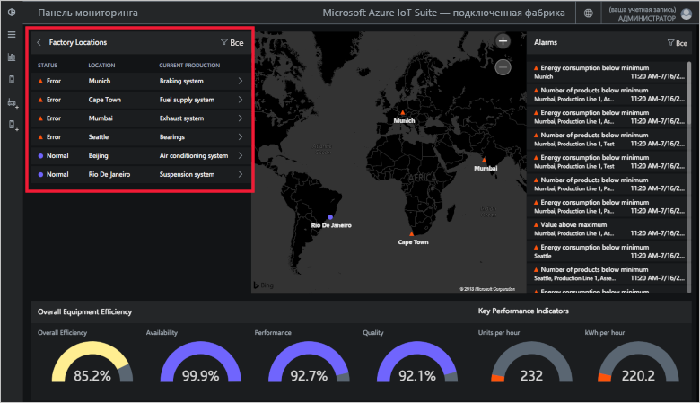](./media/quickstart-connected-factory-deploy/factorylocations-expanded.png#lightbox)

Можно перемещаться по иерархии решения и просматривать значения общей эффективности оборудования и ключевых показателей эффективности на каждом уровне.

1. На вкладке **Расположения фабрик** щелкните **Мумбаи**. Появятся производственные линии в этом расположении.

1. Щелкните **Производственная линия 1**. Вы увидите станции этой производственной линии.

1. Щелкните **Упаковка**. Отобразятся узлы OPC UA, опубликованные для этой станции.

1. Щелкните **EnergyConsumption**. Вы увидите несколько диаграмм, где это значение отображено на разных шкалах времени. Вы можете щелкнуть диаграмму, чтобы выполнить дальнейший анализ данных.

[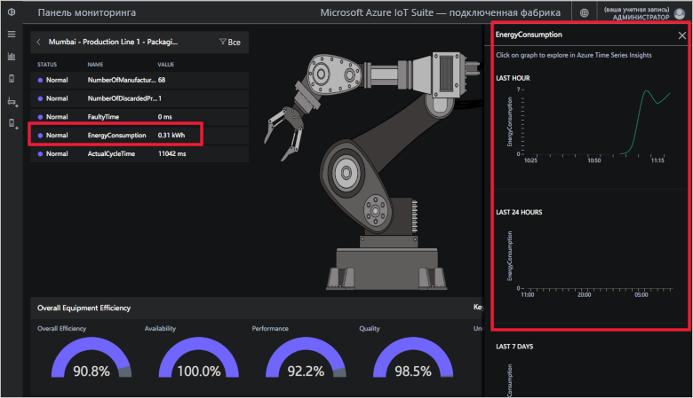](./media/quickstart-connected-factory-deploy/explorelocations-expanded.png#lightbox)

### Сопоставление

Если ваша подписка имеет доступ к [API для Карт Bing](iot-accelerators-faq-cf.md), на карте *фабрик* отобразится географическое расположение и состояние всех фабрик в решении. Щелкните расположение на карте, чтобы просмотреть подробную информацию о нем.

[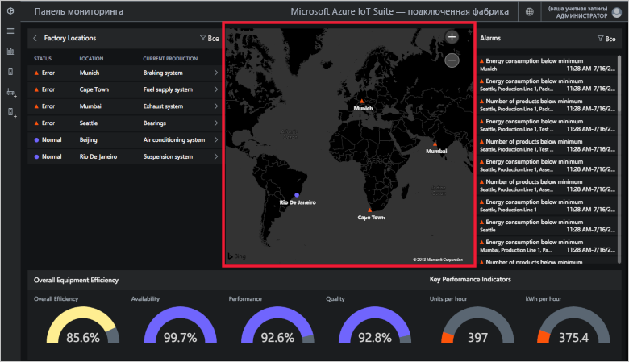](./media/quickstart-connected-factory-deploy/map-expanded.png#lightbox)

### Оповещения

На панели **оповещений** отображаются сигналы о сообщаемом или вычисленном значении общей эффективности оборудования или ключевых показателей эффективности, превышающие заданное пороговое значение. На этой панели отображаются оповещения на каждом уровне иерархии, от уровня представления станции до предприятия. Оповещения содержат описание, дату, время, расположение и число повторений.

[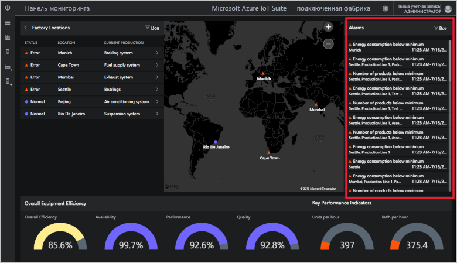](./media/quickstart-connected-factory-deploy/alarms-expanded.png#lightbox)

Вы можете проанализировать данные, вызвавшие оповещение, на панели мониторинга. При возникновении оповещений администратор может предпринять следующие действия по умолчанию.

* Закрыть оповещение.
* Подтвердить оповещение.

Щелкните одно из оповещений в раскрывающемся списке **Выбрать действие**, выберите **Подтвердить оповещение** и нажмите кнопку **Применить**:

[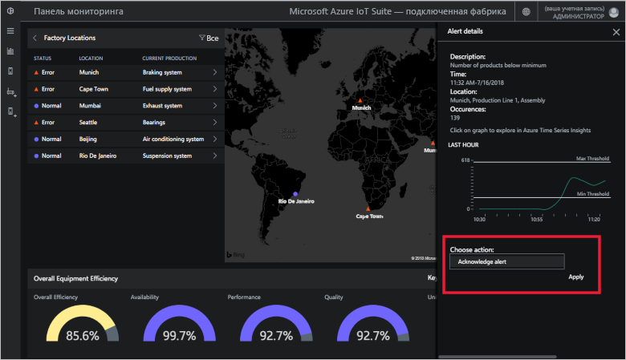](./media/quickstart-connected-factory-deploy/acknowledge-expanded.png#lightbox)

Чтобы дополнительно проанализировать данные оповещения, щелкните диаграмму на панели оповещений.

Эти оповещения создаются по правилам, указанным в файле конфигурации акселератора решений. Эти правила позволяют создавать оповещения, если значения общей эффективности оборудования, ключевых показателей эффективности или значения узлов на основе унифицированной архитектуры OPC превышают заданное пороговое значение.

## Очистка ресурсов

Если вы планируете продолжить изучение, не удаляйте развернутый акселератор решения для подключенной фабрики.

Если акселератор решений больше не требуется, удалите его на странице [Подготовленные решения](https://www.azureiotsolutions.com/Accelerators#dashboard), выбрав его, а затем щелкнув **Удалить решение**:

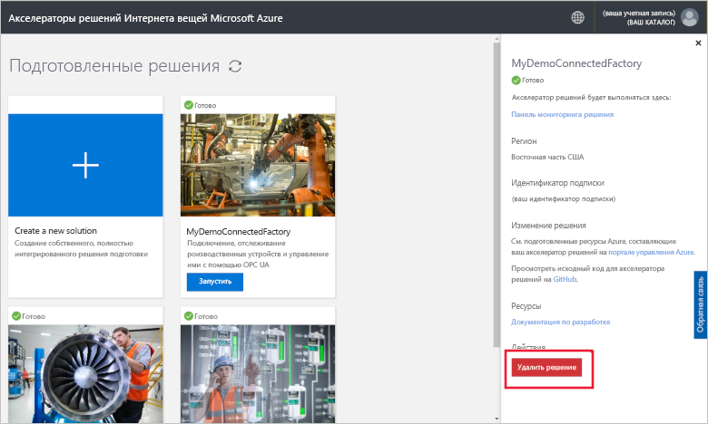

## Дополнительная информация

В этом кратком руководстве вы развернули решение акселератора для подключенной фабрики и научились переходить между фабриками, производственными линиями и станциями. Вы также узнали, как просматривать значения общей эффективности оборудования и ключевых показателей эффективности на любом уровне иерархии и как реагировать на оповещения.

Чтобы узнать, как использовать другие функции панели мониторинга для управления промышленными устройствами Центра Интернета вещей, перейдите к следующему руководству:

> [!div class="nextstepaction"]
> [Руководство по использованию панели мониторинга подключенной фабрики](iot-accelerators-connected-factory-dashboard.md)