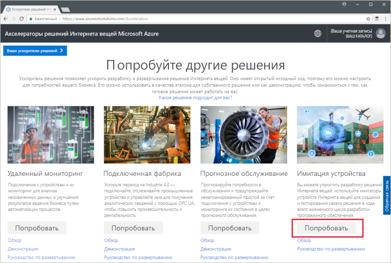
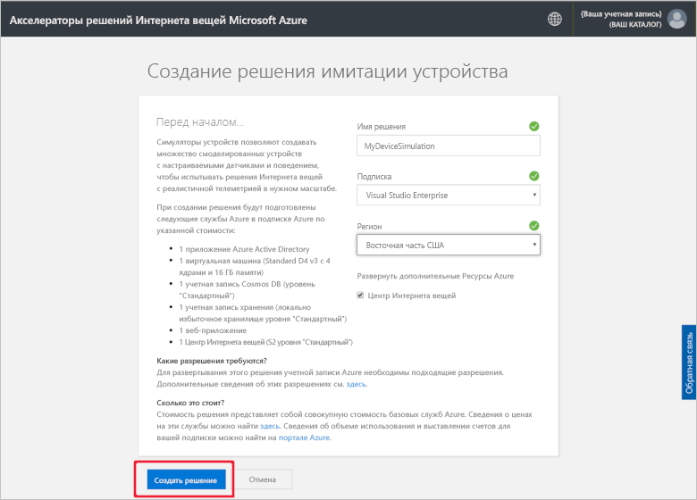
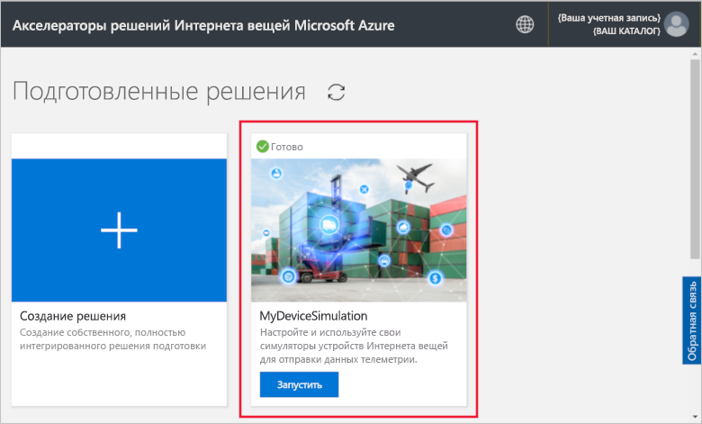
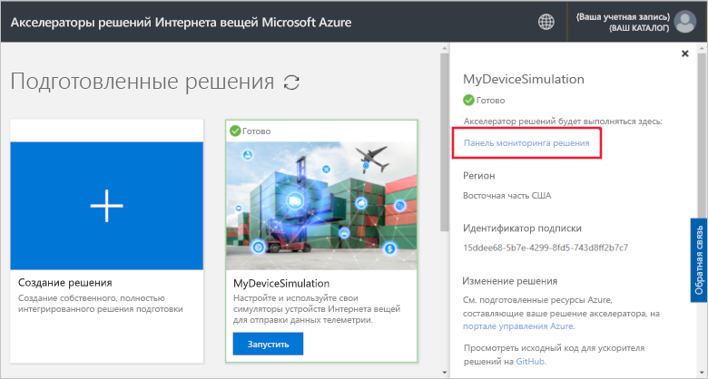
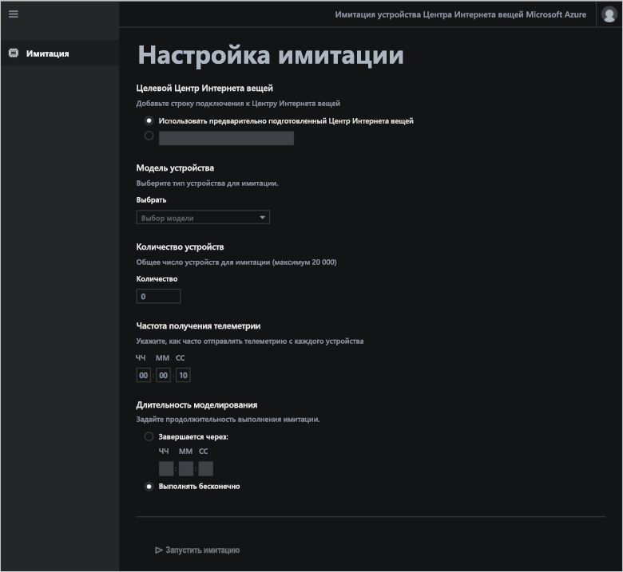
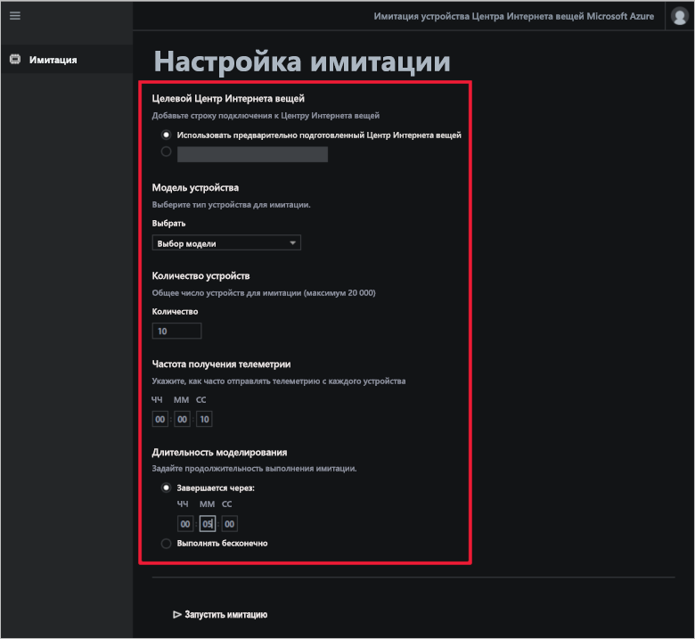
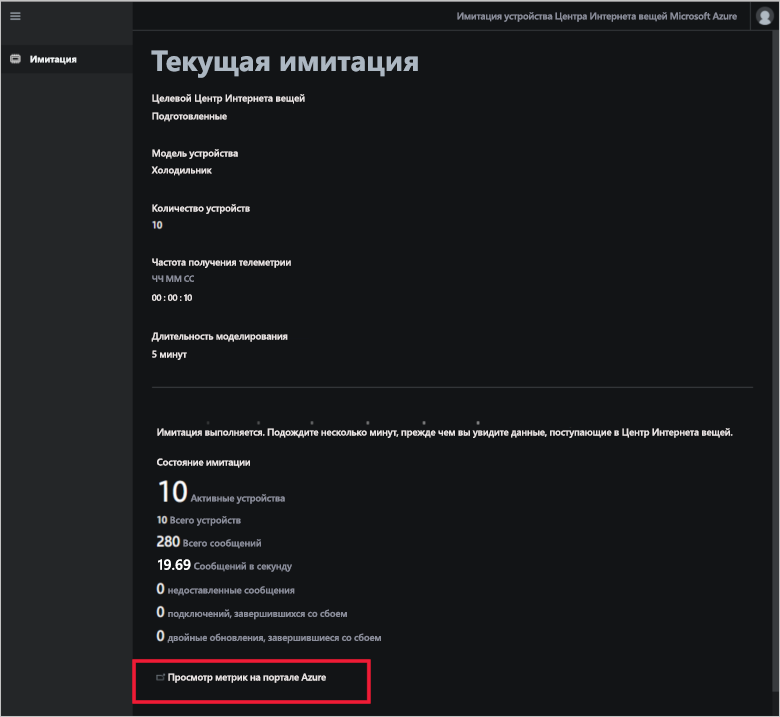
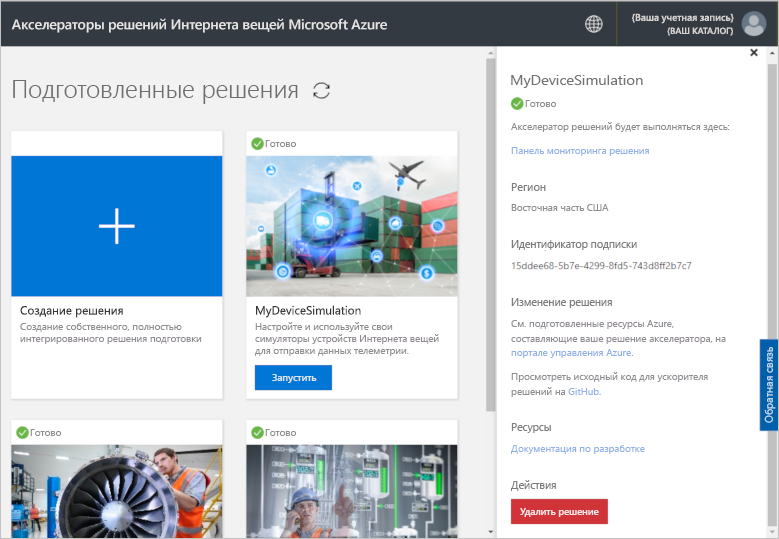

# Краткое руководство по развертыванию и запуску решения "Симулятор устройств" на основе облака

В этом кратком руководстве показано, как развернуть акселератор решения Интернета вещей Azure "Симулятор устройств" для тестирования решения Интернета вещей. После развертывания акселератора решений создайте и выполните симулятор на странице **Simulation** (Симуляторы).

Для работы с этим кратким руководством вам потребуется действующая подписка Azure.

Если у вас еще нет подписки Azure, [создайте бесплатную учетную запись Azure](https://azure.microsoft.com/free/?WT.mc_id=A261C142F), прежде чем начинать работу.

## Развертывание решения

Когда вы будете развертывать акселератор решения в подписке Azure, необходимо указать некоторые параметры конфигурации.

Войдите на сайт [azureiotsolutions.com](https://www.azureiotsolutions.com/Accelerators) с использованием данных учетной записи Azure.

Щелкните **Try Now** (Попробовать) на плитке **Симуляторы устройств**.

На странице **Create Device Simulation solution** (Создание решения симулятора устройств) введите уникальное **имя решения**. Запишите имя решения, так как оно будет именем группы ресурсов Azure, которая содержит все ресурсы решения.

Выберите **подписку** и **регион**, которые необходимо использовать для развертывания акселератора решений. Вы можете выбрать ближайший к вам регион. Вы должны быть [глобальным администратором или пользователем](iot-accelerators-permissions.md) в подписке.

Установите флажок, чтобы развернуть Центр Интернета вещей и использовать его с решением "Симулятор устройств". Вы в любой момент можете выбрать другой Центр Интернета вещей для симулятора.

Щелкните **Создать решение**, чтобы начать подготовку решения. Этот процесс занимает по крайней мере пять минут:

## Вход в решение

После завершения процесса подготовки вы можете войти на панель мониторинга акселератора решения "Симулятор устройств".

На странице **Подготовленные решения** щелкните новый акселератор решения "Симулятор устройств":

Вы можете просмотреть сведения об акселераторе решения "Симулятор устройств" на отобразившейся панели. Чтобы просмотреть акселератор решения "Симулятор устройств", выберите **Панель мониторинга решений**.

Щелкните **Accept** (Принять), чтобы принять запрос на разрешения, и в браузере отобразится панель мониторинга решения "Симулятор устройств".

## Настройка симулятора

Настройте и запустите симулятор с помощью панели мониторинга. Для настройки симулятора используйте значения из приведенной ниже таблицы.

| Параметр             | Значение                       |
| ------------------- | --------------------------- |
| Целевой Центр Интернета вещей      | Use pre-provisioned IoT Hub (Использовать предварительно подготовленный Центр Интернета вещей) |
| Модель устройства        | Холодильник                     |
| Количество устройств   | 10                          |
| Частота получения телеметрии | 10 с                  |
| Длительность моделирования | 5 мин                   |

[Настройка симулятора](./media/quickstart-device-simulation-deploy/simulationconfig-expanded.png#lightbox)

## Запуск симулятора

Щелкните **Запустить имитацию**. Имитация выполняется на протяжении установленного времени. Имитацию можно остановить в любой момент, щелкнув **Остановить имитацию**. Эта имитация содержит статистические данные текущего выполнения. Щелкните **View IoT Hub metrics in the Azure portal** (Просмотреть метрики Центра Интернета вещей на портале Azure), чтобы просмотреть метрики, о которых сообщает Центр Интернета вещей:

[Выполнение имитации](./media/quickstart-device-simulation-deploy/simulationrun-expanded.png#lightbox)

На подготовленном экземпляре акселератора решений можно выполнять только одно моделирование одновременно.

## Очистка ресурсов

Если вы планируете продолжить изучение, не удаляйте развернутый акселератор решения "Симулятор устройств".

Если акселератор решений больше не нужен, удалите его на странице [Подготовленные решения](https://www.azureiotsolutions.com/Accelerators#dashboard). Для этого выберите его, а затем щелкните **Удалить решение**:

## Дополнительная информация

В этом кратком руководстве вы развернули акселератор решения "Симулятор устройств" и запустили имитацию устройства Интернета вещей.

Чтобы узнать, как использовать имеющийся Центр Интернета вещей для имитации, см. следующее практическое руководство:

> [!div class="nextstepaction"]
> [Use an existing IoT hub with the Device Simulation solution accelerator](iot-accelerators-device-simulation-choose-hub.md) (Использование имеющегося Центра Интернета вещей с акселератором решения "Симулятор устройств")
