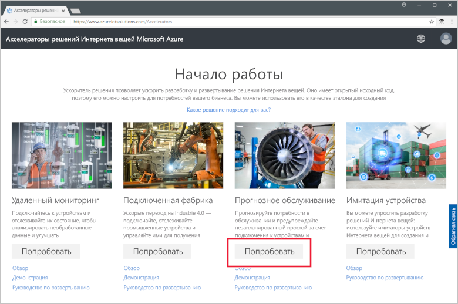
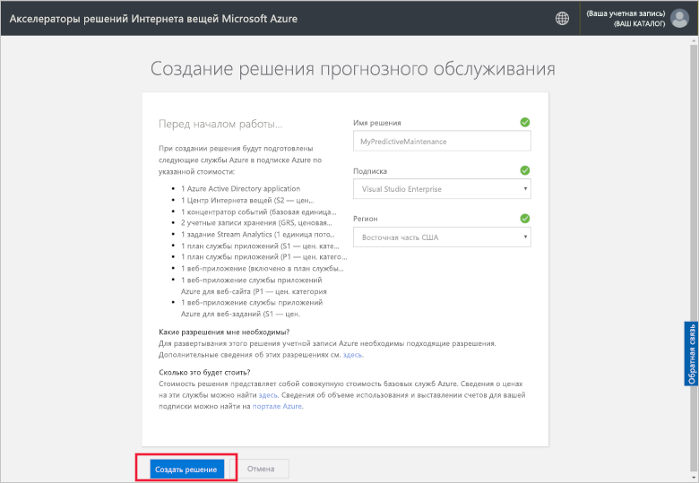
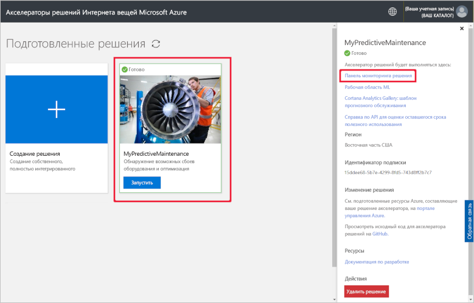
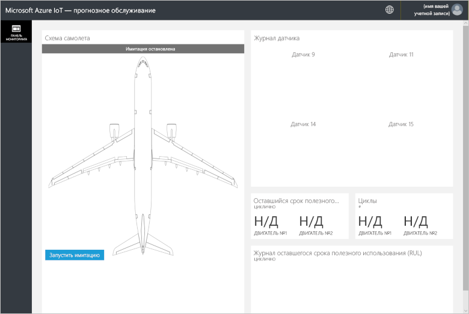
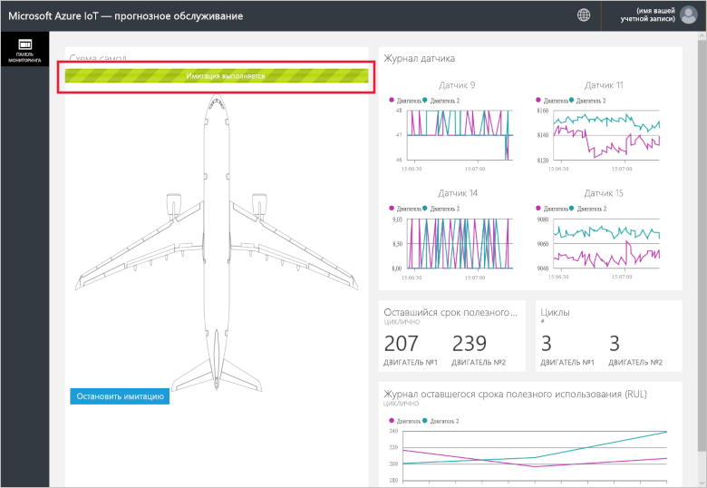

# Краткое руководство по развертыванию облачных решений для выполнения анализа прогнозного обслуживания на подключенных устройствах

В этом кратком руководстве показано, как развернуть акселератор решения для прогнозного обслуживания Интернета вещей в Azure для использования в качестве облачного решения прогнозного обслуживания для устройств Интернета вещей. После развертывания акселератора решения используйте страницу решения **Панель мониторинга**, чтобы запустить имитацию, используя данные двигателя самолета.

Компания Fabrikam является региональной авиалинией, которая концентрируется на хорошем впечатлении клиентов по приемлемым ценам. Одной из причин задержки рейсов являются проблемы обслуживания, в частности, особенно сложной задачей является обслуживание двигателей самолетов. Компания Fabrikam должна избегать сбоя двигателя во время полета любой ценой, поэтому она регулярно выполняет проверку двигателей и придерживается программы запланированного обслуживания. Однако износ двигателей самолетов не всегда одинаков. В некоторых случаях выполняется ненужное обслуживание двигателей. Что более важно, возникают проблемы, которые могут задержать самолет на земле до проведения обслуживания. Это приводит к дорогостоящим задержкам, особенно если самолет находится там, где недоступны нужные специалисты или запасные части.

Самолеты компании Fabrikam снабжены датчиками, которые отслеживают состояние двигателей во время полета. После нескольких лет накопления данных о работе и сбоях двигателей специалисты по анализу данных Fabrikam разработали способ прогнозирования оставшегося полезного срока службы (RUL) двигателя самолета. В модели используется корреляция между данными четырех датчиков двигателя и износом двигателя (что в конечном счете и приводит к сбою). Хотя компания Fabrikam продолжает проводить регулярные проверки, чтобы обеспечить безопасность, она теперь может использовать модели для вычисления RUL каждого двигателя после каждого рейса. Теперь компания Fabrikam может предсказывать возможные точки сбоев в работе и планировать обслуживание, чтобы минимизировать время, проведенное самолетом на земле, и снизить эксплуатационные расходы, одновременно обеспечивая безопасность пассажиров и сотрудников.

## предварительным требованиям

Для работы с этим кратким руководством вам потребуется действующая подписка Azure.

Если у вас еще нет подписки Azure, [создайте бесплатную учетную запись Azure](https://azure.microsoft.com/free/?WT.mc_id=A261C142F), прежде чем начинать работу.

## Развертывание решения

Когда вы будете развертывать акселератор решения в подписке Azure, необходимо указать некоторые параметры конфигурации.

Войдите на сайт [azureiotsolutions.com](https://www.azureiotsolutions.com/Accelerators) с использованием данных учетной записи Azure.

Щелкните действие **Try Now** (Попробовать) для элемента **Прогнозное обслуживание**.

На странице **Create Predictive Maintenance solution** (Создание решения прогнозного обслуживания) введите уникальное **имя решения** для акселератора решения прогнозного обслуживания.

Выберите **подписку** и **регион**, которые необходимо использовать для развертывания акселератора решений. Вы можете выбрать ближайший к вам регион. Вы должны быть [глобальным администратором или пользователем](iot-accelerators-permissions.md) в подписке.

Щелкните **Создать решение**, чтобы начать развертывание. Этот процесс занимает по крайней мере пять минут:

## Вход в решение

После развертывания в подписке Azure вы сможете войти на панель мониторинга акселератора решения для прогнозного обслуживания.

На странице **Подготовленные решения** выберите новый акселератор решения для прогнозного обслуживания. Вы можете просмотреть сведения об акселераторе решения на отобразившейся панели. Чтобы просмотреть акселератор решения для прогнозного обслуживания, выберите **Панель мониторинга решений**:

Щелкните **Accept** (Принять), чтобы принять запрос на разрешения, и в браузере отобразится панель мониторинга решения для прогнозного обслуживания:

Щелкните **Запустить имитацию**, чтобы начать моделирование. На панели мониторинга отобразится журнал датчика, оставшийся срок полезного использования, циклы и журнал оставшегося срока полезного использования.

Когда значение оставшегося срока полезного использования станет меньше 160 (произвольное пороговое значение, выбранное для демонстрационных целей), на портале решения рядом с этим значением появится символ предупреждения. Кроме того, цвет двигателя на портале решения изменится на желтый. Как можно заметить, значения оставшегося срока полезного использования имеют общую тенденцию к уменьшению, но при этом наблюдаются скачки вверх и вниз. Это происходит из-за различной продолжительности циклов и точности модели.

Полное моделирование, которое включает 148 циклов, занимает около 35 минут. Пороговое значение остаточного срока эксплуатации, равное 160, достигается примерно через 5 минут, а порог для обоих двигателей достигается примерно через 8 минут.

В процессе моделирования обрабатывается весь набор данных со 148 циклами. В результате можно получить окончательные значения остаточного срока эксплуатации и количества выполненных циклов.

Моделирование можно остановить в любой момент, но, если нажать кнопку **Запустить моделирование** , процесс перезапустится с самого начала.

## Очистка ресурсов

Если вы планируете продолжить изучение, не удаляйте развернутый акселератор решения для прогнозного обслуживания.

Если акселератор решений больше не требуется, удалите его со страницы [Подготовленные решения](https://www.azureiotsolutions.com/Accelerators#dashboard):

## Дополнительная информация

В этом кратком руководстве вы развернули акселератор решения для прогнозного обслуживания и запустили имитацию.

Дополнительные сведения об акселераторе решения см. в следующей статье.

> [!div class="nextstepaction"]
> [Общие сведения об акселераторе решений для диагностического обслуживания](iot-accelerators-predictive-walkthrough.md)
