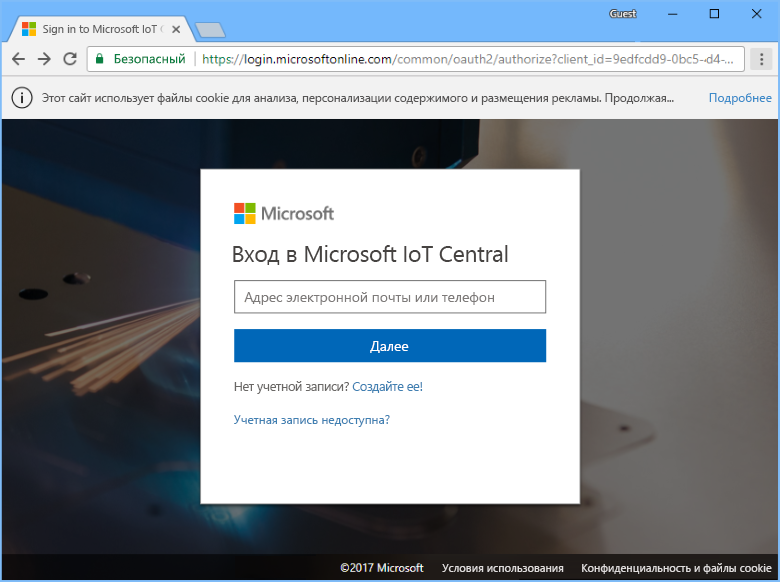
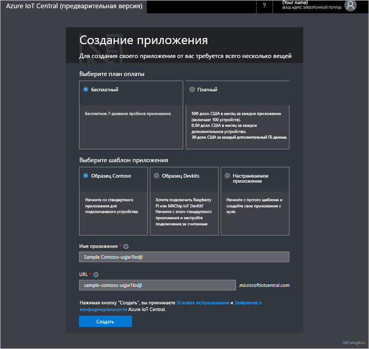

# Создание приложения Azure IoT Central

С помощью пользовательского интерфейса Azure IoT Central _конструктор_ может определить свое приложение Microsoft Azure IoT Central. В этом кратком руководстве объясняется, как выполнять следующие задачи:

- Создание приложения Azure IoT Central, которое содержит пример _шаблона устройства_ и _имитированные устройства_.
- Просмотр возможностей шаблона устройства **Охлаждаемый торговый автомат** в приложении.
- Просмотр данных телеметрии и аналитических сведений из имитированного **охлаждающего** устройства.

В рамках этого краткого руководства вы просмотрите сведения имитированного **охлаждающего** устройства с помощью шаблона устройства. Имитированное устройство выполняет следующие операции:

* Отправляет в приложение данные телеметрии, такие как температура и давление.
* Отправляет в приложение сообщения о значении свойств устройства, например оповещение о перемещении.
* Содержит параметры устройств, которые можно задать в приложении, например скорость вращения вентилятора.

Создание имитируемого устройства с помощью шаблона устройства в приложении Azure IoT Central позволяет проверить приложение перед подключением реального устройства.

## Создание приложения

Для выполнения инструкций в этом кратком руководстве необходимо создать приложение Azure IoT Central с помощью шаблона приложения **Образец Contoso**.

Перейдите на страницу [диспетчера приложений](https://aka.ms/iotcentral) в Azure IoT Central. Затем введите адрес электронной почты и пароль, которые вы используете для доступа к подписке Azure:

Чтобы начать создание нового приложения Azure IoT Central, выберите **Новое приложение**:

Чтобы создать приложение Azure IoT Central, сделайте следующее:

1. Выберите план оплаты **Free Trial Application** (Бесплатная пробная версия приложения).
1. Выберите понятное имя для приложения, например **Contoso IoT**. Azure IoT Central создаст уникальный префикс URL-адреса. Вы можете изменить этот префикс на что-то более запоминающееся.
1. Выберите шаблон приложения **Sample Contoso** (Образец Contoso).
1. Щелкните **Создать**.

## Дополнительная информация

В рамках этого краткого руководства вы создали предварительно заполненное приложение Azure IoT Central, которое содержит шаблон устройства **Охлаждаемый торговый автомат** и имитированные устройства. Дополнительные сведения о том, как конструктор может определить шаблоны устройств см. в [этой статье](tutorial-define-device-type.md).
