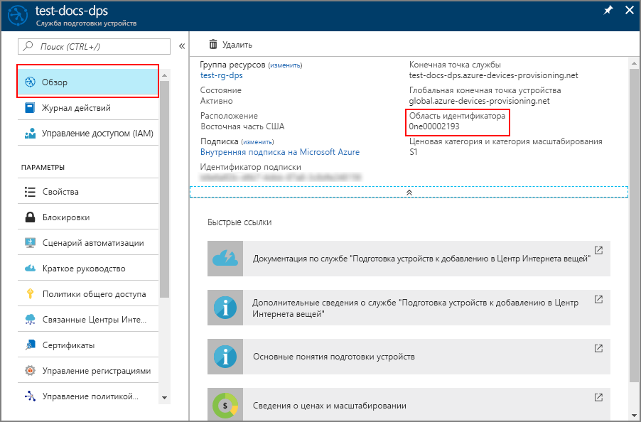

# <a name="how-to-provision-for-multitenancy"></a>Подготовка к мультитенантности 

Политики выделения, определяемые службой подготовки, поддерживают разнообразные сценарии выделения. Ниже приводятся два распространенных сценария.

* **Географическое расположение/географическая задержка**: при перемещении устройства между расположениями сетевая задержка снижается за счет подготовки устройства в центре Интернета вещей, ближайшем к каждому расположению. В этом случае для регистраций выбирается группа центров Интернета вещей, которые располагаются в разных регионах. Для этих регистраций выбрана политика выделения **Наименьшая задержка**. Эта политика заставляет службу подготовки устройств оценить задержку устройства и определить ближайший центр Интернета вещей из группы центров Интернета вещей. 

* **Мультитенантность**: устройства, используемые в решении Интернета вещей, может потребоваться назначить определенному центру Интернета вещей или группе центров. Решение может требовать, чтобы все устройства для одного конкретного клиента взаимодействовали с определенной группой центров Интернета вещей. В некоторых случаях клиент может владеть центром Интернета вещей и требовать назначения устройств такому собственному центру Интернета вещей.

Сочетание этих двух сценариев весьма распространено. Например, мультитенантное решение Интернета вещей часто назначает устройства клиента с помощью группы центров Интернета вещей, разбросанных по регионам. Эти устройства клиента могут назначаться центру Интернета вещей в такой группе, имеющему наименьшее значение задержки, исходя из географического расположения.

В этой статье пример имитации устройства из [пакета SDK для языка C Azure IoT](https://github.com/Azure/azure-iot-sdk-c) используется для демонстрации подготовки устройств в мультитенантном сценарии с несколькими регионами. В этой статье мы выполним следующие процедуры.

* Использование Azure CLI для создания двух региональных центров Интернета вещей (**Западная часть США** и **Восточная часть США**)
* Создание мультитенантной регистрации
* Использование Azure CLI для создания двух региональных виртуальных машин Linux в качестве устройств в одном регионе (**Западная часть США** и **Восточная часть США**)
* Настройка среды разработки для пакета SDK для языка C Azure IoT на обеих виртуальных машинах Linux
* Имитация устройств для проверки их подготовки для одного клиента в ближайшем регионе


[!INCLUDE [quickstarts-free-trial-note](../../includes/quickstarts-free-trial-note.md)]


## <a name="prerequisites"></a>Предварительные требования

* Выполните процедуру, описанную в руководстве по [настройке службы подготовки устройств центра Интернета вещей на портале Azure](./quick-setup-auto-provision.md).


[!INCLUDE [cloud-shell-try-it.md](../../includes/cloud-shell-try-it.md)]


## <a name="create-two-regional-iot-hubs"></a>Создание двух региональных центров Интернета вещей

В этом разделе мы используем Azure Cloud Shell для создания двух новых региональных центров Интернета вещей в регионах **Западная часть США** и **Восточная часть США** для клиента.


1. В Azure Cloud Shell создайте группу ресурсов с помощью команды [az group create](/cli/azure/group#az-group-create). Группа ресурсов Azure является логическим контейнером, в котором происходит развертывание ресурсов Azure и управление ими. 

    В следующем примере создается группа ресурсов с именем *contoso-us-resource-group* в регионе *eastus*. Рекомендуется использовать эту группу для всех ресурсов, созданных в рамках этой статьи. Это поможет упростить очистку после завершения работы.

    ```azurecli-interactive 
    az group create --name contoso-us-resource-group --location eastus
    ```

2. В Azure Cloud Shell создайте центр Интернета вещей в регионе **eastus** с помощью команды [az iot hub create](/cli/azure/iot/hub#az-iot-hub-create). Центр Интернета вещей будет добавлен в группу *contoso-us-resource-group*.

    В следующем примере создается центр Интернета вещей с именем *contoso-east-hub* в расположении *eastus*. Вместо **contoso-east-hub** необходимо использовать собственное уникальное имя центра.

    ```azurecli-interactive 
    az iot hub create --name contoso-east-hub --resource-group contoso-us-resource-group --location eastus --sku S1
    ```
    
    Выполнение этой команды может занять несколько минут.

3. В Azure Cloud Shell создайте центр Интернета вещей в регионе **westus** с помощью команды [az iot hub create](/cli/azure/iot/hub#az-iot-hub-create). Центр Интернета вещей также будет добавлен в группу *contoso-us-resource-group*.

    В следующем примере создается центр Интернета вещей с именем *contoso-west-hub* в расположении *westus*. Вместо **contoso-west-hub** необходимо использовать собственное уникальное имя центра.

    ```azurecli-interactive 
    az iot hub create --name contoso-west-hub --resource-group contoso-us-resource-group --location westus --sku S1
    ```

    Выполнение этой команды может занять несколько минут.


## <a name="create-the-multitenant-enrollment"></a>Создание мультитенантной регистрации

В этом разделе мы создадим группу регистрации для устройств клиента.  

Для удобства в этой статье используется [аттестация симметричного ключа](concepts-symmetric-key-attestation.md) с регистрацией. В качестве более безопасного решения рекомендуется использовать [аттестацию сертификатов X.509](concepts-security.md#x509-certificates) с цепочкой доверия.

1. Войдите на [портал Azure](http://portal.azure.com) и перейдите к своему экземпляру службы подготовки устройств.

2. Выберите вкладку **Управление регистрациями**, а затем нажмите кнопку **Добавить группу регистрации** в верхней части страницы. 

3. В разделе **Добавление группы регистрации** введите следующие сведения ниже, а затем нажмите кнопку **Сохранить**.

    **Имя группы**: введите **contoso-us-devices**.

    **Тип аттестации**: выберите **Симметричный ключ**.

    **Автоматически создавать ключи**: этот флажок должен быть уже установлен.

    **Выберите способ назначения устройств для центров**: выберите **Наименьшая задержка**.

    


4. На странице **Добавление группы регистрации** щелкните **Link a new IoT hub** (Привязать новый центр Интернета вещей), чтобы привязать оба региональных центра.

    **Подписка**: если у вас несколько подписок, выберите подписку, в которой вы создали региональные центры Интернета вещей.

    **Центр Интернета вещей**: выберите один из созданных региональных центров.

    **Политика доступа**: выберите **iothubowner**.

    


5. После связывания обоих региональных центров Интернета вещей необходимо выбрать их для группы регистрации и нажать кнопку **Сохранить** для создания группы региональных центров Интернета вещей для регистрации.

    


6. После сохранения регистрации снова откройте ее и запомните или запишите **первичный ключ**. Для формирования ключей необходимо сначала сохранить регистрацию. Этот ключ будет позднее использоваться для создания уникальных ключей устройства для обоих имитируемых устройств.


## <a name="create-regional-linux-vms"></a>Создание региональных виртуальных машин Linux

В этом разделе мы создадим две региональные виртуальные машины Linux. На этих виртуальных машинах будет выполняться пример имитации устройства из каждого региона для демонстрации подготовки устройств для устройств клиента из обоих регионов.

Чтобы упростить очистку, эти виртуальные машины будут добавляться в ту же группу ресурсов, которая содержит созданные ранее центры Интернета вещей, *contoso-us-resource-group*. Тем не менее виртуальные машины будут выполняться в разных регионах (**Западная часть США** и **Восточная часть США**).

1. В Azure Cloud Shell выполните команду ниже, чтобы создать виртуальную машину в регионе **Восточная часть США**, изменив следующие параметры в команде:

    **--name** — введите уникальное имя для виртуальной машины в регионе **Восточная часть США**. 

    **--admin-username** — используйте имя пользователя администратора.

    **--admin-password** — используйте пароль администратора.

    ```azurecli-interactive
    az vm create \
    --resource-group contoso-us-resource-group \
    --name ContosoSimDeviceEest \
    --location eastus \
    --image Canonical:UbuntuServer:18.04-LTS:18.04.201809110 \
    --admin-username contosoadmin \
    --admin-password myContosoPassword2018 \
    --authentication-type password
    ```

    Выполнение этой команды займет несколько минут. После выполнения команды запомните или запишите значение **publicIpAddress** для виртуальной машины в регионе "Восточная часть США".

1. В Azure Cloud Shell выполните команду, чтобы создать виртуальную машину в регионе **Западная часть США**, изменив следующие параметры в команде:

    **--name** — введите уникальное имя для виртуальной машины в регионе **Западная часть США**. 

    **--admin-username** — используйте имя пользователя администратора.

    **--admin-password** — используйте пароль администратора.

    ```azurecli-interactive
    az vm create \
    --resource-group contoso-us-resource-group \
    --name ContosoSimDeviceWest \
    --location westus \
    --image Canonical:UbuntuServer:18.04-LTS:18.04.201809110 \
    --admin-username contosoadmin \
    --admin-password myContosoPassword2018 \
    --authentication-type password
    ```

    Выполнение этой команды займет несколько минут. После выполнения команды запомните или запишите значение **publicIpAddress** для виртуальной машины в регионе "Западная часть США".

1. Откройте две оболочки командной строки. Подключитесь к одной из региональных виртуальных машин в каждой оболочке с помощью SSH. 

    Передайте свое имя пользователя администратора и общедоступный IP-адрес, записанный для виртуальной машины, в качестве параметров для SSH. В ответ на запрос введите пароль администратора.

    ```bash
    ssh contosoadmin@1.2.3.4

    contosoadmin@ContosoSimDeviceEast:~$
    ```

    ```bash
    ssh contosoadmin@5.6.7.8

    contosoadmin@ContosoSimDeviceWest:~$
    ```


## <a name="prepare-the-azure-iot-c-sdk-development-environment"></a>Подготовка среды разработки для пакета SDK для языка C Azure IoT

В этом разделе мы клонируем пакет SDK для языка C Azure IoT на каждой виртуальной машине. Пакет SDK содержит пример, который будет имитировать подготовку устройства клиента из каждого региона.


1. Для каждой виртуальной машины установите **Cmake**, **g++**, **gcc** и [Git](https://git-scm.com/book/en/v2/Getting-Started-Installing-Git) с помощью следующих команд:

    ```bash
    sudo apt-get update
    sudo apt-get install cmake build-essential libssl-dev libcurl4-openssl-dev uuid-dev git-all
    ```


1. Клонируйте [пакет SDK для языка C Azure IoT](https://github.com/Azure/azure-iot-sdk-c) на обе виртуальные машины.

    ```bash
    cd ~/
    git clone https://github.com/Azure/azure-iot-sdk-c.git --recursive
    ```

    Размер этого репозитория в настоящее время составляет примерно 220 МБ. Выполнение этой операции может занять несколько минут.

1. Для обеих виртуальных машин создайте новую папку **cmake** внутри репозитория и измените путь, указав на эту папку.

    ```bash
    mkdir ~/azure-iot-sdk-c/cmake
    cd ~/azure-iot-sdk-c/cmake
    ```

1. Для обеих виртуальных машин выполните приведенную ниже команду, чтобы создать версию пакета SDK для конкретной клиентской платформы разработки. 

    ```bash
    cmake -Duse_prov_client:BOOL=ON ..
    ```

    После успешного создания последние несколько строк выходных данных будут выглядеть следующим образом:

    ```bash
    -- IoT Client SDK Version = 1.2.9
    -- Provisioning client ON
    -- Provisioning SDK Version = 1.2.9
    -- target architecture: x86_64
    -- Checking for module 'libcurl'
    --   Found libcurl, version 7.58.0
    -- Found CURL: curl
    -- target architecture: x86_64
    -- target architecture: x86_64
    -- target architecture: x86_64
    -- target architecture: x86_64
    -- iothub architecture: x86_64
    -- target architecture: x86_64
    -- Configuring done
    -- Generating done
    -- Build files have been written to: /home/contosoadmin/azure-iot-sdk-c/cmake
    ```    


## <a name="derive-unique-device-keys"></a>Получение производных уникальных ключей

При использовании аттестации симметричного ключа с групповыми регистрациями вы не используете ключи группы регистрации напрямую. Вместо этого создается уникальный производный ключ для каждого устройства (см. раздел [Групповые регистрации с симметричным ключом](concepts-symmetric-key-attestation.md#group-enrollments)).

Чтобы создать ключ устройства, используйте главный ключ группы для вычисления [HMAC-SHA256](https://wikipedia.org/wiki/HMAC) на основе уникального идентификатора регистрации для устройства и преобразования результата в формат Base64.

Не включайте главный ключ группы в код устройства.

Используйте пример оболочки Bash для создания производного ключа устройства для каждого устройства с помощью **openssl**.

- Замените значение **KEY** значением **первичного ключа**, записанным ранее для вашей регистрации.

- Замените значение **REG_ID** собственным уникальным идентификатором регистрации для каждого устройства. Для определения обоих идентификаторов используйте строчные буквы, цифры и дефис ("-").

Пример создания ключа устройства для *contoso-simdevice-east*:

```bash
KEY=rLuyBPpIJ+hOre2SFIP9Ajvdty3j0EwSP/WvTVH9eZAw5HpDuEmf13nziHy5RRXmuTy84FCLpOnhhBPASSbHYg==
REG_ID=contoso-simdevice-east

keybytes=$(echo $KEY | base64 --decode | xxd -p -u -c 1000)
echo -n $REG_ID | openssl sha256 -mac HMAC -macopt hexkey:$keybytes -binary | base64
```

```bash
p3w2DQr9WqEGBLUSlFi1jPQ7UWQL4siAGy75HFTFbf8=
```

Пример создания ключа устройства для *contoso-simdevice-west*:

```bash
KEY=rLuyBPpIJ+hOre2SFIP9Ajvdty3j0EwSP/WvTVH9eZAw5HpDuEmf13nziHy5RRXmuTy84FCLpOnhhBPASSbHYg==
REG_ID=contoso-simdevice-west

keybytes=$(echo $KEY | base64 --decode | xxd -p -u -c 1000)
echo -n $REG_ID | openssl sha256 -mac HMAC -macopt hexkey:$keybytes -binary | base64
```

```bash
J5n4NY2GiBYy7Mp4lDDa5CbEe6zDU/c62rhjCuFWxnc=
```


Устройства клиента будут использовать собственные производные ключи устройства и уникальные идентификаторы регистрации для выполнения аттестации симметричного ключа в группе регистрации во время подготовки в центрах Интернета вещей клиента.


## <a name="simulate-the-devices-from-each-region"></a>Имитация устройств из каждого региона


В этом разделе мы изменим пример подготовки в пакете SDK для языка C Azure IoT для обеих региональных виртуальных машин. 

Пример кода имитирует последовательность загрузки устройства, которое отправляет запрос на подготовку в экземпляр службы подготовки устройств. При выполнении последовательности загрузки устройство будет распознано и назначено ближайшему центру Интернета вещей с учетом задержки.

1. На портале Azure выберите вкладку **Обзор** службы подготовки устройств и запишите значение **_области идентификатора_**.

     

1. Откройте **~/azure-iot-sdk-c/provisioning\_client/samples/prov\_dev\_client\_sample/prov\_dev\_client\_sample.c** для редактирования на обеих виртуальных машинах.

    ```bash
    vi ~/azure-iot-sdk-c/provisioning_client/samples/prov_dev_client_sample/prov_dev_client_sample.c
    ```

1. Найдите константу `id_scope` и замените ее значение ранее скопированным значением **области идентификатора**. 

    ```c
    static const char* id_scope = "0ne00002193";
    ```

1. Найдите определение функции `main()` в том же файле. Убедитесь, что переменной `hsm_type` присвоено значение `SECURE_DEVICE_TYPE_SYMMETRIC_KEY`, как показано ниже, в соответствии с методом аттестации группы регистрации. 

    Сохраните изменения в файлах на обеих виртуальных машинах.

    ```c
    SECURE_DEVICE_TYPE hsm_type;
    //hsm_type = SECURE_DEVICE_TYPE_TPM;
    //hsm_type = SECURE_DEVICE_TYPE_X509;
    hsm_type = SECURE_DEVICE_TYPE_SYMMETRIC_KEY;
    ```


1. Откройте **~/azure-iot-sdk-c/provisioning\_client/adapters/hsm\_client\_key.c** на обеих виртуальных машинах. 

    ```bash
     vi ~/azure-iot-sdk-c/provisioning_client/adapters/hsm_client_key.c
    ```

1. Найдите объявление констант `REGISTRATION_NAME` и `SYMMETRIC_KEY_VALUE`. Внесите следующие изменения в файлы на обеих региональных виртуальных машинах и сохраните файлы.

    Замените значение константы `REGISTRATION_NAME` **уникальным идентификатором регистрации для устройства**.
    
    Замените значение константы `SYMMETRIC_KEY_VALUE` **производным ключом устройства**.

    ```c
    static const char* const REGISTRATION_NAME = "contoso-simdevice-east";
    static const char* const SYMMETRIC_KEY_VALUE = "p3w2DQr9WqEGBLUSlFi1jPQ7UWQL4siAGy75HFTFbf8=";
    ```

    ```c
    static const char* const REGISTRATION_NAME = "contoso-simdevice-west";
    static const char* const SYMMETRIC_KEY_VALUE = "J5n4NY2GiBYy7Mp4lDDa5CbEe6zDU/c62rhjCuFWxnc=";
    ```

1. На обеих виртуальных машинах перейдите к папке с примером, показанной ниже, и выполните сборку примера.

    ```bash
    cd ~/azure-iot-sdk-c/cmake/provisioning_client/samples/prov_dev_client_sample/
    cmake --build . --target prov_dev_client_sample --config Debug
    ```

1. После успешного завершения сборки запустите **prov\_dev\_client\_sample.exe** на обеих виртуальных машинах для имитации устройства клиента из каждого региона. Обратите внимание, что каждое устройство выделяется в центре Интернета вещей клиента, ближайшем к региону имитации устройства.

    ```bash
    contosoadmin@ContosoSimDeviceEast:~/azure-iot-sdk-c/cmake/provisioning_client/samples/prov_dev_client_sample$ ./prov_dev_client_sample
    Provisioning API Version: 1.2.9

    Registering Device

    Provisioning Status: PROV_DEVICE_REG_STATUS_CONNECTED
    Provisioning Status: PROV_DEVICE_REG_STATUS_ASSIGNING
    Provisioning Status: PROV_DEVICE_REG_STATUS_ASSIGNING

    Registration Information received from service: contoso-east-hub.azure-devices.net, deviceId: contoso-simdevice-east
    Press enter key to exit:

    ```

    ```bash
    contosoadmin@ContosoSimDeviceWest:~/azure-iot-sdk-c/cmake/provisioning_client/samples/prov_dev_client_sample$ ./prov_dev_client_sample
    Provisioning API Version: 1.2.9

    Registering Device

    Provisioning Status: PROV_DEVICE_REG_STATUS_CONNECTED
    Provisioning Status: PROV_DEVICE_REG_STATUS_ASSIGNING
    Provisioning Status: PROV_DEVICE_REG_STATUS_ASSIGNING

    Registration Information received from service: contoso-west-hub.azure-devices.net, deviceId: contoso-simdevice-west
    Press enter key to exit:
    ```


## <a name="clean-up-resources"></a>Очистка ресурсов

Если вы планируете продолжить работу с ресурсами, созданными при работе с этой статьей, не удаляйте их. В противном случае выполните следующие действия, чтобы удалить все созданные ресурсы, за которые может взиматься плата.

Здесь предполагается, что вы создали все используемые в этой статье ресурсы, как было указано, в одной группе ресурсов с именем **contoso-us-resource-group**.

> [!IMPORTANT]
> Удаление группы ресурсов — процесс необратимый. Группа ресурсов и все содержащиеся в ней ресурсы удаляются без возможности восстановления. Будьте внимательны, чтобы случайно не удалить не ту группу ресурсов или не те ресурсы. Если вы создали Центр Интернета вещей в группе ресурсов, содержащей ресурсы, которые нужно сохранить, удалите только ресурс Центра Интернета вещей, не удаляя всю группу ресурсов.
>

Удаление группы ресурсов по имени:

1. Войдите на [портал Azure](https://portal.azure.com) и щелкните **Группы ресурсов**.

2. Введите в текстовое поле **Фильтровать по имени...** имя вашей группы ресурсов: **contoso-us-resource-group**. 

3. Справа от своей группы ресурсов в списке результатов щелкните **...**, а затем выберите **Удалить группу ресурсов**.

4. Подтвердите операцию удаления группы ресурсов. Еще раз введите имя группы ресурсов для подтверждения и нажмите кнопку **Удалить**. Через некоторое время группа ресурсов и все ее ресурсы будут удалены.

## <a name="next-steps"></a>Дополнительная информация

- Дополнительные сведения о повторной подготовке см. в статье, посвященной [основным понятиям повторной подготовки устройств в центре Интернета вещей](concepts-device-reprovision.md). 
- Дополнительные сведения об отмене подготовки см. в статье [Как отменить подготовку устройств, которые были автоматически подготовлены](how-to-unprovision-devices.md). 


