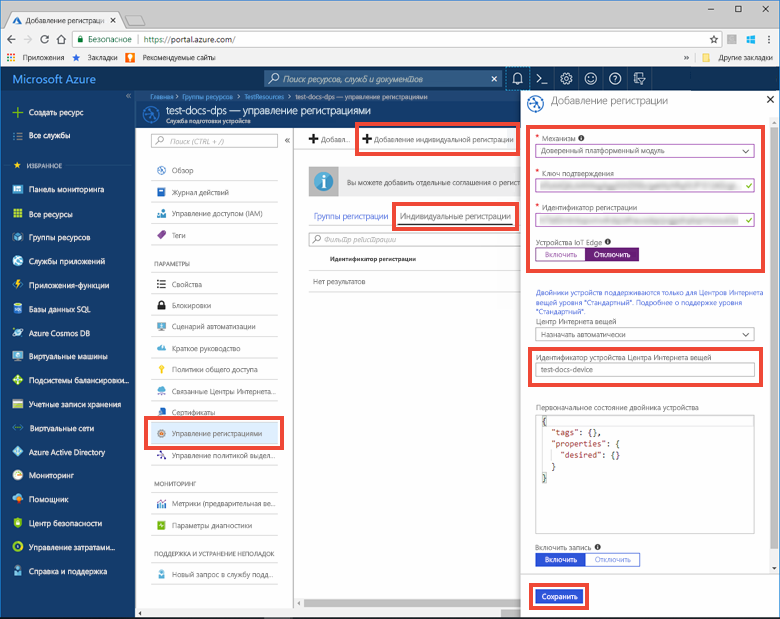
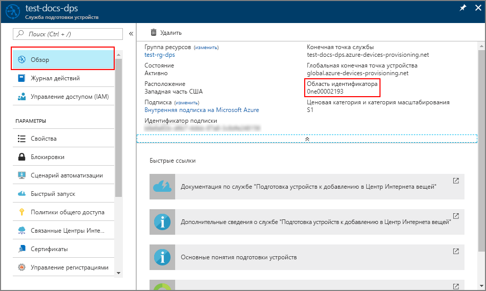
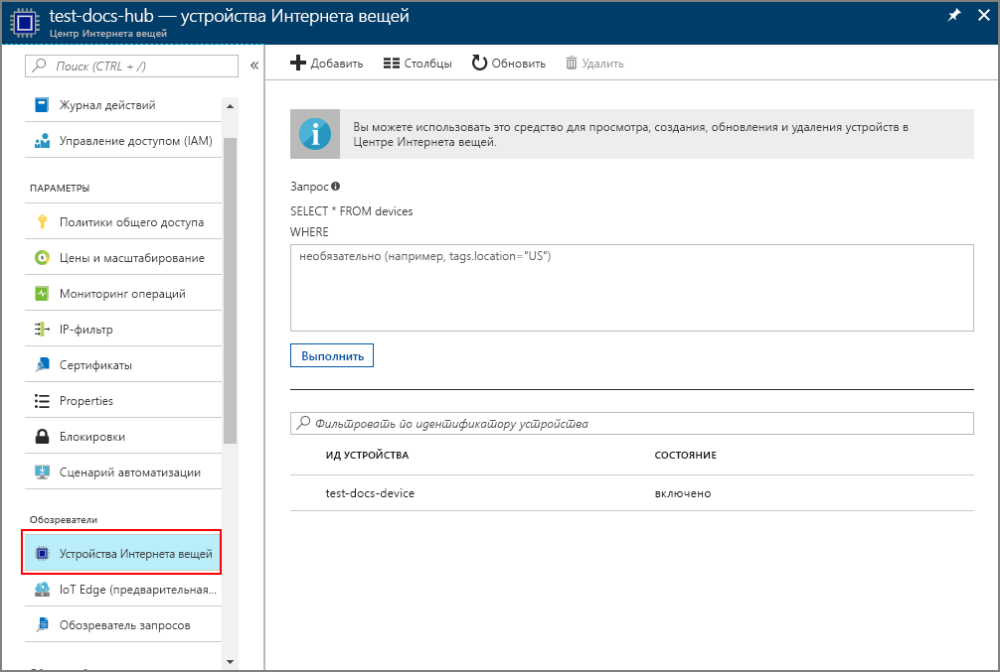

# <a name="quickstart-provision-a-simulated-tpm-device-using-the-azure-iot-c-sdk"></a>Краткое руководство по подготовке имитированного устройства доверенного платформенного модуля с помощью пакета SDK для устройства C Интернета вещей Azure

[!INCLUDE [iot-dps-selector-quick-create-simulated-device-tpm](../../includes/iot-dps-selector-quick-create-simulated-device-tpm.md)]

В этом кратком руководстве вы узнаете, как создать и запустить симулятор устройства доверенного платформенного модуля (TPM) на компьютере для разработки Windows. Вы подключите это имитированное устройство к Центру Интернета вещей с помощью экземпляра службы подготовки устройств. Пример кода из [пакета SDK для устройства C Интернета вещей Azure](https://github.com/Azure/azure-iot-sdk-c) будет использоваться для регистрации устройства в экземпляре службы подготовки устройств и имитации последовательности загрузки устройства.

Если вы не знакомы с процессом автоматической подготовки, прочтите статью [Принципы автоматической подготовки устройств](concepts-auto-provisioning.md). Кроме того, прежде чем продолжить работу с этим кратким руководством, выполните шаги, описанные в статье [Настройка службы подготовки устройств для Центра Интернета вещей на портале Azure](./quick-setup-auto-provision.md). 

[!INCLUDE [quickstarts-free-trial-note](../../includes/quickstarts-free-trial-note.md)]

## <a name="prerequisites"></a>Предварительные требования

* Visual Studio 2015 или [Visual Studio 2017](https://www.visualstudio.com/vs/) со включенной рабочей нагрузкой [Разработка классических приложений на C++](https://www.visualstudio.com/vs/support/selecting-workloads-visual-studio-2017/).
* Установите последнюю версию [Git](https://git-scm.com/download/).


<a id="setupdevbox"></a>

## <a name="prepare-a-development-environment-for-the-azure-iot-c-sdk"></a>Подготовка среды разработки для пакета SDK для устройства C Интернета вещей Azure

В этом разделе вы подготовите среду разработки, которая используется для создания [пакета SDK для устройства C Интернета вещей Azure](https://github.com/Azure/azure-iot-sdk-c) и примера симулятора устройства [доверенного платформенного модуля](https://docs.microsoft.com/windows/device-security/tpm/trusted-platform-module-overview).

1. Загрузите последнюю версию выпуска [системы сборки CMake](https://cmake.org/download/). На этом же сайте найдите криптографический хэш для выбранной вами версии бинарного дистрибутива. Проверьте загруженный бинарный дистрибутив, используя соответствующее значение криптографического хэша. В следующем примере для проверки криптографического хэша для дистрибутива MSI x64 версии 3.11.4 использовалась среда Windows PowerShell:

    ```PowerShell
    PS C:\Users\wesmc\Downloads> $hash = get-filehash .\cmake-3.11.4-win64-x64.msi
    PS C:\Users\wesmc\Downloads> $hash.Hash -eq "56e3605b8e49cd446f3487da88fcc38cb9c3e9e99a20f5d4bd63e54b7a35f869"
    True
    ```

    **Перед** установкой `CMake` очень важно установить на компьютер необходимые компоненты Visual Studio (Visual Studio с рабочей нагрузкой "Разработка классических приложений на C++"). После установки компонентов и проверки загрузки установите систему сборки CMake.

2. Откройте командную строку или оболочку Git Bash. Выполните следующую команду для клонирования репозитория GitHub [пакета SDK для устройства C Интернета вещей Azure](https://github.com/Azure/azure-iot-sdk-c):
    
    ```cmd/sh
    git clone https://github.com/Azure/azure-iot-sdk-c.git --recursive
    ```
    Размер этого репозитория в настоящее время составляет примерно 220 МБ. Выполнение этой операции может занять несколько минут.


3. Создайте подкаталог `cmake` в корневом каталоге репозитория Git и перейдите в эту папку. 

    ```cmd/sh
    cd azure-iot-sdk-c
    mkdir cmake
    cd cmake
    ```

## <a name="build-the-sdk-and-run-the-tpm-device-simulator"></a>Создание пакета SDK и запуск симулятора устройства доверенного платформенного модуля

В этом разделе вы создадите пакет SDK для устройства C Интернета вещей Azure, который включает пример кода симулятора устройства доверенного платформенного модуля. Этот пример содержит [механизм аттестации](concepts-security.md#attestation-mechanism) доверенного платформенного модуля с помощью проверки подлинности по маркерам подписанного URL-адреса (SAS).

1. Из подкаталога `cmake`, созданного в репозитории Git azure-iot-sdk-c, выполните следующую команду для создания примера. Эта команда также создает решение Visual Studio для имитированного устройства.

    ```cmd/sh
    cmake -Duse_prov_client:BOOL=ON -Duse_tpm_simulator:BOOL=ON ..
    ```

    Если `cmake` не удастся найти компилятор C++, могут возникнуть ошибки сборки во время выполнения предыдущей команды. В этом случае попробуйте, выполнить эту команду в [командной строке Visual Studio](https://docs.microsoft.com/dotnet/framework/tools/developer-command-prompt-for-vs). 

    После успешного создания последние несколько строк выходных данных будут выглядеть следующим образом:

    ```cmd/sh
    $ cmake -Duse_prov_client:BOOL=ON -Duse_tpm_simulator:BOOL=ON ..
    -- Building for: Visual Studio 15 2017
    -- Selecting Windows SDK version 10.0.16299.0 to target Windows 10.0.17134.
    -- The C compiler identification is MSVC 19.12.25835.0
    -- The CXX compiler identification is MSVC 19.12.25835.0

    ...

    -- Configuring done
    -- Generating done
    -- Build files have been written to: E:/IoT Testing/azure-iot-sdk-c/cmake
    ```

2. Перейдите к корневой папке клонированного репозитория Git и запустите симулятор [доверенного платформенного модуля](https://docs.microsoft.com/windows/device-security/tpm/trusted-platform-module-overview), используя путь, приведенный ниже. Симулятор ожидает передачи данных через сокет на портах 2321 и 2322. Не закрывайте командное окно. Симулятор должен работать, пока вы не выполните все инструкции из этого краткого руководства. 

   Если вы находитесь в папке *cmake*, выполните следующие команды:

    ```cmd/sh
    cd ..
    .\provisioning_client\deps\utpm\tools\tpm_simulator\Simulator.exe
    ```

    Симулятор не возвращает какие-либо выходные данные. Пусть продолжает выполнять имитацию устройства доверенного платформенного модуля.

<a id="simulatetpm"></a>

## <a name="read-cryptographic-keys-from-the-tpm-device"></a>Чтение криптографических ключей из устройства доверенного платформенного модуля

В этом разделе вы создадите и выполните пример, который будет считывать ключ подтверждения и идентификатор регистрации из симулятора доверенного платформенного модуля, все еще работающего и ожидающего передачи данных через порты 2321 и 2322. Эти значения будут использоваться для регистрации устройств в экземпляре службы подготовки устройств.

1. Запустите Visual Studio и откройте новый файл решения с именем `azure_iot_sdks.sln`. Этот файл решения находится в папке `cmake`, созданной ранее в корневом каталоге репозитория Git azure-iot-sdk-c.

2. В меню Visual Studio выберите **Построить** > **Построить решение** для создания всех проектов в решении.

3. В окне *Обозреватель решений* Visual Studio перейдите в папку **Provision\_Tools**. Щелкните проект **tpm_device_provision** правой кнопкой мыши и выберите параметр **Назначить запускаемым проектом**. 

4. В меню Visual Studio выберите **Отладка** > **Запуск без отладки**, чтобы запустить решение. Приложение считывает и отображает **_идентификатор регистрации_** и **_ключ подтверждения_**. Скопируйте эти значения. Они будут использоваться в следующем разделе для регистрации устройств. 


<a id="portalenrollment"></a>

## <a name="create-a-device-enrollment-entry-in-the-portal"></a>Создание записи регистрации устройств на портале

1. Войдите на портал Azure, нажмите кнопку **Все ресурсы** в меню слева и откройте службу подготовки устройств.

2. Выберите вкладку **Управление регистрациями**, а затем нажмите кнопку **Add individual enrollment** (Добавить индивидуальную регистрацию) в верхней области. 

3. В разделе **Add enrollment** (Добавить регистрацию) введите сведения ниже, а затем нажмите кнопку **Сохранить**.

    - **Механизм:** выберите **доверенный платформенный модуль (TPM)** как *механизм* аттестации удостоверения.
    - **Ключ подтверждения:** введите *ключ подтверждения*, созданный для устройства доверенного платформенного модуля в результате запуска проекта *tpm_device_provision*.
    - **Идентификатор регистрации:** введите *идентификатор регистрации*, созданный для устройства доверенного платформенного модуля в результате запуска проекта *tpm_device_provision*.
    - **IoT Edge device** (Устройство IoT Edge): выберите **Отключить**.
    - **Идентификатор устройства Центра Интернета вещей:** введите **test-docs-device**, чтобы присвоить устройству идентификатор.

      

    После успешной регистрации *идентификатор регистрации* устройства отобразится в списке под вкладкой *Отдельные регистрации*. 


<a id="firstbootsequence"></a>

## <a name="simulate-first-boot-sequence-for-the-device"></a>Имитация последовательности первой загрузки для устройства

В этом разделе вы настроите пример кода для использования [Расширенного протокола управления очередью сообщений (AMQP)](https://wikipedia.org/wiki/Advanced_Message_Queuing_Protocol), чтобы отправить последовательность загрузки устройства в экземпляр службы подготовки устройств. Эта последовательность загрузки приведет к тому, что устройство будет распознано и назначено Центру Интернета вещей, связанному с экземпляром службы подготовки устройств.

1. На портале Azure выберите вкладку **Обзор** службы подготовки устройств и скопируйте значение **_области идентификатора_**.

     

2. В окне *Обозреватель решений* Visual Studio перейдите в папку **Provision\_Samples**. Разверните пример проекта с именем **prov\_dev\_client\_sample**. Разверните **исходные файлы** и откройте **prov\_dev\_client\_sample.c**.

3. В верхней части файла найдите операторы `#define` для каждого протокола устройства, как показано ниже. Убедитесь, что раскомментирован только параметр `SAMPLE_AMQP`.

    В настоящее время [протокол MQTT не поддерживается для индивидуальной регистрации доверенного платформенного модуля](https://github.com/Azure/azure-iot-sdk-c#provisioning-client-sdk).

    ```c
    //
    // The protocol you wish to use should be uncommented
    //
    //#define SAMPLE_MQTT
    //#define SAMPLE_MQTT_OVER_WEBSOCKETS
    #define SAMPLE_AMQP
    //#define SAMPLE_AMQP_OVER_WEBSOCKETS
    //#define SAMPLE_HTTP
    ```

4. Найдите константу `id_scope` и замените ее значение ранее скопированным значением **области идентификатора**. 

    ```c
    static const char* id_scope = "0ne00002193";
    ```

5. Найдите определение функции `main()` в том же файле. Проверьте, чтобы переменной `hsm_type` было задано значение `SECURE_DEVICE_TYPE_TPM`, а не `SECURE_DEVICE_TYPE_X509`, как показано ниже.

    ```c
    SECURE_DEVICE_TYPE hsm_type;
    hsm_type = SECURE_DEVICE_TYPE_TPM;
    //hsm_type = SECURE_DEVICE_TYPE_X509;
    ```

6. Щелкните проект **prov\_dev\_client\_sample** правой кнопкой мыши и выберите пункт **Назначить запускаемым проектом**. 

7. В меню Visual Studio выберите **Отладка** > **Запуск без отладки**, чтобы запустить решение. При появлении запроса перестроить проект щелкните **Да**, чтобы перестроить его перед запуском.

    Следующий результат является примером успешной загрузки примера клиента устройства подготовки и подключения к экземпляру службы подготовки устройств для получения сведений о Центре Интернета вещей и регистрации:

    ```cmd
    Provisioning API Version: 1.2.7
    Provisioning Status: PROV_DEVICE_REG_STATUS_CONNECTED

    Registering... Press enter key to interrupt.

    Provisioning Status: PROV_DEVICE_REG_STATUS_CONNECTED
    Provisioning Status: PROV_DEVICE_REG_STATUS_ASSIGNING
    Provisioning Status: PROV_DEVICE_REG_STATUS_ASSIGNING

    Registration Information received from service:
    test-docs-hub.azure-devices.net, deviceId: test-docs-device
    ```

8. Когда имитированное устройство будет подготовлено для Центра Интернета вещей службой подготовки, идентификатор устройства отобразится на вкладке **Устройства IoT**. 

     


## <a name="clean-up-resources"></a>Очистка ресурсов

Если вы планируете продолжить работу с примером клиентского устройства, не удаляйте ресурсы, созданные в ходе работы с этим руководством. Если вы не планируете продолжать работу, следуйте инструкциям ниже, чтобы удалить все созданные ресурсы.

1. Закройте окно выходных данных примера клиентского устройства на компьютере.
2. Закройте окно симулятора доверенного платформенного модуля на компьютере.
3. В меню слева на портале Azure щелкните **Все ресурсы** и откройте службу подготовки устройств. Откройте раздел **Управление регистрациями** для службы, а затем щелкните вкладку **Индивидуальные регистрации**. Выберите *идентификатор регистрации* устройства, которое вы зарегистрировали в процессе работы с этим руководством, и нажмите кнопку **Удалить** вверху. 
4. В меню слева на портале Azure нажмите кнопку **Все ресурсы** и выберите свой Центр Интернета вещей. Щелкните вкладку **Устройства IoT** для своего центра, выберите *идентификатор устройства*, которое вы зарегистрировали в процессе работы с этим кратким руководством, а затем нажмите кнопку **Удалить** в верхней области.

## <a name="next-steps"></a>Дополнительная информация

Вы создали имитированное устройство доверенного платформенного модуля на компьютере и подготовили его для Центра Интернета вещей с помощью службы подготовки устройств Центра Интернета вещей. Чтобы узнать, как программными средствами зарегистрировать устройство TPM, изучите краткое руководство по программной регистрации устройств TPM. 

> [!div class="nextstepaction"]
> [Краткое руководство по Azure. Регистрация устройств доверенного платформенного модуля в службе подготовки устройств Центра Интернета вещей](quick-enroll-device-tpm-java.md)

