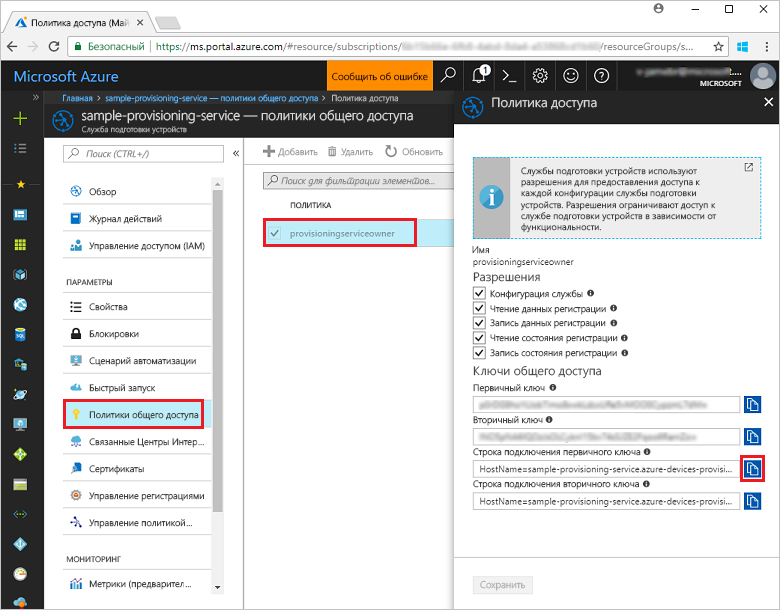
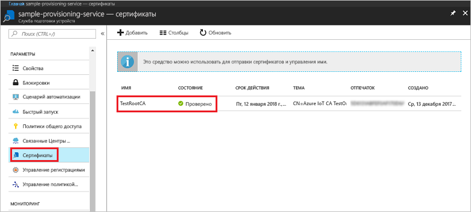
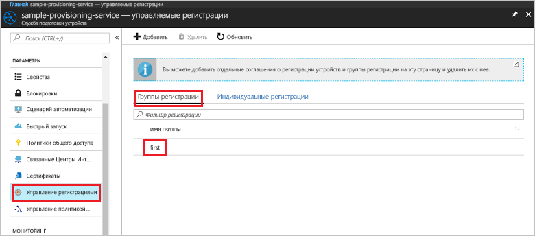

# <a name="quickstart-enroll-x509-devices-to-the-device-provisioning-service-using-nodejs"></a>Краткое руководство по регистрации устройств X.509 в Службе подготовки устройств с помощью Node.js

[!INCLUDE [iot-dps-selector-quick-enroll-device-x509](../../includes/iot-dps-selector-quick-enroll-device-x509.md)]

В этом кратком руководстве показано, как с помощью Node.js программно создать [группу регистрации](concepts-service.md#enrollment-group), которая использует промежуточные или корневые сертификаты ЦС X.509. Группа регистрации создается с помощью [пакета SDK IoT для Node.js](https://github.com/Azure/azure-iot-sdk-node) и примера приложения Node.js. Группа регистрации управляет доступом к службе подготовки устройств, которые совместно используют стандартный сертификат для подписи в цепочке сертификатов. Дополнительные сведения см. в разделе [Управление доступом устройств к службе подготовки с использованием сертификатов X.509](./concepts-security.md#controlling-device-access-to-the-provisioning-service-with-x509-certificates). Дополнительные сведения об использовании инфраструктуры открытых ключей на основе сертификатов X.509 с Центром Интернета вещей и службой подготовки устройств см. в статье [Device Authentication using X.509 CA Certificates](https://docs.microsoft.com/azure/iot-hub/iot-hub-x509ca-overview) (Проверка подлинности устройств с помощью сертификатов ЦС X.509). 

В этом руководстве предполагается, что Центр Интернета вещей и экземпляр Службы подготовки устройств уже созданы. Если эти ресурсы еще не созданы, прежде чем продолжить, выполните действия, описанные в руководстве по [настройке Службы подготовки устройств к добавлению в Центр Интернета вещей на портале Azure](./quick-setup-auto-provision.md).

Описанные в этой статье действия применимы к виртуальным машинам Windows и Linux, но статья предназначена для работы с машинами Windows.

[!INCLUDE [quickstarts-free-trial-note](../../includes/quickstarts-free-trial-note.md)]


## <a name="prerequisites"></a>Предварительные требования

- Установите [Node.js версии 4.0 или новее](https://nodejs.org).
- Установите [Git](https://git-scm.com/download/).


## <a name="prepare-test-certificates"></a>Подготовка тестовых сертификатов

Для этого краткого руководства требуется файл PEM или CER, который содержит общедоступную часть промежуточного или корневого сертификата ЦС X.509. Этот сертификат должен быть отправлен в службу подготовки и проверен в ней. 

[Пакет SDK для Центра Интернета вещей Azure](https://github.com/Azure/azure-iot-sdk-c) содержит средства тестирования, с помощью которых можно создать цепочку сертификатов X.509, передать корневой или промежуточный сертификат из этой цепочки и подтвердить владение сертификатом в службе. Сертификаты, созданные с помощью инструментария пакета SDK, можно использовать только в **целях тестовой разработки**. Эти сертификаты **не должны использоваться в рабочей среде**. В них жестко заданы пароли ("1234"), срок действия которых истекает через 30 дней. Сведения о получении сертификатов, подходящих для рабочего использования, см. в документации Центра Интернета вещей Azure в статье [Как получить сертификат ЦС X.509](https://docs.microsoft.com/azure/iot-hub/iot-hub-x509ca-overview#how-to-get-an-x509-ca-certificate).

Чтобы создать сертификаты с помощью этих средств тестирования, выполните следующие действия. 
 
1. Откройте командную строку или оболочку Git Bash и перейдите в рабочую папку на компьютере. Выполните следующую команду для клонирования репозитория GitHub [пакета SDK для устройства C Интернета вещей Azure](https://github.com/Azure/azure-iot-sdk-c):
    
  ```cmd/sh
  git clone https://github.com/Azure/azure-iot-sdk-c.git --recursive
  ```

  Размер этого репозитория в настоящее время составляет примерно 220 МБ. Выполнение этой операции может занять несколько минут.

  Средства тестирования находятся в клонированном репозитории *azure-iot-sdk-c/tools/CACertificates*.    

2. Выполните действия, описанные в статье [Managing test CA certificates for samples and tutorials](https://github.com/Azure/azure-iot-sdk-c/blob/master/tools/CACertificates/CACertificateOverview.md) (Управление тестовыми сертификатами ЦС для образцов и руководств). 


## <a name="create-the-enrollment-group-sample"></a>Создание примера группы регистрации 

 
1. В окне командной строки перейдите в рабочую папку и выполните следующую команду:
  
     ```cmd\sh
     npm install azure-iot-provisioning-service
     ```  

2. С помощью текстового редактора создайте а рабочей папке файл **create_enrollment_group.js**. Добавьте в этот файл следующий код и сохраните файл:

    ```
    'use strict';
    var fs = require('fs');

    var provisioningServiceClient = require('azure-iot-provisioning-service').ProvisioningServiceClient;

    var serviceClient = provisioningServiceClient.fromConnectionString(process.argv[2]);

    var enrollment = {
      enrollmentGroupId: 'first',
      attestation: {
        type: 'x509',
        x509: {
          signingCertificates: {
            primary: {
              certificate: fs.readFileSync(process.argv[3], 'utf-8').toString()
            }
          }
        }
      },
      provisioningStatus: 'disabled'
    };

    serviceClient.createOrUpdateEnrollmentGroup(enrollment, function(err, enrollmentResponse) {
      if (err) {
        console.log('error creating the group enrollment: ' + err);
      } else {
        console.log("enrollment record returned: " + JSON.stringify(enrollmentResponse, null, 2));
        enrollmentResponse.provisioningStatus = 'enabled';
        serviceClient.createOrUpdateEnrollmentGroup(enrollmentResponse, function(err, enrollmentResponse) {
          if (err) {
            console.log('error updating the group enrollment: ' + err);
          } else {
            console.log("updated enrollment record returned: " + JSON.stringify(enrollmentResponse, null, 2));
          }
        });
      }
    });
    ````

## <a name="run-the-enrollment-group-sample"></a>Запуск примера группы регистрации
 
1. Чтобы запустить этот пример, вам потребуется строка подключения к службе подготовки. 
    1. Войдите на портал Azure, нажмите кнопку **Все ресурсы** в меню слева и откройте службу подготовки устройств. 
    2. Щелкните **Политики общего доступа**, а затем выберите нужную политику доступа, чтобы открыть ее свойства. В окне **Политика доступа** скопируйте и запишите строку подключения первичного ключа. 

     


3. Как описано в разделе [Подготовка тестовых сертификатов](quick-enroll-device-x509-node.md#prepare-test-certificates), вам также потребуется PEM-файл, содержащий сертификат X.509 промежуточного или корневого центра сертификации, который вы заранее отправили в службу подготовки и проверили в ней. Чтобы убедиться, что сертификат уже передан и проверен, щелкните элемент **Сертификаты** на странице сводной информации о службе подготовки устройств на портале Azure. Найдите сертификат, который вы намерены применить для группы регистрации и убедитесь, что он имеет статус *Проверен*.

     

1. Чтобы создать группу регистрации для сертификата, выполните следующую команду (сохранив кавычки для аргументов командной строки):
 
     ```cmd\sh
     node create_enrollment_group.js "<the connection string for your provisioning service>" "<your certificate's .pem file>"
     ```
 
3. После успешного создания в окне командной строки отобразятся свойства новой группы регистрации.

     

4. Убедитесь, что группа регистрации успешно создана. На портале Azure в колонке сводки для службы подготовки устройств выберите **Управление регистрациями**. Выберите **Группы регистрации** и убедитесь, что появилась новая запись регистрации (*первая в списке*).

     
 
## <a name="clean-up-resources"></a>Очистка ресурсов
Если вы планируете изучить пример службы Node.js, не удаляйте ресурсы, которые вы создали при работе с этим руководством. Если вы не планируете продолжать работу, следуйте инструкциям ниже, чтобы удалить все созданные ресурсы Azure.
 
1. Закройте окно выходных данных примера Node.js, если оно открыто на компьютере.
2. Перейдите к службе подготовки устройств на портале Azure, щелкните **Управление регистрациями** и выберите вкладку **Группы регистрации**. Выберите *Идентификатор регистрации* для записи регистрации, которую вы создали в процессе работы с этим руководством, и нажмите кнопку **Удалить** в верхней части колонки.  
3. На странице службы подготовки устройств на портале Azure щелкните **Сертификаты**, выберите переданный для работы с руководством сертификат, а затем нажмите кнопку **Удалить** в верхней части окна  **Сведения о сертификате**.  
 
## <a name="next-steps"></a>Дополнительная информация
В этом кратком руководстве вы создали группу регистрации для сертификата X.509 промежуточного или корневого центра сертификации с помощью службы подготовки устройств Центра Интернета вещей Azure. Дополнительные сведения о подготовке устройств см. в руководстве по настройке службы подготовки устройств на портале Azure. 
 
> [!div class="nextstepaction"]
> [Руководства по службе подготовки устройств для Центра Интернета вещей Azure](./tutorial-set-up-cloud.md)