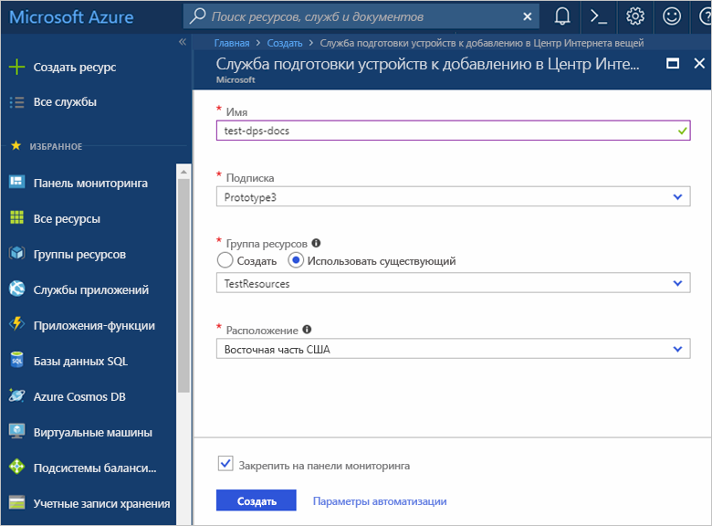
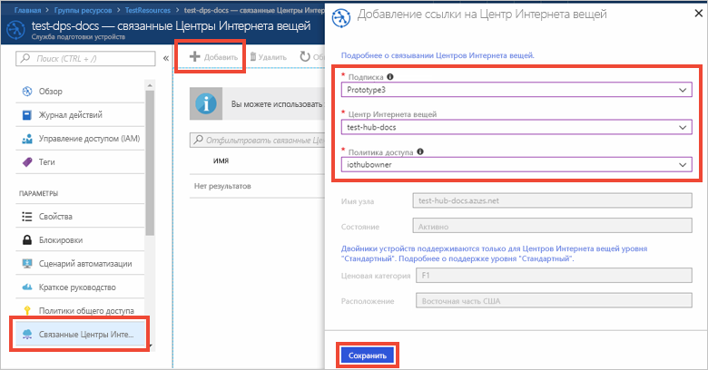

# Настройка службы подготовки устройств для Центра Интернета вещей на портале Azure

В этих инструкциях показано, как настроить облачные ресурсы Azure на портале для подготовки устройств. Эта статья включает шаги по созданию Центра Интернета вещей, создания новой службы подготовки устройств к добавлению в Центр Интернета вещей и связывание двух служб. 

Если у вас еще нет подписки Azure, [создайте бесплатную учетную запись Azure](https://azure.microsoft.com/free/?WT.mc_id=A261C142F), прежде чем начинать работу.

## Создание Центра Интернета вещей

[!INCLUDE [iot-hub-quickstarts-create-hub](../../includes/iot-hub-quickstarts-create-hub.md)]

## Создание экземпляра службы подготовки устройств Центра Интернета вещей

1. Нажмите кнопку **Создать ресурс** в верхнем левом углу окна портала Azure.

2. *Выполните в Marketplace поиск* по запросу **Device provisioning service**. Выберите **Служба подготовки устройств Центра Интернета вещей** и нажмите кнопку **Создать**. 

3. Укажите следующие сведения для нового экземпляра службы подготовки устройств и нажмите кнопку **Создать**.

    * **Имя**. Укажите уникальное имя нового экземпляра службы подготовки устройств. Если введенное имя доступно, появится зеленая галочка.
    * **Подписка**. Выберите подписку, с помощью которой нужно создать экземпляр службы подготовки устройств.
    * **Группа ресурсов**. Это поле позволяет создать новую группу ресурсов или выбрать существующую. В этой группе ресурсов будет содержаться новый экземпляр. Выберите ту же группу ресурсов, содержащую центр Интернета вещей, созданный ранее, например **TestResources**. Помещение всех связанных ресурсов в одну группу позволит управлять ими совместно. Например, при удалении группы ресурсов все содержащиеся в ней ресурсы также удаляются. Дополнительные сведения см. в статье [Управление ресурсами Azure через портал](../azure-resource-manager/resource-group-portal.md).
    * **Расположение**. Выберите ближайшее расположение для устройства.
    * **Закрепить на панели мониторинга**. Выберите этот параметр, чтобы закрепить экземпляр на панель мониторинга, что облегчит его поиск.

      

4. После успешного развертывания службы автоматически откроется колонка сводки службы.

## Связывание Центра Интернета вещей со службой подготовки устройств

В этом разделе добавляется конфигурация в экземпляр службы подготовки устройств. Эта конфигурации устанавливает Центр Интернета вещей, для которого будут подготовлены устройства.

1. Нажмите кнопку **Все ресурсы** в меню слева на портале Azure. Выберите созданный выше экземпляр службы подготовки устройств.  

2. В колонке сводки службы подготовки устройств выберите **Связанные Центры Интернета вещей**. Нажмите кнопку **Добавить** сверху. 

3. Страница **Добавление ссылки на Центр Интернета вещей** предоставляет следующую информацию, необходимую для связи экземпляра службы подготовки устройств и Центра Интернета вещей. Затем щелкните **Сохранить**. 

    * **Подписка**. Выберите подписку, содержащую Центр Интернета вещей, которую требуется связать с новым экземпляром службы подготовки устройств.
    * **Центр Интернета вещей**. Выберите Центр Интернета вещей, который требуется связать с новым экземпляром службы подготовки устройств.
    * **Политика доступа**. Выберите **iothubowner** в качестве учетных данных для установления связи с Центром Интернета вещей.  

      

3. Теперь вы выбранный центр будет отображается в колонке **Связанные Центры Интернета вещей**. Может потребоваться щелкнуть **Обновить**, чтобы **связанные Центры Интернета вещей** отобразились.

## Очистка ресурсов

Другие краткие руководства в этой коллекции созданы на основе этого документа. Если вы планируете продолжать работу с последующими краткими руководствами или обычными руководствами, не удаляйте созданные ресурсы. В противном случае удалите все созданные ресурсы, выполнив на портале Azure следующие действия.

1. В меню слева на портале Azure нажмите кнопку **Все ресурсы** и откройте службу подготовки устройств. В верхней части колонки **Все ресурсы** щелкните **Удалить**.  
2. В меню слева на портале Azure нажмите кнопку **Все ресурсы** и выберите свой Центр Интернета вещей. В верхней части колонки **Все ресурсы** щелкните **Удалить**.  

## Дополнительная информация

Вы развернули Центр Интернета вещей и экземпляр службы подготовки устройств, а затем связали эти два ресурса. Чтобы узнать, как подготовить виртуальное устройство, см. руководство по созданию виртуального устройства.

> [!div class="nextstepaction"]
> [Краткое руководство по созданию виртуального устройства](./quick-create-simulated-device.md)
