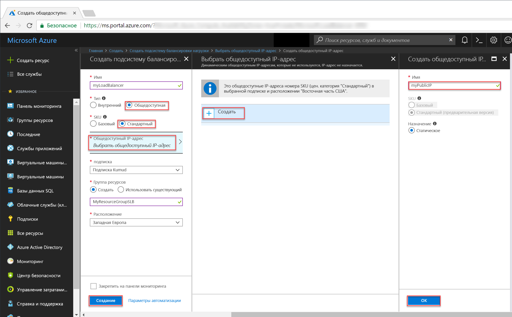
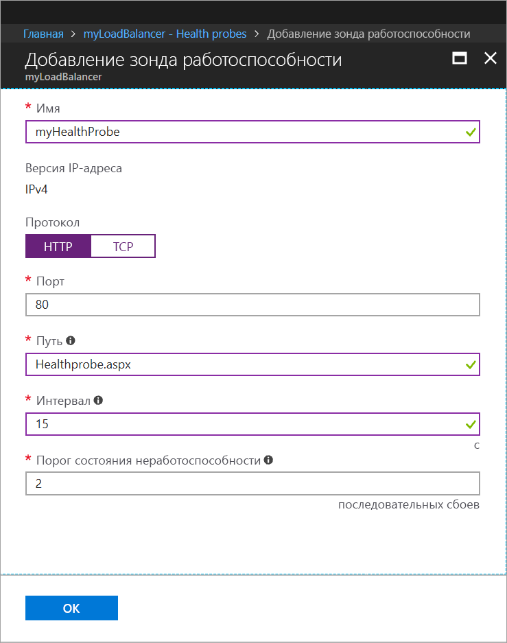
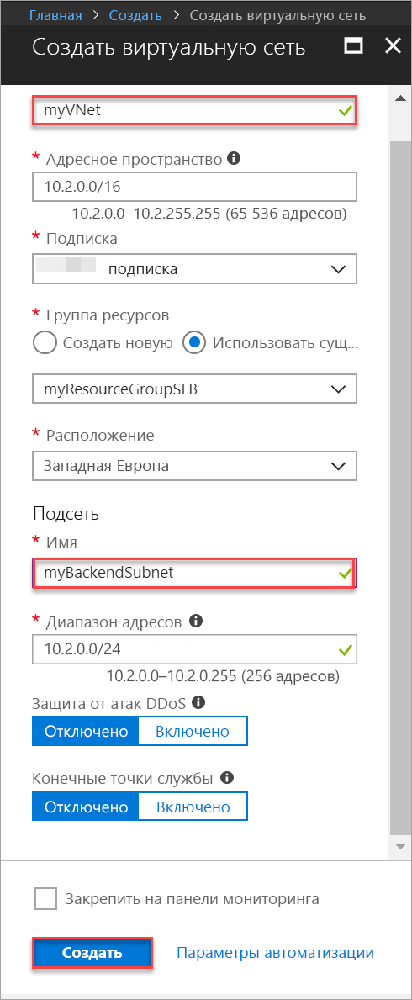

# <a name="tutorial-create-and-manage-standard-load-balancer-using-the-azure-portal"></a>Руководство по созданию и администрированию Load Balancer ценовой категории "Стандартный" с помощью портала Azure

Балансировка нагрузки обеспечивает более высокий уровень доступности и масштабирования за счет распределения входящих запросов между несколькими виртуальными машинами. Из этого руководства вы узнаете о различных компонентах Azure Load Balancer ценовой категории "Стандартный", которые распределяют трафик и обеспечивают высокий уровень доступности. Вы узнаете, как выполнять следующие задачи:


> [!div class="checklist"]
> * создание Azure Load Balancer;
> * создание пробы работоспособности балансировщика нагрузки;
> * создание правил трафика подсистемы балансировки нагрузки;
> * создание виртуальных машин и установка сервера IIS;
> * присоединение виртуальной машины к подсистеме балансировки нагрузки;
> * Просмотр балансировщика нагрузки в действии
> * добавлять и удалять виртуальные машины из подсистемы балансировки нагрузки.


Если у вас еще нет подписки Azure, [создайте бесплатную учетную запись Azure](https://azure.microsoft.com/free/?WT.mc_id=A261C142F), прежде чем начинать работу. 

## <a name="log-in-to-azure"></a>Вход в Azure

Войдите на портал Azure по адресу [http://portal.azure.com](http://portal.azure.com).

## <a name="create-a-standard-load-balancer"></a>Создание подсистемы балансировки нагрузки уровня "Стандартный"

В этом разделе вы создадите общедоступную подсистему балансировки нагрузки, помогающую распределять нагрузку виртуальных машин. Подсистема балансировки нагрузки уровня "Стандартный" поддерживает только стандартные общедоступные IP-адреса. Вместе с подсистемой балансировки нагрузки категории "Стандартный" необходимо также создать новый стандартный общедоступный IP-адрес, настроенный в качестве интерфейсного (с именем *LoadBalancerFrontend* по умолчанию). 

1. В верхней левой части экрана выберите **Создать ресурс** > **Сети** > **Балансировщик нагрузки**.
2. На странице **Create a load balancer** (Создание подсистемы балансировки нагрузки) введите следующие значения для подсистемы балансировки нагрузки.
    - *myLoadBalancer* — для имени подсистемы балансировки нагрузки.
    - **Public** — для типа подсистемы балансировки нагрузки.
    - **Стандартный** — версия номера SKU для подсистемы балансировки нагрузки.
     - *myPublicIP* — для **нового** общедоступного IP-адреса.
    - *myResourceGroupSLB* — для имени **новой** создаваемой группы ресурсов.
    - **westeurope** — для расположения.
3. Щелкните **Создать**, чтобы создать подсистему балансировки нагрузки.


   
## <a name="create-load-balancer-resources"></a>Создание ресурсов подсистемы балансировки нагрузки

В этом разделе описано, как настроить параметры подсистемы балансировки нагрузки для внутреннего пула адресов и пробы работоспособности, а также указать правила подсистемы балансировки нагрузки.

### <a name="create-a-backend-address-pool"></a>Создание внутреннего пула адресов

Для распределения трафика между виртуальными машинами пул внутренних адресов содержит IP-адреса виртуальных сетевых карт, подключенных к подсистеме балансировки нагрузки. Создайте внутренний пул адресов *myBackendPool*, куда будут входить виртуальные машины *VM1* и *VM2*.

1. Щелкните **Все ресурсы** в меню слева, а затем из списка ресурсов выберите **myLoadBalancer**.
2. В разделе **Параметры** выберите **Серверные пулы** и нажмите кнопку **Добавить**.
3. На странице **Добавление серверного пула** введите имя *myBackEndPool* для серверного пула и нажмите кнопку **ОК**.

### <a name="create-a-health-probe"></a>Создание пробы работоспособности

Чтобы балансировщик нагрузки мог следить за состоянием приложения, необходимо настроить пробу работоспособности. Проба работоспособности динамически добавляет или удаляет виртуальные машины из балансировщика нагрузки на основе их ответа на проверки работоспособности. Создайте зонд работоспособности *myHealthProbe*, чтобы отслеживать работоспособность виртуальных машин.

1. Щелкните **Все ресурсы** в меню слева, а затем из списка ресурсов выберите **myLoadBalancer**.
2. В разделе **Параметры** щелкните **Зонды работоспособности** и нажмите кнопку **Добавить**.
3. Для создания зонда работоспособности используйте следующие значения:
    - *myHealthProbe* — для имени зонда работоспособности;
    - **HTTP** — для типа протокола;
    - *80* — для номера порта;
    - *15* — для **интервала** между попытками выполнения зонда (в секундах);
    - *2* — для числа **порога состояния неработоспособности** или последовательных сбоев зонда, которые должны произойти, прежде чем виртуальная машина будет считаться неработоспособной.
4. Последовательно выберите **ОК**.

   

### <a name="create-a-load-balancer-rule"></a>Создание правила балансировщика нагрузки

Правило балансировщика нагрузки позволяет определить распределение трафика между виртуальными машинами. Вы определяете конфигурацию внешнего IP-адреса для входящего трафика и пул внутренних IP-адресов для приема трафика, а также требуемый порт источника и назначения. Создайте правило балансировки нагрузки *myLoadBalancerRuleWeb* для прослушивания порта 80 в интерфейсном сервере *FrontendLoadBalancer* и отправки сетевого трафика со сбалансированной нагрузкой во внутренний пул адресов *myBackEndPool*, также используя порт 80. 

1. Щелкните **Все ресурсы** в меню слева, а затем из списка ресурсов выберите **myLoadBalancer**.
2. В разделе **Параметры** выберите **Правила балансировки нагрузки**, а затем щелкните **Добавить**.
3. Для настройки правила балансировки нагрузки используйте следующие значения:
    - *myHTTPRule* — для имени правила балансировки нагрузки;
    - **TCP** — для типа протокола;
    - *80* — для номера порта;
    - *80* — для внутреннего порта;
    - *myBackendPool* — для имени серверного пула;
    - *myHealthProbe* — для имени зонда работоспособности.
4. Последовательно выберите **ОК**.
    
## <a name="create-backend-servers"></a>Создание внутренних серверов

В этом разделе описано, как создать виртуальную сеть, три виртуальные машины для внутреннего пула подсистемы балансировки нагрузки и установить службы IIS на виртуальных машинах для проверки подсистемы балансировки нагрузки.

### <a name="create-a-virtual-network"></a>Создать виртуальную сеть
1. В верхней левой части экрана щелкните **Создать** > **Сети** > **Виртуальная сеть**, а затем введите следующие значения для виртуальной сети:
    - *myVNet* — для имени виртуальной сети;
    - *myResourceGroupSLB* — в качестве имени имеющейся группы ресурсов;
    - *myBackendSubnet* — для имени подсети.
2. Щелкните **Создать**, чтобы создать виртуальную сеть.

    

### <a name="create-virtual-machines"></a>Создание виртуальных машин

1. В верхней части экрана слева щелкните **Создать** > **Вычисления** > **Windows Server 2016 Datacenter**, а затем введите следующие значения для виртуальной машины:
    - *myVM1* — для имени виртуальной машины;        
    - *azureuser* — для имени пользователя учетной записи администратора;    
    - *myResourceGroupSLB* — для **группы ресурсов**. Установите флажок **Использовать существующую** и выберите *myResourceGroupSLB*.
2. Последовательно выберите **ОК**.
3. Выберите значение **DS1_V2** в качестве размера виртуальной машины и нажмите кнопку **Выбрать**.
4. Введите следующие значения для параметров виртуальной машины.
    -  В качестве виртуальной сети выберите *myVNet*.
    - В качестве подсети выберите *myBackendSubnet*.
    - *myNetworkSecurityGroup* — для имени новой группы безопасности сети (брандмауэра), которую необходимо создать.
5. Щелкните **Отключено**, чтобы отключить диагностику загрузки.
6. Нажмите кнопку **ОК**, просмотрите параметры на странице сводки и нажмите кнопку **Создать**.
7. Создайте еще две виртуальные машины *VM2* и *VM3* с виртуальной сетью *myVnet*, подсетью *myBackendSubnet* и группой безопасности сети **myNetworkSecurityGroup*, выполнив шаги 1–6. 

### <a name="create-nsg-rules"></a>Создание правил NSG

В этом разделе вы создаете правила группы безопасности сети (NSG), чтобы разрешить входящие подключения по протоколу HTTP и протоколу удаленного рабочего стола (RDP).

1. В меню слева щелкните **Все ресурсы**, а затем в списке ресурсов выберите группу безопасности сети **myNetworkSecurityGroup**, расположенную в группе ресурсов **myResourceGroupSLB**.
2. В разделе **Параметры** щелкните **Правила безопасности для входящего трафика**, а затем — **Добавить**.
3. Введите (выберите) следующие значения для правила безопасности для входящего трафика с именем *myHTTPRule*, чтобы разрешить входящие подключения HTTP через порт 80:
    - *Service Tag* — для **источника**;
    - *Internet* — для **тега службы источника**;
    - *80* — для **диапазонов портов назначения**;
    - *TCP* — для **протокола**;
    - *Разрешить* — для **действия**;
    - *100* — для значения **приоритета**;
    - *myHTTPRule* — для имени;
    - *Разрешить HTTP* — для описания.
4. Последовательно выберите **ОК**.
 
 
5. Еще раз выполните шаги 2–4, чтобы создать другое правило с именем *myRDPRule*, разрешающее входящее подключение по RDP через порт 3389. Введите (выберите) следующие значения:
    - *Service Tag* — для **источника**;
    - *Internet* — для **тега службы источника**;
    - *3389* — для **диапазонов портов назначения**;
    - *TCP* — для **протокола**;
    - *Разрешить* — для **действия**;
    - *200* — для значения **приоритета**;
    - *myRDPRule* — для имени;
    - *Разрешить RDP* — для описания.

### <a name="install-iis-on-vms"></a>Установка служб IIS на виртуальные машины

1. В меню слева щелкните **Все ресурсы** и выберите в списке ресурсов виртуальную машину **myVM1**, расположенную в группе ресурсов *myResourceGroupSLB*.
2. На странице **обзора** щелкните **Подключить**, чтобы подключиться по протоколу RDP к виртуальной машине.
3. Войдите в виртуальную машину с именем пользователя *azureuser*.
4. На рабочем столе сервера перейдите к **Средства администрирования Windows**>**Windows PowerShell**.
5. В окне PowerShell выполните следующие команды, чтобы установить сервер IIS, удалить файл по умолчанию iisstart.htm и добавить новый файл iisstart.htm с именем виртуальной машины:

   ```azurepowershell-interactive
    
    # install IIS server role
    Install-WindowsFeature -name Web-Server -IncludeManagementTools
    
    # remove default htm file
     remove-item  C:\inetpub\wwwroot\iisstart.htm
    
    # Add a new htm file that displays server name
     Add-Content -Path "C:\inetpub\wwwroot\iisstart.htm" -Value $("Hello World from" + $env:computername)
   ```
6. Закройте сеанс RDP для *myVM1*.
7. Повторите шаги 1–6, чтобы установить IIS и добавить обновленный файл iisstart.htm на *myVM2* и *myVM3*.

## <a name="add-vms-to-the-backend-address-pool"></a>Добавление виртуальных машин в серверный пул адресов

Чтобы направлять трафик на виртуальные машины, добавьте виртуальные машины *VM1*, *VM2* и *VM3* в ранее созданный серверный пул адресов *myBackendPool*. Этот пул содержит IP-адреса виртуальных сетевых адаптеров, подключенных к подсистеме балансировки нагрузки.

1. Щелкните **Все ресурсы** в меню слева, а затем из списка ресурсов выберите **myLoadBalancer**.
2. В разделе **Параметры** щелкните **Серверные пулы**, затем в списке серверных пулов выберите **myBackendPool**.
3. На странице **myBackendPool** сделайте следующее:
    - Щелкните **Добавить целевую IP-конфигурацию сети**, чтобы добавить созданные для серверного пула виртуальные машины (*myVM1*, *myVM2* и *myVM3*).
    - Последовательно выберите **ОК**.

4. Убедитесь, что в настройках серверного пула подсистемы балансировки нагрузки отображаются все нужные виртуальные машины (**VM1**, **VM2** и **myVM3**).

## <a name="test-the-load-balancer"></a>Тестирование подсистемы балансировки нагрузки
1. Найдите общедоступный IP-адрес для подсистемы балансировки нагрузки на экране **обзора**. Выберите **Все ресурсы**, а затем щелкните **myPublicIP**.

2. Скопируйте общедоступный IP-адрес и вставьте его в адресную строку браузера. В браузере отобразится страница по умолчанию веб-сервера IIS.

      

Чтобы проверить, как подсистема балансировки нагрузки распределяет трафик между тремя виртуальными машинами, на которых выполняется приложение, принудительно обновите страницу в браузере.

## <a name="remove-or-add-vms-from-the-backend-pool"></a>Добавление виртуальных машин в серверный пул и удаление их из него
На виртуальных машинах, выполняющих приложение, может потребоваться выполнить обслуживание, например установить обновления операционной системы. Для обработки большего объема трафика в приложении необходимо добавить дополнительные виртуальные машины. В этом разделе показано, как удалить или добавить виртуальную машину из балансировщика нагрузки.

1. Щелкните **Все ресурсы** в меню слева, а затем из списка ресурсов выберите **myLoadBalancer**.
2. В разделе **Параметры** щелкните **Серверные пулы**, затем в списке серверных пулов выберите **myBackendPool**.
3. На странице **myBackendPool** в разделе **Целевые IP-конфигурации сети** щелкните значок удаления рядом с элементом **Виртуальная машина: myVM1**, чтобы удалить *VM1* из серверного пула.

Теперь *myVM1* не входит в серверный пул адресов, и вы можете выполнять для *myVM1* любые задачи обслуживания, например установить обновления программного обеспечения. На период отсутствия *VM1** вся нагрузка распределяется между *myVM2* и *myVM3*. 

Чтобы вернуть *myVM1* в серверный пул, выполните процедуру из раздела *Добавление виртуальных машин в серверный пул адресов* этой статьи.

## <a name="clean-up-resources"></a>Очистка ресурсов

Ставшие ненужными группу ресурсов, подсистему балансировки нагрузки и все связанные ресурсы можно удалить. Для этого выберите группу ресурсов, содержащую подсистему балансировки нагрузки, и щелкните **Удалить**.

## <a name="next-steps"></a>Дополнительная информация

В этом руководстве описано, как создать подсистему балансировки нагрузки в службе Azure Load Balancer (цен. категории "Стандартный"), подключить к ней виртуальные машины, настроить правило трафика подсистемы балансировки нагрузки, пробу работоспособности, а также протестировать подсистему балансировки нагрузки. Также здесь показано, как удалить виртуальную машину из набора балансировки нагрузки и добавить ее в серверный пул адресов. Чтобы узнать больше об Azure Load Balancer, ознакомьтесь с другими руководствами по этой службе.

> [!div class="nextstepaction"]
> [Руководства по Azure Load Balancer](tutorial-load-balancer-standard-public-zone-redundant-portal.md)
