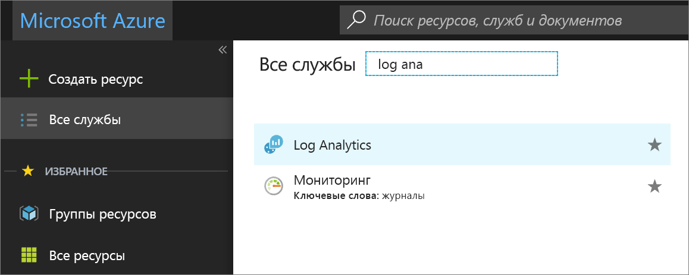

# Управление рабочими областями

Управление доступом к Log Analytics осуществляется с использованием разных задач администрирования, связанных с рабочими областями. Эта статья содержит рекомендации и инструкции по управлению рабочими областями. Рабочая область — это контейнер, который содержит сведения об учетной записи и ее конфигурации. Вы или другие члены организации могут использовать несколько рабочих областей для управления различными наборами данных, собранными из всех частей ИТ-инфраструктуры.

Чтобы создать рабочую область, вам понадобится:

1. Создать подписку Azure.
2. Выбрать имя рабочей области.
3. Связать рабочую область с одной из своих подписок и групп ресурсов.
4. Выбрать географическое расположение.

## Определение необходимого количества рабочих областей
Рабочая область — это ресурс Azure и контейнер, где данные собираются, группируются, анализируются и представляются на портале Azure.

Вы можете создать несколько рабочих областей в подписке Azure и иметь к ним доступ, а также легко создавать запросы между областями. В этом разделе описывается, в каких ситуациях может пригодиться создание более чем одной рабочей области.

В настоящее время рабочая область обеспечивает:

* географическое расположение для хранения данных;
* изоляцию данных для определения прав доступа для другого пользователя;
* определение области применения конфигурации, включающей параметры хранения и ограничения данных.

В контексте потребления рекомендуется создавать минимальное число рабочих областей. Это упростит и ускорит процессы администрирования и выполнения запросов. Но даже с учетом указанного вы можете создать большее число рабочих областей в следующих ситуациях:

* Вы являетесь глобальной компанией, и по причинам конфиденциальности или в соответствии с нормативными требованиями вам необходимо хранить данные в определенных регионах.
* Вы используете Azure и хотите избежать расходов на передачу исходящих данных, создав рабочую область в том же регионе, где находятся ресурсы Azure, которыми она управляет.
* Вам необходимо распределить расходы между различными отделами или бизнес-группами в зависимости от их использования, создав рабочую область для каждого отдела или бизнес-группы в рамках их подписки Azure.
* Вы являетесь поставщиком управляемой службы, и вам необходимо хранить данные службы Log Analytics по каждому клиенту отдельно от данных других клиентов.
* Вы управляете несколькими клиентами и хотите, чтобы каждый клиент, отдел или бизнес-группа видели только свои данные.

При использовании агентов Windows для сбора данных [каждый агент можно настроить таким образом, чтобы он отправлял отчеты в одну или несколько рабочих областей](log-analytics-windows-agents.md).

При использовании System Center Operations Manager, каждую группу управления Operations Manager можно подключить только к одной рабочей области. Microsoft Monitoring Agent можно установить на компьютеры под управлением Operations Manager и настроить его таким образом, чтобы он отправлял отчеты и в Operations Manager, и в другую рабочую область Log Analytics.

## Сведения о рабочей области

Сведения о рабочей области можно просмотреть на портале Azure. 

1. Перейдите на [портал Azure](https://portal.azure.com), если вы еще этого не сделали.

2. На портале Azure щелкните **Все службы**. В списке ресурсов введите **Log Analytics**. Как только вы начнете вводить символы, список отфильтруется соответствующим образом. Выберите **Log Analytics**.  

      

3. В области подписок Log Analytics выберите рабочую область.

4. На странице рабочей области отображаются сведения о начале работы, конфигурации и ссылки на дополнительные сведения.  

      

## Управление учетными записями и пользователями
Каждая рабочая область может включать учетных записей, каждая из которых может иметь доступ к нескольким рабочим областям. Управление доступом осуществляется через [управление доступом на основе ролей Azure](../active-directory/role-based-access-control-configure.md). Эти права доступа применяются на портале Azure и при доступе к API.

Разрешения Azure также требуются для следующих действий:

| Действие                                                          | Требуются разрешения Azure | Примечания |
|-----------------------------------------------------------------|--------------------------|-------|
| Добавление и удаление решений по управлению                        | `Microsoft.Resources/deployments/*`   `Microsoft.OperationalInsights/*`   `Microsoft.OperationsManagement/*`   `Microsoft.Automation/*`   `Microsoft.Resources/deployments/*/write` | Эти разрешения нужно предоставить на уровне группы ресурсов или подписки. |
| Изменение ценовой категории                                       | `Microsoft.OperationalInsights/workspaces/*/write` | |
| Просмотр данных на плитках *службы архивации* и *службы Site Recovery* | Администратор или соадминистратор | Имеет доступ к ресурсам, развернутым с использованием классической модели развертывания |
| Создание рабочей области на портале Azure                        | `Microsoft.Resources/deployments/*`   `Microsoft.OperationalInsights/workspaces/*` ||

### Управление доступом к службе Log Analytics с помощью разрешений Azure
Чтобы предоставить доступ к рабочей области Log Analytics с помощью разрешений Azure, следуйте указаниям в статье [Использование назначений ролей для управления доступом к ресурсам в подписке Azure](../active-directory/role-based-access-control-configure.md).

В Azure доступны две встроенные роли пользователей для Log Analytics:
- читатель Log Analytics;
- участник Log Analytics.

Членам роли *Читатель Log Analytics* доступны следующие действия:
- просмотр и поиск всех данных мониторинга; 
- просмотр параметров мониторинга, в том числе просмотр конфигурации диагностики Azure на всех ресурсах Azure.

Роль читателя Log Analytics включает следующие действия Azure:

| type    | Разрешение | ОПИСАНИЕ |
| ------- | ---------- | ----------- |
| Действие | `*/read`   | Возможность просматривать все ресурсы Azure и их конфигурацию. Включает просмотр следующих данных:   состояние расширения виртуальной машины;   конфигурация диагностики Azure на ресурсах;   все свойства и параметры всех ресурсов. |
| Действие | `Microsoft.OperationalInsights/workspaces/analytics/query/action` | Возможность выполнять запросы поиска по журналам версии 2. |
| Действие | `Microsoft.OperationalInsights/workspaces/search/action` | Возможность выполнять запросы поиска по журналам версии 1. |
| Действие | `Microsoft.Support/*` | Возможность создавать обращения в службу поддержки. |
|Запрет действия | `Microsoft.OperationalInsights/workspaces/sharedKeys/read` | Запрет на чтение ключа рабочей области, необходимого для использования API сбора данных и для установки агентов. Это предотвращает добавление новых ресурсов в рабочую область |

Членам роли *Участник Log Analytics* доступны следующие действия:
- чтение всех данных мониторинга, доступных для роли читателя Log Analytics;  
- создание и настройка учетных записей службы автоматизации;  
- Добавление и удаление решений по управлению    
    > [!NOTE] 
    > Чтобы выполнять последние два действия, нужно предоставить разрешение на уровне группы ресурсов или подписки.  

- чтение ключей учетной записи хранения;   
- настройка сбора журналов из службы хранилища Azure;  
- изменение параметров мониторинга ресурсов Azure, в том числе:
  - добавление расширения виртуальных машин на виртуальные машины;
  - настройка диагностики Azure на всех ресурсах Azure.

> [!NOTE] 
> Можно добавить расширение виртуальной машины на виртуальную машину, чтобы получить полный контроль над ней.

Роль участника Log Analytics включает следующие действия Azure:

| Разрешение | ОПИСАНИЕ |
| ---------- | ----------- |
| `*/read`     | Возможность просматривать все ресурсы и конфигурацию ресурсов. Включает просмотр следующих данных:   состояние расширения виртуальной машины;   конфигурация диагностики Azure на ресурсах;   все свойства и параметры всех ресурсов. |
| `Microsoft.Automation/automationAccounts/*` | Возможность создания и настройки учетных записей службы автоматизации Azure, в том числе добавление и изменение модулей Runbook. |
| `Microsoft.ClassicCompute/virtualMachines/extensions/*`   `Microsoft.Compute/virtualMachines/extensions/*` | Добавление, обновление и удаление расширений виртуальных машин, в том числе расширения Microsoft Monitoring Agent и агента OMS для расширения Linux. |
| `Microsoft.ClassicStorage/storageAccounts/listKeys/action`   `Microsoft.Storage/storageAccounts/listKeys/action` | Просмотр ключа учетной записи хранения. Эта возможность необходима для настройки в Log Analytics чтения журналов из учетных записей хранения Azure. |
| `Microsoft.Insights/alertRules/*` | Добавление, обновление и удаление правил генерации оповещений. |
| `Microsoft.Insights/diagnosticSettings/*` | Добавление, обновление и удаление параметров диагностики в ресурсах Azure. |
| `Microsoft.OperationalInsights/*` | Добавление, обновление и удаление конфигурации рабочих областей Log Analytics. |
| `Microsoft.OperationsManagement/*` | Добавление и удаление решений по управлению. |
| `Microsoft.Resources/deployments/*` | Создание и удаление развертываний. Требуется для добавления и удаления решений, рабочих областей и учетных записей службы автоматизации. |
| `Microsoft.Resources/subscriptions/resourcegroups/deployments/*` | Создание и удаление развертываний. Требуется для добавления и удаления решений, рабочих областей и учетных записей службы автоматизации. |

Чтобы добавить пользователей в роль или удалить их из нее, требуются разрешения `Microsoft.Authorization/*/Delete` и `Microsoft.Authorization/*/Write`.

С помощью этих ролей можно предоставлять пользователям доступ к различным областям:
- Подписка — доступ ко всем рабочим областям в подписке.
- Группа ресурсов — доступ ко всем рабочим областям в группе ресурсов.
- Ресурс — доступ к только указанной рабочей области.

Чтобы обеспечить точное управление доступом, рекомендуем выполнять назначения на уровне ресурса (рабочей области).  Используйте [пользовательские роли](../active-directory/role-based-access-control-custom-roles.md) для создания ролей с определенными разрешениями.

## Связывание существующей рабочей области с подпиской Azure
Все рабочие области, созданные после 26 сентября 2016 года, должны быть связаны с подпиской Azure во время создания, Рабочие области, созданные до этой даты, должны быть связаны с рабочей областью во время входа. Когда вы создаете рабочую область на портале Azure или связываете рабочую область с подпиской Azure, Azure Active Directory связывается в качестве учетной записи организации.

### Связывание рабочей области с подпиской Azure на портале Azure
1. На портале Azure щелкните **Все службы**. В списке ресурсов введите **Log Analytics**. Как только вы начнете вводить символы, список отфильтруется соответствующим образом. Выберите **Log Analytics**.  

2. В области подписок Log Analytics щелкните **Добавить**.  

    

3. Из панели **Рабочая область Log Analytics** выберите **Link existing** (Связать существующую).  

4. Щелкните **Настроить необходимые параметры**.  

5. Появится список рабочих областей, не связанных с учетной записью Azure. Выберите рабочую область.  
   
6. При необходимости вы можете изменить значения следующих элементов:
   * Подписка
   * Группа ресурсов
   * Расположение
   * Ценовой уровень  

7. Последовательно выберите **ОК**. Теперь рабочая область связана с учетной записью Azure.

> [!NOTE]
> Если рабочая область, которую необходимо связать, не отображается, у подписки Azure нет прав доступа к рабочей области, созданной на портале OMS.  Чтобы предоставить доступ к этой учетной записи на портале OMS, см. раздел [Добавление пользователя в существующую рабочую область](#add-a-user-to-an-existing-workspace).
>
>

## Обновление рабочей области до тарифного плана с оплатой
Рабочая область OMS поддерживает три типа плана: **Бесплатный**, **Автономный** и **OMS**.  Уровень *Бесплатный* предусматривает ограничение емкости на отправку данных в Log Analytics в течение одного дня (500 МБ).  Чтобы собирать данные, которые превышают этот предел, рабочую область необходимо обновить до плана с оплатой. Тарифный план можно изменить в любое время.  Дополнительные сведения о ценах на OMS см. [здесь](https://www.microsoft.com/en-us/cloud-platform/operations-management-suite-pricing).

### Использование прав из подписки OMS
Чтобы использовать права, полученные при покупке подписки OMS E1, OMS E2 или надстройки OMS для System Center, выберите план *OMS* для Log Analytics (OMS).

При покупке подписки OMS права добавляются в соглашение Enterprise. Эти права могут использоваться любой подпиской Azure, созданной в рамках этого соглашения. Все рабочие области этих подписок используют права OMS.

Чтобы использование рабочей области основывалось на правах из подписки OMS, сделайте следующее:

1. Создайте рабочую область в подписке Azure, которая входит в состав соглашения Enterprise, включающего подписку OMS.

2. Выберите для рабочей области план *OMS*.

> [!NOTE]
> Если рабочая область создана до 26 сентября 2016 года и для Log Analytics используется тарифный план *Премиум*, то рабочая область будет использовать права из надстройки OMS для System Center. Чтобы использовать права из подписки OMS, ценовую категорию необходимо изменить на *OMS*.
>
>

Права из подписки OMS не отображаются на портале Azure. Однако права и их использование можно просмотреть на корпоративном портале.  

Если вам нужно изменить подписку Azure, с которой связана ваша рабочая область, можно использовать командлет [Move-AzureRmResource](https://msdn.microsoft.com/library/mt652516.aspx) в среде Azure PowerShell.

### Использование подписки Azure в рамках соглашения Enterprise
Если подписка OMS отсутствует, плата взимается за каждый компонент OMS по отдельности, а сведения об использовании отражаются в счете Azure.

Если у вас есть денежные обязательства Azure в отношении соглашения о регистрации Enterprise, с которым связаны ваши подписки Azure, использование службы Log Analytics будет идти в зачет этих обязательств.

Если вам нужно изменить подписку Azure, с которой связана рабочая область, можно использовать командлет [Move-AzureRmResource](https://msdn.microsoft.com/library/mt652516.aspx) в среде Azure PowerShell.  

### Изменение рабочей области до платной ценовой категории на портале Azure
1. На портале Azure в области подписок Log Analytics выберите рабочую область.

2. На панели рабочей области в разделе **Общие** щелкните **Ценовая категория**.  

3. В разделе **Ценовая категория** выберите ценовую категорию и щелкните **Выбрать**.  
    

> [!NOTE]
> Если рабочая область связана с учетной записью службы автоматизации, прежде чем вы сможете выбрать ценовую категорию *Автономная (за гигабайт)*, нужно удалить все решения **службы автоматизации и управления** и отменить привязку учетной записи автоматизации. В колонке рабочей области в разделе **Общие** щелкните **Решения**, чтобы просмотреть и удалить решения. Чтобы отменить привязку учетной записи службы автоматизации, щелкните ее имя в колонке **Ценовая категория**.
>
>

### Изменение рабочей области до платной ценовой категории на портале OMS

Чтобы изменить ценовую категорию с помощью портала OMS, необходимо иметь подписку Azure.

1. На портале OMS щелкните элемент **Параметры**.

2. Выберите вкладку **Учетные записи**, а затем — **Azure Subscription & Data Plan** (Подписка Azure и тарифный план).

3. Выберите ценовую категорию, которую вы хотите использовать.

4. Выберите команду **Сохранить**.  

    

Новый тарифный план отображается на ленте портала OMS в верхней части веб-страницы.

## Дополнительная информация
* Сведения о сборе данных с компьютеров в вашем центре обработки данных или другой облачной среде см. в статье [Сбор данных с компьютеров в среде с помощью Log Analytics](log-analytics-concept-hybrid.md).
* Сведения о настройке сбора данных на виртуальных машинах Azure см. в [этой статье](log-analytics-quick-collect-azurevm.md).  
* [добавьте решения Log Analytics из коллекции решений](log-analytics-add-solutions.md) .

