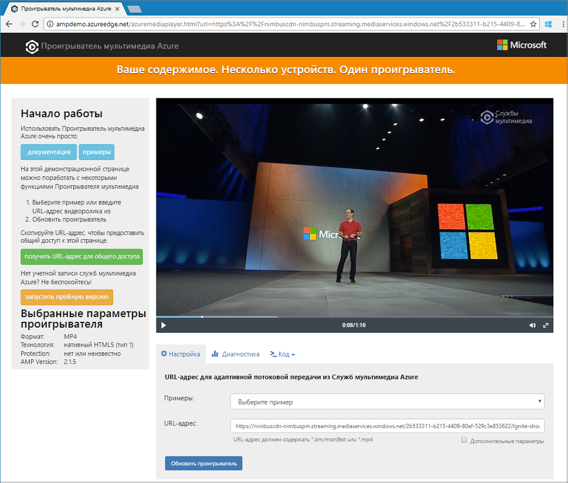

# <a name="quickstart-stream-video-files---net"></a>Краткое руководство по потоковой передаче видеофайлов — .NET

> [!NOTE]
> Последняя версия Служб мультимедиа Azure представлена в предварительной версии и может называться версией 3. Чтобы начать использовать API-интерфейсы 3 версии, создайте учетную запись Служб мультимедиа, как описано в этом кратком руководстве. 

Это краткое руководство показывает, как можно легко начать потоковую передачу видео в разных браузерах и на разных устройствах с помощью Служб мультимедиа Azure. Пример в этой статье предназначен для кодирования содержимого, которое доступно через URL-адрес HTTPS. 

Изучив это краткое руководство, вы сможете выполнить потоковую передачу видео.  



[!INCLUDE [quickstarts-free-trial-note](../../../includes/quickstarts-free-trial-note.md)]

## <a name="prerequisites"></a>предварительным требованиям

Вы можете скачать [Visual Studio Community 2017](https://www.visualstudio.com/thank-you-downloading-visual-studio/?sku=Community&rel=15) бесплатно, если у вас нет Visual Studio.

## <a name="download-the-sample"></a>Скачивание примера приложения

Клонируйте репозиторий GitHub, содержащий пример потоковой передачи данных .NET, на компьютер с помощью следующей команды:  

 ```bash
 git clone https://github.com/Azure-Samples/media-services-v3-dotnet-quickstarts.git
 ```

Этот пример находится в папке [EncodeAndStreamFiles](https://github.com/Azure-Samples/media-services-v3-dotnet-quickstarts/tree/master/AMSV3Quickstarts/EncodeAndStreamFiles).

Этот пример выполняет следующие действия:

1. создание преобразования (сначала проверяется, существует ли указанное преобразование); 
2. создание выходного ресурса, который используется в качестве выходных данных задания кодирования;
3. создание входных данных для задания, основанных на URL-адресе HTTPS;
4. отправка задания кодирования с помощью входных и выходных данных, которые были созданы ранее;
5. проверка состояния задания;
6. создание указателя потоковой передачи;
7. компиляция URL-адресов потоковой передачи.

Чтобы получить сведения о назначении всех функций в образце, ознакомьтесь с кодом и просмотрите комментарии в [этом исходном файле](https://github.com/Azure-Samples/media-services-v3-dotnet-quickstarts/blob/master/AMSV3Quickstarts/EncodeAndStreamFiles/Program.cs).

## <a name="log-in-to-azure"></a>Вход в Azure

Войдите на [портал Azure](http://portal.azure.com).

[!INCLUDE [cloud-shell-try-it.md](../../../includes/cloud-shell-try-it.md)]

[!INCLUDE [media-services-cli-create-v3-account-include](../../../includes/media-services-cli-create-v3-account-include.md)]

[!INCLUDE [media-services-v3-cli-access-api-include](../../../includes/media-services-v3-cli-access-api-include.md)]

## <a name="run-the-sample-app"></a>Запуск примера приложения

После запуска приложения отображаются URL-адреса, которые можно использовать для воспроизведения видео с помощью различных протоколов. 

1. Нажмите клавиши CTRL+F5, чтобы выполнить приложение *EncodeAndStreamFiles*.
2. Выберите протокол **HLS** Apple (заканчивается на *manifest(format=m3u8-aapl)*) и скопируйте URL-адрес потоковой передачи в консоли.


В [исходном коде](https://github.com/Azure-Samples/media-services-v3-dotnet-quickstarts/blob/master/AMSV3Quickstarts/EncodeAndStreamFiles/Program.cs) образца вы увидите, каким образом создан URL-адрес. Чтобы создать его, необходимо сцепить имя узла конечной точки потоковой передачи и путь указателя потоковой передачи.  

## <a name="test-with-azure-media-player"></a>Тестирование с помощью Проигрывателя мультимедиа Azure

Для тестирования потоковой передачи в этой статье используется Проигрыватель мультимедиа Azure. 

> [!NOTE]
> Если проигрыватель размещен на сайте HTTPS, обновите URL-адрес до HTTPS.

1. Откройте браузер и перейдите по адресу [https://aka.ms/azuremediaplayer/](https://aka.ms/azuremediaplayer/).
2. В поле **URL:** (URL-адрес:) вставьте одно из значений URL-адресов потоковой передачи, полученных при работе приложения. 
3. Щелкните **Update Player** (Обновить проигрыватель).

Проигрыватель мультимедиа Azure можно использовать для тестирования, но его нельзя применять в рабочей среде. 

## <a name="clean-up-resources"></a>Очистка ресурсов

Если вам больше не нужны ресурсы в группе ресурсов, включая Службы мультимедиа и учетные записи хранения, созданные в рамках этого краткого руководства, удалите группу ресурсов. Для этого можно использовать инструмент **CloudShell**.

В **CloudShell** выполните следующую команду:

```azurecli-interactive
az group delete --name amsResourceGroup
```

## <a name="examine-the-code"></a>Анализ кода

Чтобы получить сведения о назначении всех функций в образце, ознакомьтесь с кодом и просмотрите комментарии в [этом исходном файле](https://github.com/Azure-Samples/media-services-v3-dotnet-quickstarts/blob/master/AMSV3Quickstarts/EncodeAndStreamFiles/Program.cs).

В руководстве по [передаче, кодированию и потоковой передаче файлов](stream-files-tutorial-with-api.md) представлен более сложный пример потоковой передачи и подробные пояснения. 

## <a name="multithreading"></a>Многопоточность

Пакеты SDK для Служб мультимедиа Azure версии 3 не являются потокобезопасными. При работе с многопоточным приложением необходимо создать объект AzureMediaServicesClient для каждого потока.

## <a name="next-steps"></a>Дополнительная информация

> [!div class="nextstepaction"]
> [Руководство. Отправка, кодирование и потоковая передача видео с помощью API](stream-files-tutorial-with-api.md)
