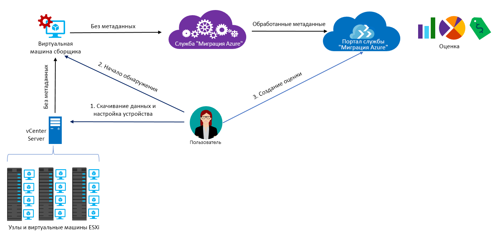

# Сведения о службе "Миграция Azure"

Служба "Миграция Azure" выполняет оценку локальных рабочих нагрузок для миграции в Azure. Служба оценивает миграционную пригодность локальных компьютеров, определяет размер на основе производительности и рассчитывает затраты на работу локальных виртуальных машин в Azure. Эта служба подходит для миграции методом lift-and-shift, а также для начальных этапов оценки миграции. После оценки можно использовать такие службы, как [Azure Site Recovery](https://docs.microsoft.com/azure/site-recovery/site-recovery-overview) и [Azure Database Migration Service](https://docs.microsoft.com/azure/dms/dms-overview), чтобы перенести компьютеры в Azure.

## Зачем использовать службу "Миграция Azure"?

Служба "Миграция Azure" помогает выполнить следующие задачи:

- **Оценка готовности к работе в Azure.** Позволяет определить, подходят ли локальные компьютеры для работы в Azure.
- **Выбор размера.** Рекомендации по размерам виртуальных машин Azure на основе журнала производительности локальных виртуальных машин.
- **Оценка ежемесячных расходов.** Расчет затрат на работу локальных виртуальных машин в Azure.  
- **Миграция с высокой надежностью.** Визуализация зависимостей локальных виртуальных машин, позволяющая создавать группы виртуальных машин для совместной оценки и миграции.

## Текущие ограничения

- Сейчас для перехода на виртуальные машины Azure можно оценить только локальные виртуальные машины VMware. Виртуальные машины VMware должны работать под управлением vCenter Server (версии 5.5, 6.0 или 6.5).
- Если вы хотите оценить виртуальные машины Hyper-V и физические серверы, используйте [Планировщик развертывания Azure Site Recovery](http://aka.ms/asr-dp-hyperv-doc) для Hyper-V и наши [партнерские средства](https://azure.microsoft.com/migration/partners/) для физических компьютеров.
- Вы можете обработать до 1500 виртуальных машин при помощи одной операции обнаружения и до 1500 виртуальных машин в одном проекте. Кроме того, можно обработать до 1500 виртуальных машин при помощи одной операции оценки.
- Если нужно обнаружить среду большего размера, можно разделить операцию обнаружения и создать несколько проектов. [Узнайте больше](how-to-scale-assessment.md). Служба "Миграция Azure" поддерживает до 20 проектов на подписку.
- Проект службы "Миграция Azure" можно создать только в регионах "Западно-центральная часть США" и "восточная часть США". Это не влияет на возможность планирования миграции в любое целевое расположение Azure. Расположение проекта миграции используется только для хранения метаданных из локальной среды.
- Служба "Миграция Azure" поддерживает только управляемые диски для оценки миграции.

## За что будет взиматься плата?

[Дополнительные сведения](https://azure.microsoft.com/pricing/details/azure-migrate/) о ценах на службу "Миграция Azure".

## Что такое оценка?

Параметры оценки можно настроить в соответствии со своими потребностями. Ниже представлена таблица, в которой кратко описаны свойства оценки.

**Свойство** | **Дополнительные сведения**
--- | ---
**Целевое расположение** | Расположение Azure для миграции.  Сейчас служба "Миграция Azure" поддерживает 30 регионов ([проверьте доступность по регионам](https://azure.microsoft.com/global-infrastructure/services/)). По умолчанию в качестве целевого региона указана западная часть США 2.
**Тип хранилища** | Тип дисков, которые нужно выделить в Azure. Это свойство применимо, если для изменения размера указано условие **как в локальной среде**. В качестве типа целевого диска можно указать управляемые диски класса Premium (по умолчанию) или Standard. Если размер определяется на основе производительности, рекомендация по изменению размера диска реализуется автоматически на основе данных производительности виртуальных машин. 
**Условия определения размера** | Размер может определяться на основе **журнала производительности** локальных виртуальных машин или **как в локальной среде** без учета журнала производительности. 
**Предложение Azure** | [Предложение Azure](https://azure.microsoft.com/support/legal/offer-details/), в котором вы зарегистрированы. Служба "Миграция Azure" оценивает стоимость соответствующим образом.
**Преимущество гибридного использования Azure** | Сведения о том, есть ли у вас лицензия Software Assurance и используете ли вы программу [Преимущество гибридного использования Azure](https://azure.microsoft.com/pricing/hybrid-use-benefit/), чтобы получить скидку.
**Зарезервированные экземпляры** |  Сведения о том, есть ли у вас [зарезервированные экземпляры](https://azure.microsoft.com/pricing/reserved-vm-instances/) в Azure. Служба "Миграция Azure" оценивает стоимость соответствующим образом.
**Время доступности виртуальной машины** | Продолжительность работы виртуальных машин в Azure. Оценка стоимости выполняется соответствующим образом.
**Ценовая категория** | [Ценовая категория ("Базовый" или "Стандартный")](../virtual-machines/windows/sizes-general.md) целевых виртуальных машин Azure. Например, при планировании переноса рабочей среды можно попробовать использовать уровень "Стандартный", который предоставляет виртуальные машины с низкой задержкой, но может быть более затратным. С другой стороны, в тестовой среде можно использовать уровень "Базовый" с большей задержкой, но меньшими затратами. По умолчанию применяется категория [Стандартный](../virtual-machines/windows/sizes-general.md).
**Журнал производительности** | По умолчанию в службе "Миграция Azure" оценивается производительность локальных компьютеров на основе журнала производительности за последний день со значением процентиля 95 %. 
**Серия виртуальных машин** | Серия виртуальной машины VM, используемая для оценки размера. Например, если у вас есть рабочая среда, которую вы не планируете переносить на виртуальные машины Azure серии А, эту серию можно исключить из списка серий. Изменение размера выполняется только для выбранных серий.   
**Фактор комфорта** | При оценке в службе "Миграция Azure" учитывается буфер (фактор комфорта). Этот буфер применяется на основе данных об использовании компьютера для виртуальных машин (показателей ЦП, памяти, диска и сети). Фактор комфорта учитывается, например, для сезонного использования и малого количества записей в журнале с потенциальным повышением в будущем.   Например, если виртуальная машина с 10 ядрами загружена на 20 %, обычно в результате оценки определяется виртуальная машина с двумя ядрами. Но с фактором комфорта 2.0x в результате определяется машина с 4 ядрами. По умолчанию используется фактор комфорта 1.3x.

## Как работает служба "Миграция Azure"?

1.  Создайте проект службы.
2.  Для получения сведений о локальных компьютерах в службе "Миграция Azure" используется локальная виртуальная машина, называемая модулем сборщика. Чтобы создать модуль, скачайте файл установки в формате Open Virtualization Appliance (OVA) и импортируйте его как виртуальную машину на локальный сервер vCenter Server.
3. Подключитесь к виртуальной машине из vCenter Server и при подключении укажите новый пароль для нее.
4. Запустите приложение сборщика на виртуальной машине, чтобы начать обнаружение.
5. Сборщик собирает метаданные виртуальной машины с помощью командлетов VMware PowerCLI. Обнаружение выполняется без агента и установки каких-либо компонентов на узлах или виртуальных машинах VMware. Собранные метаданные содержат информацию о виртуальной машине (сведения о ядрах, памяти, дисках, размерах дисков и сетевых адаптерах). Кроме того, собираются данные производительности для виртуальных машин, включая показатели использования ЦП и памяти, операций ввода-вывода для диска, пропускной способности диска (МБ/с) и выходные показатели сети (МБ/с).
5.  Метаданные отправляются в проект службы "Миграция Azure". Их можно просмотреть на портале Azure.
6.  Для оценки виртуальные обнаруженные виртуальные машины объединяются в группы. Например, вы можете сгруппировать виртуальные машины, на которых выполняется одно и то же приложение. Для более точного группирования вы можете использовать визуализацию зависимостей, чтобы просмотреть зависимости для определенной виртуальной машины или для всех машин в группе и уточнить группу.
7.  Определив группу, создайте для нее оценку.
8.  По завершении оценки можно просмотреть ее результаты на портале или скачать их в формате Excel.

  

## Каковы требования к портам?

В следующей таблице содержится список портов для обмена данными со службой "Миграция Azure":

Компонент | С чем взаимодействует |  Сведения
--- | --- |--- 
Сборщик  | со службой "Миграция Azure" | Сборщик подключается к службе через SSL-порт 443.
Сборщик | с сервером vCenter | По умолчанию сборщик подключается к серверу vCenter Server через порт 443. Если сервер прослушивает другой порт, настройте этот порт как исходящий порт на виртуальной машине сборщика. 
Локальная виртуальная машина | Рабочая область Log Analytics | [TCP 443] | [Microsoft Monitoring Agent (MMA)](../log-analytics/log-analytics-windows-agent.md) использует TCP-порт 443 для подключения к Log Analytics. Этот порт нужен, только если используется визуализация зависимостей, для которой требуется агент MMA. 

## Действия после оценки

После оценки локальных компьютеров можно использовать несколько средств для миграции.

- **Azure Site Recovery.** Можно использовать Azure Site Recovery для миграции в Azure. Для этого нужно [подготовить необходимые компоненты Azure](../site-recovery/tutorial-prepare-azure.md), в том числе учетную запись хранения и виртуальную сеть. В локальной среде нужно [подготовить среду VMware](../site-recovery/vmware-azure-tutorial-prepare-on-premises.md). Когда все будет готово, настройте и включите репликацию в Azure и перенесите виртуальные машины. [Узнайте больше](../site-recovery/vmware-azure-tutorial.md).
- **Azure Database Migration.** Если локальные компьютеры работают с базами данных, такими как SQL Server, MySQL или Oracle, вы можете перенести их в Azure с помощью [Azure Database Migration Service](../dms/dms-overview.md). 

## Дополнительная информация

- [Выполните задачи из этого руководства](tutorial-assessment-vmware.md), чтобы создать оценку для локальной виртуальной машины VMware.
- [Просмотрите часто задаваемые вопросы](resources-faq.md) о службе "Миграция Azure".
