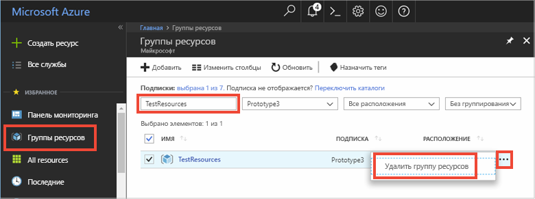

# <a name="quickstart-use-azure-redis-cache-with-a-net-core-app"></a>Краткое руководство. Использование кэша Redis для Azure с приложением .NET Core


В этом кратком руководстве описано, как начать работу с кэшем Redis для Microsoft Azure на платформе .NET Core. Кэш Redis для Microsoft Azure основан на популярном продукте с открытым кодом — кэше Redis. Он дает доступ к защищенному выделенному кэшу Redis, управляемому Майкрософт. Кэш, созданный с использованием кэша Azure Redis, доступен из любого приложения в Microsoft Azure.

В этом кратком руководстве описано, как запустить клиента [StackExchange.Redis](https://github.com/StackExchange/StackExchange.Redis) с помощью кода C\# в консольном приложении .NET Core. Затем вы создадите кэш и настроите клиентское приложение .NET Core. После этого вы добавите в кэш объекты и обновите их. 

Вы можете использовать любой редактор кода для выполнения шагов в этом кратком руководстве. Однако [Visual Studio Code](https://code.visualstudio.com/) является отличным вариантом, доступным на платформах Windows, MacOS и Linux.


[!INCLUDE [quickstarts-free-trial-note](../../includes/quickstarts-free-trial-note.md)]

## <a name="prerequisites"></a>предварительным требованиям

* [Пакет SDK для .NET версии 2.0](https://www.microsoft.com/net/learn/get-started/windows) или более поздней.
* Для клиента StackExchange.Redis требуется [.NET Framework 4 или более новая версия](https://www.microsoft.com/net/download/dotnet-framework-runtime).

## <a name="create-a-cache"></a>Создание кэша
[!INCLUDE [redis-cache-create](../../includes/redis-cache-create.md)]

[!INCLUDE [redis-cache-access-keys](../../includes/redis-cache-access-keys.md)]

Запомните или запишите **имя узла** и **первичный ключ доступа**. Эти значения вам потребуются позже для создания секрета *CacheConnection*.


## <a name="create-a-console-app"></a>Создание консольного приложения

Откройте новое окно командной строки и выполните следующую команду для создания нового консольного приложения .NET Core:

```
dotnet new console -o Redistest
```

В этом же окне командной строки перейдите к каталогу нового проекта *Redistest*.


## <a name="add-secret-manager-to-the-project"></a>Добавление менеджера секретных ключей в проект

В этом разделе добавьте [инструмент "Диспетчер секретов"](https://docs.microsoft.com/aspnet/core/security/app-secrets) в проект. Инструмент "Диспетчер секретов" хранит конфиденциальные данные для разработки вне вашего дерева проектов. Этот подход помогает предотвратить случайный обмен секретами приложений в исходном коде.

Откройте файл *Redistest.csproj*. Добавьте элемент `DotNetCliToolReference`, чтобы включить *Microsoft.Extensions.SecretManager.Tools*. Кроме того, добавьте элемент `UserSecretsId`, как показано ниже, и сохраните файл.

```xml
<Project Sdk="Microsoft.NET.Sdk">

  <PropertyGroup>
    <OutputType>Exe</OutputType>
    <TargetFramework>netcoreapp2.0</TargetFramework>
    <UserSecretsId>Redistest</UserSecretsId>
  </PropertyGroup>
  <ItemGroup>
    <DotNetCliToolReference Include="Microsoft.Extensions.SecretManager.Tools" Version="2.0.0" />
  </ItemGroup>
</Project>
```

Выполните следующую команду, чтобы добавить в проект пакет *Microsoft.Extensions.Configuration.UserSecrets*:

```
dotnet add package Microsoft.Extensions.Configuration.UserSecrets
```

Выполните следующую команду, чтобы восстановить пакеты:

```
dotnet restore
```

В том же окне командной строки выполните следующую команду, чтобы сохранить новый секрет с именем *CacheConnection*. Не забудьте заменить заполнители (включая угловые скобки) именем кэша и первичным ключом доступа.

```
dotnet user-secrets set CacheConnection "<cache name>.redis.cache.windows.net,abortConnect=false,ssl=true,password=<primary-access-key>"
```

Добавьте в файл *Program.cs* следующий метод `using`:

```csharp
using Microsoft.Extensions.Configuration;
```

Добавьте в класс `Program` файла *Program.cs* следующие методы. Этот код инициализирует настройки для доступа к секрету пользователя, который хранит строку подключения к кэшу Redis.

```csharp
        private static IConfigurationRoot Configuration { get; set; }
        const string SecretName = "CacheConnection";

        private static void InitializeConfiguration()
        {
            var builder = new ConfigurationBuilder()
                .AddUserSecrets<Program>();

            Configuration = builder.Build();
        }
```

## <a name="configure-the-cache-client"></a>Настройка клиента кэша

В этом разделе вы настроите в консольном приложении использование клиента [StackExchange.Redis](https://github.com/StackExchange/StackExchange.Redis) для .NET.

В окне командной строки выполните следующую команду в каталоге проекта *Redistest*:

```
dotnet add package StackExchange.Redis
```

Когда установка завершится, клиент кэша *StackExchange.Redis* станет доступным для использования в проекте.


## <a name="connect-to-the-cache"></a>Подключение к кэшу

Добавьте в файл *Program.cs* следующий метод `using`:

```csharp
using StackExchange.Redis;
```

Подключение к кэшу Redis для Azure выполняется с помощью класса `ConnectionMultiplexer` . Этот класс нужно сделать общим и повторно использовать в коде клиентского приложения. Не создавайте новое подключение для каждой операции. 

В файле *Program.cs* добавьте следующие члены в класс `Program` консольного приложения:

```csharp
        private static Lazy<ConnectionMultiplexer> lazyConnection = new Lazy<ConnectionMultiplexer>(() =>
        {
            string cacheConnection = Configuration[SecretName];
            return ConnectionMultiplexer.Connect(cacheConnection);
        });

        public static ConnectionMultiplexer Connection
        {
            get
            {
                return lazyConnection.Value;
            }
        }
```

При таком подходе к совместному использованию экземпляра `ConnectionMultiplexer` в приложении нужно создать статическое свойство, которое возвращает подключенный экземпляр. Такой код потокобезопасно инициализирует только один подключенный экземпляр `ConnectionMultiplexer`. Для параметра `abortConnect` задано значение false. Это означает, что вызов завершается успешно, даже если подключение к кэшу Redis для Azure не установлено. Одна из ключевых особенностей `ConnectionMultiplexer` заключается в том, что этот параметр автоматически восстанавливает соединение с кэшем, когда устраняется проблема с сетью или другие проблемы.

Значение секрета *CacheConnection* извлекается через поставщик конфигурации "Диспетчер секретов" и используется в качестве параметра пароля.

## <a name="executing-cache-commands"></a>Выполнение команд кэша

В файле *Program.cs* добавьте следующий код в процедуру `Main` класса `Program` для консольного приложения:

```csharp
        static void Main(string[] args)
        {
            InitializeConfiguration();

            // Connection refers to a property that returns a ConnectionMultiplexer
            // as shown in the previous example.
            IDatabase cache = lazyConnection.Value.GetDatabase();

            // Perform cache operations using the cache object...

            // Simple PING command
            string cacheCommand = "PING";
            Console.WriteLine("\nCache command  : " + cacheCommand);
            Console.WriteLine("Cache response : " + cache.Execute(cacheCommand).ToString());

            // Simple get and put of integral data types into the cache
            cacheCommand = "GET Message";
            Console.WriteLine("\nCache command  : " + cacheCommand + " or StringGet()");
            Console.WriteLine("Cache response : " + cache.StringGet("Message").ToString());

            cacheCommand = "SET Message \"Hello! The cache is working from a .NET Core console app!\"";
            Console.WriteLine("\nCache command  : " + cacheCommand + " or StringSet()");
            Console.WriteLine("Cache response : " + cache.StringSet("Message", "Hello! The cache is working from a .NET Core console app!").ToString());

            // Demostrate "SET Message" executed as expected...
            cacheCommand = "GET Message";
            Console.WriteLine("\nCache command  : " + cacheCommand + " or StringGet()");
            Console.WriteLine("Cache response : " + cache.StringGet("Message").ToString());

            // Get the client list, useful to see if connection list is growing...
            cacheCommand = "CLIENT LIST";
            Console.WriteLine("\nCache command  : " + cacheCommand);
            Console.WriteLine("Cache response : \n" + cache.Execute("CLIENT", "LIST").ToString().Replace("id=", "id="));

            lazyConnection.Value.Dispose();
        }
```

Сохраните файл *Program.cs*.

Кэши Redis для Azure могут использовать до 16 баз данных (их количество можно указать), чтобы обеспечить логическое разделение данных в кэше Redis. Этот код подключается к стандартной базе данных DB 0. Дополнительные сведения см. в разделах [What are Redis databases?](cache-configure.md#default-redis-server-configuration) (Что такое базы данных Redis) и [Конфигурация сервера Redis по умолчанию](cache-faq.md#what-are-redis-databases).

Элементы можно сохранять в кэше и извлекать из него с помощью методов `StringSet` и `StringGet`.

Redis хранит большинство данных в строках Redis, но эти строки могут содержать данные многих типов, включая сериализованные двоичные данные, которые можно использовать при сохранении объектов .NET в кэше.

В окне командной строки выполните следующую команду, чтобы запустить сборку приложения:

```
dotnet build
```

Теперь запустите это приложение с помощью следующей команды.

```
dotnet run
```

В приведенном ниже примере видно, что ключ `Message` ранее содержал кэшированное значение, установленное через консоль Redis на портале Azure. Приложение обновило кэшированное значение. Кроме того, оно выполнило команды `PING` и `CLIENT LIST`.


## <a name="work-with-net-objects-in-the-cache"></a>Работа с объектами .NET в кэше

Кэш Redis для Azure может кэшировать объекты .NET и примитивные типы данных, но прежде чем объект .NET можно будет сохранить в кэше, он должен быть сериализован. За сериализацию объекта .NET отвечает разработчик приложения, что дает ему свободу в выборе сериализатора.

Простой способ сериализовать объекты — использовать методы сериализации `JsonConvert` из [Newtonsoft.Json](https://www.nuget.org/packages/Newtonsoft.Json/) и выполнять сериализацию в нотацию JSON и из нее. В этом разделе вы добавите в кэш объект .NET.

Выполните следующую команду, чтобы добавить в приложение пакет *Newtonsoft.json*:

```
dotnet add package Newtonsoft.json
```

Добавьте следующую инструкцию `using` в начало файла *Program.cs*:

```charp
using Newtonsoft.Json;
```

Добавьте следующее определение класса `Employee` в файл *Program.cs*:

```csharp
        class Employee
        {
            public string Id { get; set; }
            public string Name { get; set; }
            public int Age { get; set; }

            public Employee(string EmployeeId, string Name, int Age)
            {
                this.Id = EmployeeId;
                this.Name = Name;
                this.Age = Age;
            }
        }
```

В нижней части процедуры `Main()` в файле *Program.cs* прямо перед вызовом `Dispose()` добавьте следующие строки кода, которые сохраняют и извлекают сериализованный объект .NET:

```csharp
            // Store .NET object to cache
            Employee e007 = new Employee("007", "Davide Columbo", 100);
            Console.WriteLine("Cache response from storing Employee .NET object : " + 
                cache.StringSet("e007", JsonConvert.SerializeObject(e007)));

            // Retrieve .NET object from cache
            Employee e007FromCache = JsonConvert.DeserializeObject<Employee>(cache.StringGet("e007"));
            Console.WriteLine("Deserialized Employee .NET object :\n");
            Console.WriteLine("\tEmployee.Name : " + e007FromCache.Name);
            Console.WriteLine("\tEmployee.Id   : " + e007FromCache.Id);
            Console.WriteLine("\tEmployee.Age  : " + e007FromCache.Age + "\n");
```

Сохраните файл *Program.cs* и повторите сборку приложения с помощью следующей команды:

```
dotnet build
```

Запустите приложение с помощью следующей команды, чтобы проверить сериализацию объектов .NET:

```
dotnet run
```


## <a name="clean-up-resources"></a>Очистка ресурсов

При переходе к следующему руководству в нем можно использовать ресурсы, созданные в этом руководстве.

В противном случае, если вы закончите работу с примером приложения из краткого руководства, вы можете удалить ресурсы Azure, созданные в текущем руководстве, чтобы избежать ненужных расходов. 

> [!IMPORTANT]
> Удаление группы ресурсов — необратимая операция, и все соответствующие ресурсы удаляются окончательно. Будьте внимательны, чтобы случайно не удалить не ту группу ресурсов или не те ресурсы. Если ресурсы для размещения этого примера созданы в имеющейся группе ресурсов, содержащей ресурсы, которые следует сохранить, можно удалить каждый ресурс отдельно в соответствующих колонках вместо удаления группы ресурсов.
>

Войдите на [портал Azure](https://portal.azure.com) и щелкните **Группы ресурсов**.

Введите имя группы ресурсов в текстовое поле **Фильтровать по имени...**. В инструкциях в этой статье использовалась группа ресурсов с именем *TestResources*. В своей группе ресурсов в списке результатов щелкните **...**, а затем **Удалить группу ресурсов**.



Подтвердите операцию удаления группы ресурсов. Введите имя группы ресурсов и нажмите кнопку **Удалить**.

Через некоторое время группа ресурсов и все ее ресурсы будут удалены.


<a name="next-steps"></a>

## <a name="next-steps"></a>Дополнительная информация

В этом кратком руководстве описано, как использовать кэш Redis для Azure из приложения .NET Core. Переходите к следующему краткому руководству по использованию кэша Redis с веб-приложением ASP.NET.

> [!div class="nextstepaction"]
> [Создание веб-приложения ASP.NET, использующего кэш Redis для Azure.](./cache-web-app-howto.md)


