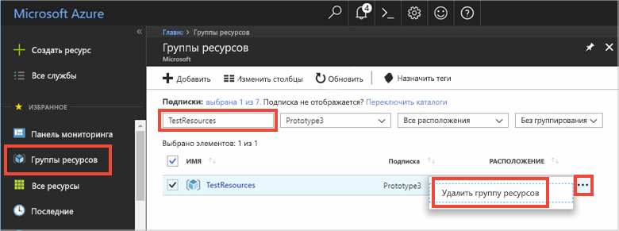

# <a name="quickstart-how-to-use-azure-redis-cache-with-nodejs"></a>Краткое руководство по использованию кэша Redis для Azure в Node.js


Кэш Redis для Azure дает доступ к защищенному выделенному кэшу Redis, управляемому Майкрософт. Кэш доступен из любого приложения в Microsoft Azure.

В этой статье показано, как приступить к работе с кэшем Redis для Azure, используя Node.js. 

Вы можете использовать любой редактор кода для выполнения шагов в этом кратком руководстве. Однако [Visual Studio Code](https://code.visualstudio.com/) является отличным вариантом, доступным на платформах Windows, MacOS и Linux.


[!INCLUDE [quickstarts-free-trial-note](../../includes/quickstarts-free-trial-note.md)]


## <a name="prerequisites"></a>предварительным требованиям
Установите [node_redis](https://github.com/mranney/node_redis).

    npm install redis

В этом руководстве используется [node_redis](https://github.com/mranney/node_redis). Примеры использования других клиентов Node.js см. в отдельных документах по [клиентам Node.js для Redis](http://redis.io/clients#nodejs).


## <a name="create-a-cache"></a>Создание кэша
[!INCLUDE [redis-cache-create](../../includes/redis-cache-create.md)]

[!INCLUDE [redis-cache-access-keys](../../includes/redis-cache-access-keys.md)]


Добавление переменных среды для **ИМЯ_УЗЛА** и **Основного** ключа доступа. Вместо включения конфиденциальных данных непосредственно в код использоваться будут эти переменные из вашего кода.

```
set REDISCACHEHOSTNAME=contosoCache.redis.cache.windows.net
set REDISCACHEKEY=XXXXXXXXXXXXXXXXXXXXXXXXXXXXXXXXXXXXXXXXXXXX
```


## <a name="connect-to-the-cache"></a>Подключение к кэшу

Новейшие сборки [node_redis](https://github.com/mranney/node_redis) обеспечивают поддержку подключения к кэшу Redis для Azure по протоколу SSL. В приведенном ниже примере показано, как подключиться к кэшу Redis для Azure с помощью конечной точки SSL на порту 6380. 

```js
var redis = require("redis");

// Add your cache name and access key.
var client = redis.createClient(6380, process.env.REDISCACHEHOSTNAME,
    {auth_pass: process.env.REDISCACHEKEY, tls: {servername: process.env.REDISCACHEHOSTNAME}});
```

Нельзя создавать новые подключения для каждой операции в коде. Вместо этого повторно используйте как можно больше подключений. 

## <a name="create-a-new-nodejs-app"></a>Создание нового приложения Node.js

Создайте новый файл сценария с именем *redistest.js*.

Добавьте следующий пример JavaScript в файл. Этот код показывает способ подключения к экземпляру кэша Redis для Azure, используя имя узла кэша и переменные среды ключа. Код также хранит строковое значение в кэше и извлекает его. Также выполняются команды `PING` и `CLIENT LIST`. Дополнительные примеры использования Redis с клиентом [node_redis](https://github.com/mranney/node_redis) см. в [http://redis.js.org/](http://redis.js.org/).

```js
var redis = require("redis");
var bluebird = require("bluebird");

bluebird.promisifyAll(redis.RedisClient.prototype);
bluebird.promisifyAll(redis.Multi.prototype);

async function testCache() {

    // Connect to the Redis cache over the SSL port using the key.
    var cacheConnection = redis.createClient(6380, process.env.REDISCACHEHOSTNAME, 
        {auth_pass: process.env.REDISCACHEKEY, tls: {servername: process.env.REDISCACHEHOSTNAME}});
        
    // Perform cache operations using the cache connection object...

    // Simple PING command
    console.log("\nCache command: PING");
    console.log("Cache response : " + await cacheConnection.pingAsync());

    // Simple get and put of integral data types into the cache
    console.log("\nCache command: GET Message");
    console.log("Cache response : " + await cacheConnection.getAsync("Message"));    

    console.log("\nCache command: SET Message");
    console.log("Cache response : " + await cacheConnection.setAsync("Message",
        "Hello! The cache is working from Node.js!"));    

    // Demostrate "SET Message" executed as expected...
    console.log("\nCache command: GET Message");
    console.log("Cache response : " + await cacheConnection.getAsync("Message"));    

    // Get the client list, useful to see if connection list is growing...
    console.log("\nCache command: CLIENT LIST");
    console.log("Cache response : " + await cacheConnection.clientAsync("LIST"));    
}

testCache();
```

Выполните сценарий с помощью Node.js.

```
node redistest.js
```

В приведенном ниже примере видно, что ключ `Message` ранее содержал кэшированное значение, установленное через консоль Redis на портале Azure. Приложение обновило кэшированное значение. Кроме того, оно выполнило команды `PING` и `CLIENT LIST`.


## <a name="clean-up-resources"></a>Очистка ресурсов

При переходе к следующему руководству в нем можно использовать ресурсы, созданные в этом руководстве.

В противном случае, если вы закончите работу с примером приложения из краткого руководства, вы можете удалить ресурсы Azure, созданные в текущем руководстве, чтобы избежать ненужных расходов. 

> [!IMPORTANT]
> Удаление группы ресурсов — необратимая операция, и все соответствующие ресурсы удаляются окончательно. Будьте внимательны, чтобы случайно не удалить не ту группу ресурсов или не те ресурсы. Если ресурсы для размещения этого примера созданы в имеющейся группе ресурсов, содержащей ресурсы, которые следует сохранить, можно удалить каждый ресурс отдельно в соответствующих колонках вместо удаления группы ресурсов.
>

Войдите на [портал Azure](https://portal.azure.com) и щелкните **Группы ресурсов**.

Введите имя группы ресурсов в текстовое поле **Фильтровать по имени...**. В инструкциях в этой статье использовалась группа ресурсов с именем *TestResources*. В своей группе ресурсов в списке результатов щелкните **...**, а затем **Удалить группу ресурсов**.



Подтвердите операцию удаления группы ресурсов. Введите имя группы ресурсов и нажмите кнопку **Удалить**.

Через некоторое время группа ресурсов и все ее ресурсы будут удалены.


## <a name="next-steps"></a>Дополнительная информация

В этом кратком руководстве вы узнали, как использовать кэш Redis для Azure в приложениях Node.js. Переходите к следующему краткому руководству по использованию кэша Redis с веб-приложением ASP.NET.

> [!div class="nextstepaction"]
> [Создание веб-приложения ASP.NET, использующего кэш Redis для Azure.](./cache-web-app-howto.md)


